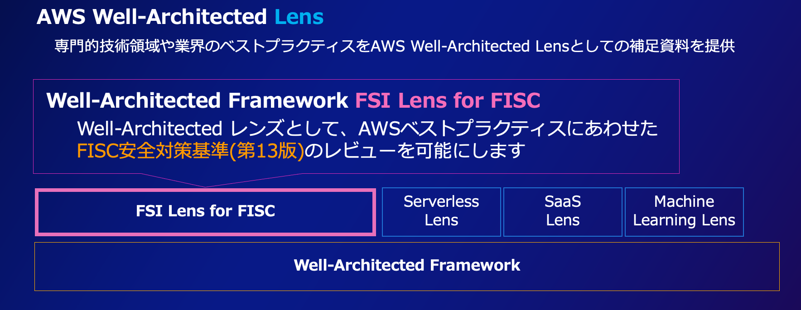

# 金融リファレンスアーキテクチャ 日本版

金融リファレンスアーキテクチャ日本版は、下記 3 つのコンテンツで構成されます。

- [Well-Architected Framework FSI Lens for FISC](#well-architected-framework-fsi-lens-for-fisc)
- [金融ワークロードのベストプラクティス](#金融ワークロードのベストプラクティス)
- [Baseline Environment on AWS for FSI](#baseline-environment-on-aws-for-financial-services-institute)

# Well-Architected Framework FSI Lens for FISC

AWS Well-Architected(WA) レビューを拡張する形で、専門的技術領域や業界ごとのベストプラクティスを AWS Well-Architected Lens として提供しています。金融リファレンスアーキテクチャ日本版として提供される「Well-Architected Framework FSI Lens for FISC」は、FISC 安全対策基準に沿って、回復力、セキュリティ、および運用パフォーマンスを促進する金融サービス業界 (FSI) のワークロードを設計、デプロイ、設計する方法に焦点を当てたレンズになります。

- [Well-Architected Framework FSI Lens for FISC](doc/fsi-lens-for-fisc/README.md)

# 金融ワークロードのベストプラクティス

金融ワークロードのベストプラクティスは、「金融リファレンスアーキテクチャ日本版」の一部として提供されるアセットです。
金融システムの可用性およびレジリエンスの確保については、そのワークロード特性に大きく依存します。そのため、金融のお客様の代表的なワークロードとして、下記のサンプルアプリケーションを提供します。

- **勘定系システム**

  - [金融ワークロードアーキテクチャ解説 [勘定系]
    ](doc/reference-arc-core-banking/core-banking-arch-readme.md)
  - [FISC 実務基準対策 一覧 [勘定系]
    ](doc/reference-arc-core-banking/fisc-mapping-core-banking.md)
  - [CDK サンプルコード [勘定系]
    ](doc/reference-arc-core-banking/deploy-core-banking-sample.md)

- **顧客チャネル**

  - [金融ワークロードアーキテクチャ解説 [顧客チャネル]
    ](doc/reference-arc-customer-channel/customer-channel-arch-readme.md)
  - [FISC 実務基準対策 一覧 [顧客チャネル]
    ](doc/reference-arc-customer-channel/fisc-mapping-customer-channel.md)
  - [CDK サンプルコード [顧客チャネル]
    ](doc/reference-arc-customer-channel/deploy-customer-channel-sample.md)

- **オープン API**

  - [金融ワークロードアーキテクチャ解説 [オープン API]
    ](doc/reference-arc-open-api/open-api-arch-readme.md)
  - [FISC 実務基準対策 一覧 [オープン API]
    ](doc/reference-arc-open-api/fisc-mapping-open-api.md)
  - [CDK サンプルコード [オープン API ベーシック]  
    ](doc/reference-arc-open-api/deploy-openapi-base-sample.md)
  - CDK サンプルコード [オープン API 金融グレード(FAPI)]
    - （バージョンアップ対応のため CDK は工事中）

- **マーケットデータ**

  - [金融ワークロードアーキテクチャ解説 [マーケットデータ]
    ](doc/reference-arc-market-data/market-data-arch-readme.md)
  - [FISC 実務基準対策 一覧 [マーケットデータ]
    ](doc/reference-arc-market-data/fisc-mapping-market-data.md)
  - [CDK サンプルコード [マーケットデータ]  
    ](doc/reference-arc-market-data/deploy-market-data-sample.md)

- **データ分析プラットフォーム(simple data lake)**

  - [金融ワークロードアーキテクチャ解説 [データ分析プラットフォーム]
    ](doc/reference-arc-analytics-platform/analytics-simple-datalake-arch-readme.md)
  - [FISC 実務基準対策 一覧 [データ分析プラットフォーム]
    ](doc/reference-arc-analytics-platform/fisc-mapping-analytics-simple-datalake.md)
  - [CDK サンプルコード [データ分析プラットフォーム]  
    ](doc/reference-arc-analytics-platform/deploy-analytics-platform-simpledatalake.md)

- **メインフレーム連携**

  - [金融ワークロードアーキテクチャ解説 [メインフレーム連携]
    ](doc/reference-arc-mf-integration/mf-integration-arch-readme.md)
  - [FISC 実務基準対策 一覧 [メインフレーム連携]
    ](doc/reference-arc-mf-integration/fisc-mapping-mf-integration.md)

- **ハイブリッド**

  - [金融ワークロードアーキテクチャ解説 [ハイブリッド]
    ](doc/reference-arc-hybrid/readme.md)
  - [FISC 実務基準対策 一覧 [ハイブリッド]
    ](doc/reference-arc-hybrid/fisc-mapping-hybrid.md)

- **モバイルバンキング**
  - [金融ワークロードアーキテクチャ解説 [モバイルバンキング]
    ](doc/reference-arc-mobile-banking/mobile-banking-arch-readme.md)
  - [FISC 実務基準対策 一覧 [モバイルバンキング]
    ](doc/reference-arc-mobile-banking/fisc-mapping-mobile-banking.md)
  - [CDK サンプルコード [モバイルバンキング]
    ](doc/reference-arc-mobile-banking/deploy-mobile-banking-sample.md)

# Baseline Environment on AWS for Financial Services Institute

Baseline Environment on AWS for Financial Services Institute(BLEA for FSI)は「金融リファレンスアーキテクチャ日本版」の一部として提供されるアセットです。セキュアなベースラインを構築するための CDK テンプレート、設定ガイド、FISC 対応マッピングを提供し、AWS 上で FISC 安全対策基準を満たすシステムの構築の自動化（IaC）を支援します。"BLEA for FSI ガバナンスベース" と "金融ワークロードベストプラクティス用のサンプルアプリケーション"から構成されます。

セキュアなベースラインを確立するための リファレンス CDK テンプレート群である [BLEA](https://github.com/aws-samples/baseline-environment-on-aws/) をベースに、FISC 準拠の観点から金融ワークロードに必要とされる要素を追加しています（[参考：BLEA と BLEF for FSI の差異](./doc/governance-base/diff-from-blea.md)）。また典型的な金融ワークロードを実現するエンドツーエンドの下記の CDK サンプルコードを提供します。これらの CDK テンプレートは用途に合わせてユーザが拡張して使うことを前提としています。

- 勘定系
- オープン API
- 顧客チャネル
- マーケットデータ
- データ分析プラットフォーム
- モバイルバンキング

BLEA for FSI のガバナンスベースライン および 各サンプルアプリケーションの FISC 安全対策基準（第 10 版 ）実務基準への対応については、
[金融ワークロードのベストプラクティス](#金融ワークロードのベストプラクティス)を参照してください。

> **:warning: BLEA for FSI の利用に関する注意**  
> 本 CDK テンプレートは、金融ワークロードのベストプラクティスと IaC コードの実装サンプルとして提供するものです。利用者の要件に応じてカスタマイズを行う事が必須であり、このテンプレートを本番環境でそのままプロビジョニングして利用することは想定しておりません。検証環境にプロビジョニングして確認してください。

Jump to | [Changelog](CHANGELOG.md) | [HowTo](doc/how-to.md) | [BLEA for FSI ガバナンスベースのデプロイ](doc/governance-base/deploy-governance-base.md) |

## ガバナンスアーキテクチャ

### オペレーションパターン

## ベースライン アーキテクチャ

## ガバナンスベースとして提供される CDK テンプレート

| ユースケース                                              | フォルダ                   |
| --------------------------------------------------------- | -------------------------- |
| BLEA for FSI ガバナンスベース（Log Archive アカウント用） | `usecases/base-ct-logging` |
| BLEA for FSI ガバナンスベース（ゲストアカウント用）       | `usecases/base-ct-guest`   |

## 金融ワークロードベストプラクティス サンプルアプリケーション

| ユースケース                                          | フォルダ                                                                     |
| ----------------------------------------------------- | ---------------------------------------------------------------------------- |
| [勘定系] サンプルアプリケーション                     | `usecases/guest-core-banking-sample`                                         |
| [顧客チャネル] サンプルアプリケーション               | `usecases/guest-customer-channel-sample`                                     |
| [Open API] サンプルアプリケーション                   | `usecases/guest-openapi-base-sample` `usecases/guest-openapi-fapi-sample` |
| [マーケットデータ] サンプルアプリケーション           | `usecases/guest-market-data-sample`                                          |
| [データ分析プラットフォーム] サンプルアプリケーション | `usecases/guest-analytics-platform-sample`                                   |

## BLEA for FSI の導入

BLEA for FSI ガバナンスベース と 各金融ワークロード サンプルアプリケーション を AWS アカウント環境にデプロイする手順について記載します。BLEA for FSI は ControlTower 管理下のアカウントに導入することを前提とします。また AWS アカウントにデプロイだけ行う場合、デプロイ用のクライアント環境に Visual Studio Code によるエディタ環境の構築は必ずしも必要なく CDK ランタイムのみで構いません。

### 前提条件

BLEA for FSI を AWS 上にデプロイするためのクライアントの前提条件については下記を参照して下さい。

- [BLEA for FSI 導入の前提条件](doc/pre-conditions.md)

クライアント環境からインターネットに接続できない場合は、下記の閉域網での CDK 実行環境のセットアップ手順を参照して下さい。

- [手順]: [閉域網での CDK 実行環境 のセットアップ手順](doc/cdk-deployment-environment-setup.md)

### デプロイの流れ

各金融ワークロード サンプルアプリケーション は AWS Control Tower（以下 CT）に依存しておらず非 CT 環境にデプロイすることができますが、ガバナンスベースは CT 環境に依存しています。そのため、最初に CT を設定・導入する必要があり、その後に BLEA for FSI の追加設定・導入を行います。

CT を導入していないアカウント環境へのガバナンスベースのデプロイを希望される方は、以下のガイダンスを参考にして下さい。

- [シングルアカウント／非 Control Tower 環境でのガバナンスベースのセットアップ方法](./doc/governance-base/how-to-setup-governance-base-in-nonct-env.md)

> NOTE: `MC`はマネジメントコンソールでの作業を、`Local`はデプロイ用クライアント環境での作業を示します。

1. BLEA for FSI ガバナンスベースの導入

   1.1. AWS Control Tower およびセキュリティサービスのセットアップ(MC)

   1.2. デプロイ対象のゲストアカウントを AWS Control Tower で作成する(MC)

   1.3. 依存パッケージのインストールとコードのビルド(Local)

   1.4. AWS IAM Identity Center（旧 AWS SSO) に合わせて AWS CLI の認証情報を設定する(Local)

   1.5. Control Tower 管理者/Log Archive アカウントでの追加設定(MC)

   1.6. ゲストアカウント用ガバナンスベースをデプロイする(Local)

2. 金融ワークロード サンプルアプリケーションをデプロイする

   2.1. ゲストアカウントにサンプルアプリケーション用 CDK テンプレートをデプロイする(Local)

   2.2. ゲストアカウントでの追加設定(MC)

### 導入手順

- [1. BLEA for FSI ガバナンスベース のセットアップ手順](doc/governance-base/deploy-governance-base.md)
- [2. [勘定系] サンプルアプリケーションのセットアップ手順](doc/reference-arc-core-banking/deploy-core-banking-sample.md)
- [3. [顧客チャネル] サンプルアプリケーションのセットアップ手順](doc/reference-arc-customer-channel/deploy-customer-channel-sample.md)
- [4-1. [Open API ベーシック ] サンプルアプリケーションのセットアップ手順](doc/reference-arc-open-api/deploy-openapi-base-sample.md)
- 4-2. [Open API 金融グレード(FAPI)] サンプルアプリケーションのセットアップ手順　（バージョンアップ対応のため工事中）
- [5. [マーケットデータ] サンプルアプリケーションのセットアップ手順](doc/reference-arc-market-data/deploy-market-data-sample.md)
- [6. [データ分析プラットフォーム] サンプルアプリケーションのセットアップ手順](doc/reference-arc-analytics-platform/deploy-analytics-platform-simpledatalake.md)
- [7. [モバイルバンキング] サンプルアプリケーションのセットアップ手順](doc/reference-arc-mobile-banking/deploy-mobile-banking-sample.md)

## 独自のアプリケーションを開発する

BLEA for FSI 導入後はサンプルコードを起点にして、自分のユースケースに合わせたアプリケーションを開発していくことになります。一般的な開発に必要な情報を示します。

- [通常の開発の流れ](doc/how-to.md#通常の開発の流れ)
- [依存パッケージの最新化](doc/how-to.md#依存パッケージの最新化)

# 金融事例

AWS を実際に利用いただいているお客様の事例をベースにそのアーキテクチャ上の重要ポイントを解説します。

- [1. 金融ワークロードアーキテクチャ解説 [資本市場 OMS]](doc/fsi-case-study/reference-arc-capital-oms/reference-arc-capital-oms-readme.md)
- [2. 金融ワークロードアーキテクチャ解説 [クレジットカード イシュアシステム]](doc/fsi-case-study/reference-arc-credit-card/reference-arc-credit-card-readme.md)

## License

This library is licensed under the MIT-0 License. See the LICENSE file.
