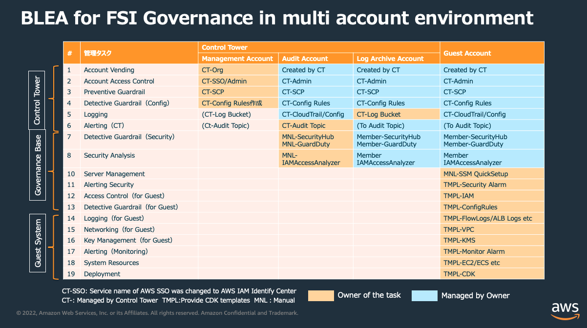
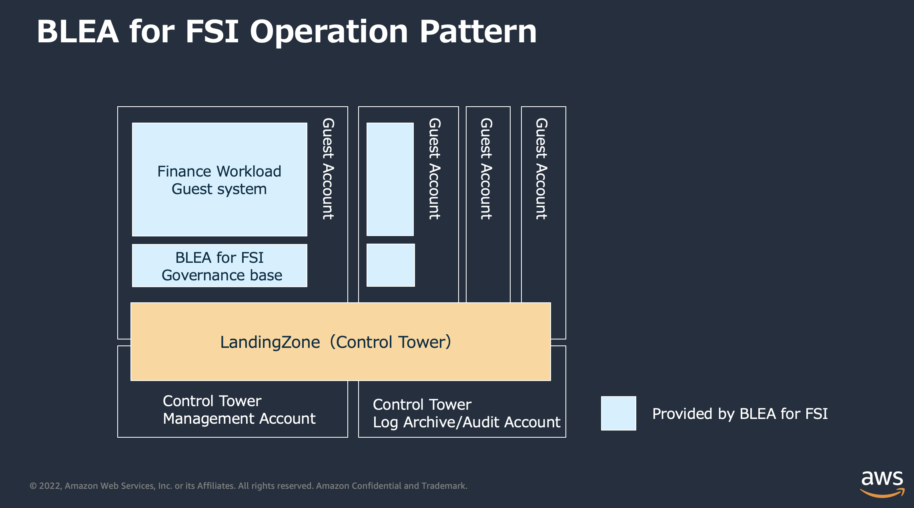
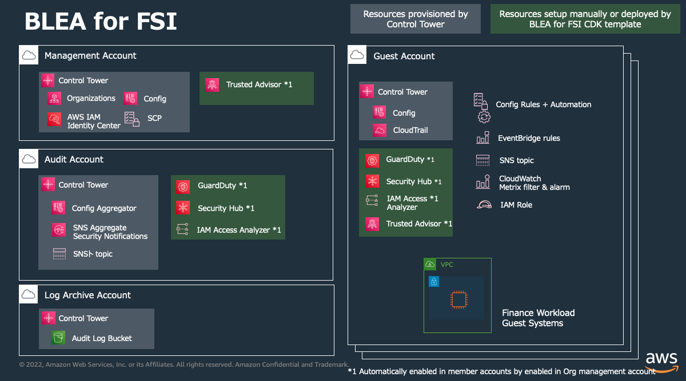

# Finance reference architecture for Japan

[In Japanese](README.md)

Finance reference architecture for Japan consists of three contents.

- [Well-Architected Framework FSI Lens for FISC](#well-architected-framework-fsi-lens-for-fisc)
- [Best practices for financial workloads](#best-practices-for-financial-workloads)
- [Baseline Environment on AWS for Financial Services Institute](#baseline-environment-on-aws-for-fsi)

# Well-Architected Framework FSI Lens for FISC

By extending AWS Well-Architected review, best practices on specific technology areas or each industry are provided as AWS Well-Architected Lens. "Well-Architected Framework FSI Lens for FISC" in Finance reference architecture for Japan is a Lens which focuses on how to design and deploy financial workload in order to enhance resiliency, security and maintenance aligned with FISC Security Guidelines on Computer Systems.

- [Well-Architected Framework FSI Lens for FISC](doc/fsi-lens-for-fisc/README.md)

# Best practices for financial workloads

Best practices for financial workloads is an asset provided as a part of "Finance reference architecture for Japan". Securing availability and resilience on financial systems deeply depends on the characteristic of workload itself. From the point of this view, We provide sample applications bellow including cdk IaC code as popular workloads in financial industry.

- **Core Banking**

  - [Architecture overview [Core Banking]
    ](doc/reference-arc-core-banking/FinRA-core-banking-Arch-readme.md)
  - [Countermeasures for FISC practical standards [Core Banking]
    ](doc/reference-arc-core-banking/FISC_Mapping_core-banking.md)
  - [CDK sample code [Core Banking]
    ](doc/reference-arc-core-banking/deploy-core-banking-sample.md)

- **Customer Channel**

  - [Architecture overview [Customer Channel]
    ](doc/reference-arc-customer-channel/FinRA-customer-channel-Arch-readme.md)
  - [Countermeasures for FISC practical standards [Customer Channel]
    ](doc/reference-arc-customer-channel/FISC_Mapping_customer-channel.md)
  - [CDK sample code [Customer Channel]
    ](doc/reference-arc-customer-channel/deploy-customer-channel-sample.md)

- **Open API**

  - [Architecture overview [Open API]
    ](doc/reference-arc-open-api/FinRA-OpenAPI-Arch-readme.md)
  - [Countermeasures for FISC practical standards [Open API]
    ](doc/reference-arc-open-api/FISC_Mapping_OpenAPI.md)
  - [CDK sample code [Open API]
    ](doc/reference-arc-open-api/deploy-open-api-sample.md)

- **Market Data**
  - [Architecture overview [Market Data]
    ](doc/reference-arc-market-data/FinRA-market-data-Arch-readme.md)
  - [Countermeasures for FISC practical standards [Market Data]
    ](doc/reference-arc-market-data/FISC_Mapping_market-data.md)
  - [CDK sample code [Market Data]
    ](doc/reference-arc-market-data/deploy-market-data-sample.md)

# Baseline Environment on AWS for Financial Services Institute

Baseline Environment on AWS for Financial Services Institute (BLEA for FSI) is an asset provided as part of the Financial Reference Architecture Japan Edition. It provides CDK templates, configuration guides, and FISC-compliant mappings for building secure baselines and helps infrastructure automation(IaC) of the systems that meet FISC security standards on AWS." It consists of "BLEA for FSI Governance Base" and "Sample Applications for Financial Workload Best Practices.

Based on [BLEA](https://github.com/aws-samples/baseline-environment-on-aws/), a set of reference CDK templates for establishing secure baselines, this asset provides a set of confidentiality, integrity, and availability elements required for financial workloads in terms of a FISC-compliant perspective. We also provide the following end-to-end CDK sample code for typical financial workloads. These CDK templates are intended to be extended by the user to suit their own requirement.

- Banking
- Open API
- Customer Channels
- Market Data

> NOTE: BLEA for FSI is based on the secure baseline provided by BLEA for AWS Control Tower and Multi-Account Edition [v2.0.0].  
> See BLEA v2.0.0: [https://github.com/aws-samples/baseline-environment-on-aws/tree/v2.0.0]

See below for the Governance Baseline of 'BLEA for FSI' and each sample application's compliance with the FISC Security Standards (9th edition, December 2021) , Code of Practice.

- [1. [Account] Sample Applications
  ](doc/fiscmapping-core-banking-sample.md)

Jump to | [Changelog](CHANGELOG.md) | [HowTo](doc/how-to.md) | [BLEA for FSI governance-based deployment](/doc/DeployBleaForFIS.md) | [Pipeline deployment](lib/ blea/tools/cicd/README_en.md)

## Governance Architecture

### Operations Patterns

## Baseline Architecture

## CDK templates provided as a governance base

| Use Cases                                                         | Folders                      |
| ----------------------------------------------------------------- | ---------------------------- |
| BLEA for FSI Governance Base（for Log Archive account）           | `usecases/base-ct-logging`   |
| BLEA for FSI Governance Base（for guest account）                 | `usecases/base-ct-guest`     |
| BLEA for FSI Governance base（for guest account in Osaka region） | `usecases/base-ct-guest-osa` |

## Financial Workload Best Practices Sample Application

| Use Cases                    | Folders                              |
| ---------------------------- | ------------------------------------ |
| [Banking] Sample Application | `usecases/guest-core-banking-sample` |

## Introducing BLEA for FSI

This section describes the procedure for deploying 'BLEA for FSI' in an AWS account environment, assuming that 'BLEA for FSI' is deployed in an account under ControlTower management. If you only deploy to your AWS account, you do not necessarily need to build an editor environment using Visual Studio Code for just deployment, but only the CDK runtime is required.

### Prerequisites

Please refer to the following for the client prerequisites for deploying 'BLEA for FSI' on AWS.

- [Prerequisites for BLEA for FSI deployment](doc/pre-conditions.md)

If you cannot directly connect to the Internet from the client environment, please refer to the following procedure for setting up a CDK execution environment on a closed private network.

- [Procedure]: [Setup Procedure for CDK Deployment on a Closed Network](./doc/cdk-deployment-environment-setup.md)

### Deployment Flow

'BLEA for FSI' is configured for a multi-account environment with AWS Control Tower, so it is necessary to configure and deploy Control Tower first, followed by additional configuration and deployment of 'BLEA for FSI'. The most typical procedure is described here.

If you cannot directly connect to the Internet from the client environment, please refer to the following procedure for setting up a CDK execution environment on a closed private network.

- [Procedure]: [Setup Procedure for CDK Deployment in a Closed Network](./doc/cdk-deployment-environment-setup.md)

> NOTE: `MC` denotes working in the management console, `Local` denotes working in the deployment client environment.

1. 'BLEA for FSI' Governance Base deployment

   1.1. setup AWS Control Tower and security services (MC)

   1.2. create a guest account in AWS Control Tower for deployment (MC)

   1.3. install dependent packages and build code (Local)

   1.4. configure AWS CLI credentials for AWS IAM Identity Center (Local)

   1.5. configure additional settings in the Control Tower Admin/Log Archive account (MC)

   1.6. Deploy Governance Base for guest accounts (Local)

2. Deploy the Financial Workload Sample Application

   2.1. Deploy the CDK template for the sample application to the guest account (Local)

   2.2. Do additional configuration on the guest account (MC)

### Deployment Procedure

- [1. 'BLEA for FSI' Governance Base Setup Instructions](doc/deploy-governance-base.md)
- [2. [Core Banking] Sample Application Setup Instructions](doc/reference-arc-core-banking/deploy-core-banking-sample.md)
- [3. [Customer Channel] Sample Application Setup Instructions](doc/reference-arc-customer-channel/deploy-customer-channel-sample.md)
- [4. [Open API] Sample Application Setup Instructions](doc/reference-arc-open-api/deploy-open-api-sample.md)
- [5. [Market Data] Sample Application Setup Instructions](doc/reference-arc-market-data/deploy-market-data-sample.md)

## Develop your own application

After deploying 'BLEA for FSI', you will use the sample code as a starting point to develop your own application for your own use case. The following is the information required for general development.

- [Normal development Flow](doc/doc/how-to.md#通常の開発の流れ)
- [Updating Dependent Packages](doc/how-to.md#依存パッケージの最新化)

## Security

See [CONTRIBUTING](CONTRIBUTING.md#security-issue-notifications) for more information.

## License

This library is licensed under the MIT-0 License.

Translated with www.DeepL.com/Translator (free version)
