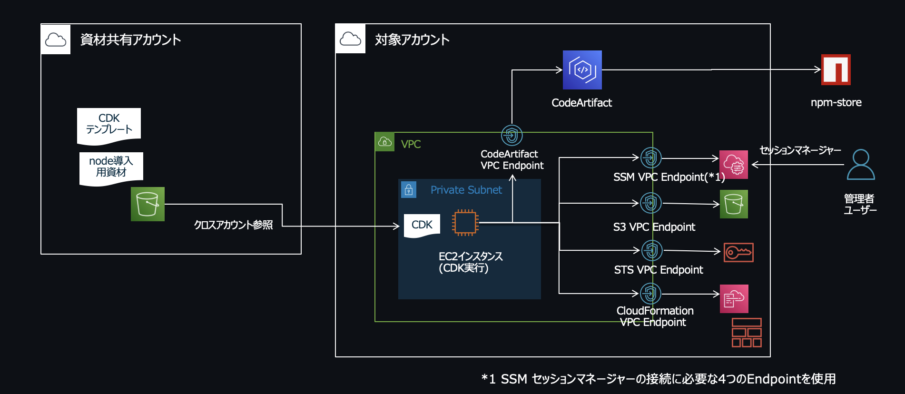
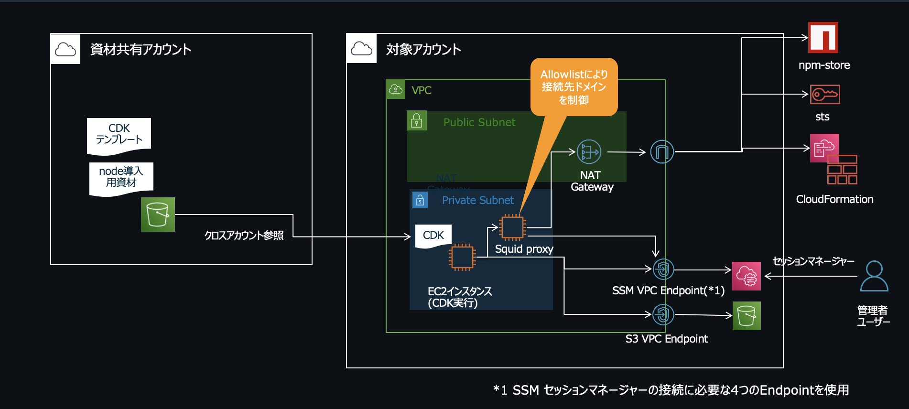
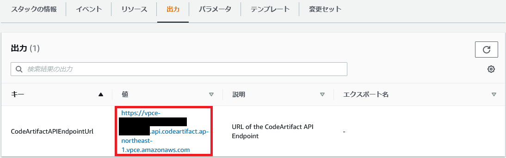
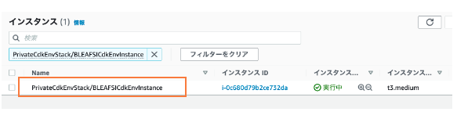
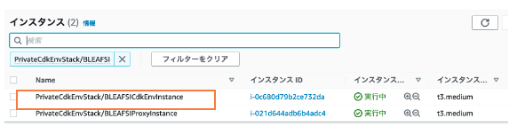
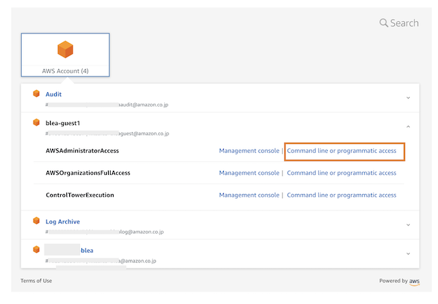
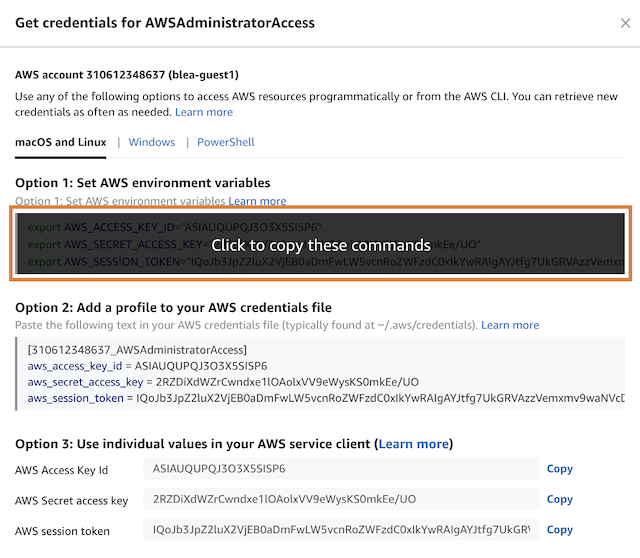

# 閉域網での CDK 実行環境 のセットアップ手順

CloudFormation テンプレートを使って、AWS アカウント上に閉域網で CDK テンプレートを実行できる環境をセットアップする手順を説明します。

注意：本手順を実行するには BLEA for FSI で提供する S3 バケットへのアクセス権が必要です。アクセス権がないと EC2 インスタンス作成時の Userdata の実行に失敗します。詳細は担当 Solution Architect にご確認下さい。

> NOTE: EC2 インスンタスのプロビジョニング時に、共有 S3 バケットから CDK 実行のために必要な資材を EC2 インスタンスにコピーします
>
> aws s3 cp s3://bleafsi-share/baseline-environment-on-aws-for-fsi-202xxxxx.zip ./

> NOTE: 任意のアカウントに本環境は構築可能です

## 構築する環境の構成

下記の 2 つの構成のいずれかをセットアップして下さい。

### A. 単一リージョンにリソースをセットアップ

東京リージョンでガバナンスベースのみをセットアップする場合は、こちらの環境で CDK のデプロイを行うことができます。VPC Endpoint と CodeArtifact サービスを利用して必要なリソースにアクセスします。



#### CloudFormation stack によりプロビジョニングされるリソース

- VPC
- Private Subnet
- NACL, Security Group
- EC2 インスタンス（Amazon Linux2, T3 Medium）
- VPC FlowLogs と LogGroup
- VPC Endpoint
  - ec2
  - ec2messages
  - ssm
  - ssmmessages
  - sts
  - cloudformation
  - s3
  - codeartifact.api
  - codeartifact.repositories
- CodeArtifact

### B. マルチリージョンにリソースをセットアップ

マルチリージョンで各サンプルアプリケーションをセットアップする場合は、こちらの環境で CDK のデプロイを行うことができます。Proxy を経由して必要なリソースにアクセスします。



#### CloudFormation stack によりプロビジョニングされるリソース

- VPC
- Private Subnet
- NACL, Security Group
- NAT Gateway, Internet Gateway
- VPC FlowLogs と LogGroup
- EC2 インスタンス（Amazon Linux2, T3 Medium）: CDK 実行用
- EC2 インスタンス（Amazon Linux2, T3 Medium）: Squid Proxy 用
- VPC Endpoint
  - ec2
  - ec2messages
  - ssm
  - ssmmessages
  - s3

## 作業手順 [環境 A]

1. デプロイ環境を作成したい AWS アカウント（ゲストアカウント等）に、AWS マネジメントコンソール [https://console.aws.amazon.com/console/home] 上でログインします（管理者権限でログインして下さい）。

   > NOTE: AdministratorAccess 相当の権限でログインしてください。

1. テンプレート（[cdk-deploy-env.yaml](../cfn-templates/cdk-deploy-env.yaml)）をローカル環境からアップロードして、CloudFormation のスタックを作成します。手順は以下のドキュメントを参照してください。これにより、VPC と EC2 インスタンスのセットアップが行われます。

   See: [https://docs.aws.amazon.com/ja_jp/AWSCloudFormation/latest/UserGuide/cfn-console-create-stack.html]

   > NOTE:
   >
   > - スタック名は他と競合しない任意の名称を付与してください。
   > - パラメータ AL2AMIID は特段の要件が無ければデフォルトのまま作成してください。
   > - パラメータの SubnetCidr, VpcCidr はネットワーク要件に応じて変更して下さい。

1. 2.のスタック作成のステータスが"CREATE_COMPLETE"になったことを確認後、テンプレート（[cdk-deploy-codeartifact.yaml](../cfn-templates/cdk-deploy-codeartifact.yaml)）を使用して、新しい CloudFormation のスタックを作成します。手順は以下のドキュメントを参照してください。これにより、CodeArtifact レポジトリのセットアップが行われます。

   See: [https://docs.aws.amazon.com/ja_jp/AWSCloudFormation/latest/UserGuide/cfn-console-create-stack.html]

   > NOTE:
   >
   > - スタック名は他と競合しない任意の名称を付与してください。
   > - CodeArtifact は閉域網で npm レポジトリとして機能し、cdk の実行のために利用します。

1. 3.のスタック作成のステータスが"CREATE_COMPLETE"になったことを確認後、出力タブの"CodeArtifactAPIEndpointUrl"の値（https://vpce-…） をコピーして、メモ帳などに張り付けておいてください。  
   

1. EC2 インスタンスのメニューを表示し、Name が"PrivateCdkEnvStack/BLEAFSICdkEnvInstance"となっている EC2 リソースを探します。  
   

1. インスタンスを選択し、右上の"接続"ボタンをクリックします。

1. "セッションマネージャー"タブを選択し、接続します。

   > NOTE: 接続が可能になるまで 10 分弱掛かる場合があります。"接続"ボタンがアクティブでない、エラーが表示される場合はしばらく待ったあと、画面をリロードしてください。

1. コンソール画面が開いたら、以下のコマンドを実行します。コマンド内の 2 つの変数 **{この AWS アカウントの ID}** と **{4.コピーした URL}** は実際に値に置き換えて下さい。

   ```sh
   sudo -iu ssm-user
   aws codeartifact login --tool npm --repository bleafsicdkenvcodeartifactrepo --domain bleafsicdkenvcodeartifactdomain --domain-owner {このAWSアカウントのID} --region ap-northeast-1 --endpoint-url {4.でコピーしたURL}
   # Successfully configured npm to use AWS CodeArtifact repository …と表示されることを確認する
   npm install -g aws-cdk
   cdk --version
   # バージョンが表示されることを確認する
   ```

   > NOTE: EC2 でのコマンド実行に失敗する場合は、EC2 作成時の userdata の実行に失敗している可能性が高いです。下記のログを参照して途中でエラーが発生していないかを確認して下さい。
   >
   > > sudo cat /var/log/cloud-init-output.log

以上で cdk 実行環境のセットアップが完了しました。
以降 cdk コマンドを実行する際は、セッションマネージャーから作成した EC2 インスタンスにログインして cdk テンプレートを実行してください。

なお、EC2 インスタンスの権限はセットアップのために必要な最小限の権限に絞られているため、実際にリソースをデプロイする際は、AWS IAM Identity Center（旧 AWS SSO) にログインして取得した利用者の一時的な認証情報を利用して下さい（手順については後述）。

## 作業手順 [環境 B]

1. デプロイ環境を作成したい AWS アカウント（ゲストアカウント等）に、AWS マネジメントコンソール [https://console.aws.amazon.com/console/home] 上でログインします（管理者権限でログインして下さい）。

   > NOTE: AdministratorAccess 相当の権限でログインしてください。

1. テンプレート（[cdk-deploy-env-multiregion.yaml](../cfn-templates/cdk-deploy-env-multiregion.yaml)）をローカル環境からアップロードして、CloudFormation のスタックを作成します。手順は以下のドキュメントを参照してください。これにより、VPC と EC2 インスタンス（CDK 実行用と Proxy サーバー）のセットアップが行われます。

   See: [https://docs.aws.amazon.com/ja_jp/AWSCloudFormation/latest/UserGuide/cfn-console-create-stack.html]

   > NOTE:
   >
   > - スタック名は他と競合しない任意の名称を付与してください。
   > - パラメータ AL2AMIID は特段の要件が無ければデフォルトのまま作成してください。
   > - パラメータの SubnetCidr, VpcCidr はネットワーク要件に応じて変更して下さい。

   > NOTE:
   >
   > Squid Proxy では allowlist を使って接続可能なドメインを制御しています。東京、大阪リージョン以外のリージョンにデプロイを行う場合は、squid の allowlist（/etc/squid/allowlist）にドメインを追加して下さい。  
   > [allowlist で許可しているドメイン一覧]
   >
   > - ssm.ap-northeast-1.amazonaws.com
   > - ssm.ap-northeast-3.amazonaws.com
   > - sts.ap-northeast-1.amazonaws.com
   > - sts.ap-northeast-3.amazonaws.com
   > - s3.ap-northeast-1.amazonaws.com
   > - s3.ap-northeast-3.amazonaws.com
   > - cloudformation.ap-northeast-1.amazonaws.com
   > - cloudformation.ap-northeast-3.amazonaws.com

1. EC2 インスタンスのメニューを表示し、Name が"PrivateCdkEnvStack/BLEAFSICdkEnvInstance"となっている EC2 リソースを探します。  
   

   > NOTE:
   >
   > PrivateCdkEnvStack/BLEAFSIProxyInstance は squid Proxy サーバーが稼働するインスタンスです。

1. インスタンスを選択し、右上の"接続"ボタンをクリックします。

1. "セッションマネージャー"タブを選択し、接続します。

   > NOTE: 接続が可能になるまで 10 分弱掛かる場合があります。"接続"ボタンがアクティブでない、エラーが表示される場合はしばらく待ったあと、画面をリロードしてください。

1. コンソール画面が開いたら、以下のコマンドを実行します。コマンド内の 2 つの変数 **{この AWS アカウントの ID}** と **{4.コピーした URL}** は実際に値に置き換えて下さい。

   ```sh
   sudo -iu ssm-user
   npm install -g aws-cdk
   cdk --version
   # バージョンが表示されることを確認する
   ```

   > NOTE: EC2 でのコマンド実行に失敗する場合は、EC2 作成時の userdata の実行に失敗している可能性が高いです。下記のログを参照して途中でエラーが発生していないかを確認して下さい。
   >
   > > sudo cat /var/log/cloud-init-output.log

> NOTE:
>
> 環境変数 HTTPS_PROXY 設定により CDK 実行環境は Proxy サーバーに接続する設定になっています。この環境変数はログイン時に自動的に設定されるようになっているため、セッションマネージャーを利用する場合は必ず、sudo -iu ssm-user コマンドを実行して Linux 環境にユーザーとしてログインして下さい。y

以上で cdk 実行環境のセットアップが完了しました。
以降 cdk コマンドを実行する際は、セッションマネージャーから作成した EC2 インスタンスにログインして cdk テンプレートを実行してください。

なお、EC2 インスタンスの権限はセットアップのために必要な最小限の権限に絞られているため、実際にリソースをデプロイする際は、AWS IAM Identity Center（旧 AWS SSO) にログインして取得した利用者の一時的な認証情報を利用して下さい。

## AWS IAM Identity Center（旧 AWS SSO) の一時認証を取得する手順

1. インターネットに接続できる端末で AWS IAM Identity Center の管理者ユーザーでログインします

2. CDK テンプレートを使ってデプロイを行いたいアカウントの"AWSAdministratorAccess"ロールを選択し "Command line or programmatic access"をクリックします

   

3. 表示された子ウィンドウの "Option1 Set AWS environment variables"に表示されたテキストをコピーします

   

   > NOTE: 認証情報を環境変数にセットするためのコマンドになります

4. セッションマネージャーのコンソール上でコピーしたテキストを貼り付けて実行することで、AWS IAM Identity Center（旧 AWS SSO) の一時認証の権限で cdk テンプレートを実行できます

See: [https://aws.amazon.com/blogs/security/aws-single-sign-on-now-enables-command-line-interface-access-for-aws-accounts-using-corporate-credentials/]

## 一時認証情報を使って cdk テンプレートを実行する場合の注意点

プロファイル情報を使って認証情報を取得するのではなく、環境変数（AWS_ACCESS_KEY_ID, AWS_SECRET_ACCES_KEY, AWS_SESSION_TOKEN）を使って認証情報を取得するため `--profile` 属性は使用しないで下さい。

例）bootstrap を実行する（末尾の --profile は不要）

```
npx cdk bootstrap -c environment=dev
```

例）cdk テンプレートを実行する（末尾の --profile は不要）

```
npx cdk deploy --all -c environment=dev
```
