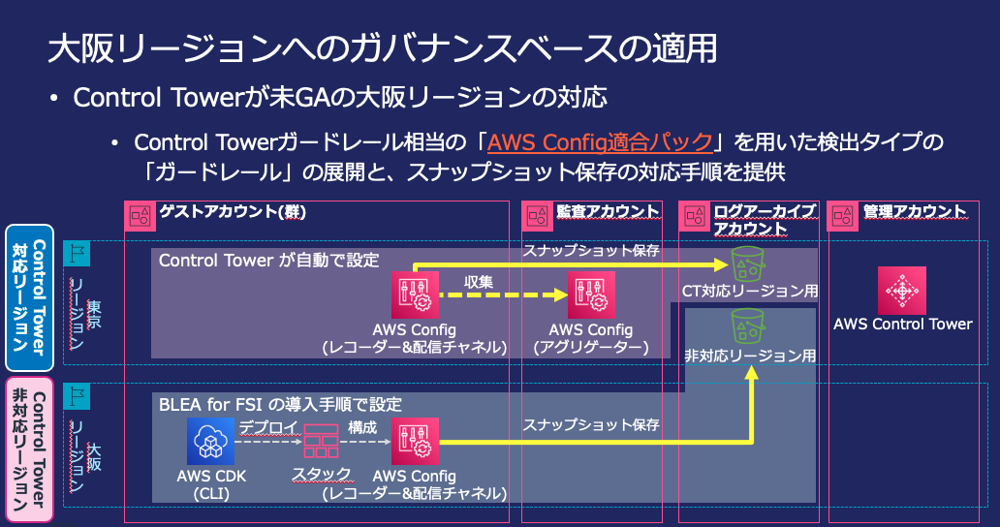

# ゲストアカウントでの大阪リージョンへのガバナンスベースのセットアップ手順

[[BLEA for FSI ガバナンスベースのセットアップ手順に戻る]](./deploy-governance-base.md)

2022 年 9 月 30 日時点で大阪リージョンは Control Tower 未対応であるため、大阪リージョンで BLEA for FSI によるガバナンスベースを適用するには下記の手順に従って下さい。



## 導入手順[全体の流れ]

| #   | 手順                                                                                                                                              | MC/Local | 対象アカウント                     |
| --- | ------------------------------------------------------------------------------------------------------------------------------------------------- | -------- | ---------------------------------- |
| 1   | [Control Tower のリージョン拒否設定を無効化する](./deploy-governance-base-to-osa.md#1-control-tower-のリージョン拒否設定を無効化するmc)           | MC       | CT 管理アカウント                  |
| 2   | [Security Hub の検出結果の集約で大阪リージョンを追加](./deploy-governance-base-to-osa.md#2-security-hub-の検出結果の集約で大阪リージョンを追加mc) | MC       | CT Audit アカウント                |
| 3   | [大阪リージョンでの Security Hub の有効化](./deploy-governance-base-to-osa.md#3-大阪リージョンでの-security-hub-の有効化mc)                       | MC       | ゲストアカウント                   |
| 4   | [大阪リージョンでの GuardDuty の有効化](./deploy-governance-base-to-osa.md#4-大阪リージョンでの-guardduty-の有効化mc)                             | MC       | ゲストアカウント                   |
| 5   | [ゲストアカウント用ガバナンスベースをデプロイする](./deploy-governance-base-to-osa.md#5-1-デプロイ情報contextを設定する)                          | Local    | CT 管理アカウント/ゲストアカウント |

## 1. Control Tower のリージョン拒否設定を無効化する（MC)

Control Tower のリージョン拒否設定が有効化されていると Control Tower 未対応のリージョンで管理コンソール/CLI による作業を行えないため、この機能を無効化します。

1. Control Tower 管理アカウントでログイン
2. Control Tower の設定画面で [ランディンゾーン設定]を選択
3. [設定を変更する]をクリックして設定編集画面を表示
4. [リージョン拒否設定]で "有効になっていません"を選択しランディングゾーンを更新

- [AWS ドキュメント: リージョン拒否ガードレールの設定](https://docs.aws.amazon.com/ja_jp/controltower/latest/userguide/region-deny.html)

## 2. Security Hub の検出結果の集約で大阪リージョンを追加(MC)

マルチリージョンでの Security Hub の検出結果を集約するために設定を変更します。

1. Control Tower Audit アカウントでログイン
2. Security Hub の設定画面で[設定]を選択
3. [リージョン]タブで[編集]をクリックして設定編集画面を表示
4. 利用可能なリージョンで"アジアパシフィック（大阪）"をチェックして保存

- [AWS ドキュメント: リージョン間の結果を集約する](https://docs.aws.amazon.com/ja_jp/securityhub/latest/userguide/finding-aggregation.html)

## 3. 大阪リージョンでの Security Hub の有効化(MC)

大阪リージョンで Security Hub を有効化します。

1. ゲストアカウントでログイン
2. リージョンを"アジアパシフィック（大阪）"に切り替える
3. Security Hub を選択し、[Security Hub に移動]ボタンを押して Security Hub を大阪リージョンで有効化

> NOTE: セキュリティ基準 の 「AWS 基礎セキュリティのベストプラクティス」 と 「CIS AWS Foundations Benchmark」を有効化するかは、組織の基準に従って下さい。

> - [AWS ドキュメント: Security Hub を有効にする](https://docs.aws.amazon.com/ja_jp/securityhub/latest/userguide/securityhub-enable.html)

## 4. 大阪リージョンでの GuardDuty の有効化(MC)

大阪リージョンで GuardDuty を有効化します。

1. ゲストアカウントでログイン
2. リージョンを"アジアパシフィック（大阪）"に切り替える
3. GuardDuty を選択し、[今すぐ始める]ボタンを押して GuardDuty を大阪リージョンで有効化

> - [AWS ドキュメント: GudardDuty の開始方法](https://docs.aws.amazon.com/ja_jp/guardduty/latest/ug/guardduty_settingup.html)

## 5. ゲストアカウント用ガバナンスベースをデプロイする(Local)

### 5-1. デプロイ情報(Context)を設定する

デプロイのため CDK Context (cdk.json) にパラメータを指定する必要があります。 BLEA for FSI 版のゲストアカウント[大阪リージョン向け] ガバナンスベースの設定ファイルはこちらです。

```sh
usecases/base-ct-guest-osa/cdk.json
```

cdk.json の設定については[こちら](./deploy-governance-base.md#7-1-デプロイ情報contextを設定する)を参照

大阪リージョンへのデプロイでは下記の要素を指定する必要があります。

| 変数名               | 値                                                                                                                                                                                                                |
| -------------------- | ----------------------------------------------------------------------------------------------------------------------------------------------------------------------------------------------------------------- |
| targetGuestAccountId | デプロイ対象のゲストアカウント ID                                                                                                                                                                                 |
| cloudTrailBucketName | Log Archive アカウントに作成した 集約ログ用の S3 バケット名（[手順 BLEA for FSI ガバナンスベースのセットアップ手順 6.2](./deploy-governance-base.md#6-2-log-archive-アカウントにガバナンスベースをデプロイする)） |

```js
      "securityNotifyEmail": "xxxx@example.com",
      "targetGuestAccountId": "123456789012",
      "cloudTrailBucketName": "blea-fsi-base-s3bucket-logsbucket222200000-123456789012"
    },
```

[修正の例]

### 5-2. ゲストアカウントに Config 設定をデプロイする(Local)

大阪リージョンは Control Tower 未対応であるため、ゲストアカウント用の CDK テンプレートを使って Config ガードレールを有効化します。

> NOTE:
> 2022 年 9 月 30 日時点で、大阪リージョンは Config アグリゲータ未対応であるため、Audit アカウントで Config ルールのチェック結果を収集することはできません。

最初にゲストアカウントで CDK ブートストラップを実行します。

AWS IAM Identity Center（旧 AWS SSO) を使って **ゲストアカウント** にログインします。

> NOTE:
> 既にマスターユーザーでログインしている場合は一度ログアウトすると、下記のコマンド実行時にログイン画面が表示されます。
>
> コマンド: aws sso logout --profile ct-guest-sso

```sh
aws sso login --profile ct-guest-sso
```

ゲストアカウントの大阪リージョンで CDK ブートストラップを実行します。

```sh
cd usecases/base-ct-guest-osa
npx cdk bootstrap -c environment=dev --profile ct-guest-sso
```

これでゲストアカウントでの作業は一旦完了です。続いて、管理者として作業するために Control Tower 管理アカウントにログインします。一旦ゲストアカウントからログアウトして下さい。

```sh
aws sso logout --profile ct-guest-sso
```

> NOTE:  
> Control Tower のガードレールによる制約により、このステップでは管理アカウントから StackSets 経由でゲストアカウントに Config 設定をデプロイします。
> StackSets のデプロイは**ゲストアカウント**ではなく、Control Tower の **管理アカウント**でデプロイを行うことに注意して下さい。

```sh
aws sso login --profile ct-management-sso
```

大阪リージョンで CDK ブートストラップを実行します。

```sh
cd usecases/base-ct-guest-osa
npx cdk bootstrap -c environment=dev --profile ct-management-sso
```

CDK を使い StackSet を経由してゲストアカウントに対して Config 設定をデプロイします。

```sh
npx cdk synthesize --all --app "npx ts-node --prefer-ts-exts bin/bleafsi-base-generate-stack.ts" --no-rollback -c environment=dev --profile ct-management-sso > bleafsi-base-ct-config.yaml

npx cdk deploy --all --app "npx ts-node --prefer-ts-exts bin/bleafsi-base-ct-guest-config.ts" -c environment=dev --profile ct-management-sso
```

### 5-3. ゲストアカウントにガバナンスベースをデプロイする(Local)

AWS IAM Identity Center（旧 AWS SSO) を使って **ゲストアカウント** にログインします。管理アカウントからログアウトしてから再度ログインして下さい。

```sh
aws sso logout --profile ct-management-sso
aws sso login --profile ct-guest-sso
```

ゲストアカウントのガバナンスベースをデプロイします。

```
npx cdk deploy --all -c environment=dev --profile ct-guest-sso
```

これらのデプロイによってゲストアカウントの大阪リージョンに以下の機能がセットアップされます。

- Config ベースのガードレールの追加
- AWS Health イベントの通知
- セキュリティに影響する変更操作の通知（一部）
- メールによるセキュリティイベントの通知

デフォルトで展開されるガードレールは下記となります。変更したい場合は usecases/base-ct-guest-osa/cfn/AWS-Control-Tower-Detective-Guardrails.yaml ファイルの定義を修正して下さい。東京リージョンと大阪リージョンのでは有効化できる Config マネージドルールに差異があることに注意して下さい

| カテゴリ   | 動作 | ガードレール名                                                                                  |
| ---------- | ---- | ----------------------------------------------------------------------------------------------- |
| IAM        | 検出 | ルートユーザーに対して MFA が有効になっているかどうかを検出する                                 |
| Amazon S3  | 検出 | Amazon S3 バケットへのパブリック読み取りアクセスが許可されているかどうかを検出する              |
| Amazon S3  | 検出 | Amazon S3 バケットへのパブリック書き込みアクセスが許可されているかどうかを検出する              |
| Amazon EBS | 検出 | Amazon EBS ボリュームが Amazon EC2 インスタンスにアタッチされているかどうかを検出する           |
| Amazon EBS | 検出 | Amazon EC2 インスタンスの Amazon EBS 最適化が有効になっているかどうかを検出する                 |
| Amazon RDS | 検出 | Amazon RDS データベースインスタンスへのパブリックアクセスが有効になっているかどうかを検出する   |
| Amazon RDS | 検出 | Amazon RDS データベースインスタンスに対してストレージ暗号化が有効になっているかどうかを検出する |
| IAM        | 検出 | AWS IAM ユーザーに対して MFA が有効になっているかどうかを検出する                               |
| IAM        | 検出 | AWS コンソールの AWS IAM ユーザーに対して MFA が有効になっているかどうかを検出する              |

以下の内容はセキュリティサービスの Organizations 対応により設定されます。

- CloudTrail による API のロギング

### 5-4. (オプション) SSM セッションマネージャーの S3 ログ出力を手動でセットアップする(MC)

- [手順] [ssm セッションマネージャーの s3 ログ出力を手動でセットアップする](./deploy-governance-base.md#7-3-オプション-ssm-セッションマネージャーの-s3-ログ出力を手動でセットアップする)

### 5-5. (オプション) 他のベースラインセットアップを手動でセットアップする(MC)

- [手順] [他のベースラインセットアップを手動でセットアップする](./deploy-governance-base.md#7-4-オプション-他のベースラインセットアップを手動でセットアップする)

### 5-6. セキュリティ指摘事項の修復(MC)

- [手順] [セキュリティ指摘事項の修復](./deploy-governance-base.md#7-5-セキュリティ指摘事項の修復)

以上で大阪リージョンへのガバナンスベースラインのデプロイは完了です。
