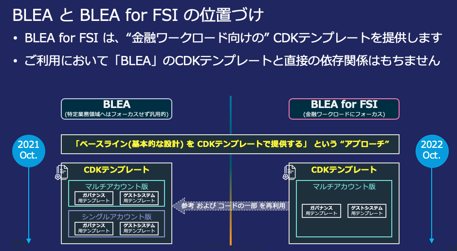

# BLEA for FSI と BLEA の差異

BLEA for FSI はセキュアなベースラインを確立するための リファレンス CDK テンプレート群である BLEA のマルチアカウント版[[v2.0.0]]([https://github.com/aws-samples/baseline-environment-on-aws/tree/v2.0.0])をベースに、FISC 準拠の観点から金融ワークロードに必要とされる下記の要素（CDK テンプレート実装 および ガイダンス）を追加しています。
異なるアセットとして開発を行っていますが、セキュアなベースラインの確立という観点では今後も BLEA をリファレンス実装として参考にしていく方針です。

- [閉域網での CDK 実行環境](./cdk-deployment-environment-setup.md)
- [FISC 実務基準に沿った Control Tower ガードレールでの対策](./ct-guardrails-for-fisc.md)
- [大阪リージョンへのガバナンスベースのデプロイ](./deploy-governance-base-to-osa.md)
- [AWS IAM Identity Center(旧 AWS SSO)の MFA 設定](./manual-deploy-governance-base.md#aws-iam-identity-center旧-aws-sso-の-mfa-設定手順)
- FISC 実務基準対策一覧
  - [勘定系](./reference-arc-core-banking/FISC_Mapping_core-banking.md)
  - [顧客チャネル](./reference-arc-customer-channel/FISC_Mapping_customer-channel.md)
  - [オープン API](./reference-arc-open-api/FISC_Mapping_OpenAPI.md)
  - [マーケットデータ](./reference-arc-market-data/FISC_Mapping_market-data.md)
- ガバナンスベース CDK テンプレート
  - [CloudTrail S3 データイベント記録](./deploy-governance-base.md#7-5-オプション-他のベースラインセットアップを手動でセットアップするmc)
  - [SSM セッションマネージャーの S3 ログ出力](./manual-deploy-governance-base.md#ssm-セッションマネージャーの-s3-ログ出力を手動でセットアップ)
- 金融ワークロード CDK サンプルコード
  - [勘定系](./deploy-core-banking-sample.md)
  - [顧客チャネル](./deploy-customer-channel-sample.md)
  - [オープン API](./deploy-open-api-sample.md)
  - [マーケットデータ](./deploy-market-data-sample.md)

また、下記の機能を BLEA から削除しています。

- Slack 通知機能
