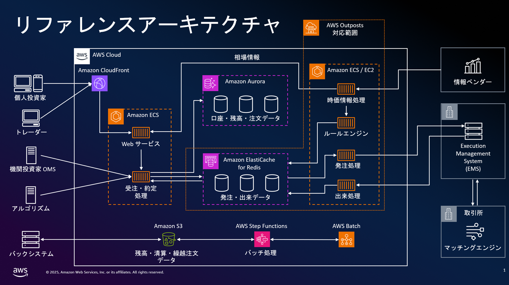
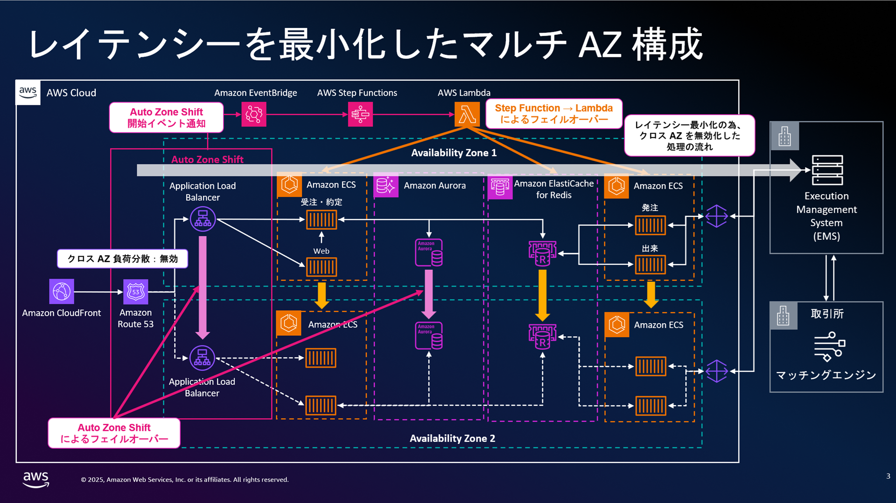
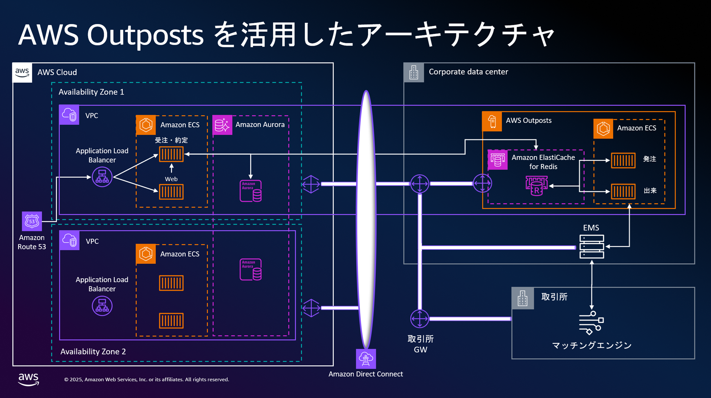

# 金融ワークロードアーキテクチャ解説 [資本市場 OMS]

## アーキテクチャの特徴

### 本アーキテクチャのリファレンス

現在、国内・海外で実際に稼働している証券会社の OMS(Order Management System) のアーキテクチャを参考に、求められるレイテンシーや可用性の要件を実現可能なものとなるようなクラウドネイティブなデザインとしています。

**クラウドメインで構築されている/稼働している OMS 事例**

- Vanguard critical trading platform
- Fidelity Asset Management's Equity Trading Platform
- Santander trading platform

### 本アーキテクチャの目的

本リファレンスアーキテクチャは、レイテンシー・スケーラビリティ・高可用性のトリレンマを抱える証券会社に対し、多様化するニーズに応じた最適なバランスを実現するクラウドネイティブな OMS の指針を提供することを目的としています。

証券会社の基幹システムである OMS は、各社が独自に開発したシステムを古くからオンプレミスで保守運用されてきた歴史があり、大規模システムではメインフレームが今も利用されていることは珍しくありません。一方、近年の著しく増加した取引量を背景に、受発注システムの柔軟なキャパシティ調整とコスト最適化のため、OMS にもクラウド活用への期待が高まっています。

**課題としては、以下の 3 点が挙げられます**

- **レイテンシー要件**: 投資家からの注文を受け付けてから執行までの価格乖離（スリッページ）を最小化し、最良気配値での約定確率を高めるには、極めて低いレイテンシーが求められます。従来は取引所コロケーションサービスや同一データセンター配置で対応してきましたが、商品や投資家へのサービスの多様化により一律にレイテンシーに対して最優先で大きなコストをかけることの投資対効果が高いという状況は変化してきました。

- **スケーラビリティ**: 増大を続ける取引量と、相場イベント時の予測困難な急激なピークは、平常時との必要キャパシティのギャップを拡大させ、ピーク対応リソース確保のコストが課題となっています。

- **高可用性**: 社会インフラとして重要性を増す証券取引において、トレードライフサイクルの中心となる OMS の可用性要件は一層厳格化しています。

### 本アーキテクチャの特徴

一般投資家、機関投資家、トレーダーからの注文受付と約定管理、取引所への発注という基本機能をクラウド環境で実現しています。本アーキテクチャの特徴として、「受注と約定」を処理する部分と「発注と出来」を処理する部分を分離し、その間を非同期メッセージング基盤で連携する設計を採用しています。

一般的な証券会社の基幹システムでは、複数の市場・取引所への注文回送を一元管理し最適な執行戦略の選択・実行を行う EMS(Execution Management System) というシステムがあり、 OMS からの注文の情報を取引所に繋いでいます。OMS の「発注と出来」を処理する部分をこの EMS と近い位置に配置することで、取引所との通信レイテンシーを最小化できます。また、「受注と約定」部分と「発注と出来」部分では負荷特性が異なるため、それぞれ独立したスケーリング戦略を取ることが可能になります。さらに、各処理層内での一貫性を確保しやすくなり、システム全体の安定性と信頼性を高めています。

この機能分離アプローチにより、急激な相場変動時などの高負荷状況下でも各コンポーネントが最適な処理能力を維持しやすくなり、システム全体のパフォーマンスと応答性を向上させています。

本アーキテクチャには、投資家に対して値動きなどの相場情報を配信する機能も含まれています。情報ベンダーから提供される相場情報を受信し、投資家に対してリアルタイムで配信するコンポーネントを備えています。

OMS は一般的な証券会社のシステムの中では、フロント～ミドルのシステムという位置づけとなります。このフロント～ミドルのシステムは、場取引時間中に顧客注文の処理と暫定的なポジション・残高・買付余力の加減算をリアルタイムで行います。一方、バックという位置づけのシステムでは市場取引終了後、取引所・清算機関からの最終決済データを受信・処理し確定値を算出します。この確定データは夜間バッチ処理によって フロント～ミドルシステム へ転送され、翌営業日の開始前に洗い替えられます。

この OMS・バックシステム間のデータ連携には、ポジション・残高データ、顧客情報・与信情報、手数料・税金計算結果などが含まれ、双方向でデータ整合性を確保する必要があります。これらのデータ転送処理と OMS 側での夜間バッチ処理（データ取込、整合性検証、洗い替え処理）には、スケーラビリティと運用負荷軽減のため、マネージドサービスを活用したアーキテクチャを採用しています。

### 工夫したポイント、AWS 独特の実装、Edge な取り組み

#### レイテンシー最適化

- メッセージング基盤には、低レイテンシーを実現するマネージドサービスとして Amazon ElastiCache for Redis（Redis Streams 機能を含む）を採用しています。
- 極めて低いレイテンシーが必要な場合は、クロス AZ 通信を無効化してシングル AZ 内で全ての処理を行う AZ の Active/Standby アーキテクチャとしています。レイテンシー要件が緩和される場合は、クロス AZ の通信を許容した Active/Active のマルチ AZ 構成に同じアーキテクチャで構成可能です。
- 取引所への執行管理を行う EMS と発注・出来処理をネットワーク的により近くに配置するため、AWS Outposts を活用したアーキテクチャに転用できる設計としています。

#### スケーラビリティ向上

- 「受注・約定」と「発注・出来」の機能を明確に分離したマイクロサービス設計により、各コンポーネントが独立してスケールできる柔軟なアーキテクチャを実現しています。
- マネージドサービスを積極的に採用することで、急激な負荷変動にも対応可能な弾力的なリソース調整を実現しています。

#### 高可用性確保

- AWS Auto Zone Shift 機能を活用し、AZ 障害発生時に自動的に影響のある AZ からトラフィックを退避させることで、クロス AZ 通信を無効化した Active/Standby 構成でも、クロス AZ 通信を許容する Active/Active 構成でも、いずれの場合でも高可用性を確保する設計としています。

### 諦めたこと（トレードオフ）

#### レイテンシー vs 可用性

クロス AZ 通信を無効化した Active/Standby 構成を採用した場合、障害検知とフェイルオーバー実行のためのカスタムスクリプトを設計・実装する必要があります。障害発生時には二つの選択肢があります。一つは正常なコンポーネントを含めて AZ 全体をフェイルオーバーさせることでクロス AZ 無効化状態を維持する方法、もう一つは単一コンポーネントのみをフェイルオーバーさせるものの一時的にクロス AZ 通信が発生する縮退状態とする方法です。前者はレイテンシー優先、後者は可用性優先の選択となりトレードオフの検討が必要となります。

#### レイテンシー vs スケーラビリティ

取引所により近い位置への配置を実現するために AWS Outposts を利用する場合、リージョンで動作するサービスと比較してリソースの拡張性が限定的となり、スケーラビリティが制約されます。急激な負荷増大に対応するためには、より柔軟なスケーラビリティを持つリージョン配置を選択する必要があります。

#### スケーラビリティ vs 可用性

- 高いスケーラビリティとコスト効果を実現するために負荷特性に応じて処理を細かく分割したマイクロサービス設計を採用すると、システムの複雑性が増すことによって可用性設計も合わせて複雑になってしまうリスクがあります。
- 本アーキテクチャでは全てのコンポーネントが Auto Zone Shift 対応ではないため、AZ 障害時の一貫したフェイルオーバーには追加実装が必要です。細分化されたマイクロサービスによるスケーラビリティと障害時の整合性維持の複雑さのトレードオフを考慮する必要があります。

## アーキテクチャ

### アーキテクチャ図

### 解説文

#### 基本となるアーキテクチャの説明

注文を受け付けるフロント部分の処理、執行・取引所とのやり取りをする処理はそれぞれ負荷特性が異なり、ビジネスロジックの変更要求頻度も大きく異なるため、コンテナによるマイクロサービスとしています。コンテナオーケストレーションには Amazon Elastic Container Service (ECS) を利用しています。

メインのリレーショナルデータベースとして Amazon Aurora を採用し、受注処理と発注処理の間のメッセージングには Amazon ElastiCache for Redis の Redis Streams 機能を使用しています。Redis Streams はインメモリでの高速な処理が可能で、低レイテンシーが求められるユースケースに適しており、導入や運用の容易さ、シンプルなアーキテクチャという利点があります。本アーキテクチャの大きな特徴は、「受注と約定」処理と「発注と出来」処理を明確に分離し、それらをメッセージング基盤で連携するコンポーネント化された設計にある点です。この疎結合アーキテクチャにより、メッセージング基盤を各証券会社のニーズに応じて柔軟に選択・交換することが可能になります。例えば、長期間のメッセージ保持や多数のコンシューマーグループへの配信が必要な場合は Amazon Managed Streaming for Apache Kafka (MSK)、メッセージの順序がそれほど重要でなく、シンプルなキューイング機能で十分な場合は Amazon SQS も選択できます。このコンポーネント分離により、レイテンシー・スケーラビリティ・高可用性のバランスを各社の優先事項に合わせて最適化できる柔軟性を実現しています。

情報ベンダーから受け取った相場情報は、WebSocket を通じてクライアントにリアルタイム配信されます。

証券バックシステムとの連携においては、取引所や清算機関からの確定データをもとに算出された顧客の最新ポジション・残高情報、顧客マスター情報、与信情報、手数料・税金計算結果などの重要データを日次で受け取り、OMS のデータを洗い替えます。これらのデータ連携処理は、Amazon S3 をデータ授受の中継点とし、AWS Step Functions によるワークフロー制御、AWS Lambda による処理実行という、高いスケーラビリティと運用効率を実現するマネージドサービスの組み合わせで実現しています。

取引所とのネットワーク接続ポイントはオンプレミス環境に配置されていることを想定しています。

#### レイテンシーを最小化したマルチ AZ 構成の説明

本ユースケースでは一連のトレードライフサイクルでのレイテンシーを最小化する為、クロス AZ での通信を無効化した、Active / Standby のマルチ AZ 構成パターンを採用しています。この構成では全てのコンポーネント単一 AZ 内で処理を完結させることで、クロス AZ 通信によるレイテンシー増加を回避しています。

単一 AZ 内での処理を維持しながらも AZ 障害に対応するため、AWS Auto Zone Shift による自動フェイルオーバー機能を実装しています。この機能により、障害が発生した AZ から自動的にトラフィックを退避させ、スタンバイ AZ への切り替えを実現します。

2025/08 時点で Auto Zone Shift の直接サポート対象外となっている Amazon ECS、Amazon ElastiCache for Redis については、Amazon EventBridge を経由した Auto Zone Shift 開始イベント通知を利用し、AWS Step Functions と AWS Lambda による独自のフェイルオーバー処理を実装しています。

Auto Zone Shift はどのような構成でも有用です。レイテンシー要件が緩和され、従来型のクロス AZ 通信を許容するマルチ AZ 構成を採用する場合でも、AZ 障害発生時に問題のある AZ を迅速に切り離す機能として Auto Zone Shift の導入は推奨されます。これにより、障害のある AZ でのリソース消費や通信エラーを回避し、システム全体の安定性を向上させることができます。

ただし、Auto Zone Shift 対象外サービス用のカスタム実装フェイルオーバー機能は、AWS コントロールプレーンに依存する設計となるため、AWS コントロールプレーン自体の障害時には機能しない可能性がある点に留意が必要です。

#### AWS Outposts を活用したアーキテクチャ

本ユースケースでは、取引所への執行管理を行う Execution Management System（EMS）と発注・出来処理のレイテンシーを極限まで低減するために、AWS Outposts を活用しています。これにより取引所への FIX プロトコルによる通信遅延を最小化できます。

AWS Outposts は取引所に近接した場所やコロケーションセンターに配置され、Outposts 上で Amazon ElastiCache for Redis によるメッセージング処理と Amazon ECS による発注・出来処理を実行します。

基本構成としては単一の AWS Outposts を採用しています。Outposts は物理的に独立しているため、親 AZ に障害が発生しても Outposts 自体の処理能力は維持され、他の健全な AZ にある受注処理部分との通信が確保されている限り処理を継続できます。

より高い可用性が求められる場合には、オプションとして複数の Outposts による冗長構成も検討可能です。その場合、異なる Outposts 上の ElastiCache for Redis インスタンス間でのデータ整合性確保の仕組みを追加実装する必要があります。

> AWS Outposts を用いたアーキテクチャについては「[金融ワークロードアーキテクチャ解説 [ハイブリッド]](https://github.com/aws-samples/baseline-environment-on-aws-for-financial-services-institute/blob/main/doc/reference-arc-hybrid/readme.md)」も合わせてご参照ください。

#### DR 構成について

一般的な金融機関のミッションクリティカルなシステムと同様にマルチリージョン構成を推奨します。ただし、証券会社の OMS の特性上、障害発生時には以下の点を考慮する必要があります。

障害発生時、特に取引時間中の場合、注文処理途中や約定連携中の取引データはリージョン切替時に損失するリスクがあります。データロストを避けるために Aurora のクロスリージョンレプリケーションは有効ですが、メッセージング基盤に残存するデータについては別途、損失パターンを考慮した保護策が必要となります。

DR への切替プロセスでは、取引所との接続再確立やバックシステムとのデータ整合性確保など、複数の検証ステップが必要となります。これらの確認作業を確実に行うためには、慎重かつ計画的な実施が求められ、多くの場合、手動での操作と確認を伴います。こうした要件から、DR 切替には一般的に数時間から 1 営業日程度の時間枠を確保することが現実的であり、ビジネス影響を最小化するための適切なタイミング選定も重要な考慮点となります。

## FAQ

- Q: レイテンシー要件はどの程度まで対応可能ですか？

  - A: 本アーキテクチャでは、投資家からの注文処理において複数の段階でのレイテンシーを最適化しています。OMS 内部のコンポーネント間（受注処理と発注処理間）の通信レイテンシーは、同一 AZ 内での処理に最適化することで数ミリ秒程度に抑えられます。また、OMS 内部での処理時間（アプリケーションロジックやデータベース処理を含む）は、ロジックの複雑さに依存しますが、最適化により数十ミリ秒程度に収めることが可能です。さらに、OMS（あるいは Outposts 上の EMS）から取引所までのネットワーク往復レイテンシーについては、AWS Outposts を取引所近接地に配置することで数ミリ秒レベルまで短縮できます。これにより、エンドツーエンドでの注文処理全体を十数ミリ秒～数十ミリ秒程度で完了させることが可能となります。
  - 2025 年 4 月にリリースされた第二世代 の Outposts ラックでは、超低レイテンシーで決定論的なパフォーマンスを実現するよう設計された bmn-sf2e インスタンスが利用可能になりました。この新しいインスタンスでは、特に証券業界のお客様向けに、ネイティブのレイヤー 2 (L2) マルチキャスト、Precision Time Protocol (PTP)、等長ケーブルを通じた決定論的なネットワークを提供します。

- Q: なぜメッセージング基盤に Amazon ElastiCache for Redis を選択したのですか？

  - A: 証券取引では少しの遅延が収益に大きく影響するため、インメモリで動作し超低レイテンシーを実現できる Redis Streams を選択しました。SQS や SNS などの他のメッセージングサービスと比較して、Redis Streams は処理速度が格段に速く、またデータ構造の柔軟性も高いというメリットがあります。さらに大規模システムの場合は、レイテンシーと永続化、管理性のバランスを考慮して、Amazon Managed Streaming for Apache Kafka を検討することも可能です。

- Q: AZ 障害時のデータ永続性はどう担保していますか？

  - A: Amazon Aurora のクロス AZ レプリケーション、Amazon ElastiCache for Redis の複数クラスタへの同期書き込みを活用し、 AZ 障害時のデータロストを最小限に抑えています。

- Q: 取引量の急激な増加（バースト）にどう対応しますか？
  - A: Amazon ECS のサービスオートスケーリング、Amazon ElastiCache for Redis のスケールアウト機能により、取引量増加に動的に対応します。ただし、負荷に合わせたスケーリングはその反応速度が課題になります。寄り付き時の注文量を事前に予測し、寄り付き前に先にスケールアウトさせておく等のスケジュールスケーリングとの組み合わせが重要となります。

## リファレンス

- 公開事例のリンク

  - [SBI 証券 オンライン取引システム](https://aws.amazon.com/jp/solutions/case-studies/sbi-securities/)
  - [Vanguard critical trading platform](https://reinvent.awsevents.com/content/dam/reinvent/2024/slides/fsi/FSI322_How-Vanguard-rebuilt-its-mission-critical-trading-application-on-AWS.pdf)
  - [Fidelity Asset Management's Equity Trading Platform](https://pages.awscloud.com/rs/112-TZM-766/images/MO01-Fidelity.pdf)
  - [Santander trading platform](https://d1.awsstatic.com/events/Summits/reinvent2023/FSI311_How-Santander-built-a-cloud-native-trading-platform-at-scale.pdf)

- AWS ドキュメント、blog へのリンク
  - [金融ワークロードアーキテクチャ解説 [ハイブリッド]](https://github.com/aws-samples/baseline-environment-on-aws-for-financial-services-institute/blob/main/doc/reference-arc-hybrid/readme.md)
  - [How Upstox built Next-Generation trading platform using Amazon EKS, Karpenter, and Spot Instances](https://aws.amazon.com/jp/blogs/containers/how-upstox-built-nextgen-trading-platform-using-amazon-eks-karpenter-and-spot-instances/)
  - [オンプレミスで画期的なパフォーマンスとスケーラビリティを実現する第 2 世代の AWS Outposts ラックを発表](https://aws.amazon.com/jp/blogs/news/announcing-second-generation-aws-outposts-racks-with-breakthrough-performance-and-scalability-on-premises/)
