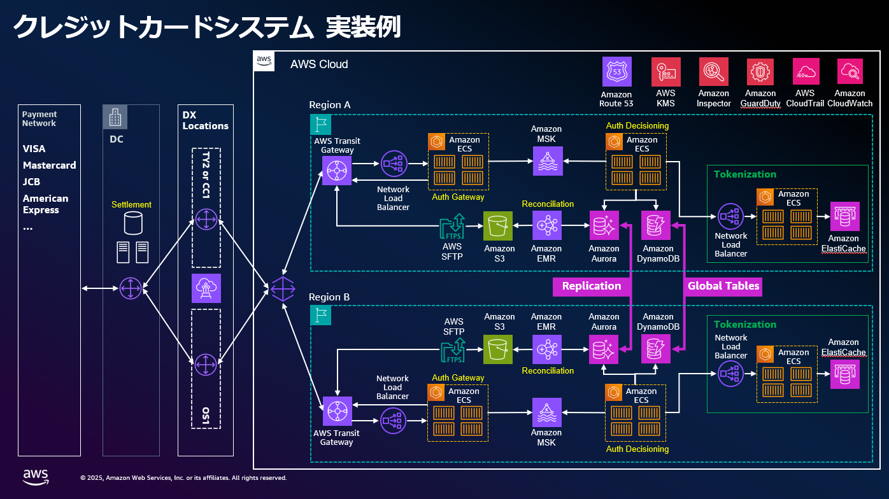

# 金融ワークロードアーキテクチャ解説 [クレジットカード イシュアシステム]

## アーキテクチャの特徴

### 本アーキテクチャのリファレンス

- クレジットカードのイシュアシステム(\*1)をオンプレミスから AWS に段階的に移行・構築運用する際のリファレンス

### 本アーキテクチャの目的

- 大規模セールやポイント還元キャンペーン等に起因した決済需要による高トラフィック処理やリアルタイム承認要件に柔軟に対応する
- 新しい決済技術や業界標準の導入／金融規制要件の変更が必要になった際等に、サービス・機能の追加・変更を効率的に実行可能な IT 基盤を構築する
- 高可用性が求められるミッションクリティカルなカード決済システムの業務継続性を支える高レジリエンスなアーキテクチャを構築する

### 本アーキテクチャの特徴

- ミッションクリティカルなクレジットカード処理のイシュアシステムを実現するアーキテクチャ
- マイクロサービスアーキテクチャを採用し各機能の独立したスケールアウトを実現することで、クレジットカード業界で要求される高トラフィック処理やリアルタイム承認要件に柔軟に対応する

#### パフォーマンス要件

- 最大 5,000TPS 、レスポンス時間 200msec 以下、日次で 100 万件／月次で 3 億件を超えるトランザクションを処理
  - マイクロサービスアーキテクチャを採用し各機能の独立したスケールアウトを実現

#### 可用性要件

- 99.99%
  - マルチリージョン/マルチ AZ 等の AWS のメカニズムを最大限に活用し高可用性を実現

### 全体構成・各機能の位置づけ

- 本アーキテクチャでは Authorization（承認）および Reconciliation（クリアリングファイルと承認済みデータの突合せ）の機能を AWS 上に構築し、Settlement（資金精算）をオンプレミスで構築するアーキテクチャパターンを採用
  - 段階的に AWS にワークロードを移行する Strangler Pattern の手法を採用することで、移行に伴うリスクやコストを低減しつつクラウド化によるメリットをバランスよく享受することが可能
- AWS 上で Reconciliation 済みのクリアリングデータを作成した上でオンプレミスにファイルを連携し、Settlement（資金精算）の処理を実施する流れとなっている

### 工夫したポイント、AWS 独特の実装、Edge な取り組み

- クレジットカードシステムでは超低レイテンシーが求められることから僅かなテールレイテンシー(\*2)が重大な課題となる可能性があり、対策アプローチとしてリクエストヘッジを採用している（詳細はアーキテクチャセクションにて解説）

## アーキテクチャ

### アーキテクチャ図

- 全体アーキテクチャ図（Overview）

### 解説文

#### マルチ AZ ＆マルチリージョン構成

- リージョン内のサービス継続性を高めるためにマルチ AZ の構成を採用

  - Amazon ECS で動作するコンピューティングリソース、Amazon MSK 、Amazon EMR 、Amazon ElastiCache for Valkey 、AWS SFTP をマルチ AZ で冗長配置
  - Amazon Aurora はサービスと仕様として 3AZ でストレージを 6 つ持つクォーラム構成で冗長化／インスタンスをマルチ AZ で構築
  - S3 、DynamoDB はサービス仕様としてデフォルトでマルチ AZ に冗長配置が可能

- マルチリージョンでの Active - Active 構成を採用

  - カード番号、顧客 ID 等のデータ内容ごとにオンプレミスからどちらのリージョンに振り分けるかを判定することで各リージョンごとに処理対象を分離し、整合性と可用性の両立を実現

- リージョン間のデータ同期

  - Aurora Global Database、DynamoDB Global Tables を利用（通常 1 秒以内にレプリケーション）
  - 障害復旧時のレプリケーションラグによるデータロストが発生するケースへの対応例：
    - DynamoDB Streams を活用し書き込みイベントを Kinesis Data Firehose 経由で S3 にアーカイブ
    - アプリケーションの処理結果ログを S3 に連携し、Athena で内容を確認しつつリージョン復旧時に活用
    - 外部決済システムと突合し、取引履歴から未反映取引を検出・補完
    - 店舗の POS システム、EC 事業者の注文記録、顧客アプリの履歴等を元に復旧

- リージョン障害時の切り替え
  - Application Recovery Controller の Routing control によって信頼性の高い切り替えを実現

#### Network

- オンプレミスと AWS の接続はマルチロケーションの Direct Connect + Direct Connect Gateway + Transit Gateway を利用した冗長化構成
- 国際ブランドのカードネットワークとの接続はオンプレミス側で実施
- オンプレミス側からの通信は Route 53 の名前解決を利用した実装

#### Computing

- Amazon ECS を採用し VPC 内にマルチ AZ で展開
- 要件に合わせて Amazon ECS の代わりに Amazon EKS を選択可能
- 機能構成：外部からの承認要求を受信するための”Auth Gateway”、承認処理を実行するための”Auth Decisioning“と用途別のタスク群を配置し、 Amazon MSK を利用してデータをキューイングし機能間の疎結合を実現している
  - クレジットカード取引では大容量のメタデータ（商品情報、顧客情報、リスクスコア等）を含む場合があり、扱えるメッセージサイズが大きいこと、スループット・レイテンシ等のパフォーマンス面で優れる Amazon MSK が有効な選択肢となる

#### Database

- 以下のように取り扱うデータ／処理の内容に合わせて適材適所でデータベースを選択
  - カード取引に関連するアカウント情報（残高／取引データ）を DynamoDB で保管・処理する
    - 前述したクレジットカード取引の対象処理・低レイテンシ・高スループット要件に対応するために NoSQL である DynamoDB のパフォーマンス特性を活用
  - カードの上限金額、PIN エラーの許容回数といった顧客ごとの業務ルール等を Aurora で管理
    - 業務ルールを複雑な条件付きで参照/検索・集計するような用途では RDB である Aurora の特性を活用することが可能
  - カード情報のトークナイゼーションは ElastiCache for Valkey で処理する
    - セキュリティ／PCI DSS 要件の対応のためカード番号や認証コード等をトークン化した上で加盟店や決済代行会社とデータ連携するため、トークナイゼーションの仕組みが必要となる
    - データをディスクではなくメモリ内で保持するデータベース仕様によりトークナイゼーションをマイクロ秒レベルの低遅延で処理することを可能とする
  - DynamoDB のテールレイテンシー(\*2)の対策にリクエストヘッジを導入
    - DynamoDB は分散システムのため内部コンポーネントの稀な性能低下の影響によるテールレイテンシーが 99 パーセンタイルや 99.9 パーセンタイルで発生する可能性がある
    - リクエストヘッジは、リクエストが指定された時間しきい値(デルタ値)を超えた際に、自動的に 2 番目のリクエストを送信するアプリケーション側の実装手法である
    - 結果、2 つのリクエストのうち最速のレスポンスを使用することで全体的なテールレイテンシーを改善することが可能となる

#### ファイル連携

- Reconciliation（クリアリングファイルと承認済みデータの突合せ）のバッチ処理は Amazon EMR で実行し、S3 にエクスポートしたものを Transfer Family を使って SFTP でオンプレミスに転送する
  - Authorization（承認）処理はリアルタイムにオンプレミスシステムに連携する一方で、差異や不一致が無いことの確認として取引明細データの突合せ確認をバッチで行うのが Reconciliation 処理 の目的である

## FAQ

- 国際ブランド（Visa、Mastercard 等）との接続はどのように行いますか？
  - 国際ブランド接続はオンプレミス側で維持し Direct Connect によりセキュアに連携します
- 災害復旧（DR）の目標復旧時間はどの程度ですか？
  - マルチリージョン構成により RTO（目標復旧時間）は 30 分以内、RPO（目標復旧時点）は 1 分以内を目指す構成です
  - また、Aurora Global Database と DynamoDB Global Tables を活用しデータ損失リスクを最小化しています
- 各サービスがどのように独立してスケールアウトするのですか？
  - ECS タスク定義により、Gateway、Authorization、Reconciliation の各コンポーネントを独立したサービスとして構築することで個別のスケールアウトが可能です
  - Amazon MSK によるメッセージキューイングにより各サービス間の疎結合を維持しながら一つのサービスの負荷増大が他サービスに影響しない設計としています
- PCI DSS やその他の金融規制要件の変更にはどのように対応しますか？
  - 各 AWS マネージドサービスにおける AWS の責任領域は AWS サービス側でで PCI DSS 基準に対応するため、規制変更時においてもユーザ様側での対応負荷を低減することが出来ます
  - また、ユーザ様側の責任領域においても、マイクロサービス化したアーキテクチャにより規制変更の影響範囲を限定できます
  - 例えばカード情報処理に関する規制変更は該当する Authorization 部分のみを更新すれば対応可能です
  - また、AWS Config 、CloudTrail 、Security Hub を活用したコンプライアンス監視機能により、規制要件の継続的な監視と迅速な対応が可能です
- セキュリティとコンプライアンス要件はどのように対応しますか？
  - 各 AWS マネージドサービスにおける AWS の責任領域は AWS サービス側でで PCI DSS 基準に対応するため、ユーザ様側での対応負荷を低減可能です
  - ユーザ様側の責任領域においても、PCI DSS 等の金融規制に準拠しカード情報のトークン化、暗号化、アクセス制御、監査ログ機能を包括的に実装することで対応します
  - AWS Config を活用したコンプライアンス監視機能も可能です

## リファレンス

- 公開事例のリンク
  - How Global Payments accelerates innovation on AWS
    - https://pages.awscloud.com/rs/112-TZM-766/images/IN01-GlobalPayments.pdf
  - How Global Payments scales on AWS with governance and controls
    - https://d1.awsstatic.com/events/Summits/reinvent2022/COP303_How-Global-Payments-scales-on-AWS-with-governance-and-controls.pdf
  - AWS re:Invent 2022 - Global Payments: From mainframes to microservices (FSI309)
    - https://www.youtube.com/watch?v=7WMtVj12W1U
  - Global Payments Credit Card Authorization System using AWS DynamoDB & EKS | AWS Events
    - https://www.youtube.com/watch?v=wqDWy9hXL3k
  - How Global Payments Inc. improved their tail latency using request hedging with Amazon DynamoDB
    - https://aws.amazon.com/jp/blogs/database/how-global-payments-inc-improved-their-tail-latency-using-request-hedging-with-amazon-dynamodb/
- AWS ドキュメント、blog へのリンク
  - Building a Credit Card Payment Processing Platform on AWS
    - https://aws.amazon.com/jp/blogs/industries/credit-card-payment-processing-on-aws/

## 注釈

- \*1：クレジットカードシステム／イシュアシステムに関する補足
  - クレジットカードのイシュアシステムの処理は主に以下のプロセスで構成される
    - カード利用をリアルタイムに承認する Authorization の処理
      - 顧客がカードを利用する際、加盟店 → 決済代行会社（アクワイアラ）→ カード発行会社（イシュア）の流れで情報を中継して承認判定を行う
    - 承認された取引データの交換・照合を行う Reconciliation の処理
      - 決済代行会社（アクワイアラ）が売り上げ情報であるクリアリングデータをカード発行会社（イシュア）に連携し、承認データとの突合せ処理を行う
    - 資金決済を担う Settlement の処理
      - 決済ネットワーク上でのアクワイアラとイシュア間の清算・決済・資金移動
  - イシュアシステムの位置づけは以下の資料を参照
    - 宮居雅宣「キャッシュレス決済の仕組みと注意点」決済サービスコンサルティング株式会社、
      - 総務省自治行政局行政課、2021 年 7 月 26 日、p.12
        - https://www.soumu.go.jp/main_content/000761489.pdf
- \*2：テールレイテンシーとは
  - 分散システムなどで処理される多数のリクエストの中でごく一部（例えば上位 1%や 0.1%）が、 通信経路の混雑や物理距離・リソース競合等に起因して長い待ち時間となる現象
