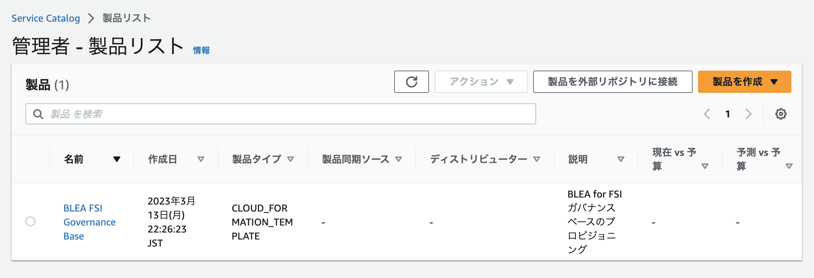
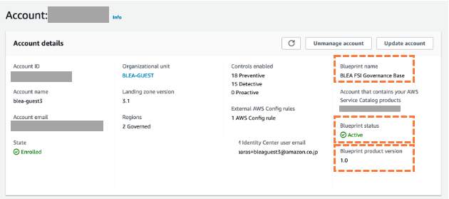

# Control Tower AFC を利用したガバナンスベースの自動プロビジョニング

ここでは、Control Tower Account Factory Customization(AFC) を使用して、Control Tower でのゲストアカウント作成時に BLEA for FSI ガバナンスベースを自動的にプロビジョニングする方法について説明します。

> **Account Factory Customization(AFC)**： AWS Control Tower では、AWS アカウントの新規作成または既存アカウントの更新の際に、Service Catalog に登録された CloudFormation テンプレートをブループリントとして使用して、アカウントへのリソースのプロビジョニングを自動化することができます。ブループリントではアカウントのプロビジョニング時に必要な特定のリソースと設定が定義されます。

BLEA for FSI ガバナンスベースは、通常、CDK テンプレートを利用して各ゲストアカウント上にプロビジョニングしますが、CDK により生成された CloudFormation テンプレートを使用することで、Account Factory Customization(AFC) の仕組みを使って、ゲストアカウント作成時に自動的にガバナンスベースをプロビジョニングすることができるようになります。

## 1. Account Factory Customization(AFC)を利用する事前準備

AFC では AWS Service Catalog に製品として登録した CloudFormation テンプレートを利用して自動プロビジョニングを行うため、事前に Service Catalog を使用する準備が必要になります。Service Catalog サービスは、Control Tower 管理アカウント または、専用アカウントとして Service Catalog ハブアカウントを AWS 組織内に準備して利用することが可能です。本ガイドでは Service Catalog ハブアカウントを利用する前提で説明を行います。

### 1-1. Service Catalog ハブアカウントの準備

Service Catalog ハブアカウントを AWS 組織内に新規に作成します。Control Tower Account Factory を使用してアカウントを新規に作成して下さい。

### 1-2. Service Catalog ハブアカウントでの IAM ロールの準備

Control Tower 管理アカウントから Service Catalog ハブアカウント上の Service Catalog へのアクセスを許可するために、IAM ロール `AWSControlTowerBlueprintAccess` を準備する必要があります。

:warning: IAM ロールの作成作業は Service Catalog ハブアカウント 上で `AWSControlTowerExecution`ロールにスイッチロールしてから作業して下さい。それ以外のロールでこの IAM ロールを作成した場合は、**SCP により処理が失敗します**。

[ロール名]  
AWSControlTowerBlueprintAccess

[許可ポリシー]

- AWSServiceCatalogAdminFullAccess
- AmazonS3ReadOnlyAccess

[信頼関係]

```
{
    "Version": "2012-10-17",
    "Statement": [
        {
            "Effect": "Allow",
            "Principal": {
                "AWS": [
                "arn:aws:iam::<CT管理カウントのアカウントID>:role/service-role/AWSControlTowerAdmin",
                "<CT管理アカウントでアカウントを作成する際に使用するロールのARN>"
                ]
            },
            "Action": "sts:AssumeRole"
        }
    ]
}
```

> **:warning:CT 管理アカウントでアカウントを作成する際に使用するロールの ARN**  
> AWS 管理コンソールにログインする際に使用するユーザーのロールの ARN です。 AWS IAM Identity Center から AWSAdiministratorAccess ロールを使用してログインする場合の ARN は下記のようになります。  
> `arn:aws:iam::<CT管理カウントのアカウントID>:role/aws-reserved/sso.amazonaws.com/ap-northeast-1/AWSReservedSSO_AWSAdministratorAccess_xxxxxxxxxxxxxxxx`

### 1-3. Sevice Catalog での 権限設定

Control Tower 管理者アカウントで下記コマンドを実行して、Sevice Catalog と StackSets に Organizations の権限を委譲します。

```
aws organizations enable-aws-service-access --service-principal servicecatalog.amazonaws.com
```

```
aws organizations enable-aws-service-access --service-principal member.org.stacksets.cloudformation.amazonaws.com
```

> 下記のコマンドで、現在権限を委譲されているサービスを確認できます。
>
> aws organizations list-aws-service-access-for-organization

## 2. ブループリント用 CloudFormation テンプレートの準備

ゲストアカウント用のガバナンスベース CDK テンプレートを実行して、CloudFormation テンプレートを作成します。最初にガバナンスベースのソースコードを取得します。

### 2-1. リポジトリの取得

github から BLEA for FSI の git リポジトリを clone して下さい。

```sh
git clone https://github.com/aws-samples/baseline-environment-on-aws-for-financial-services-institute.git
```

[https でコードを取得する例]

### 2-2. 依存する NPM パッケージのインストール

npm モジュールをインターネット経由で取得します。

```sh
# install dependencies
npm ci
```

### 2-3. ガバナンスベース用 CDK テンプレートのパラメータファイルを設定

パラメータファイルに必要な値を指定して下さい。

[参照： デプロイ情報(Context)をパラメータに設定する](../deploy-governance-base.md#7-1-デプロイ情報contextを設定するlocal)

### 2-4. CDK テンプレートを実行して、CloudFormation テンプレートを生成

cdk synth を実行して CloudFormation テンプレートファイル `governance-base-blueprint.json`を作成します。

```
cd usecases/base-ct-guest
npx cdk synth BLEAFSI-Base-AFC -j --version-reporting false > governance-base-blueprint.json
npx ts-node update-template
```

> update-template.ts では、生成した CloudFormation テンプレートから `Rules`と`Parameters`セクションを削除しています。

## 3. Service Catalog へのブループリントの登録

Service Catalog ハブアカウントまたは Control Tower の管理者アカウント上で作業して下さい。

**a. Service Catalog サービスの設定画面で、[製品]リストを表示します。**

**b. [製品を作成]をクリックして、手順で 2 で作成した CloudFormation テンプレート `governance-base-blueprint.json` をアップロードして製品を作成します。**

- **製品名：** BLEA for FSI Governance Base
- **製品の説明：** BLEA for FSI ガバナンスベースのプロビジョニング
- **所有者：** <AWS 環境を管理する組織の名称>
- **方法の選択：** テンプレートファイルの使用
- **バージョン名：** 1.0 等



> :warning: Control Tower AFC から Service Catalog 製品を利用する場合は、製品をポートフォリオに追加して各アカウントと共有する必要はありません。

## 4. Control Tower でのゲストアカウントへのブループリントの適用

Control Tower の管理者アカウント上で作業して下さい。
アカウントの新規作成 または 更新時に、Service Catalog に登録したブループリントを適用することができます。

**a. アカウント作成/更新画面の表示**  
新規にゲストアカウントを追加する場合は、Control Tower のメニューから [Account Factory] を選択します。既存のアカウントを更新する場合は、[組織]から対象アカウントを選択してアカウントの詳細を表示します。

Account Factory では[アカウントの作成]、既存アカウントの場合は、[アカウントの更新]ボタンを押します

**b. AFC 設定の指定**  
アカウントを作成する場合は必要な情報（アカウントの詳細、アクセス設定、組織単位）を入力して下さい。

アカウント作成/更新画面で、[アカウントファクトリーのカスタマイズ - オプション] のセクションを開き、AFC 実行に必要な情報を入力します。

- **AWS Service Catalog の製品を含むアカウント:** Service Catalog ハブアカウントのアカウント ID（12 桁）
  > :warning: アカウントを検証してエラーが表示される場合は、ハブアカウントでの IAM ロール設定に失敗している可能性があります
- **製品を選択して下さい：** BLEA for FSI Governance Base
- **製品バージョン**： 1.0 等
- **デプロイメントリージョン**： ホームリージョン

[アカウントの更新]、[アカウントの作成]を押すと、アカウントへのプロビジョニングが開始されます。

**c. プロビジョニング結果の確認**  
実行終了後に[ブループリント名] 、[ブループリントステータス]、[ブループリント製品バージョン] を確認して下さい。



以上で、Control Tower AFC を利用した BLEA for FSI ガバナンスベースの自動プロビジョニングの設定および確認は完了です。
