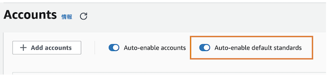
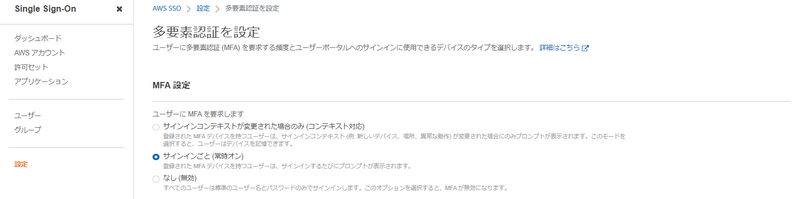
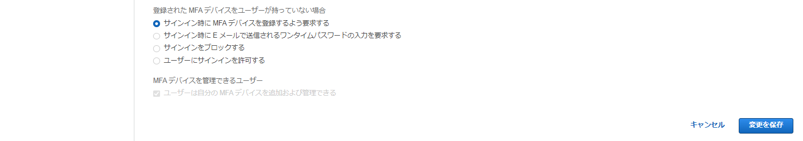
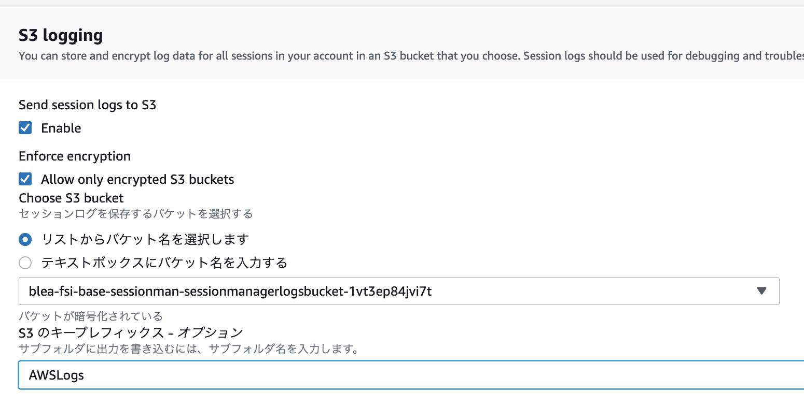

# 手作業での BLEA for FSI ガバナンスベースの設定手順

[BLEA for FSI の導入手順に戻る](./deploy-governance-base.md)

管理コンソール上での手作業でのガバナンスベースの設定手順について説明します。

---

## Organizations 環境下の Security Hub のセットアップ手順

下記公式ドキュメントを参照して、Organizations 環境下でのマルチアカウント構成の Security Hub をセットアップして下さい。

- [AWS ドキュメント: Security Hub 管理者アカウントの指定](https://docs.aws.amazon.com/securityhub/latest/userguide/designate-orgs-admin-account.html)
- [AWS ドキュメント: 新しい組織アカウントを自動的に有効にする](https://docs.aws.amazon.com/securityhub/latest/userguide/accounts-orgs-auto-enable.html)

[手順の流れ]

1. Organizations 管理アカウントにログイン
2. Security Hub 管理者アカウントとして Audit アカウントを指定

(CLI で設定したい場合)

```
aws securityhub enable-organization-admin-account  --region ap-northeast-1 --admin-account-id #auditアカウントのID#
```

3. Audit アカウントにログイン
4. [Security Hub] - [設定] を選択し、画面上部の「このリージョンで 組織 の Security Hub を有効化する」 で "有効化" を選択

5. 「Auto Enable default Standards」設定は ON にする



> NOTE: 「Auto Enable default Standards」設定を OFF にすることで、Security Hub の 「AWS 基礎セキュリティのベストプラクティス」 と 「CIS AWS Foundations Benchmark」が自動で有効化しないように設定することが可能です

> NOTE: 「Auto-enable accounts」を ON すると、自動的に組織の全てのメンバーアカウントで Security Hub が有効されます

---

## Organizations 環境下の GuardDuty のセットアップ手順

下記公式ドキュメントを参照して、Organizations 環境下でのマルチアカウント構成の GuardDuty をセットアップして下さい。

- [AWS ドキュメント: AWS Organizations を使用した GuardDuty アカウントの管理](https://docs.aws.amazon.com/ja_jp/guardduty/latest/ug/guardduty_organizations.html)

[手順の流れ]

1. Organizations 管理アカウントにログイン
2. GuardDuty の委任された管理者として Audit アカウントを指定

(CLI で設定したい場合)

```
aws guardduty enable-organization-admin-account  --region ap-northeast-1 --admin-account-id #auditアカウントのID#
```

3. Audit アカウントにログイン
4. [GuardDuty] - [設定] - [アカウント]を選択し、画面上部の「このリージョンで Organization の GuardDuty を有効化する」で "有効化" を選択

> NOTE: ”S3 保護” と ”Kubernetes Audit Logs Monitoring”の有効化はオプションです。要件に応じて有効化の有無を判断して下さい

> NOTE: この設定により自動的に組織の全てのメンバーアカウントで GuardDuty が有効化されます

---

## AWS IAM Identity Center（旧 AWS SSO) の MFA 設定手順

Control Tower 管理下のアカウントに対する AWS IAM Identity Center（旧 AWS SSO) の MFA 設定手順について記述します。

### 1. MFA の有効化

以下ドキュメントを参照して設定を行って下さい。全てのサインインに MFA を有効化するには、MFA 要求の設定を「サインインごと（常時オン）」にします。

- [AWS ドキュメント: MFA の有効化](https://docs.aws.amazon.com/ja_jp/singlesignon/latest/userguide/mfa-enable-how-to.html)



### 2. MFA デバイスの強制設定

MFA を強制するには、MFA デバイスをユーザーが持っていない場合の設定を「サインイン時に MFA デバイスを登録するよう要求する」にします。

- [AWS ドキュメント: MFA デバイスの強制の設定](https://docs.aws.amazon.com/ja_jp/singlesignon/latest/userguide/how-to-configure-mfa-device-enforcement.html)



---

## SSM セッションマネージャーの S3 ログ出力を手動でセットアップ

下記ドキュメントの 「Amazon S3 を使用してセッションデータをログ記録する（コンソール）」の手順を実行して、セッションマネージャーのセッションログを[手順 6.2](./deploy-governance-base.md#6-2-log-archive-アカウントにガバナンスベースをデプロイする) の CDK テンプレートで作成した S3 バケットに保管して下さい。

- [AWS ドキュメント: セッションアクティビティのログ記録](https://docs.aws.amazon.com/ja_jp/systems-manager/latest/userguide/session-manager-logging.html)

「S3 のキープレフィックス」は "AWSLogs"を指定して下さい。


**[重要]**
セッションマネージャー実行時に監査ログを指定された S3 バケットに出力するためには、ログイン対象となる EC2 インスタンスのプロファイルに下記のカスタマー管理ポリシー（ゲストアカウント用 CDK テンプレートで生成）を追加する必要があります。このポリシーによる権限がないとセッションマネージャーでのセッション開始が S3 への権限エラーで失敗します。

```
BLEA-FSI-BASE-SessionManagerLog-WritePolicy**
```

参考: [AWS ドキュメント: Session Manager のカスタム IAM ロールを作成](https://docs.aws.amazon.com/ja_jp/systems-manager/latest/userguide/getting-started-create-iam-instance-profile.html#create-iam-instance-profile-ssn-logging)

> NOTE: Session Manager アクセスログの Log Archive アカウントへのログ集約はサポートされていないため、ゲストアカウントのローカル S3 バケットにログは記録されます
