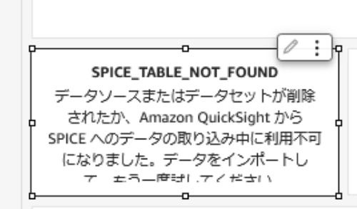
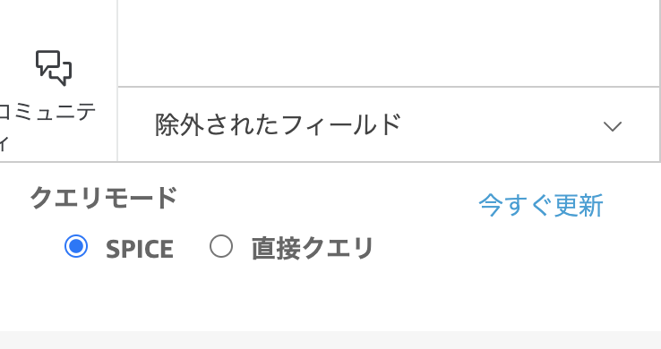

### QuickSight のセットアップ中にエラーが発生した時の対応について

#### ケース [手順 1-4-4] QuickSight データセットの作成 に失敗する。

```
Error message:  Texts contents could not be decoded.
Error message:  `cli-input-json`: Invalid JSON received
```

[可能性のある原因]

- AWS CLI のバージョンが古いため、CLI の実行に失敗しています。v2.11.12 以降のバージョンを利用して下さい。

```
Error message: Unable to verify/create output bucket bleafsi-analyticsplatform-athenaquery-output-xxxxxx
```

[可能性のある原因]

- QuickSight が使用する IAM ロールが正しく設定されていないため、Athena の出力データを保管する S3 バケットにアクセスできていない可能性があります。手順 1-4-2 QuickSight のアクセス権の設定 を確認して下さい。

```
Error message: One or more principals in resource permissions list are not valid QuickSight users
```

[可能性のある原因]

JSON ファイルに指定した QuickSight のユーザー名を見つけられない事が原因です。下記の 2 つの原因が考えられます。

- JSON ファイルに指定した QuickSight のユーザー名が間違っている。
- QuickSight を初期化したリージョンが `us-east-1`（バージニア北部）になっていて、`ap-northeast-1`（東京リージョン）ではない。

#### ケース [手順 1-4-5] QuickSight 分析の作成 に失敗する

```
Error message:  Texts contents could not be decoded.
Error message:  `cli-input-json`: Invalid JSON received
```

[可能性のある原因]

- AWS CLI のバージョンが古いため、CLI の実行に失敗しています。v2.11.12 以降のバージョンを利用して下さい。

#### ケース QuickSight 分析画面で、一部のビジュアルが正常に表示されない



[対応]

- 正常に表示されていないビジュアル部品の設定画面で `更新`を選択し、データを再取得して下さい

#### ケース QuickSight 分析画面で、全てのビジュアルが正常に表示されない

[可能性のある原因]

- QuickSight が使用する IAM ロールが正しく設定されていないため、データを保管する S3 バケットにアクセスできていない可能性があります。手順 1-4-2 QuickSight のアクセス権の設定 を確認して下さい。
- QuickSight データセットでの SPICE データの更新が上手くいっていない可能性があります。下記の手順に従って QuickSet データセット内のデータを更新して下さい。

  - 管理コンソールから QuickSight にアクセスして下さい。

  - メニューで「データセット」を選択して、`bleafsi simple datalake dataset`を開きます。

  - 右上の[データセットの編集]ボタンを押して編集画面を開きます。

  - 左下のクエリモードで`今すぐ更新`をクリックして SPICE データを更新します。タイプは `フル更新`を選択して下さい。

  

  - 更新が終わるまで 1−2 分待ちます。完了すると右上にメッセージボックスが表示されます。
