# データ分析プラットフォーム サンプルアプリケーションデータ説明

## ユースケース概要

仮想の銀行である “AWS 銀行” の 3 つの基幹システム(勘定系、顧客、インターネット・バンキング)をデータソースとしたデータレイクシステムをモデルとしています。 それらデータソースから、日時あるいは適時データがデータレイクに取り込まれます。取り込まれたデータは ETL 処理で加工され、BI ツールによる分析が可能となります。

基幹システムの一つである**勘定系システム**からは、「入出金明細」と
「口座情報」が連携され、**顧客システム**からは「顧客」情報、そして**インターネットバンキングシステム**からは「インバン契約」Entity のデータが連携されます。

データレイク(図中 Data lake)は、[サンプルアプリケーションデータ説明 : ３層構造のデータ配置](analytics-simple-datalake-arch-readme.md#三層構造のデータ配置)　に示したとおり、3 つのレイヤーで構成されています。 このデータレイクの実装は、データのストレージとして Amazon S3 を採用し、データの管理に AWS Glue Studio、ETL ジョブは AWS Glue、そのオーケストレーションは AWS Step Functions で実装しています。

図の右側にはデータ分析のビジネスユーザー（データアナリストやマーケティング担当者など）によるデータ分析を表しており、本システムでは Amazon Athena をデータソースとした Amazon QuickSight を BI ツールとして実装しています。

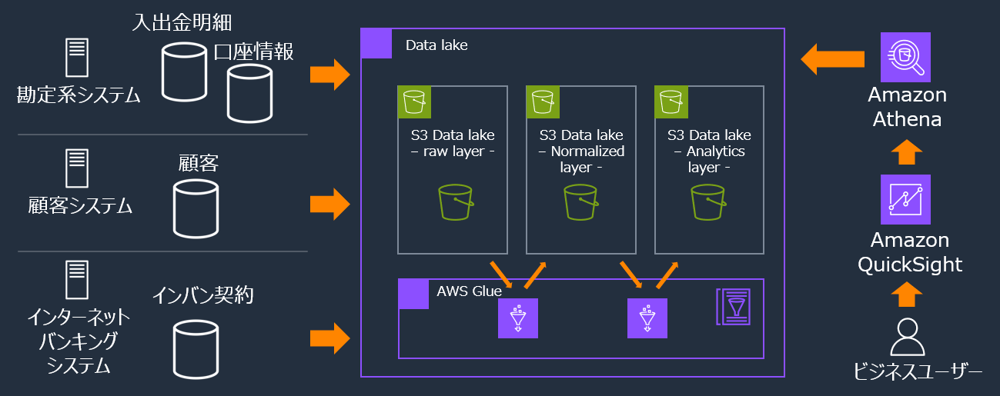

## データモデル

各ソースシステムから受領したデータは、以下の論理的関連があるものとしています。

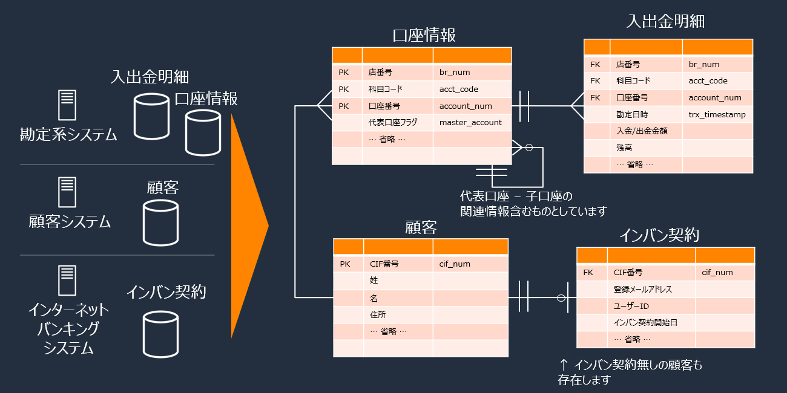

## ETL 処理概要

左端の最初のレイヤー Origin は、各ソースシステムから受領するデータの配置レイヤーです。 本システムではソースシステムから受領した csv ファイルが Origin として S3 に格納されている前提としています。

Origin から Raw、Raw から Normalized、Normalized から Analitics のレイヤーに ETL ジョブで加工しつつデータを配置します。

右端 Analytics(目的別データ)レイヤーには、マスタデータが存在します。本来はソースシステムから受領し、ETL 処理で加工され、マスタデータとして配置されますが、本システムでは割愛し、既に加工されたものが Analytics(目的別データ)レイヤーに配置されている前提としています。

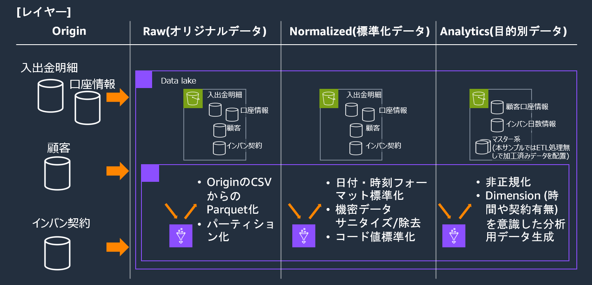

## データスキーマ

各エンティティ―毎に、Raw(オリジナルデータ)に続いて Normalized(標準化データ)のスキーマを示し、続けて Analytics(目的別データ)レイヤーで導出するエンティティおよびマスタデータのスキーマを示します。 ここに示すスキーマ情報は、 **[こちらの csv ファイル](sample-data-schema.csv)** でも提供しています。

注：

- Raw のデータ属性列は char 型で表現されていますが、これはソースシステム側のデータ属性を表現しており、当サンプルシステムの Raw(オリジナルデータ) レイヤーのデータ型は全て string として Glue Data Catalog にカタログしています。
- Normalized(標準化データ)レイヤーでは、金額は Decimal 型で、日付、タイムスタンプはそれぞれ Date, Timestamp 型としています。
- 下記スキーマ表のオレンジ色のセルは Normalized(標準化データ)レイヤーの ETL の加工対象を意味しています。 例：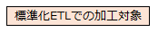

### Raw(オリジナルデータ)、Normalized(標準化データ)レイヤーのスキーマ

#### 入出金明細 - Raw(オリジナルデータ) レイヤー

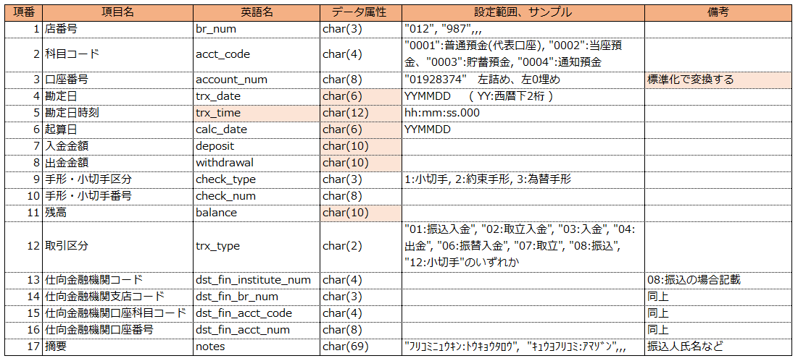

#### 入出金明細 - Normalized(標準化データ) レイヤー

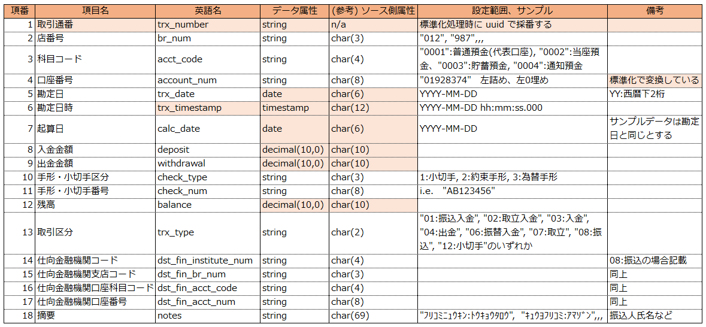

#### 口座情報 - Raw(オリジナルデータ) レイヤー

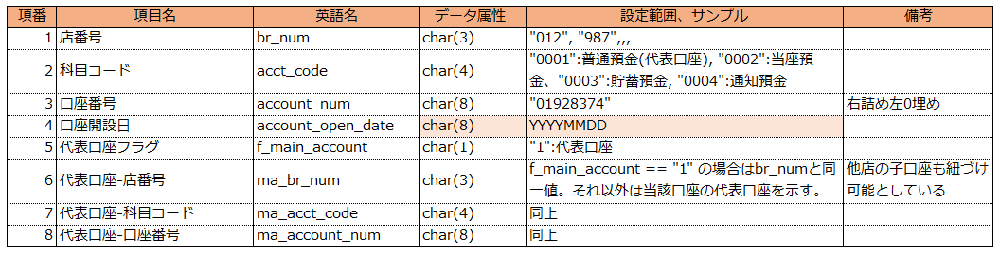

#### 口座情報 - Normalized(標準化データ) レイヤー

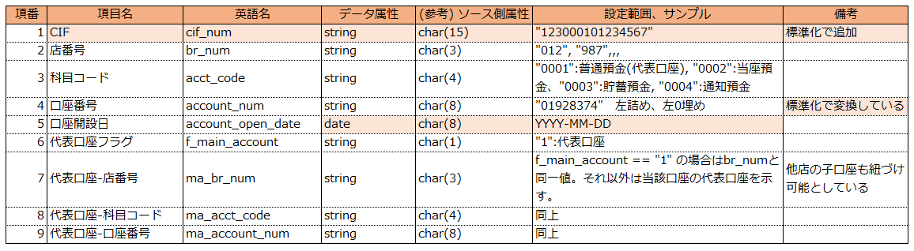

#### 顧客 - Raw(オリジナルデータ) レイヤー

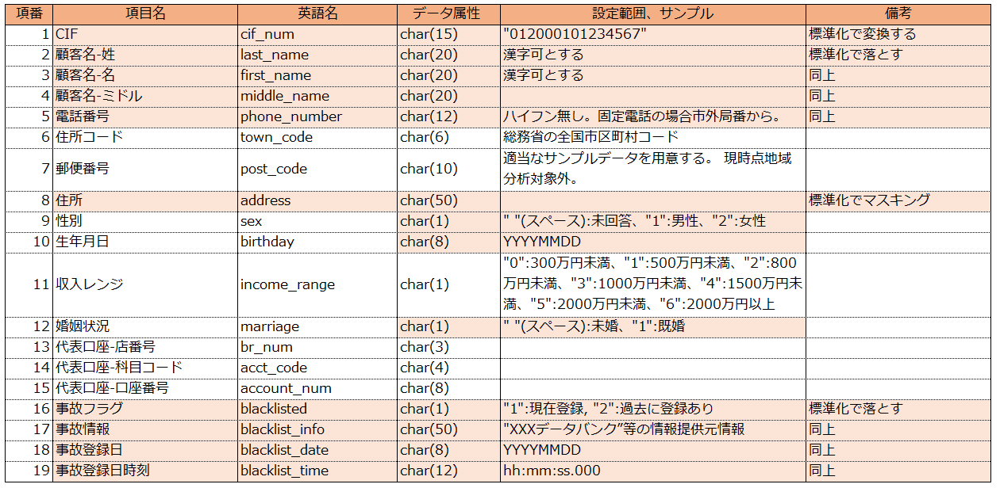

#### 顧客 - Normalized(標準化データ) レイヤー

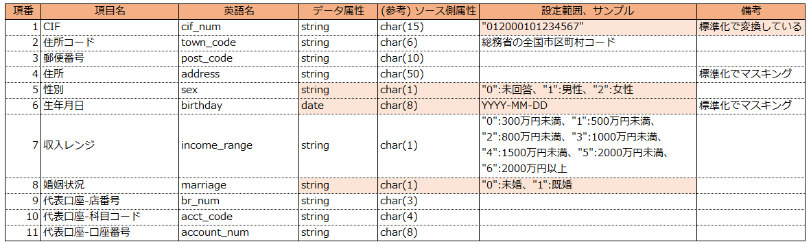

#### インバン契約 - Raw(オリジナルデータ) レイヤー

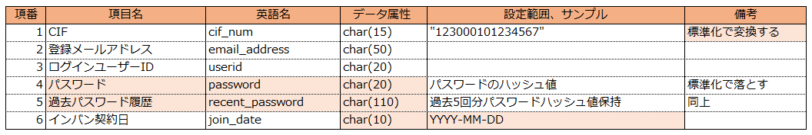

#### インバン契約 - Normalized(標準化データ) レイヤー

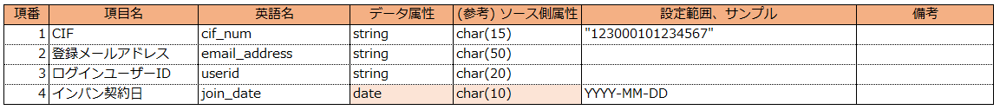

### Analytics(目的別データ)レイヤーのスキーマ

#### 顧客口座情報

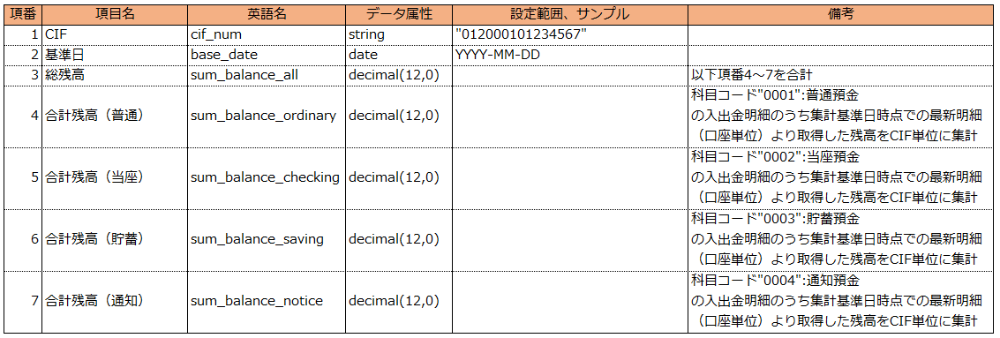

#### インバン日数情報

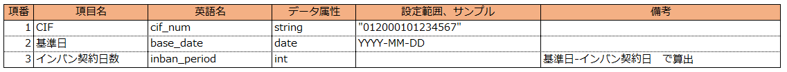

#### 科目マスタ

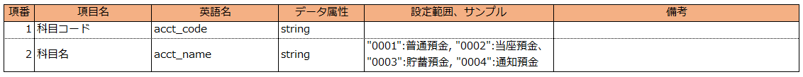

#### 取引区分マスタ

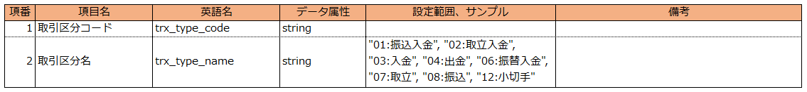

#### 支店情報

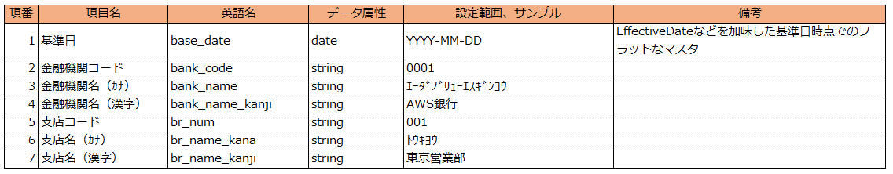

## Analytics(目的別データ)レイヤーの ETL 処理

Analytics(目的別データ)レイヤーの ETL 処理では、Normalized(標準化データ)レイヤーのデータ、およびマスタデータを input とし、以下の「顧客口座情報」、および「インバン日数情報」を output (導出) するものとしています。 マスタデータは、前述のとおり Analytics(目的別データ)レイヤーに配置済みとしています。

本サンプルで用意しているマスタデータは、「科目マスタ」、「取引区分マスタ」、「支店情報」の 3 テーブルになります。

### 1. 顧客口座情報

顧客の保有する複数の口座の残高情報より、全口座の合計残高、科目別の残高情報を生成しています。

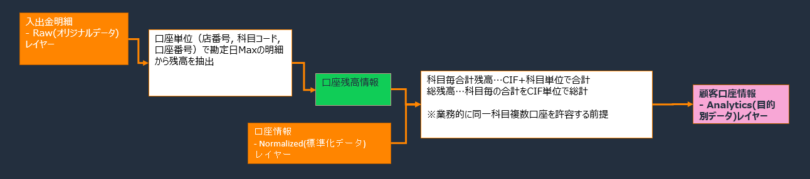

### 2. インバン日数情報

標準化レイヤーのインバン契約情報とパラメータの基準日より、インバン契約日数を算出しています。 BI ダッシュボードでの分析時の　 Dimension 　として利用する想定のデータです。

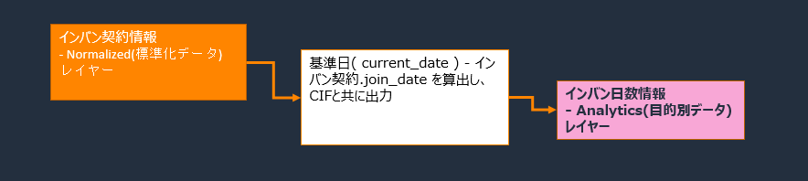

## サンプルデータについて

流動性預金のみの Retail バンキングを想定したサンプルデータです。

顧客や取引明細等のデータはランダム値を利用して作成しています。

以降、提供するサンプルデータの内容について示します。

入出金明細データは 4 種類の流動性口座の取引が含まれますが、口座種別毎の取引種類の違いは考慮していません。 なお、取引の種類とその取引数割合は以下としています。

    取引区分     取引名       取引割合[%]
    01          振込入金      25
    02          取立入金       1
    03          入金          15
    04          出金          28
    06          振替入金      13
    07          取立           3
    08          振込          12
    12          小切手         2

### 個人情報について

テストデータ値についてはランダムに作成した架空の人名、メールアドレス、電話番号等を利用しており、個人情報は一切含まれておりません。 住所コード、住所については実在の住所データより作成していますが、特定個人の情報と一致するものではございません。

### データ値について

データモデルで示した４つの Entity 毎にサンプル提供しているデータの内容について説明します。

#### 顧客

日本国内に住所のある架空の Retail 顧客として作成しています。 年収レンジはおおよそ以下の比率で作成しています。

    年収 300 万円未満： 33%
    ～   500 万円未満： 23%
    ～   800 万円未満： 22%
    ～  1000 万円未満：  9%
    ～  1500 万円未満：  9%
    ～  2000 万円未満：  2%
        2000 万円以上：  2%

代表口座の情報(店番号+科目コード+口座番号)から CIF 番号を導出しています。

#### インバン契約

顧客を母体とした、インターネットバンキング契約者を想定したデータです。
全顧客のうち、60% の顧客がインバン契約を保有しているものとしています。 インバン契約日は 1999 年以降としており、契約者のうち 50%は 2010 年以降の契約としています。
CIF 番号で顧客に紐づいている前提としています。

#### 口座種類

流動性預金のみで、口座数の比率はおおよそ以下の割合で作成しています。

    普通預金(0001)： 約70%
    当座預金(0002)： 約10%
    貯蓄預金(0003)： 約15%
    通知預金(0004)： 約 5%

代表口座である普通預金に、複数の流動性預金の子口座が紐づいている構造としています。 一つの代表口座には、同一支店のみならず、別支店の子口座も紐づけたデータとなっています。

一つの代表口座が有する子口座数は、おおよそ以下割合で作成しています。

    子口座数      割合   備考
          0       20%   全CIFの約20%は子口座無し
          1       25%   子口座数1の人が最も多いとしている
          2       20%
          3       10%
          4       10%
          5        1%   5～20保有はそれぞれ約 1%
              ～
         20        1%

#### 入出金明細

各流動性預金の取引明細で、各口座のおおよその月あたり平均取引数(明細数)と、最小/最大は以下で作成しています。

    月あたりおおよその平均明細数と最小最大明細数：
    	"0001":普通預金  15	(0～30)
    	"0002":当座預金   5	(0～10)
    	"0003":貯蓄預金   5	(0～10)
    	"0004":通知預金   5	(0～10)

振り込みの仕向口座情報はランダム数値で作成しており、マスタテーブルや全銀支店情報等に紐づいたものではありません。
