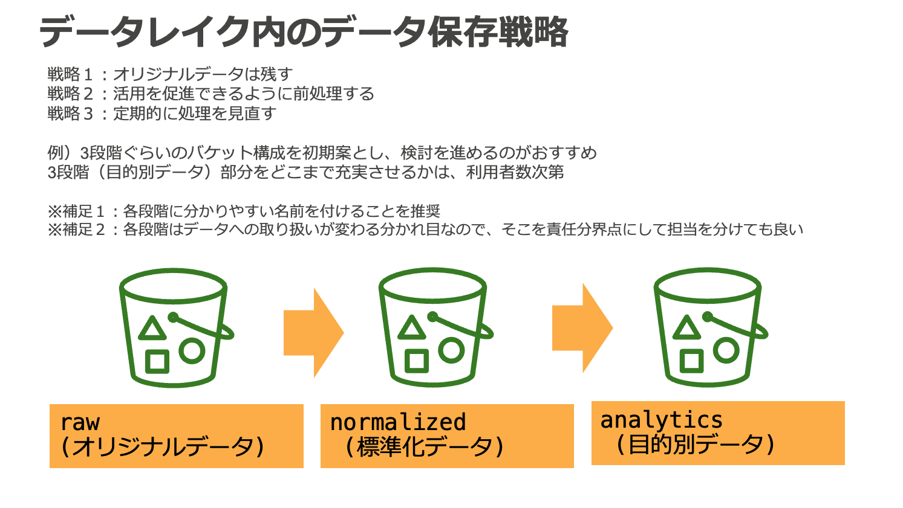
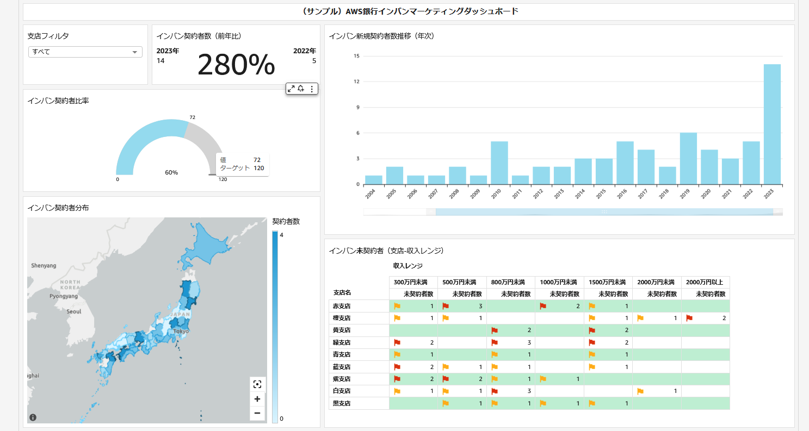
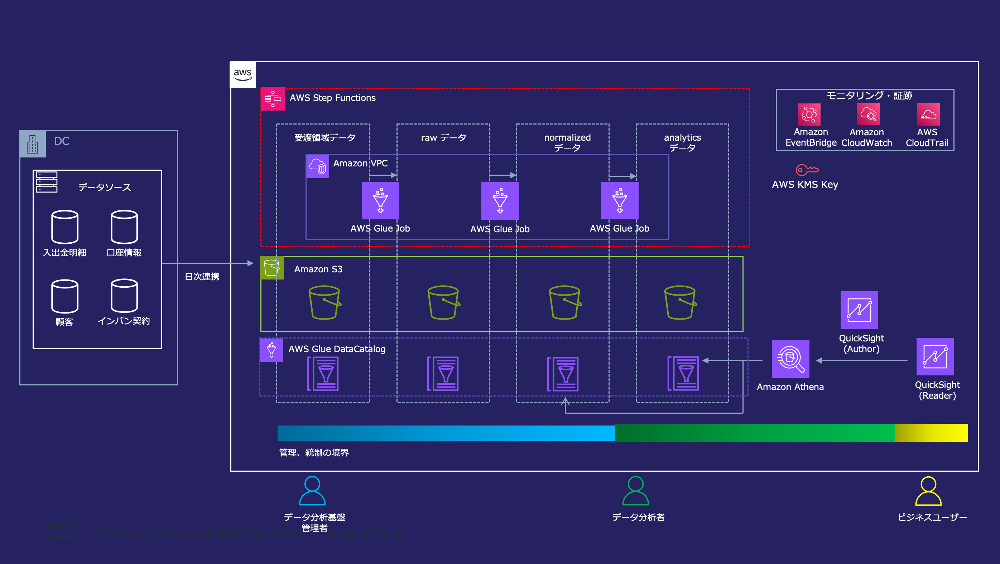

# 金融ワークロードアーキテクチャ解説 [データ分析プラットフォーム Simple data lake]

## ユースケース

不確実性が高まる事業環境で高速かつ合理的に判断を下すため、データに基づく意思決定の重要性が注目されています。企業が扱うデータの規模は前例のない速度で増加しており、エクサバイト規模のデータを活用する企業も出てきています。AWS はデータ分析に関わる広範なサービスを提供しており、これらを組み合わせることでスケーラブルなデータ分析基盤を迅速に構築できます。本リファレンスアーキテクチャでは、金融機関に求められる水準のセキュリティレベルを備えつつ、将来的なニーズの変化や利用規模拡大に柔軟に対応可能で、コスト最適なデータ分析基盤を構築できるリファレンスアーキテクチャを提示します。

## アーキテクチャの特徴

### データレイクを中心とした分析環境

AWS におけるデータ分析基盤は、 Amazon S3 上のデータレイクを中心に構成されます。  
データレイクとは収集したデータを原則そのまま保存しておくデータリポジトリのことです。データレイクを作る上では、データを蓄積するコンポーネントとデータを処理するコンポーネントを分離しておくことが重要です。これは両者が異なるライフサイクルで扱われるためです。データ分析基盤上のデータは数年にわたって蓄積されることで価値を生むのに対して、データを処理する道具は社内外の環境の変化によって適切な選択肢が変わっていきます。従って、蓄積と処理を分離することによって一貫したデータリポジトリを整備しつつ、将来のニーズや技術に合わせた様々な道具を使い分け可能なデータ分析基盤を構築できます。データを蓄積するコンポーネントには Amazon S3 を利用することで、高い堅牢性、コスト効率、並列アクセスへのスケーラビリティを備えたデータレイクが構築できます。

### 3 層構造のデータ配置

データ分析基盤上のデータは 3 層構造で配置されます。これはデータ分析基盤上のデータの将来性を確保しつつ、利活用を促進すると共に、各領域の統制と管理の境界を確保するのに役立ちます。

- raw (オリジナルデータ)
  - ソースシステムのデータを未加工のまま配置するレイヤー
  - オリジナルデータを残しておくことで、将来のユースケースの変化に対応可能
  - 基本的にデータ分析基盤管理者のみがアクセス可能
- normalized (標準化データ)
  - raw レイヤーのデータを元に、データを利用する上で共通的に必要とされる名寄せや日付け形式の統一などの前処理、パーティショニングなどによるクエリ効率の最適化などを適用するレイヤー
  - 個人情報などの機微情報へのマスキングも適用し、データ分析基盤利用者に幅広く公開可能な内容にサニタイズする
  - データ分析基盤管理者が analytics レイヤーに見られる共通的な要求を抽出して normalized レイヤーに取り込み、データ分析基盤利用者による利活用を促進する
- analytics (目的別データ)
  - normalized, 他の analytics レイヤーのデータを元に、顧客分析など、個別のビジネス要件に対応した変換を適用するレイヤー
  - データ分析基盤利用者が個別要件に応じて整備し、利活用する

本リファレンスアーキテクチャでは 3 層構造のデータ配置を採用していますが、組織の規模や要件によっては、より細分化された階層が適切である場合もあります。まずは上記 3 層を初期案として、検討を進めるのがおすすめです。
また、データ分析基盤の管理者や利用者がアクセス可能なデータ範囲の権限制御についても、上記を参考にしていただきつつ、組織に合った設計をご検討ください。

### データ分析基盤のペルソナとアクセス権限管理

データレイクへのアクセス権限は各レイヤーの S3 バケットに対して IAM によって管理されます。データ分析基盤の運用に関わるペルソナには一般的にデータ分析基盤管理者、データ分析者、ビジネスユーザーが含まれます。データ分析基盤管理者はデータ分析基盤そのものの開発と運用及び normalized までのデータを提供します。データ分析者はデータ分析基盤が提供するツールと、normalized, analytics のデータを使って分析を行うほか、適宜ビジネスユーザー向けのダッシュボードを作成します。ビジネスユーザーはデータ分析者が作成したダッシュボードを使って、分析結果を活用します。それぞれのペルソナに対して、データレイクへの IAM アクセス権限を適切に設定することでデータ分析基盤のセキュリティを確保します。

本リファレンスアーキテクチャでは、比較的シンプルなアクセス権限管理の方法として各レイヤーのバケットに対してリソースベースで IAM のアクセス権限を設定していますが、大規模な組織での運用を想定する場合は、リソースタグによる ABAC や AWS Lake Formation の LF-Tag を用いた属性ベースの権限管理戦略によってよりスケーラブルな統制を検討できます。  
また、normalized, analytics レイヤーで一部の利用者にのみ機微情報を提供したい場合は、専用のテーブルを構成してアクセス権限を提供する方式に加えて、Amazon Redshift による Dynamic data masking、AWS Lake Formation による行、列レベルのアクセスコントロールも検討できます。

### データライフサイクル

本リファレンスアーキテクチャでは、上記の 3 層構造のデータ配置戦略の中で具体的にどのようなデータライフサイクルが実現できるかのリファレンスを示すため、架空の銀行である「AWS 銀行」のソースシステムから日次で連携される入出金明細、口座情報、顧客、インターネットバンキング契約データを扱います。  
データ受渡用の S3 バケットに配置されたデータは、AWS Step Functions によってオーケストレーションされた Glue Job によって raw レイヤー　 → normalized レイヤー → analytics レイヤーへと変換されます。  
より詳細なライフサイクルに関しては以下をご参照ください。  
[サンプルアプリケーションデータ説明](analytics-platform-app-data.md)

### Amazon QuickSight による可視化

本リファレンスアーキテクチャには、データ分析基盤のユースケース例として AWS 銀行のインターネットバンキングのマーケティングダッシュボードが含まれます。本ダッシュボードは normalized レイヤーと analytics レイヤーのデータを元に作成されており、日次のデータ連携に対する一連の変換フローを通じて、最終的にダッシュボードが更新されるまでを観察できます。

### Glue Job の閉域実行

本リファレンスアーキテクチャで使用している Glue Job は Internet Gateway を持たない VPC に接続されており、アクセス可能なネットワーク空間が制限されています。Glue Job から S3 等のリソースへのアクセスは、VPC Endpoint を経由します。

### Glue Data Catalog によるスキーマ管理

データ分析基盤上のデータは、Glue DataCatalog によって
データソースの場所や形式、スキーマ情報などのメタデータが管理されます。DataCatalog を管理することで、ETL 処理やクエリエンジンがデータにアクセスする際の実装、設定をシンプルにできます。

### サーバレス分散処理によるスケーラビリティ

ETL には Glue Spark Job, クエリエンジンとして Amazon Athena を採用しています。両者はスケールアウトによってデータを分散処理するため、テラバイト規模を超える巨大なデータであっても効率よく処理することができます。同時に両者はサーバレスなサービスであり、必要な時に必要な分だけリソースが確保されるため、コスト効率も最適化できます。従って、スモールスタートの段階のデータ分析基盤から、中長期的な成長を見据えてご利用いただけます。

## アーキテクチャ図

Amazon S3 をコアとした Simple data lake のアーキテクチャサンプル

## 参考情報

[データレイクとは](https://aws.amazon.com/jp/big-data/datalakes-and-analytics/what-is-a-data-lake/)

[AWS のモダンデータアーキテクチャ](https://aws.amazon.com/jp/big-data/datalakes-and-analytics/modern-data-architecture/)

[AWS の ABAC とは](https://docs.aws.amazon.com/ja_jp/IAM/latest/UserGuide/introduction_attribute-based-access-control.html)

[Lake Formation のタグベースのアクセス制御](https://docs.aws.amazon.com/ja_jp/lake-formation/latest/dg/tag-based-access-control.html)
