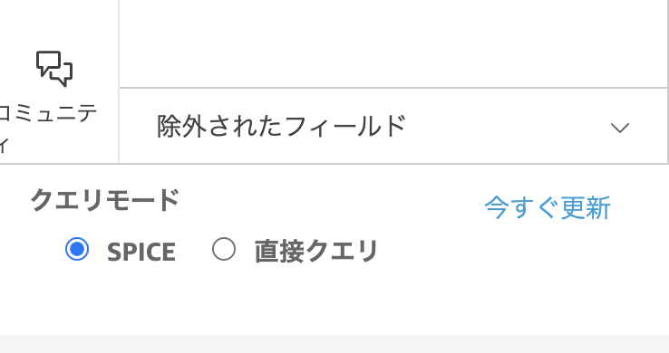
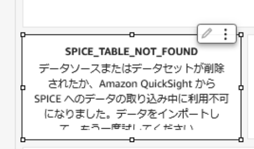

# [データ分析プラットフォーム] Simple Datalake ワークロードのデプロイ手順

[リポジトリの README に戻る](../../README.md)

ここでは BLEA for FSI のガバナンスベースがデプロイされたアカウントに [データ分析プラットフォーム] Simple Datalake ワークロードと QuickSight サンプルアプリケーションを導入する手順について記述します。

> `MC`はマネジメントコンソールでの作業を、`Local`は手元環境での作業を示します。

## 導入・確認手順

### 1. [データ分析プラットフォーム] Simple DataLake ワークロードをデプロイする

ゲストアカウントに SSO で認証している状態からのデプロイメントの手順を示します。

#### 1-1. ゲストアカウントデプロイ用の AWS CLI プロファイルを設定する(Local)

ゲストアカウントにデプロイするための AWS CLI プロファイルを設定します。ここではゲストアカウントの ID を 123456789012 としています。
~/.aws/config

```sh
# for Guest Account Login
[profile ct-guest-sso]
sso_start_url = https://d-90xxxxxxxx.awsapps.com/start/
sso_region = ap-northeast-1
sso_account_id = 123456789012
sso_role_name = AWSAdministratorAccess
region = ap-northeast-1
```

#### 1-2. 環境別の設定を指定する(Local)

デプロイ前に環境別（開発、ステージング、本番等）の情報を設定する必要があります。下記の typescript ファイルを編集します。

```sh
usecases/guest-analytics-platform-sample/bin/parameter.ts
```

このサンプルは dev と staging という 開発、検証用の設定を定義する例です。本番アカウントにもデプロイできるようにするには、prod 用の定義を追加します。

```js
//// Development environment parameters ////
export const DevParameters: StackParameter = {
  envName: 'Development',
  simpleDataLake: {
    notifyEmail: 'xxx@example.com',
    vpcCidr: string;
  },
};

//// Staging environment parameters ////
export const StageParameters: StackParameter = {
  envName: 'Staging',
  env: {
    account: '111111111111',
    region: 'ap-northeast-1',
  },
  simpleDataLake: {
    notifyEmail: 'xxx@example.com',
    vpcCidr: '10.4.0.0/16',
  },
};
```

この設定内容は以下の通りです。

| key                        | value                                                                                        |
| -------------------------- | -------------------------------------------------------------------------------------------- |
| env.account                | デプロイ対象のアカウント ID。CLI の profile で指定するアカウントと一致している必要があります |
| env.region                 | デプロイする AWS リージョン名                                                                |
| envName                    | 環境名。これが各々のリソースタグに設定されます                                               |
| simpleDataLake.notifyEmail | アラーム通知先のメールアドレス                                                               |
| simpleDataLake.vpcCidr     | リソースを配置する vpc の cidr block                                                         |

#### 1-3. データ分析プラットフォーム Simple DataLake ワークロードをデプロイする(MC|Local)

（ログインしていない場合）AWS IAM Identity Center（旧 AWS SSO) を使ってゲストアカウントにログインします。

```sh
aws sso login --profile ct-guest-sso
```

最初に下記の CDK スタックを実行して、DataLake を構成する下記の AWS サービスをデプロイします。

- VPC
- S3 バケット
- AWS Glue JOB
- AWS Athena WorkGroup
- AWS StepFunctions ステートマシン
- EventBridge Schedule

```sh
cd usecases/guest-analytics-platform-sample
npx cdk deploy BLEAFSI-AnalyticsPlatform-SimpleDataLake-Dev --profile ct-guest-sso
```

> スタック名は環境ごとに異なります。xxx-Dev は開発環境用のスタック名です。

実行が完了すると下記の Output 名で Origin データを格納する S3 バケットの URL が出力されますので、メモしておいて下さい。手順 2 で使用します。

`BLEAFSI-AnalyticsPlatform-SimpleDataLake-Dev.S3BucketurlforOrigindata`

#### 1-4 QuickSight サンプルアプリケーションのセットアップ

Simple datalake に蓄積されたサンプルデータをビジュアルに参照するための QuickSight アプリケーションをセットアップします。

#### 1-4-1 QuickSight の有効化（Local)

QuickSight をアカウント上で有効化します。

> 既に有効化されている場合はこの作業は不要です。

コンソールから下記の AWS CLI コマンドを実行します。

> `<account id>` にはゲストアカウントの ID、notification-email には管理者の email を指定して下さい。
> aws cli のバージョンが古い場合は下記コマンドの実行に失敗することがあります。v2.11.12 以降のバージョンをご利用下さい。

```sh
cd /usecases/guest-analytics-platform-sample
aws quicksight create-account-subscription \
 --edition ENTERPRISE \
 --authentication-method IAM_AND_QUICKSIGHT \
 --aws-account-id <account id> \
 --account-name <account id>-quicksight-admin \
 --notification-email xxxx@xxx.co.jp \
 --region ap-northeast-1 \
 --profile ct-guest-sso
```

#### 1-4-2 QuickSight のアクセス権の設定（MC)

QuickSight ダッシュボードが Amazon Athena サービス および 分析データを格納した S3 バケットにアクセスできるように、権限設定を行います。

- 管理者権限で AWS 管理コンソールにログインしてから `QuickSight` サービスにアクセスする。
  > ログインユーザーで初めて QuickSight にアクセスすると、QuickSight ユーザーを作成するためにメールアドレスの入力を求められることがあります。
- QuickSight の管理画面が表示されたら、右上のメニューから[QuickSight の管理]を選択する。
- [セキュリティとアクセス制限] - [QuickSight の AWS のサービスへのアクセス] で[管理]ボタンを押す。
- [IAM ロール]で "既存のロールを使用する"を選択し、下記ロールを選択し設定を保存する
  - bleafsi-quicksight-role

#### 1-4-3 QuickSight データソースの作成（Local)

下記の json ファイルを開いて編集して下さい。  
/usecases/guest-analytics-platform-sample/resources/quicksight/qs-datasource-simple-datalake.json

[変更箇所]

- `<account-id>` にゲストアカウントの ID を指定して下さい。

```
{
  "AwsAccountId": "<account-id>",
  "Name": "bleafsi simple datalake athena datasource",
  "DataSourceId": "bleafsi-simple-datalake-athena-datasource",
  "Type": "ATHENA",
  "DataSourceParameters": {
    "AthenaParameters": {
      "WorkGroup": "analytics-workGroup"
    }
  }
}
```

変更を保存した後に、下記の CLI を実行して、分析に必要な QuickSight データソースを作成します。

```
cd usecases/guest-analytics-platform-sample
aws quicksight create-data-source --cli-input-json file://resources/quicksight/qs-datasource-simple-datalake.json --profile ct-guest-sso
```

#### 1-4-4 QuickSight データセットの作成（Local)

下記の json ファイルを開いて編集して下さい。  
/usecases/guest-analytics-platform-sample/resources/quicksight/qs-dataset-simple-datalake.json

[変更箇所]

- `<account-id>` にゲストアカウントの ID を指定して下さい。`<account-id>`は全部で 10 カ所あります。
- `<QuickSight-username>` には現在ログインしている QuickSight のユーザー名を指定して下さい（ユーザー名の例 AWSReservedSSO_AWSAdministratorAcces_xx）。QuickSight のユーザー名は <QuickSight の管理> - <ユーザーを管理> から確認できます。

```
{
  "AwsAccountId": "<account-id>",
  "DataSetId": "bleafsi-simple-datalake-dataset",
  "Name": "bleafsi simple datalake dataset",
  "ImportMode": "SPICE",
  "PhysicalTableMap": {
    "06b45fb8-e2fd-3a1e-9dd9-2ddba1bfe297": {
        "RelationalTable": {
            "DataSourceArn": "arn:aws:quicksight:ap-northeast-1:<account-id>:datasource/bleafsi-simple-datalake-athena-datasource",
            "Catalog": "AwsDataCatalog",

  ・・・

  "Permissions": [
    {
      "Principal": "arn:aws:quicksight:ap-northeast-1:<account-id>:user/default/<QuickSight-username>",

```

変更を保存した後に、下記の CLI を実行して分析に必要な QuickSight データセットを作成します。

```
aws quicksight create-data-set --cli-input-json file://resources/quicksight/qs-dataset-simple-datalake.json  --profile ct-guest-sso
```

> この段階では Glue カタログ上にテーブルがないため、作成されたデータセット `bleafsi simple datalake dataset`を開くとエラーが表示されます。
> データの準備は 2.稼働確認 の手順を実施して下さい。

#### 1-4-5 QuickSight 分析の作成

下記の json ファイルを開いて編集して下さい。

/usecases/guest-analytics-platform-sample/resources/quicksight/qs-analytics-simple-datalake.json

[変更箇所]

- `<account-id>` にゲストアカウントの ID を指定して下さい。`<account-id>`は全部で 3 カ所あります。
- `<QuickSight-username>` には現在ログインしている QuickSight のユーザー名を指定して下さい。

```

{
  "AwsAccountId": "<account-id>",
  "AnalysisId": "bleafsi-analytics-platform-sample",
  "Name": "bleafsi-analytics-platform-sample",
  "Permissions": [
    {
      "Principal": "arn:aws:quicksight:ap-northeast-1:<account-id>:user/default/<QuickSight-username>",
      "Actions": [
        "quicksight:RestoreAnalysis",
        "quicksight:UpdateAnalysisPermissions",
        "quicksight:DeleteAnalysis",
        "quicksight:DescribeAnalysisPermissions",
        "quicksight:QueryAnalysis",
        "quicksight:DescribeAnalysis",
        "quicksight:UpdateAnalysis"
      ]
    }
  ],
  "Definition": {
    "DataSetIdentifierDeclarations": [
      {
        "Identifier": "bleafsi-sample-table",
        "DataSetArn": "arn:aws:quicksight:ap-northeast-1:<account id>:dataset/bleafsi-simple-datalake-dataset"
      }
    ],
    ・・・
```

下記の CLI を実行して、サンプルとして提供されている QuickSight 分析を作成します。

```
aws quicksight create-analysis --cli-input-json file://resources/quicksight/qs-analytics-simple-datalake.json --profile ct-guest-sso
```

非同期で分析の作成がリクエストされましたので、実行結果は下記の CLI コマンドで確認して下さい。`<account-id>`は環境に合わせて変更して下さい。

```
aws quicksight describe-analysis --aws-account-id <account-id> --analysis-id bleafsi-analytics-platform-sample --profile ct-guest-sso
```

下記のように Status = CREATION_SUCCESSFUL になっていれば作成に成功しています。

```
{
    "Status": 200,
    "Analysis": {
        "AnalysisId": "bleafsi-analytics-platform-sample",
        "Arn": "arn:aws:quicksight:ap-northeast-1:861968721394:analysis/bleafsi-analytics-platform-sample",
        "Name": "bleafsi-analytics-platform-sample",
        "Status": "CREATION_SUCCESSFUL",
        "DataSetArns": [
            "arn:aws:quicksight:ap-northeast-1:861968721394:dataset/bleafsi-simple-datalake-dataset"
        ],
        ・・・
```

以上で データ分析プラットフォーム Simple DataLake ワークロードのデプロイ および サンプル QuickSight アプリケーションの設定は完了です。

> QuickSight のデータセットや分析のセットアップが上手くいかない場合は、以下のページも参照してみて下さい
>
> - [QuickSight のセットアップ中にエラーが発生した時の対応について](./action-for-deployment-error.md)

### 2. 稼働確認

実際にテストデータを使い、データ分析プラットフォームとしてセットアップした Glue JOB を実行して simple s3 datalake の稼働確認を行っていきます。データの確認には QuickSight ダッシュボードを使用します。

#### 2-1. テスト用初期データの S3 バケットへのコピー（Local)

以下の CLI を実行して、テスト用の 4 種類のデータを S3 バケットにコピーします。

```
cd usecases/guest-analytics-platform-sample/resources
unzip testdata-base.zip
aws s3 cp ./testdata-base/CustomerAccount.csv  <Originデータ用S3バケットURL>/CustomerAccount/ --profile ct-guest-sso
aws s3 cp ./testdata-base/InternetBankingUser.csv  <Originデータ用S3バケットURL>/InternetBankingUser/ --profile ct-guest-sso
aws s3 cp ./testdata-base/DepositWithdrawHistory.csv  <Originデータ用S3バケットURL>/DepositWithdrawHistory/ --profile ct-guest-sso
aws s3 cp ./testdata-base/Customer.csv  <Originデータ用S3バケットURL>/Customer/ --profile ct-guest-sso
```

> `<Originデータ用S3バケットURL>`は CDK スタック実行後に Output として出力されています。

#### 2-2. Glue Job の実行（MC)

管理コンソールから AWS Step Functions ステートマシンを実行して 3 つの Glue Job を実行します。これらの Glue Job では S3 バケット上に格納されたサンプルデータに対して origin(元データ) → raw（生データ）→ normalized（正規化） → analytics（分析） の 3 つのレイヤーでの変換を行います。

管理コンソールにログインして、AWS StepFunctions の管理メニューを開きます。ステートマシン `glue-job-pipeline`を開きます。  
右上の [実行を開始] ボタンを押します。表示されたダイアログの入力フィールドを以下入力値（全日付のデータを処理対象とする）で入れ替えて、 [実行を開始] を押します。

```
{"import_date":"all"}
```

3 つの Job が完了するのを待ちます。

> この Step Functions ステートマシンは EventBridge スケジュールにより日次で実行するように設定されています。
> Job の実行中に処理のタイミングが原因で一部のタスクが失敗することがあります（ステータスが`TaskFailed`になる）。自動でリトライすることで最終的に全ての Job が成功するように実装していますのでこのエラーは無視して下さい。

#### 2-3. Glue Job の実行確認（MC）

Glue Job が正常に実行され、raw（生データ）/ normalized（正規化）/ analytics（分析）の 3 つレイヤにそれぞれデータが作成されている事を確認します。

- S3 バケットに処理結果のデータ格納されている事を確認

| 目的                 | S3 バケット名                                        |
| -------------------- | ---------------------------------------------------- |
| raw（生データ）      | bleafsi-analyticsplatform-raw-<アカウント ID>        |
| normalized（正規化） | bleafsi-analyticsplatform-normalized-<アカウント ID> |
| analytics（分析）    | bleafsi-analyticsplatform-analytics-<アカウント ID>  |

- Glue DataCatalog に raw（生データ）/ normalized（正規化）/ analytics（分析）用のデータベースが作られていることを確認します。

[Glue DataCatalog に作成されるテーブルとデータベース]

| テーブル               | データベース名 |
| ---------------------- | -------------- |
| customer               | origin         |
| internetbankinguser    | origin         |
| customeraccount        | origin         |
| depositwithdrawhistory | origin         |
| customer               | raw            |
| internetbankinguser    | raw            |
| customeraccount        | raw            |
| depositwithdrawhistory | raw            |
| customer               | normalized     |
| internetbankinguser    | normalized     |
| customeraccount        | normalized     |
| depositwithdrawhistory | normalized     |
| internetbankingperiod  | analytics      |
| customerdepositinfo    | analytics      |
| master_acct            | master         |
| master_branch          | master         |
| master_trx_type        | master         |

#### 2-4. QuickSight サンプルダッシュボードを参照する(MC)

データレイク上のデータをビジュアルに確認するための QuickSight 分析をデプロイしていますのでダッシュボードとして共有していきます。

`分析`を表示する前に QuickSight データセットのデータを更新する必要がありますので、下記の手順を実施して下さい。

- 管理コンソールから QuickSight にアクセスして下さい。

- メニューで「データセット」を選択して、`bleafsi simple datalake dataset`を開きます。

- ステータスが "インポートに失敗しました" となっていますが無視して、右上の[データセットの編集]ボタンを押して編集画面を開きます。

- 左下のクエリモードで`今すぐ更新`をクリックして SPICE データを更新します。タイプは `フル更新`を選択して下さい。



- 更新が終わるまで 1−2 分待ちます。完了すると右上にメッセージボックスが表示されます。

続いて`分析`を表示します。

- メニューに戻り「分析」を選択して、`bleafsi-analytics-platform-sample`を開きます。

- 左上の`支店フィルタ`のビジュアルが正しく表示されていないので、設定画面で `更新`を選択し、データを再取得してフィルターが正しく表示されることを確認して下さい。




- 右上のメニューからダッシュボードを作成して公開します。


ダッシュボードが表示されます。この時点で 100 件のデータが読み込まれています。


> QuickSight 分析の表示が上手くいかない場合は、以下のページも参照してみて下さい
>
> - [QuickSight のセットアップ中にエラーが発生した時の対応について](./action-for-deployment-error.md)

#### (オプション) 2-5. 日次断面の取り込み

テストデータは日次（2023/6/14）で作成されています。ここからは翌日分(2023/6/15)の追加データに対して再度 Glue Job を回して、Glue Job が差分データを処理できる事を確認します。

以下の CLI を実行して、4 種類の追加データを S3 バケットにコピーします。

```
cd usecases/guest-analytics-platform-sample/resources
unzip testdata-incremental.zip
aws s3 cp ./testdata-incremental/CustomerAccount.csv  <Originデータ用S3バケットURL>/CustomerAccount/ --profile ct-guest-sso
aws s3 cp ./testdata-incremental/InternetBankingUser.csv  <Originデータ用S3バケットURL>/InternetBankingUser/ --profile ct-guest-sso
aws s3 cp ./testdata-incremental/DepositWithdrawHistory.csv  <Originデータ用S3バケットURL>/DepositWithdrawHistory/ --profile ct-guest-sso
aws s3 cp ./testdata-incremental/Customer.csv  <Originデータ用S3バケットURL>/Customer/ --profile ct-guest-sso
```

> `<Originデータ用S3バケットURL>`は CDK スタック実行後に Output として出力されています。

[手順 2-2](./deploy-analytics-platform-simpledatalake.md#2-2-glue-job-の実行mc) と同じ手順で、AWS StepFunctions ステートマシンの実行入力フィールドを以下入力値（YYYYMMDD 形式日付のデータを処理対象とする）で入れ替えて、AWS StepFunctions から Glue Job を実行します。

```
{"import_date":"20230615"}
```

正常に実行が完了したら、QuickSight にアクセスしてデータセット `bleafsi-simple datalake dataset`を編集モードで開きます。

左下のクエリモードで`今すぐ更新`をクリックして SPICE データを更新します。プラスで 20 件のデータが追加され合計 120 件のデータ数になります。


ダッシュボード `bleafsi-analytics-platform-sample`を開き、グラフの内容が更新されている事を確認して下さい。


以上で確認作業は終了です。
