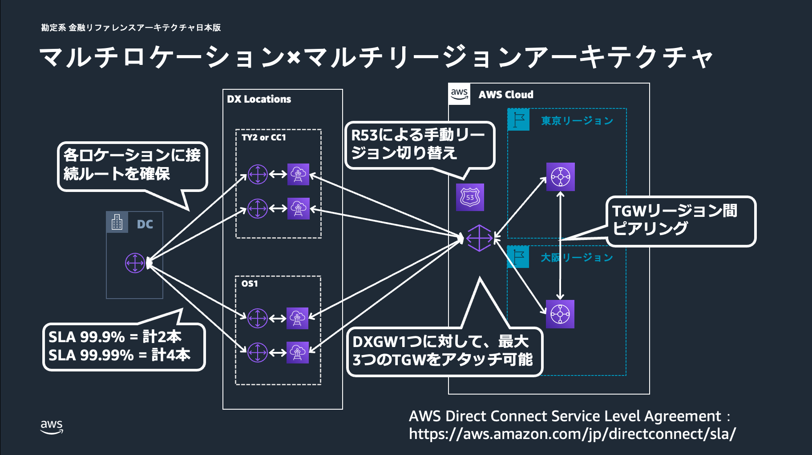

# 金融ワークロードアーキテクチャ解説 [勘定系]

## 前提条件

- 本リファレンスアーキテクチャは、銀行の各種業務を取り扱う勘定系を対象としています。チャネル系や情報系などは本リファレンスアーキテクチャの範囲外としています。
- 本リファレンスアーキテクチャの AWS Cloud Development Kit (AWS CDK)によるサンプルテンプレートでは、以下に示している全体アーキテクチャ図のうち主に Amazon Route 53、AWS Transit Gateway、Elastic Load Balancing (ELB)、Amazon ECS、Amazon DynamoDB、Amazon Aurora Global Database にあたる部分を実装しています。Amazon CloudFront や Amazon API Gateway、AWS Direct Connect の Direct Connect ゲートウェイ (DXGW)、DX Locations、DC にあたる部分はサンプルテンプレートに含まれていません。

## ユースケース

- 銀行システムのうち、預金や為替、融資などの各種業務を取り扱う勘定系システムを想定しています。
- 本リファレンスアーキテクチャで示している構成は銀行勘定系システムに限らず、高い可用性が求められるミッションクリティカルなシステムに応用できる汎用的なものとなっています。

## アーキテクチャの特徴（災害対策に関する注意事項など）

- マルチリージョン構成

  - 勘定システムにおけるレイテンシ、データの整合性を考慮したウォーム・スタンバイ構成を採用しています。

- リージョンの切り替え
  - プライマリリージョンからセカンダリリージョンへの切り替えは、Route 53 のレコードセット変更によって行います。
  - データの整合性や切り替え時のダウンタイム、誤検知時の影響範囲の大きさを考慮し、自動切り替えではなく手動切り替えとしています。
- アプリケーションのコンピューティング環境
  - フルマネージドコンテナオーケストレーションサービスである Amazon ECS を採用しています。
  - 要件に合わせて、Amazon ECS の代わりに Amazon Elastic Kubernetes Service (Amazon EKS)や Amazon Elastic Compute Cloud (Amazon EC2)を選択することも可能です。
- DB の構成
  - メイン DB として Aurora Global Database、アプリケーションのステート管理用 DB として DynamoDB を採用しています。
  - リージョンを切り替える際、DynamoDB についてはグローバルテーブルを用いる場合、切り替え作業は不要です。Aurora Global Database についてはフロントのネットワークと同様、手動による切り替えを想定しています。
  - どちらの DB も通常は 1 秒以内にレプリケーションされますが、障害復旧時のレプリケーションラグについては業務要件やアプリケーションの特性などを踏まえて別途考慮が必要です。

## アーキテクチャ図

- 全体アーキテクチャ図（Overview）

- マルチロケーション x マルチリージョンアーキテクチャ

- DB の構成について

