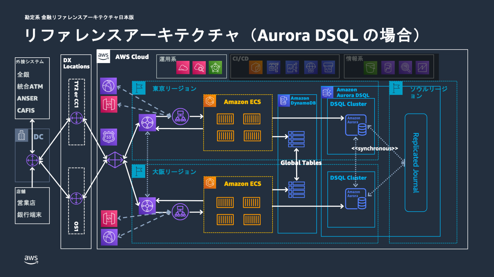
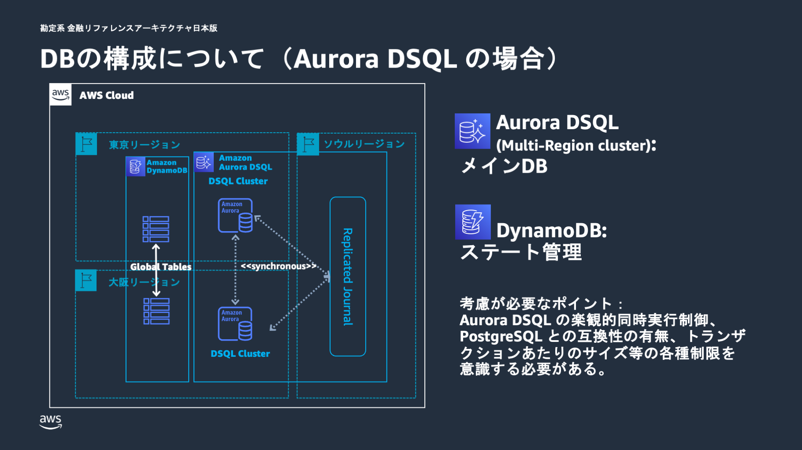

# 勘定系ワークロードへの Aurora DSQL 適用について

## 概要

本ドキュメントでは、勘定系ワークロードにおける Amazon Aurora DSQL の適用の可能性について解説します。 Aurora DSQL は、特定の要求事項に対して従来の Aurora PostgreSQL とは異なるアプローチを提供する新しいデータベースサービスです。

Aurora PostgreSQL は長年にわたる実績と高い PostgreSQL 互換性により、多くのエンタープライズ環境で信頼性を実証してきました。一方、 Aurora DSQL は分散アーキテクチャと同期レプリケーションにより、特にマルチリージョンの高可用性と強整合性が重要視される環境において新たな選択肢を提供します。本ドキュメントでは、これらの特性を理解し、要件に応じた最適な選択を行うための情報を提供します。

## Aurora DSQL とは

Amazon Aurora DSQL は、**トランザクションワークロードに最適化されたサーバーレス分散リレーショナルデータベースサービス**です。従来の Aurora PostgreSQL は読み書き可能な単一のプライマリインスタンスを中心とした構成であるのに対し、Aurora DSQL は分散アーキテクチャを採用することで、異なる特性を持つデータベースサービスとして設計されています。

Aurora DSQL の最も特徴的な点は、その分散設計にあります。従来のリレーショナルデータベースが単一のプライマリインスタンスと 1 台以上のスタンバイノード（レプリカとも呼ばれます）から構成されるのに対し、Aurora DSQL はマルチテナント分散アーキテクチャを採用しています。この設計により、単一障害点を排除し、高い可用性を実現しています。

### 主要な特徴

Aurora DSQL は以下の特徴を持ちます：

- **分散アーキテクチャ**: マルチテナントコンポーネントから構成され、高い冗長性と自動回復機能を実現します。各コンポーネントが 3 つのアベイラビリティーゾーンで冗長化され、自動クラスタースケーリングと障害時の自動回復を実現しています。
- **マルチリージョンクラスター**: 同期レプリケーション、強整合性、Active-Active 構成により、99.99%（単一リージョン）、99.999%（マルチリージョン）の可用性を実現します。両リージョンのエンドポイントで同時読み書き操作が可能で、強いデータ整合性を保持します。
- **サーバーレス特性**: インフラ管理が不要で、ワークロードに応じた自動スケーリングを提供します。サーバーのプロビジョニング、パッチ適用、インフラアップグレードに関連するメンテナンスダウンタイムを心配する必要がありません。

- **PostgreSQL 互換性**: PostgreSQL 16 ベースの互換性により、既存の PostgreSQL ドライバー、ORM、フレームワーク、SQL 機能を使用できます。ただし、Aurora PostgreSQL と比較すると、サポートされる機能は限定的となっています。

## 勘定系ワークロードに Aurora DSQL を取り込む背景

金融システム、特に勘定系システムは、その業務特性から極めて厳格な要求事項を持っています。これらの要求事項は、単に技術的な性能だけでなく、規制対応、リスク管理、業務継続性など多岐にわたります。

### 金融システムの要求事項

勘定系システムには以下の要求事項があります：

**高い可用性**: システム停止は直接的に業務停止を意味するため、可能な限り高い可用性が求められます。特に、計画停止も含めて年間のダウンタイムを最小化する必要があります。

**強いデータ整合性**: 金融取引においてデータの不整合は許容されません。特に、災害復旧時やシステム障害時においても、データの整合性を保持する必要があります。

**災害対策**: 地理的に分散した冗長構成により、大規模災害時でも業務継続を可能にする必要があります。

### 新たな選択肢としての Aurora DSQL

金融システムの要求がより高度化し、グローバル展開や 24 時間 365 日の無停止運用が求められるシステムも珍しくありません。そんな中で、従来のアーキテクチャでは対応が困難な課題も浮上してきました。

**レプリケーション遅延の課題**: Aurora PostgreSQL Global Database は非同期レプリケーションを採用しているため、セカンダリリージョンでのデータ遅延が少なからず発生します。これは、リアルタイム性が求められる取引において制約となる場合があります。

**フェイルオーバー時間の課題**: Aurora PostgreSQL Global Database は、リージョンの機能低下や停止が発生した場合、セカンダリリージョンへの切り替え処理が発生します。データベースのフェイルオーバーにかかる時間は障害時の復旧時間 (RTO) における制約となる場合があります。

**Active-Standby 構成の制約**: Aurora PostgreSQL Global Database の場合、セカンダリリージョンでは読み取り専用のアクセスのみ可能で、書き込み操作はプライマリリージョンに限定されます。これは、書き込みワークロードの地理的分散における制約となります。

Aurora DSQL は、これらの課題に対して分散アーキテクチャと同期レプリケーションという新しいアプローチを提供します。

## 勘定系ワークロードにおける Aurora DSQL の特徴と価値

Aurora DSQL は、分散アーキテクチャと同期レプリケーションにより、従来の Aurora PostgreSQL とは異なる特性を提供します。これらの特性は、特定の要求事項において価値を発揮する一方で、トレードオフが存在することも理解する必要があります。

### データ整合性における特徴

Aurora DSQL の最も特徴的な点は、その同期レプリケーション機能です。従来の Aurora PostgreSQL がリージョン間のデータ同期において非同期レプリケーションを採用していたのに対し、Aurora DSQL は**同期データレプリケーション**を実現しています。

この同期レプリケーションにより、全てのリージョンで同一のデータ状態が保証され、ACID 特性（原子性、一貫性、分離性、永続性）を完全に保持します。特に重要なのは、マルチリージョン構成においても強いデータ整合性が維持され、どのリージョンからアクセスしても常に同じデータが参照できることです。

金融取引において、この特性は重要な意味を持ちます。例えば、東京リージョンで実行された取引が、大阪リージョンで即座に一貫した状態で参照できることは、リアルタイム性が求められる勘定処理において大きな価値となります。ただし、同期レプリケーションの特性上、コミット処理時にはリージョン間の同期ネットワーク通信が必要となります。地理的距離に応じたレイテンシーの影響を受けるため、性能への影響も考慮する必要があります。

### 可用性における特徴

Aurora DSQL は、Active-Active 構成を採用しており、両リージョンで同時に読み書き操作が可能です。これは、従来の Aurora PostgreSQL の Primary-Secondary 構成と大きく異なる点です。また、 Active-Active 構成の場合、リージョン障害時におけるクラスターの明示的なフェイルオーバーが不要となる点もメリットです。RTO の短縮や運用負荷の軽減に繋がります。

しかし、Active-Active 構成は、同時更新による競合の可能性を高めるという側面もあります。Aurora DSQL は楽観的同時実行制御を採用しているため、アプリケーション側で適切に競合時のハンドリングを行う必要があります。

### 運用面における特徴

Aurora DSQL のサーバーレス特性は、運用面で大きな変化をもたらします。インフラのプロビジョニング、パッチ適用、アップグレードが不要となり、ワークロードに応じた自動スケーリングが提供されます。これにより、データベース管理者の負荷軽減が期待できます。

一方で、使用量ベースの課金体系への変更により、コスト予測の難しさが増す可能性があります。Aurora PostgreSQL（Provisioned の場合）の時間ベース課金と比較して、ワークロードパターンによってはコストが予想以上に変動する場合があります。

## 留意点・制限事項

Aurora DSQL を検討する際は、その特徴だけでなく制限事項も理解する必要があります。これらの制限事項は、Aurora PostgreSQL とは異なる設計思想に基づいて開発された Aurora DSQL のサービス特性として正しく捉えておく必要があります。

### PostgreSQL 互換性

Aurora DSQL は、PostgreSQL 16 のコア機能をサポートしていますが、Aurora PostgreSQL と比較すると、サポートされる機能はサブセットとなっています。ACID トランザクション、セカンダリインデックス、結合、挿入、更新といった基本的な機能は完全にサポートされていますが、一部の PostgreSQL 拡張機能や高度な機能については未サポートとなっています。

既存の PostgreSQL アプリケーションを Aurora DSQL に移行する場合は、事前に使用している機能の互換性確認が必要です。特に、カスタム拡張機能や特殊なデータ型を使用している場合は、代替実装の検討が必要となる場合があります。

なお、互換性に関する制約は随時改善されます。常に最新のドキュメントを確認するようにしてください。

### 楽観的同時実行制御の影響

Aurora DSQL は、分散アーキテクチャの特性上、楽観的同時実行制御を採用しています。これは、従来の Aurora PostgreSQL の悲観的ロック機構とは異なるアプローチです。

楽観的同時実行制御では、同じデータに対する同時更新が発生した場合、シリアライゼーションエラーが発生します。このため、アプリケーション側で適切なエラーハンドリングとリトライロジックの実装が必要となります。

高い競合が予想される環境では、リトライによる性能影響も考慮する必要があります。ただし、適切なトランザクション設計とリトライ戦略により、この影響を最小化することは可能です。

### トランザクション制限とバッチ処理への影響

Aurora DSQL には、分散アーキテクチャの特性上、従来の Aurora PostgreSQL とは異なるトランザクション制限があります。これらの制限は、特に大量データを扱うバッチ処理において重要な考慮事項となります。

**トランザクションサイズ制限**: 1 つのトランザクションで変更できるデータサイズは最大 10MiB に制限されています。これは、大量のデータを一括で更新・挿入するバッチ処理において、処理を複数のトランザクションに分割する必要があることを意味します。

**行数制限**: 1 つのトランザクションで変更できる行数は最大 3,000 行に制限されています。従来の Aurora PostgreSQL では数万行を一度に処理できていたバッチ処理も、この制限により設計変更が必要となる場合があります。

**トランザクション実行時間制限**: 1 つのトランザクションの最大実行時間は 5 分に制限されています。長時間実行されるバッチ処理は、この制限内で完了するよう処理を分割する必要があります。

**接続時間制限**: データベース接続の最大継続時間は 60 分に制限されています。長時間実行されるバッチジョブでは、定期的な接続の再確立が必要となります。

なお、上記の制限は 2025 年 10 月時点のものです。今後サービスの改善により制限が緩和される可能性もありますので、常に最新のドキュメントを確認するようにしてください。

## まとめ

Aurora DSQL と Aurora PostgreSQL は、それぞれ異なる設計思想に基づく特徴を持つデータベースサービスです。要求事項に応じて最適なサービスを選択することが重要です。

- Aurora PostgreSQL は、長年にわたる実績と高い PostgreSQL 互換性により、多くのエンタープライズ環境で信頼性を実証してきました。予測可能な運用特性と豊富なエコシステムは、安定性を重視する環境において大きな価値を提供します。
- Aurora DSQL は、分散アーキテクチャと同期レプリケーションにより、特に分散環境での強整合性が重要視される環境において新たな選択肢を提供します。サーバーレス特性による運用負荷軽減も魅力的な特徴となります。

金融システムにおける技術選択は、単純な性能比較だけでなく、長期的な運用性、リスク管理、規制対応など多面的な検討が必要です。Aurora DSQL は、特定の要求事項において価値を発揮する一方で、全ての環境で最適解となるわけではありません。

重要なのは、それぞれのサービスの特性を正しく理解し、自組織の要求事項と照らし合わせて適切な選択を行うことです。また、技術の進歩に伴い、これらの特性も変化していくため、継続的な評価と見直しも必要となります。

Aurora DSQL は、金融システムアーキテクチャの新たな選択肢として、従来の制約を解決する可能性を秘めています。採用にあたっては、十分な検証と段階的なアプローチにより、リスクを最小化しながら価値を最大化することが重要です。

## アーキテクチャ図

### Aurora DSQL 版 全体アーキテクチャ

### Aurora DSQL 版 データベースアーキテクチャ

## 関連ドキュメント

### AWS 公式情報

- [Amazon Aurora DSQL](https://aws.amazon.com/rds/aurora/dsql/) - Aurora DSQL サービスページ
- [Amazon Aurora Global Database](https://aws.amazon.com/jp/rds/aurora/global-database/) - Aurora Global Database サービスページ
- [What is Amazon Aurora DSQL?](https://docs.aws.amazon.com/aurora-dsql/latest/userguide/what-is-aurora-dsql.html) - Aurora DSQL の概要と主要特徴
- [Resilience in Amazon Aurora DSQL](https://docs.aws.amazon.com/aurora-dsql/latest/userguide/disaster-recovery-resiliency.html) - Aurora DSQL の高可用性とレジリエンス機能
- [Unsupported PostgreSQL features in Aurora DSQL](https://docs.aws.amazon.com/aurora-dsql/latest/userguide/working-with-postgresql-compatibility-unsupported-features.html) - Aurora DSQL でサポートされていない PostgreSQL の機能
- [Cluster quotas and database limits in Amazon Aurora DSQL](https://docs.aws.amazon.com/aurora-dsql/latest/userguide/CHAP_quotas.html) - Aurora DSQL のクォータと制限

### 本プロジェクト関連ドキュメント

- [金融ワークロードアーキテクチャ解説 [勘定系]](./core-banking-arch-readme.md) - Aurora PostgreSQL 版の基本アーキテクチャ
- [FISC 実務基準対策一覧 [勘定系]](./fisc-mapping-core-banking.md) - FISC 準拠に関する詳細
- [CDK サンプルコード [勘定系]](./deploy-core-banking-sample.md) - 実装手順とサンプルコード
