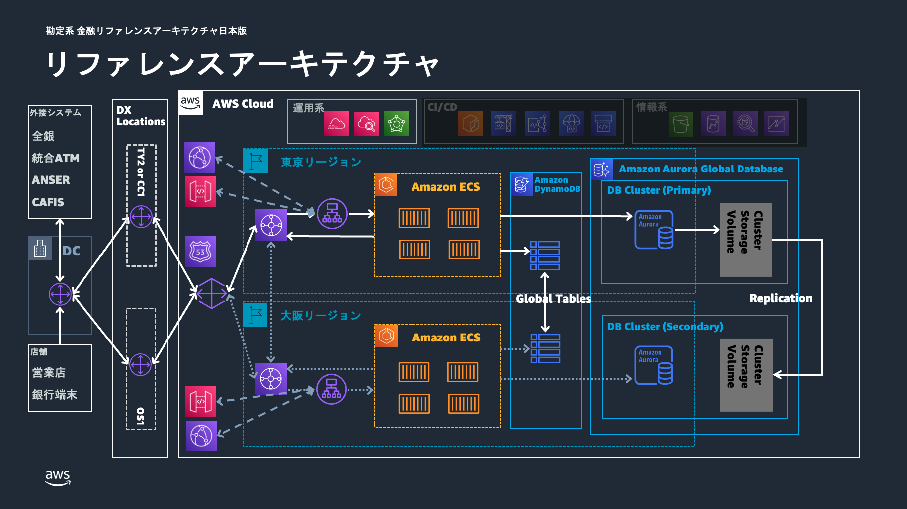

# 金融ワークロードアーキテクチャ解説 [勘定系]

## 前提条件

- 本リファレンスアーキテクチャは、銀行の各種業務を取り扱う勘定系を対象としています。チャネル系や情報系などは本リファレンスアーキテクチャの範囲外としています。
- 本リファレンスアーキテクチャの AWS Cloud Development Kit (AWS CDK)によるサンプルテンプレートでは、以下に示している全体アーキテクチャ図のうち主に Amazon Route 53、AWS Transit Gateway、Elastic Load Balancing (ELB)、Amazon ECS、Amazon DynamoDB、Amazon Aurora Global Database、AWS Backup にあたる部分を実装しています。また、リージョンフェイルオーバーための機構として Amazon Applicatio Recovery Controller、AWS Step Functions、AWS Lambda を使用し、アプリケーションの外形監視のためには Amazon CloudWatch Synthetics Canary を使用しており、これらもサンプルテンプレートに含まれます。Amazon CloudFront や Amazon API Gateway、AWS Direct Connect の Direct Connect ゲートウェイ (DXGW)、DX Locations、DC にあたる部分はサンプルテンプレートに含まれていません。

## ユースケース

- 銀行システムのうち、預金や為替、融資などの各種業務を取り扱う勘定系システムを想定しています。
- 本リファレンスアーキテクチャで示している構成は銀行勘定系システムに限らず、高い可用性が求められるミッションクリティカルなシステムに応用できる汎用的なものとなっています。

## アーキテクチャの特徴（災害対策に関する注意事項など）

- マルチリージョン構成
  - 勘定システムにおけるレイテンシ、データの整合性を考慮したウォーム・スタンバイ構成を採用しています。
- アプリケーションの外形監視
  - アプリケーションの正常性を監視するために、大阪リージョンと監視リージョンであるオレゴンリージョンの CloudWatch Synthetics Canary から東京リージョンに対して疑似トランザクションを発生させ、その応答を確認することで外形監視を行っています。
- マイクロサービスのオブザーバビリティ
  - Amazon CloudWatch Application Signals を使用して、ECS 上で動作するマイクロサービスの包括的な監視を実現しています。
  - Application Signals により、サービス間の依存関係、レイテンシ、エラー率、可用性などの重要なメトリクスを自動的に収集・可視化します。
  - CloudWatch Agent をサイドカーコンテナとして各 ECS タスクに配置し、アプリケーションコードの変更なしに OpenTelemetry ベースの分散トレーシングを実現しています。
  - サービスマップにより、勘定系システム内の各マイクロサービス（残高照会、取引処理、件数管理など）の相互関係と健全性を一目で把握できます。
- リージョンの切り替え
  - プライマリリージョンからセカンダリリージョンへの切り替えは、Amazon Application Recovery Contoller による信頼性の高い切り替えを行います。
  - リージョン切り替えが DNS に依存するため、オンプレミス側からの通信は Route 53 の名前解決を利用した実装となっています。
  - データの整合性を考慮したアプリケーション閉塞、Aurora Global Database の切り替えなど一連の切り替え手順を Step Functions で自動化することにより約５分もしくはそれ以下の RTO を実現します。
  - 東京リージョンから大阪リージョンへの切り替えに用いる Step Functions のステートマシンは切り替えを確実に実行できるよう障害による影響を受けていない大阪リージョンで実行します。
  - デプロイ時は無効化された EventBridge Rule を有効化することで、大阪リージョンとオレゴンリージョンの外形監視 Canary のステータスがともに失敗となった場合に、自動的にリージョン切り替えを行うことも可能です。
- アプリケーションのコンピューティング環境
  - フルマネージドコンテナオーケストレーションサービスである Amazon ECS を採用しています。
  - 要件に合わせて、Amazon ECS の代わりに Amazon Elastic Kubernetes Service (Amazon EKS)や Amazon Elastic Compute Cloud (Amazon EC2)を選択することも可能です。
- DB の構成
  - メイン DB として Aurora Global Database、アプリケーションのステート管理用 DB として DynamoDB を採用しています。
  - リージョンを切り替える際、DynamoDB についてはグローバルテーブルを用いる場合、切り替え作業は不要です。Aurora Global Database については Step Functions により切り替えをトリガーしています。
  - どちらの DB も通常は 1 秒以内にレプリケーションされますが、障害復旧時のレプリケーションラグについては業務要件やアプリケーションの特性などを踏まえて別途考慮が必要です。
  - メイン DB として Aurora DSQL の利用を採用する実験的アプローチも考えられます。詳細は「[勘定系ワークロードへの Aurora DSQL 適用について](./core-banking-arch-dsql.md)」を参照してください。
- データバックアップ
  - ランサムウェアにデータを暗号化もしくは使用不可能とされた場合の復旧手段として、AWS Backup によるバックアップを取得します。
  - コンプライアンスモードでボールドロックを作成することで、一度ロックされるとイミュータブルとなり、データ保持期間が終了するまでデータを削除または変更できなくなります。
  - 本サンプルでは便宜上、十分な IAM アクセス許可を持つユーザーであればデータ削除が可能であるガバナンスモードでの実装としています。

## アーキテクチャ図

- 全体アーキテクチャ図（Overview）

- マルチロケーション x マルチリージョンアーキテクチャ

- DB の構成について

- 外形監視と自動フェイルオーバー

