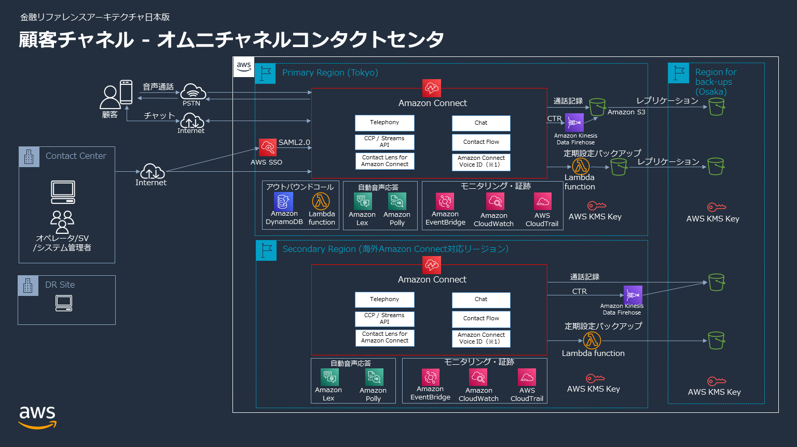
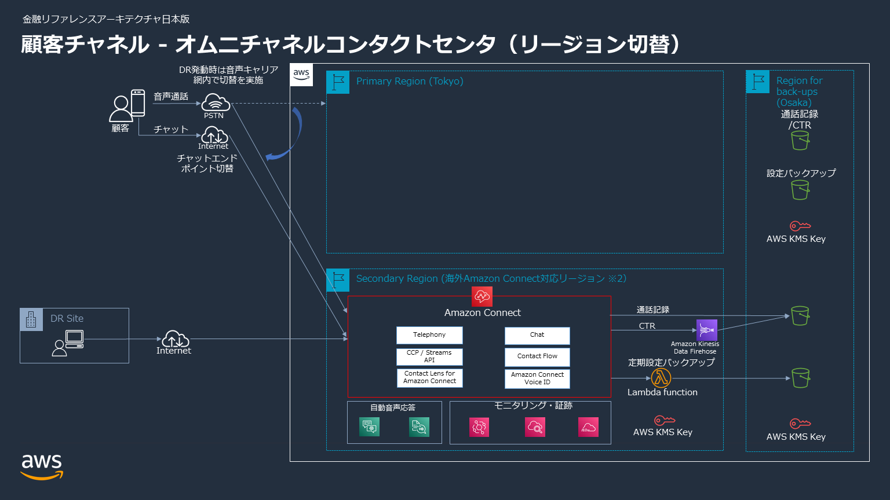

# 金融ワークロードアーキテクチャ解説 [顧客チャネル]

## ユースケース

- 金融機関は、ウェブポータルでのテキストチャット、コールセンタオペレータとの音声通話、チャットボットなど複数のチャネルを通して顧客体験と従業員体験を向上するオムニチャネルなコンタクトセンターの構築にますます投資しています。これらのユースケースにおいて Amazon Connect をはじめとする様々な AWS のサービスと機械学習のテクノロジーを活用することが出来ます。ここでは、金融機関に求められるセキュリティとコンプライアンス、信頼性を備えるコンタクトセンターを構築する際に参考となるリファレンスアーキテクチャを提示します。
- コンタクトセンターにおける業務としては以下の業務を想定します。
  - 顧客チャネルとして、公衆回線を用いた音声もしくはウェブポータルからのチャットを想定します。
  - インバウンドのコンタクトでは、お客様窓口、代理店窓口、自動受付（テレホンバンキング、カードローン仮審査など）、受電集中といった用途を想定します。
  - アウトバウンドでは、折り返し電話、テレマーケティング、督促業務といった業務を想定します。
  - 音声チャネルの会話の文字起こし結果から社内のコンプライアンス規定に反する単語を検出することを想定します。
- 以下のサンプルコンタクトフローを含みます。
  - インバウンドの業務を想定して、Amazon Lex と Amazon Connect Voice ID を活用した本人確認の自動化のフローを提供します。具体的には、初回のお問合せ時に Voice ID による声紋登録を行うコンタクトフローと、2 回目以降のお問合せ時に自動的な本人確認を行ってからエージェントにつなぐコンタクトフローから構成されます。
  - アウトバウンドの業務を想定して、API による発信自動化と、Amazon DynamoDB による発信記録の管理を行うフローを提供します。

## アーキテクチャの特徴

### Amazon Connect へのログインと認証について

- ユーザー管理は AWS IAM Identity Center（旧 AWS SSO) との SAML 連携によって行い、パスワードポリシーの強制、MFA の利用が出来るようにしています。

### 広域災害への対策

- セカンダリリージョンの利用はリファレンスアーキテクチャにおいて必須ではなく、複数アベイラビリティゾーンによる冗長構成で要件を満たしているお客様やデータレジデンシーの問題を懸念されるお客様においてはこの部分を省いてご利用いただくことも可能です。
- 関東広域被災発生時には、プライマリリージョン（例. 東京リージョン）に替えてセカンダリリージョンにあらかじめ用意した Amazon Connect インスタンスと電話番号を使用します。2022 年 9 月末時点で大阪リージョンで Amazon Connect が提供されておりませんが、切り替え先として海外リージョンが利用可能です。通話録音/CTR データの保管先としてはその他のリージョン（例. 大阪リージョン）の S3 バケットを指定します。
- プライマリリージョンにおけるユーザー管理は AWS IAM Identity Center（旧 AWS SSO) との SAML 連携によって行い、セカンダリリージョンでは Amazon Connect のユーザー管理機能によって行います。こちらはお客様の要件によっては外部 IdP を選択することも可能です。
- 通話録音やコンタクトトレースレコードなどのデータはプライマリリージョンの S3 から別のリージョンへレプリケーションすることで遠隔バックアップとします。
- コンタクトフローなど重要な設定情報についても別のリージョンへ定期的にバックアップを行います。

### Voice ID による声紋認証について

- 顧客の認証のために Voice ID を用いた声紋認証が利用可能です。
- Amazon Connect Voice ID は現時点で SOC や PCI を含むコンプライアンスプログラムの対象外となっています。今回提供するサンプルのコンタクトフローにおいて Voice ID を利用していますが、Voice ID がお客様の要件を満たさない場合は利用しないことも可能です。

### サンプルテンプレートについて

- 本リファレンスアーキテクチャのサンプルテンプレートにおいて、Amazon Connect の Preview API を使用します。Preview API は今後仕様変更される可能性がある点にご注意ください。
- 本リファレンスアーキテクチャの**サンプルテンプレートの実装範囲は以下のアーキテクチャ図の全てではなく一部となっております**。基本機能はおおよそ実装しておりますが、例えばチャットや設定の定期バックアップなどが未実装です。今後拡充の予定です。

## アーキテクチャ図

マルチリージョン構成のリファレンスアーキテクチャ

広域災害発生時のリージョン切り替えイメージ

## 参考情報

- Amazon Connect のセキュリティ: [https://docs.aws.amazon.com/ja_jp/connect/latest/adminguide/security.html]
