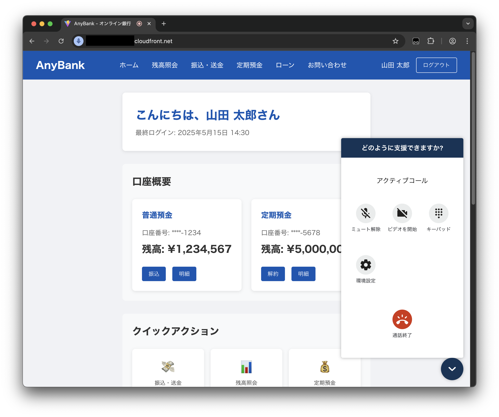

# [顧客チャネル] サンプルアプリケーションのデプロイ手順

[リポジトリの README に戻る](../../README.md)

ここでは BLEA for FSI のガバナンスベースがデプロイされたアカウントに [顧客チャネル] サンプルアプリケーションを導入する手順について記述します。

> `MC`はマネジメントコンソールでの作業を、`ACC` は Amazon Connect コンソールでの作業を、`Local`は手元環境での作業を示します。

## 導入手順

### 1. （AWS IAM Identity Center との SAML 連携時のみ） AWS IAM Identity Center クラウドアプリケーションを追加する (MC)

AWS IAM Identity Center の設定を行うために管理者アカウントでマネジメントコンソールを開きます。
以下の手順に従い、アプリケーションを追加します。

[AWS IAM Identity Center ユーザーガイド > アプリケーションの割り当て > クラウドアプリケーション](https://docs.aws.amazon.com/ja_jp/singlesignon/latest/userguide/saasapps.html)

- 追加するアプリケーションとして **Amazon Connect** を選択します。
- **IAM Identity Center メタデータ** の項にある **IAM Identity Center SAML メタデータファイル** をダウンロードします。
- それ以外の項目は一旦全てデフォルトで追加します。

AWS IAM Identity Center と Amazon Connect の連携については以下の資料も参照してください。

[IAM アイデンティティーセンター を使用して Amazon Connect インスタンスの SAML 2.0 ベースの認証をセットアップするにはどうすればよいですか?](https://repost.aws/ja/knowledge-center/connect-saml-2-authentication-aws-sso)

### 2. サンプルアプリケーションをデプロイする (Local)

ゲストアカウントに SSO で認証している状態からのデプロイメントの手順を示します。

#### 2-1. ゲストアプリケーションの Context を設定する

デプロイ前に環境別（開発、ステージング、本番等）の情報を指定する必要があります。下記の typescript ファイルを編集します。

```sh
usecases/guest-customer-channel-sample/bin/parameter.ts
```

```js
// Parameter for Dev - Anonymous account & region
export const DevParameter: AppParameter = {
  envName: 'Development',
  primaryRegion: {
    region: 'ap-northeast-1',
    connectInstance: {
      instanceAlias: 'my-connect-instance-yyyymmdd-primary', // EDIT HERE: instance alias must be unique
      identityManagementType: IdentityManagementType.CONNECT_MANAGED,
      /*adminUsers: [
        {
          alias: '', // EDIT HERE
          firstName: '', // EDIT HERE
          lastName: '', // EDIT HERE
          email: '', // EDIT HERE
          password: '', // EDIT HERE
        },
      ],*/
    },
    connectWidgetId: '', // EDIT HERE
    connectSnippetId: '', // EDIT HERE
  },
  tertiaryRegion: {
    region: 'ap-northeast-3',
  },
  enableCallMonitoring: true,
};
```

この設定内容は以下の通りです。

<!-- prettier-ignore-start -->
| key | value |
| --- | --- |
| envName | 環境名 |
| primaryRegion.region | プライマリリージョン用スタックをデプロイするリージョン |
| primaryRegion.connectInstance.instanceAlias | プライマリリージョン用スタックの Amazon Connect インスタンス名 (4 文字以上、45 文字以内でユニークな名前を指定します。**他ユーザーと競合しない名前に更新してください。**) |
| primaryRegion.connectInstance.identityManagementType | プライマリリージョン用スタックの Amazon Connect インスタンスにおける ID 管理方式の指定 (`CONNECT_MANAGED`, `SAML`, `EXISTING_DIRECTORY` のいずれか) |
| primaryRegion.connectInstance.samlProvider.metadataDocumentPath | (`identityManagementType` が `SAML` の場合) プライマリリージョン用スタックの Amazon Connect インスタンスが使用する SAML 連携時のメタデータのパス （`/usecases/guest-customer-channel-sample` からの相対パス） |
| primaryRegion.connectInstance.samlProvider.name | (`identityManagementType` が `SAML` の場合) プライマリリージョン用スタックの Amazon Connect インスタンスの SAML Provider の名前（通常は入力不要） |
| primaryRegion.connectWidgetId | コミュニケーションウィジェットのウィジェットID（初回デプロイ時は空文字列にします。） |
| primaryRegion.connectSnippetId | コミュニケーションウィジェットのスニペットID（初回デプロイ時は空文字列にします。） |
| tertiaryRegion.region | ターシャリリージョン用スタックをデプロイするリージョン |
| enableCallMonitoring | 通話モニタリング (call monitoring) 機能を有効にします (通常は変更不要) |
<!-- prettier-ignore-end -->

SAML 連携時は `identityManagementType` の部分を以下の様に書き換えます。

```js
...
      identityManagementType: IdentityManagementType.SAML,
      samlProvider: {
        metadataDocumentPath: '[AWS IAM Identity Center からダウンロードしたメタデータファイルへのパス]'
      }
...
```

#### 2-2. ゲストアプリケーションをデプロイする

（ログインしていない場合） AWS IAM Identity Center を使ってゲストアカウントにログインします。

```sh
aws sso login --profile ct-guest-sso
```

ゲストアカウントで CDK ブートストラップを実行します（Context に指定した 3 つのリージョンでブートストラップ処理が行われます）。

```sh
cd usecases/guest-customer-channel-sample
npx cdk bootstrap --profile ct-guest-sso
```

サンプルアプリケーションをデプロイします。

```sh
npx cdk deploy "*Development*" --profile ct-guest-sso
```

> NOTE:
>
> - `"*Development*"` はデプロイ対象の開発環境用のスタック（スタック名に`-Development-`が含まれるスタック）をデプロイします。
> - デプロイ時に IAM ポリシーに関する変更確認をスキップしたい場合は `--require-approval never` オプションを指定して下さい。

### 3. （AWS IAM Identity Center との SAML 連携時のみ） AWS IAM Identity Center クラウドアプリケーションの設定を変更する (MC)

デプロイした CDK スタックの出力結果を元に、AWS IAM Identity Center の設定を変更します。
本手順の詳細については、以下の記事も参照してください。

<https://aws.amazon.com/blogs/contact-center/enabling-federation-with-aws-single-sign-on-and-amazon-connect/>

#### 3-1. ユーザー属性のマッピングを変更する

以下の手順に従い、 Amazon Connect インスタンスのユーザー属性を AWS IAM Identity Center 属性にマッピングします。

<https://docs.aws.amazon.com/ja_jp/singlesignon/latest/userguide/mapawsssoattributestoapp.html>

| 属性                                                     | 値                                         |
| -------------------------------------------------------- | ------------------------------------------ |
| `Subject`                                                | `${user:email}`                            |
| `https://aws.amazon.com/SAML/Attributes/RoleSessionName` | `${user:email}`                            |
| `https://aws.amazon.com/SAML/Attributes/Role`            | `[IAMロールのARN],[SAMLプロバイダーのARN]` |

例えば、CDK スタックのデプロイ時に以下の出力が得られたと仮定します。

```
Outputs:
BLEAFSICustomerChannelPrimaryStack.ConnectInstanceSamlProviderArn0DCAAE85 = arn:aws:iam::123456789012:saml-provider/ConnectInstanceSamlProvider-XXXXXXXXXXXX
BLEAFSICustomerChannelPrimaryStack.ConnectInstanceSamlRelayState4B7151BC = https://ap-northeast-1.console.aws.amazon.com/connect/federate/aaaaaaaa-0000-bbbb-1111-cccccccccccc
BLEAFSICustomerChannelPrimaryStack.ConnectInstanceSamlRoleArnD5AF7EEB = arn:aws:iam::123456789012:role/BLEAFSICustomerChannelPri-ConnectInstanceSamlRole2-YYYYYYYYYYYY
```

この際、 `https://aws.amazon.com/SAML/Attributes/Role` の項目には `arn:aws:iam::123456789012:role/BLEAFSICustomerChannelPri-ConnectInstanceSamlRole2-YYYYYYYYYYYY,arn:aws:iam::123456789012:saml-provider/ConnectInstanceSamlProvider-XXXXXXXXXXXX` と指定します。

#### 3-2. リレーステートを変更する

クラウドアプリケーションの画面で、右上の **アクション** を選択し、 **設定の編集** を選択します。
**アプリケーションのプロパティ** の項目から **リレー状態** を変更します。
上のスタックの出力においては、 `https://ap-northeast-1.console.aws.amazon.com/connect/federate/aaaaaaaa-0000-bbbb-1111-cccccccccccc` をリレーステートとして指定します。

### 4. Amazon Connect インスタンスにアクセスする

#### 4-1. （AWS IAM Identity Center との SAML 連携時のみ）ユーザーを追加して動作確認する (MC)

まず、以下の手順に基づいて、AWS IAM Identity Center 上でユーザーを作成します。

<https://docs.aws.amazon.com/ja_jp/singlesignon/latest/userguide/addusers.html>

次に、以下の手順に基づいて、AWS IAM Identity Center クラウドアプリケーションに割り当てます。

<https://docs.aws.amazon.com/ja_jp/singlesignon/latest/userguide/assignuserstoapp.html>

Amazon Connect コンソールを開き、同じくユーザーを追加します。この際、AWS IAM Identity Center 側で追加したメールアドレスと同様のメールアドレスでユーザーを追加します。

<https://docs.aws.amazon.com/ja_jp/connect/latest/adminguide/user-management.html#add-a-user>

AWS IAM Identity Center のポータル画面から追加したユーザーでログインし、Amazon Connect コンソールに正常にログインできることを確認します。

#### 4-2. (オプション) Amazon Connect コンソールの言語を変更する (ACC)

Amazon Connect コンソールへのログイン後に表示言語を日本語に変更する場合は、右上のユーザー名をクリックして、English から日本語に変更します。

### 5. コミュニケーションウィジェットを設定する

#### 5-1. コミュニケーションウィジェットを追加する (ACC)

Amazon Connect コンソールにログインして、以下の手順でコミュニケーションウィジットを作成します。

<https://docs.aws.amazon.com/ja_jp/connect/latest/adminguide/config-com-widget1.html>

- 左のサイドメニューから **チャネル** を選択し、**コミュニケーションウィジェット** を選択します。右上の **ウィジェットの追加** を選択します。
- ウィジェットの名前は任意で指定します。
- **チャットを追加** と **ウェブ通話を追加** を有効にし、さらに追加機能（**動画を追加** や **画面共有を追加** など）を有効化します。**チャットのコンタクトフロー** と **ウェブ通話コンタクトフロー** には `ImmediateInboundContactFlow` を指定します。そして右下の **保存して続行** を選択します。
- レイアウトはそのままにして、**保存して続行** を選択します。
- **コミュニケーションウィジェットに必要なドメインを追加する** という項目で、ドメイン名を指定します。CDK スタックのデプロイ時に出力された以下のパラメータから、CloudFront のドメイン名を指定します。`https://xxxxxxxxxxxxxx.cloudfront.net` をそのままコピーして入力します。

```
BLEAFSI-CustomerChannel-Development-Primary.WebCallSampleFrontendUrlAEDD095A = https://xxxxxxxxxxxxxx.cloudfront.net
```

- **新しいコミュニケーションウィジェットリクエストのためにセキュリティを追加する** の項目では、**いいえ - このウィジェットの JWT セキュリティ対策を有効にしたくありません** を選択します。この機能は今後対応予定です。そして **保存して続行** を選択します。
- コミュニケーションウィジェットが追加され、ウィジェットのスクリプトが表示されます。

#### 5-2. ウィジェット ID とスニペット ID を修正する (Local)

コミュニケーションウィジェットを追加すると、次のようなスクリプトが表示されます。

```html
<script type="text/javascript">
  (function (w, d, x, id) {
    s = d.createElement('script');
    s.src = 'https://[インスタンスID].my.connect.aws/connectwidget/static/amazon-connect-chat-interface-client.js';
    s.async = 1;
    s.id = id;
    d.getElementsByTagName('head')[0].appendChild(s);
    w[x] =
      w[x] ||
      function () {
        (w[x].ac = w[x].ac || []).push(arguments);
      };
  })(window, document, 'amazon_connect', '[ウィジェットID]');
  amazon_connect('styles', {
    iconType: 'CHAT_VOICE',
    openChat: { color: '#ffffff', backgroundColor: '#123456' },
    closeChat: { color: '#ffffff', backgroundColor: '#123456' },
  });
  amazon_connect('snippetId', '[スニペットID]');
  amazon_connect('supportedMessagingContentTypes', [
    'text/plain',
    'text/markdown',
    'application/vnd.amazonaws.connect.message.interactive',
    'application/vnd.amazonaws.connect.message.interactive.response',
  ]);
</script>
```

スクリプトをテキストエディタにコピーし、ウィジェット ID とスニペット ID を抽出します。そして、2-1 で修正した `parameter.ts` を再度修正します。

```ts
    connectWidgetId: 'xxxxxxxx-xxxx-xxxx-xxxx-xxxxxxxxxxxx',
    connectSnippetId: 'xxxxxxxxxxxxxxxxxxxxxxxxxxxxxxxxxxxxxxxxxxxxxxxxxxxxxxxxxxxxxxxxxxxxxxxxxxxxxxxxxxxxxxxxxxxxxxxxxxxxxxxxxxxxxxxxxxxxxxxxxxxxxxxxxxxxxxxxxxxxxxxxxxxxxxxxxxxxxxxxxxxxxxxxxxxxxxxxxxxxxxxxxxxxxxxxxxxxxxxxxxxxxxxxxxxxxxxxxxxxxxxxxxxxxxxxxxxxxxxxxxxxxxxxxxxxxxxxxxxxxxxxxxxxxxxxxxxxxxxxxxxxxxxxxxxxxxxxxxxxxxxxxxxxxxxxxxxxxxxxxxxxxxxxxxxxxxxxxxxxxxxxxxxxxxxxxxxxxxxxxxxxxxxxxxxxxxxxxxxxxxxxxxxxxxxxxxxxxxxxxxxxxxxxxxxxxxxxxxxxxxxxxxxxxxxxxxxxxxxxxxxxxxxxxxxxxxxxxxxxxxxxxxxxxxxxxxxxxxxxxxxxxxxxxxxxxxxxxxxxxxxxxxxxxxxxxxx=',
```

#### 5-3. デプロイを再実行する (Local)

2-2 と同様に、デプロイを再度実行します。一度デプロイが完了しているので、以下のコマンドだけで再度デプロイできます。

```sh
npx cdk deploy  "*Development*" --profile ct-guest-sso
```

### 6. 通話をテストする

#### 6-1. サードパーティーアプリケーションのアクセス許可を追加する (ACC)

顧客チャネルサンプルアプリケーションでは、「Call monitoring」というエージェントアプリケーションが追加されていますが、
ログインしている Amazon Connect ユーザーに権限がないと、エージェントワークスペース上に表示されません。アクセス許可を追加する場合は、Amazon Connect コンソールでセキュリティプロファイルを修正します。左のサイドメニューから **ユーザー**、**セキュリティプロファイル**と選択し、ユーザーに紐づけられたセキュリティプロファイルを選択します。**エージェントアプリケーション** にある **Call monitoring** の行で、**すべて** のチェックボックスを有効にします。

<https://docs.aws.amazon.com/ja_jp/connect/latest/adminguide/security-profile-list.html#agentapplications-permissions-list>

#### 6-2. Amazon Cognito のユーザーを追加する (MC)

Call monitoring にログインするために、Amazon Cognito のユーザープールにユーザーを追加します。CDK スタックをデプロイすると `CallMonitoringAuthUserPool` という名前で始まるユーザープールが作成されているので、これにユーザーを追加します。追加手順は以下を参照してください。

<https://docs.aws.amazon.com/ja_jp/cognito/latest/developerguide/how-to-create-user-accounts.html>

#### 6-3. エージェントワークスペースと Web calling を試す (ACC)

Amazon Connect コンソールから、右上の **エージェント Workspace** を開くと、ソフトフォンとともに Amazon Connect 追加機能を使うことができます。**アプリ** を選択し、**Call monitoring** を選択すると、ログイン画面が表示されます。Amazon Cognito で作成したユーザーでログインすると、call monitoring を利用できるようになります。

5-1 で登録した `WebCallSampleFrontendUrl` の CloudFront URL にアクセスすると、AnyBank という架空の銀行のウェブサイトが表示されます。右下のボタンからチャットと通話を開始できます。



エージェントワークスペースとウェブサイトの間でチャットと通話ができ、通話のモニタリングができることを確認してください。


以上でサンプルアプリケーションのデプロイは完了です。
