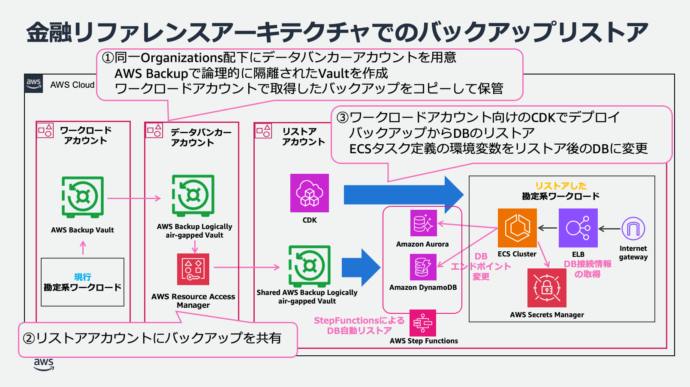
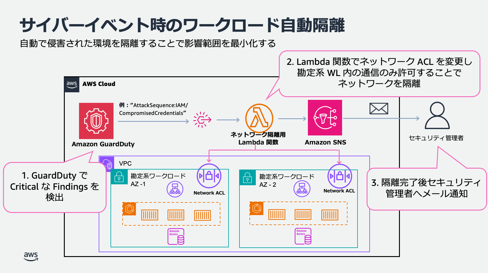

# 金融ワークロードアーキテクチャ解説 [サイバーレジリエンス]

## ユースケース

- サイバーレジリエンスとは、サイバー攻撃を受けることを前提として、攻撃を予防し、検知し、対応し、復旧する能力を総合的に高めることです。従来の「攻撃を防ぐことに主眼を置く」という考え方から、「攻撃を受けても事業を継続し、迅速に復旧する」という考え方への転換が求められています。特に可用性に影響を与える DDoS 攻撃やランサムウェア攻撃といったサイバーイベントに対する防御は実装が急務とされています。本リファレンスアーキテクチャは、金融機関におけるサイバーイベントからの迅速な復旧を具体的なアーキテクチャとともに実装サンプルを提示します。
- ランサムウェアに感染したデータがバックアップにコピーされるリスクを考慮し、バックアップデータを論理的に隔離した上で、メインデータセンターが依然として感染している可能性があるため、本番とは完全に別の環境での復旧を想定します。
  - 参考：金融庁「金融分野におけるサイバーセキュリティに関するガイドライン」の [2.3.3. データ保護] 参照

## アーキテクチャの特徴

- 本リファレンスアーキテクチャは、[金融リファレンスアーキテクチャの勘定系ワークロード](https://github.com/aws-samples/baseline-environment-on-aws-for-financial-services-institute/blob/main/doc/reference-arc-core-banking/core-banking-arch-readme.md)をベースに、バックアップを論理的に隔離し、本番環境とは別環境にリストアする構成を CDK として提供します。
- また、サイバー攻撃により侵害されたシステムをネットワーク隔離し、影響範囲を最小限に留めることができます。

### アカウント設計

- **ワークロードアカウント**: 本番環境の勘定系システム等稼働アカウント
- **データバンカーアカウント**: 論理的に隔離されたバックアップ保管用アカウント
- **リストアアカウント**: 本番環境が侵害されている想定で、復旧先となる新規アカウント
- **フォレンジックアカウント**: 侵害されたシステムの改ざん検出やマルウェアスキャン、データの完全性とアプリケーション依存関係の確認用アカウント(本ワークロードでは対象外)

### バックアップ・リストアについて

- ① ワークロードアカウントでは AWS Backup を利用してバックアップを取得しています。本リファレンスアーキテクチャでは、別途用意したデータバンカーアカウントに **AWS Backup Logically Air-gapped Vault** を作成し、ワークロードアカウントで取得したバックアップデータをこの Vault に複製しています。

- ② サイバーイベント発生時おいて、バックアップデータのリストアが必要な場合は、データバンカーアカウントに直接アクセスするのではなく、 **AWS Resource Access Manager**を使用してリストアアカウントとバックアップを共有する方式を採用しています。これにより、データバンカーアカウントへの直接アクセスを制限し、バックアップデータの不正アクセスや改ざんを防止する、より安全な運用を実現しています。

- ③ リストアアカウントでは、アプリケーションやインフラストラクチャの構成は、CDK を用いて環境を自動的に再構築します。データベースについては、バックアップからのリストアを StepFunctions で自動実行する仕組みを実装しています。ただし、復旧したデータベース環境への接続については、業務影響度の評価やリスク判断が必要となるため、自動化の対象外としています。実際の切り替え時には、手動で ECS タスク定義の環境変数をリストア後のデータベースに更新し、ECS タスクを再起動することで新環境への移行を完了する運用手順を提供しています。
  

- 具体的なバックアップ取得手順および復旧手順は以下の手順書を参照ください。
  - [サイバーレジリエンスバックアップ手順書](doc/reference-arc-cyber-resilience/backup-procedures.md)
  - [サイバーレジリエンス復旧手順書](doc/reference-arc-cyber-resilience/restore-procedures.md)

### 隔離とフォレンジックについて

- サイバーイベント発生時には、影響を受けたシステムの速やかな隔離とインシデント調査のための証拠保全を実施することが重要です。また、バックアップデータを用いた復旧作業に着手する前には、バックアップの完全性を評価する必要があります。
- 本リファレンスアーキテクチャでは、勘定系ワークロードを対象として、Amazon GuardDuty で不審なアクセスがあったことをトリガーに、Lambda 関数でネットワーク ACL を変更し、侵害されたシステムを隔離する処理を実行します。隔離が完了すると、Amazon SNS にて管理者へ通知を行います。
  - [自動ネットワーク隔離手順書](doc/reference-arc-cyber-resilience/isolation-procedures.md)
- なお、勘定系ワークロードは Amazon ECS Fargate を用いておりコンテナホストが AWS の管理責任下にあるため調査箇所が限られていることから、フォレンジックアカウントのデプロイおよび実施手順は省略しています。フォレンジックの実装ガイドおよびソリューションは以下 AWS ドキュメントを参照ください。
  - https://docs.aws.amazon.com/ja_jp/security-ir/latest/userguide/appendix-b-incident-response-resources.html#forensic-resources

## 参考情報

### 規制・ガイドライン

- 金融庁は「金融分野におけるサイバーセキュリティに関するガイドライン」を策定し、バックアップに関する規程整備やランサムウェア攻撃への対応事項を定義しています。
  - https://www.fsa.go.jp/news/r6/sonota/20241004/18.pdf
- 上記を受けて、FISC 安全対策基準でもサイバーレジリエンス強化に関する基準項目が新設され、本リファレンスアーキテクチャを活用した対策内容を更新しています。
  - [FISC 安全対策基準 実務基準の対策](doc/reference-arc-core-banking/fisc-mapping-core-banking.md)

### ベストプラクティス・ホワイトペーパー

- AWS クラウドセキュリティ ランサムウェアからの保護
  - https://aws.amazon.com/jp/security/protecting-against-ransomware/
- オンプレミスのインフラから AWS へのバックアップとリカバリ
  - https://docs.aws.amazon.com/ja_jp/prescriptive-guidance/latest/backup-recovery/on-premises-to-aws.html
- AWS Backup の Logically air-gapped vault によるサイバーレジリエンスの構築
  - https://aws.amazon.com/jp/blogs/news/building-cyber-resiliency-with-aws-backup-logically-air-gapped-vault/
- オンプレミス環境のバックアップ隔離の実装
  - https://aws.amazon.com/jp/blogs/industries/banking-trends-2022-cyber-vault-and-ransomware/
- インシデント対応の例
  - https://docs.aws.amazon.com/ja_jp/whitepapers/latest/aws-security-incident-response-guide/incident-response-examples.html
- AWS re:Invent 2024 - What’s new with AWS Backup (STG203)
  - https://youtu.be/YFcoAZQvcHM?si=A1rBTUs8ppJMCl9P
