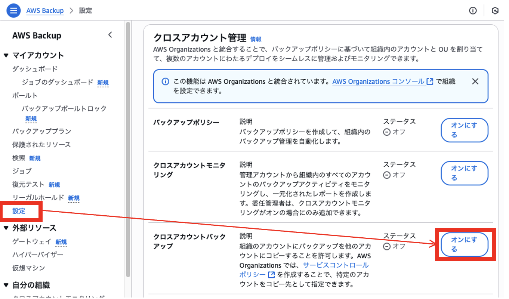
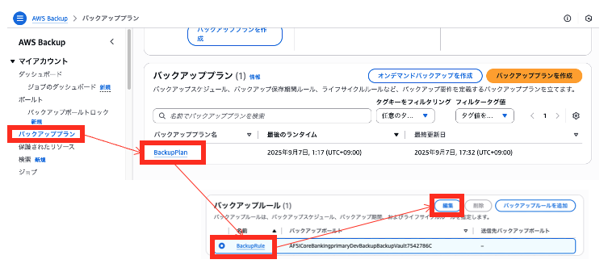
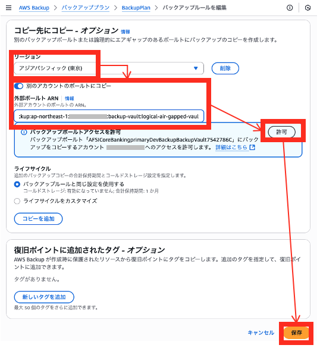

# サイバーレジリエンスバックアップ手順書

## 概要

本ドキュメントは、サイバーインシデントに備えるための、論理的に隔離された別 AWS アカウントにバックアップを取得するための手順を説明します。論理的な隔離とは、厳格なアクセス制御と不変性の仕組みによって、バックアップデータに対する操作（読み取り、変更、削除）を不可能にし、管理者権限を持つユーザーや攻撃者でさえも、指定した保持期間中は変更・削除できないよう制御することを意味します。

## 前提条件

### 必要なソフトウェア

- AWS CLI v2
- Node.js 18.0.0 以上
- AWS CDK v2.95.1 以上

### アカウント構成

- **ワークロードアカウント**: 勘定系ワークロードが稼働
- **データバンカーアカウント**: 論理的に隔離されたバックアップデータを保管

## 導入手順

データバンカーアカウントに SSO で認証している状態からのデプロイメントの手順を示します。

### 1. データバンカーアカウントデプロイ用の AWS CLI プロファイルを設定する

データバンカーアカウントにデプロイするための AWS CLI プロファイルを設定します。ここではデータバンカーアカウントアカウントの ID を 123456789012 としています。
~/.aws/config

```sh
# for Data Bunker Account Login
[profile ct-databunker-sso]
sso_start_url = https://d-90xxxxxxxx.awsapps.com/start/
sso_region = ap-northeast-1
sso_account_id = 123456789012
sso_role_name = AWSAdministratorAccess
region = ap-northeast-1
```

### 2. 環境別の設定を指定する

デプロイ前にデータバンカーアカウントの情報を指定する必要があります。下記の typescript ファイルを編集します。

`usecases/guest-core-banking-sample/bin/parameter.ts`

このサンプルはアカウント ID 123456789012 のデータバンカーアカウントに、logical-air-gapped-vault という名前の Logically air-gapped vault を作成する例です。

```typescript
export const CyberResilienceParameter = {
  // デプロイする場合は true に指定
  deploy: true,
  // どの機能をデプロイか選択
  option: 'backup', //["backup","restore","isolation"],

  // Data Bunkerアカウントの設定
  dataBunkerAccount: {
    // アカウントID
    id: '123456789012', // 実際のData BunkerアカウントIDに置き換える
    // Data Bunkerアカウントに作成するバックアップボールト名
    vaultName: 'logical-air-gapped-vault',
  },
};
```

### 3. Logically air-gapped vault をデプロイする

（ログインしていない場合）AWS IAM Identity Center（旧 AWS SSO) を使ってデータバンカーアカウントにログインします。

```sh
aws sso login --profile ct-databunker-sso
```

データバンカーアカウントで CDK ブートストラップを実行します（parameter.ts に指定した 2 つのリージョンでブートストラップ処理が行われます）。

```sh
cd usecases/guest-core-banking-sample
npx cdk bootstrap --profile ct-databunker-sso
```

Logically air-gapped vault をデプロイします。

```bash
npm install
npx cdk deploy BLEAFSI-CoreBanking-data-bunker-Dev --profile ct-databunker-sso
```

スタック BLEAFSI-CoreBanking-data-bunker-Dev の実行が完了しますと、Output として下記が表示されます。

```bash
Outputs:
BLEAFSI-CoreBanking-data-bunker-Dev.LogicallyAirGappedVaultArn = <デプロイされたボールトのARN>
```

### 4.勘定系ワークロードからデータバンカーアカウントへのコピー設定

3 によって、AWS Backup の Logically air-gapped vault が作成されているため、ワークロードアカウントの AWS Backup の既存バックアッププランを修正して、データバンカーアカウントへコピーするための設定を行います。

ワークロードアカウントのマネージメントコンソールから **AWS Backup** を開き、**設定** から **クロスアカウントバックアップ** をオンにします。



**AWS Backup** の **バックアッププラン** から、勘定系ワークロードのデプロイにて作成された **バックアッププラン** を選択し、その中にある **バックアップルール** の編集を選びます。



バックアップルールの **コピー先にコピー** に、データバンカーアカウントにデプロイした Logically air-gapped vault の ARN を設定し、アクセス許可をした上で保存をします。（ARN は、3 の処理の Output に出力されています）



以上で、設定は完了です。
コピー処理により、データバンカーアカウントの Logically air-gapped vault に正しく復旧ポイントが作成されることを確認してください。コピー処理は、バックアッププランで指定したバックアップ処理のタイミングで行われます。
