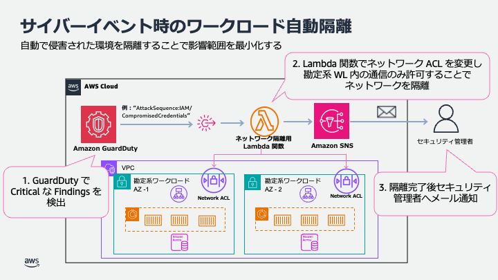
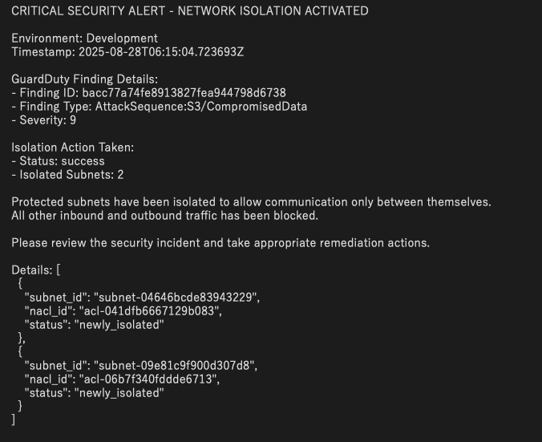
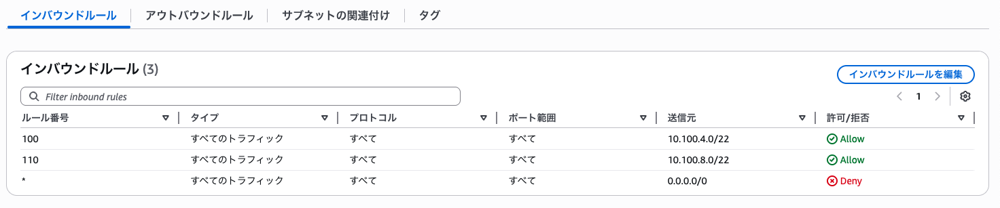

# サイバーレジリエンス - 自動ネットワーク隔離機能

## 概要

本機能は Amazon GuardDuty で重大度が Critical の脅威が検出された際に、勘定系ワークロードを自動的にネットワーク隔離する仕組みを提供します。対象のシステムを隔離することで、脅威が発生した際の影響範囲を最小限に留めることができます。本ドキュメントでは、本機能を実現する AWS のアーキテクチャと隔離手順について説明します。

※現在の実装では、インシデントに対する影響範囲を最小化するため、GuardDuty で Critical な通知が確認されるとシステムを自動で隔離する実装になっています。しかし、隔離作業には業務への影響を伴うため、人による判断が必要な場合も考えられます。そのような場合は、通知と隔離処理の間に人による判断を介在させるような実装が推奨されます。

## アーキテクチャ

```
Amazon GuardDuty → AWS EventBridge → AWS Lambda → Amazon SNS
                                        ↓
                                 Network ACL 変更
                                 (Protected Subnet の隔離)
```



## 機能詳細

### 1. 脅威検知

- Amazon GuardDuty で Severity 9.0 以上（Critical）の Finding が検出された際に、EventBridge ルールが自動的に Lambda 関数をトリガーします。この機能は**Critical**レベルのみに反応します。

### 2. ネットワーク隔離

-勘定系ワークロードは 2 つのアベイラビリティゾーンのサブネット上に構築されています。そのため、ネットワークの自動隔離を行う際は Lambda 関数で Network ACL を作成することで、2 つのアベイラビリティゾーンに存在する勘定系ワークロードのサブネット間の通信のみを許可し、その他の inbound/outbound 通信を全て遮断することで対象ワークロード外へのアクセス、外部ネットワークからの接続を Block します。

-Network ACL を動的に作成し、既存の ACL を変更します。

### 3. 通知

- 隔離完了後、Amazon SNS で管理者に通知
- エラー発生時も通知を送信

## ファイル構成

本機能に関するデプロイアセットは、以下の `usecases/guest-core-banking-sample/lib/primary/cyber-resilience/automated-isolation`に格納されています。

```
/lib/primary/cyber-resilience/automated-isolation/
├── isolation-stack.ts           # メインスタック
├── guardduty-eventbridge.ts     # GuardDuty + EventBridge設定
├── isolation-lambda.ts          # Lambda関数の定義
├── sns-notification.ts          # SNS通知設定
├── types.ts                     # 型定義
└── lambda/                      # Lambda関数コード
    ├── isolation-handler.py     # メイン処理（Python）
    └── requirements.txt         # Python依存関係
```

## デプロイ方法

### 1. 機能の有効化

`bin/parameter.ts`で以下の設定を`true`に変更：

```typescript
export const CyberResilienceIsolationParameter = {
  deploy: true,
};
```

### 2. 通知先メールアドレスの設定

`bin/parameter.ts`の`notifyEmail`を適切なメールアドレスに設定：

```typescript
export const DevParameter: StackParameter = {
  // ...
  notifyEmail: 'your-security-team@example.com',
  // ...
};
```

### 3. デプロイ実行

```bash
npm run cdk deploy BLEAFSI-CoreBanking-isolation-Dev
```

## テスト方法

### 1. Amazon GuardDuty でサンプル脅威を生成

デプロイ後、Amazon GuardDuty の create-sample-findings API を利用することで、サンプルの検出結果を生成します。本機能は重大度が Critical な脅威が生成された際に実行されるため、Critical と定義された検出結果タイプを指定します。

```bash
aws guardduty create-sample-findings \
  --detector-id $(aws guardduty list-detectors --query 'DetectorIds[0]' --output text) \
  --finding-types "AttackSequence:IAM/CompromisedCredentials"
```

### 2. AWS Lambda が実行され Amazon SNS で送られるメールを確認

サンプルの脅威が生成されると Lambda 関数が実行され、しばらく待つとデプロイ時に指定したメールアドレス宛に以下図のようなネットワーク隔離が完了した旨のメール通知が届きます。



### 3. 対象 Subnet に隔離用 Network ACL が適用されているか確認

AWS マネジメントコンソールから、勘定系ワークロードが存在する Protected Subnet に関連付けされた Network ACL を確認し、該当サブネット間のみ許可され、それ以外の通信は拒否されていることを確認します。



## 制限事項

- Primary Region のみでの動作（Secondary Region は対象外）
- Amazon GuardDuty が有効化が前提
