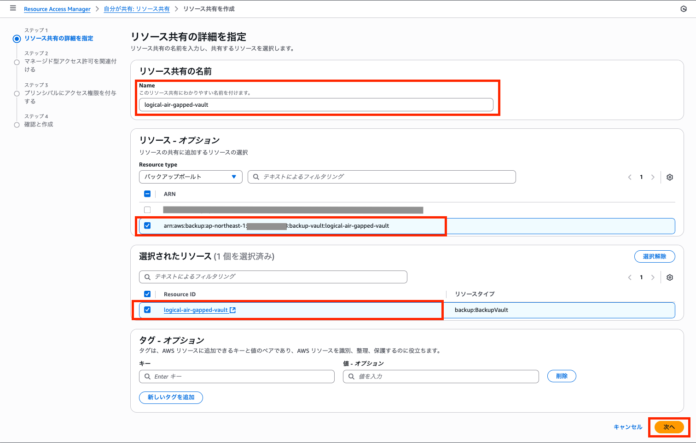
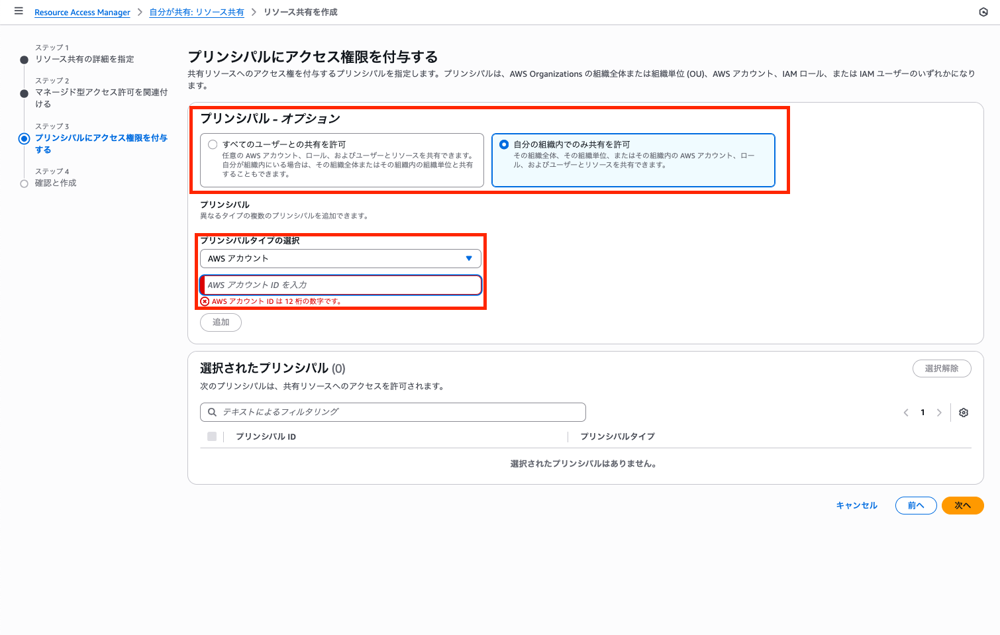
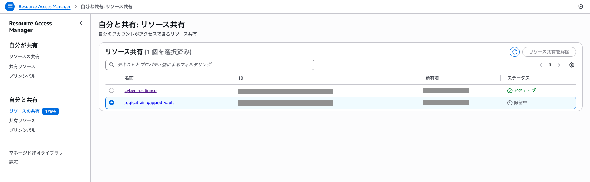
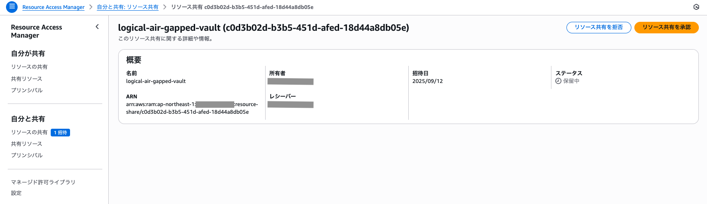

# サイバーレジリエンス復旧手順書

## 概要

本ドキュメントは、サイバーインシデント発生時のシステム復旧手順を説明します。
復旧は 3 つの段階で実施されます：

1. **Resource Access Manager (RAM) 共有設定** (手作業)
2. **データベース復旧** (CDK StepFunctions 自動化)
3. **ワークロード再接続** (手作業)

## 前提条件

### 必要なソフトウェア

- AWS CLI v2
- Node.js 18.0.0 以上
- AWS CDK v2.95.1 以上

### アカウント構成

- **データバンカーアカウント**: バックアップデータを保管
- **リストアアカウント**: 復旧作業を実行

### 必要な権限

- データバンカーアカウント: RAM 共有権限
- リストアアカウント: 必要最小権限

## 初期セットアップ

### 1. パラメータ設定

`usecases/guest-core-banking-sample/bin/parameter.ts`を編集して、以下の項目を環境に合わせて変更してください：

```typescript
export const CyberResilienceParameter = {
  // デプロイする場合は true に指定
  deploy: false,
  // どの機能をデプロイか選択
  option: 'restore', //["backup","restore","isolation"],

  // リストアアカウント設定（要変更）
  restoreAccount: {
    accountId: process.env.CDK_DEFAULT_ACCOUNT || '123456789012', // リストアアカウントID
    region: 'ap-northeast-1', // リストアリージョン
    notificationEmail: 'cyber-resilience-team@example.com', // SNS通知先メールアドレス（要変更）
  },
  // 復旧ポイント設定（リストアアカウントのデプロイ時に必要・要変更）
  recoveryPoints: {
    // Aurora PostgreSQL復旧ポイント（要変更）
    aurora: {
      recoveryPointArn: 'arn:aws:backup:ap-northeast-1:123456789012:recovery-point:11111111-2222-3333-4444-55555555555', // 復旧ポイントARN
      snapshotArn: 'arn:aws:rds:ap-northeast-1:123456789012:cluster-snapshot:cyber-resilience-xxxxxxxx', // 共有スナップショットARN
      description: 'Aurora PostgreSQL復旧ポイント',
      targetClusterName: 'restored-aurora-cluster', // 復旧先クラスター名
    },
    // DynamoDB復旧ポイント（要変更）
    dynamodb: {
      recoveryPointArn: 'arn:aws:backup:ap-northeast-1:123456789012:recovery-point:11111111-2222-3333-4444-55555555555', // 復旧ポイントARN
      description: 'DynamoDB復旧ポイント',
      targetTableName: 'restored-dynamodb-table', // 復旧先テーブル名
    },
  },
};
```

### 2. CDK 復旧システムデプロイ

```bash
cd usecases/guest-core-banking-sample
npm install
npx cdk deploy --all
```

**注意**: 初回デプロイ時は勘定系ワークロードは含まれません（復旧用 Step Functions のデプロイのみ）

### データバンカーアカウントで RAM 共有リクエスト

データバンカーアカウントのマネジメントコンソールにて **AWS Resource Access Manager** を開き、**リソースの共有** を選択します。

**リソース共有を作成** 画面にて、リソース共有の名前を入力します。
また、リソースタイプとして **バックアップボールト** を選択し、リストアアカウントへ共有する AWS Backup の Logically air-gapped vault を、そして選択されたリソースに共有するリソース ID を選択します。(サイバーレジリエンスバックアップ手順書 参照)


アクセス許可はデフォルトのものを設定した上で、ステップ 3 にて共有先アカウントを設定します。
共有するリストアアカウントが同じ Organizations ないであれば、「自分の組織内でのみ共有を許可」をプリンシパルとして設定し、アカウント ID を入力します。


確認まで完了したら、「自分と共有」というリソース内の共有ステータスが「保留中」となります。


### リストアアカウントで RAM 共有承認

リストアアカウントのマネジメントコンソールにて **AWS Resource Access Manager**を開き、「自分と共有」リソース内に承認待ちステータスのリソースがあるため、「リソース共有を承認」をクリックします。これで、RAM による共有が完了しました。


## 復旧手順

### データベース復旧

初期セットアップにてデプロイした StepFunctions によるデータベースの復旧を行います。

#### 1-1. 復旧開始

```bash
# 環境変数設定
export ENVIRONMENT="Development"  # または Production
export STATE_MACHINE_NAME="cyber-resilience-restore-${ENVIRONMENT}"

# StepFunctions実行
EXECUTION_ARN=$(aws stepfunctions start-execution \
  --state-machine-arn "arn:aws:states:ap-northeast-1:$(aws sts get-caller-identity --query Account --output text):stateMachine:${STATE_MACHINE_NAME}" \
  --name "restore-$(date +%Y%m%d-%H%M%S)" \
  --input '{
    "aurora_recovery_point_arn": "YOUR_AURORA_RECOVERY_POINT_ARN",
    "aurora_target_cluster_name": "restored-aurora-cluster",
    "dynamodb_recovery_point_arn": "YOUR_DYNAMODB_RECOVERY_POINT_ARN",
    "dynamodb_target_table_name": "restored-dynamodb-table"
  }' \
  --query 'executionArn' --output text)

```

### ワークロード再接続 (手作業)

#### 2-1. 復旧リソース情報確認

```bash
# リストアされたDB情報を確認
aws rds describe-db-clusters \
  --db-cluster-identifier restored-aurora-cluster \
  --query 'DBClusters[0].{Endpoint:Endpoint,Status:Status}' \
  --output table

aws dynamodb describe-table \
  --table-name restored-dynamodb-table \
  --query 'Table.{TableName:TableName,Status:TableStatus}' \
  --output table

```

#### 2-2. 勘定系ワークロードデプロイ設定変更

```bash
# parameter.tsのバックアップ作成
cp usecases/guest-core-banking-sample/bin/parameter.ts \
   usecases/guest-core-banking-sample/bin/parameter.ts.backup

# 手動編集: usecases/guest-core-banking-sample/bin/parameter.ts
# SampleEcsAppParameter.deploy を false から true に変更
```

#### 2-3. 勘定系ワークロード新規デプロイ

```bash
# parameter.ts更新確認
cd usecases/guest-core-banking-sample
npx cdk deploy --all

# ALBエンドポイント確認
aws elbv2 describe-load-balancers \
  --query 'LoadBalancers[?contains(LoadBalancerName,`CoreBanking`)].DNSName' \
  --output text
```

#### 3-4. 接続確認

```bash
ALB_ENDPOINT=$(aws elbv2 describe-load-balancers \
  --query 'LoadBalancers[?contains(LoadBalancerName,`CoreBanking`)].DNSName' \
  --output text)

curl -I http://$ALB_ENDPOINT/
```
