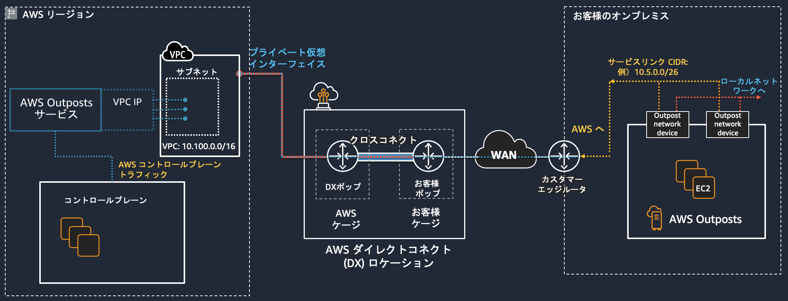
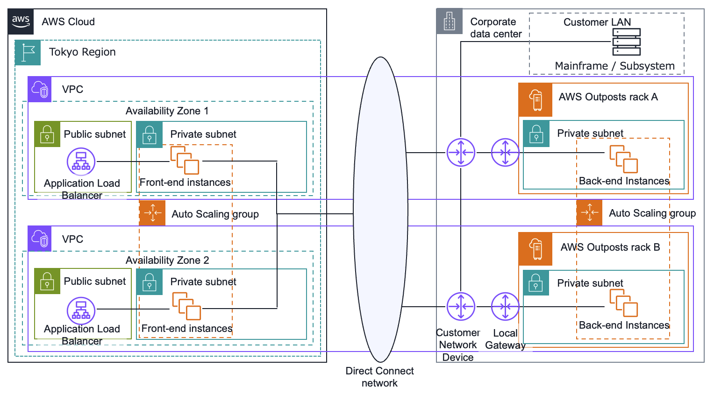
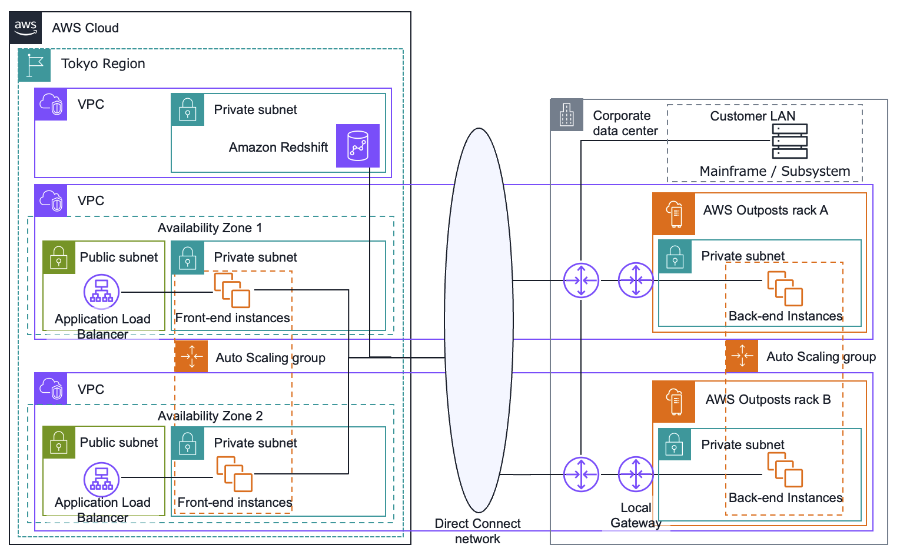
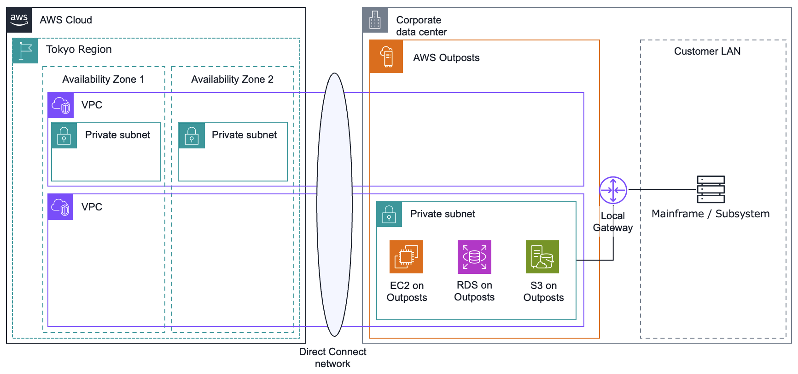
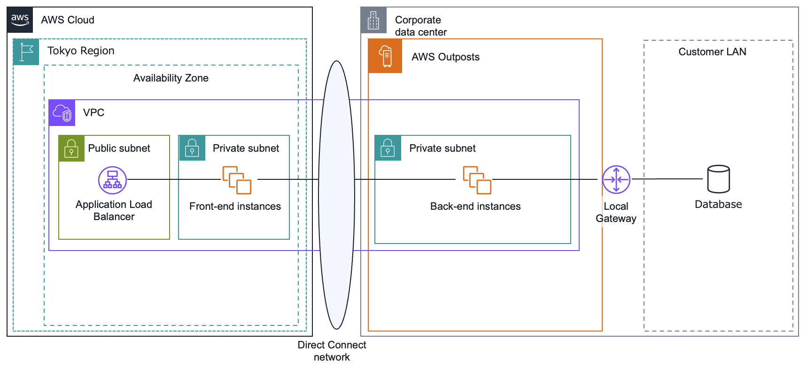

# 金融ワークロードアーキテクチャ解説 [ハイブリッド]

## 前提条件

- 本リファレンスアーキテクチャは、クラウドとオンプレミスを組み合わせたハイブリッドのワークロードを対象としています
- その中でも特に、AWS Outposts を用いたリファレンスアーキテクチャについて記載したものです
- Outposts における責任共有モデルは、AWS リージョンにおける責任共有モデルとは異なり、お客様データセンターの物理セキュリティ、電源、ネットワーク、キャパシティ管理はお客様の責任範囲となります。詳細はホワイトペーパー [「AWS Outposts の高可用性設計とアーキテクチャに関する考慮事項」の序章](https://docs.aws.amazon.com/ja_jp/whitepapers/latest/aws-outposts-high-availability-design/aws-outposts-high-availability-design.html)を参照してください
- Outposts 関連の用語については、ホワイトペーパー [「AWS Outposts の高可用性設計とアーキテクチャに関する考慮事項」の序章](https://docs.aws.amazon.com/ja_jp/whitepapers/latest/aws-outposts-high-availability-design/aws-outposts-high-availability-design.html)にある重要な用語を参照してください
  - 重要な用語:
    - AWS Outposts — は、実質的にすべてのデータセンター、コロケーションスペース、またはオンプレミス施設に同じ AWS インフラストラクチャ、AWS サービス、API、およびツールを提供するフルマネージドサービスであり、真に一貫したハイブリッドエクスペリエンスを実現します
    - Outpost （論理 Outpost） — は、物理的に接続された AWS Outposts ラックを 1 つの論理エンティティとして管理し、お客様のサイトに AWS コンピューティング、ストレージ、ネットワーキングのプールをデプロイした環境です
    - 親リージョン — Outpost のデプロイに必要な管理、コントロールプレーンサービス、およびリージョンレベルの AWS サービスを提供する AWS リージョン です
    - アンカーアベイラビリティーゾーン (アンカー AZ) — Outpost のアンカーポイントをホストする親リージョンのアベイラビリティーゾーン。Outpost はアンカーアベイラビリティーゾーンの延長として機能します
    - アンカーポイント — リモートでデプロイされた Outposts からの接続を受信するアンカー AZ 内のエンドポイント
    - サービスリンク — Outpost を親リージョンのアンカーアベイラビリティーゾーンに接続する暗号化された VPN トンネルのセット
    - ローカルゲートウェイ (LGW) — Outpost とオンプレミスネットワーク間の通信を可能にする論理的な相互接続仮想ルーター

## AWS Outposts と AWS を接続する物理レイヤーのネットワーク

論理 Outpost のデプロイは、管理、モニタリング、サービス運用が適切に機能するために、アンカー AZ への耐障害性の高い接続が不可欠です。各 Outpost ラックに冗長ネットワーク接続を提供し、AWS クラウド内のアンカーポイントへの信頼性の高い接続を提供するようにオンプレミスネットワークをプロビジョニングする必要があります。詳細は、ホワイトペーパー[「AWS Outposts の高可用性設計とアーキテクチャに関する考慮事項」のネットワークの項](https://docs.aws.amazon.com/ja_jp/whitepapers/latest/aws-outposts-high-availability-design/networking.html)を参照してください。
AWS リージョンへの接続を、AWS Direct Connect 経由でプライベートにする場合の接続イメージは、下図のとおりです。

Direct Connect 接続も、耐障害性の高い接続のために、複数の Direct Connect 接続と複数の Direct Connect ロケーションによる冗長化を推奨します。詳細は [AWS Direct Connect の回復性に関する推奨事項](https://aws.amazon.com/jp/directconnect/resiliency-recommendation/) を参照してください。

## メインフレーム周辺システム

メインフレームがオンプレミスで稼働している場合、メインフレームとの連携が必要な周辺システムはオンプレミスのデータセンターに設置することが、通信のレイテンシーの観点やデータレジデンシーの観点から望まれるケースがあります

### ユースケース

- フロントエンドは AWS クラウドのスケーラビリティを活かし、バックエンドを Outposts で処理して、メインフレームをはじめとするオンプレミスのデータも活用する
- オンプレミスのメインフレームと、クラウドのデータレイクや OLAP との中継を担う処理を Outposts で行う

### アーキテクチャ図



### アーキテクチャの特徴

- 高い可用性が求められるメインフレーム周辺システムのための、Outposts のマルチ AZ 構成です
- フロントエンドは AWS クラウドのスケーラビリティを活かし、AWS リージョンに Application Load Balancer と EC2 のインスタンスで構成されます

### アーキテクチャのバリエーション



- オンプレミスのメインフレームと、クラウドのデータレイクや OLAP との中継を担う処理を Outposts で行うことも可能です
- ダウンストリームの分析用途のシステムはそのデータベース容量が大きくなりやすい特性から、AWS クラウドでの処理に向いています

## データレジデンシーの実現

AWS クラウドでもお客様のデータプライバシー、セキュリティを実現することができますが、お客様のデータを特定のデータセンターに閉じた運用とする、データレジデンシーを Outposts で実現することによって、より明確に統制できます

### ユースケース

- データ保管場所に関する明確なポリシーがあり、データセンター内でのデータ保管要件を満たすために、AWS リージョンから分離した、Outposts に閉じた VPC で明確に統制する

### アーキテクチャ図



### アーキテクチャの特徴

- Outposts を発注した AWS アカウント内で作成した VPC は、シームレスに Outposts へ拡張されます
- Outposts サブネット専用の VPC を個別に作成して、AWS リージョンと分離することで、Outposts に閉じた VPC で明確に統制できます
- Amazon EBS local snapshots on Outposts を S3 on Outposts に保存することにより、スナップショットデータを AWS リージョンから分離して、Outposts に閉じることができます
- RDS on Outposts のシングル AZ インスタンスのスナップショットを S3 on Outposts に保存することにより、スナップショットデータを AWS リージョンから分離して、Outposts に閉じることができます

### データレジデンシーを実現するための Service Control Policies (SCPs)

Outposts を用いてデータレジデンシーを実現する際、Outposts サブネット専用の VPC を個別に作成して、Service Control Policies (SCPs) のポリシーにより AWS リージョンへデータ転送やコピー、EC2 のスナップショット作成等を拒否することにより、AWS リージョンと分離することができます
具体的な SCPs ポリシーは以下のとおりです

<details>
<summary>Outposts から AWS リージョンへのデータ転送/保存を制限する必要がある場合の SCPs ポリシー</summary>

```JSON
{
  "Version": "2012-10-17",
  "Statement": [
      {
      "Sid": "DenyCopyToRegion",
      "Action": [
        "ec2:ModifyImageAttribute",
        "ec2:CopyImage",
        "ec2:CreateImage",
        "ec2:CreateInstanceExportTask",
        "ec2:ExportImage",
        "ec2:ImportImage",
        "ec2:ImportInstance",
        "ec2:ImportSnapshot",
        "ec2:ImportVolume",
        "rds:CreateDBSnapshot",
        "rds:CreateDBClusterSnapshot",
        "rds:ModifyDBSnapshotAttribute",
        "elasticache:CreateSnapshot",
        "elasticache:CopySnapshot",
        "datasync:Create*",
        "datasync:Update*"
      ],
      "Resource": "*",
      "Effect": "Deny"
    },
    {
      "Sid": "DenyDirectTransferToRegion",
      "Action": [
        "dynamodb:PutItem",
        "dynamodb:CreateTable",
        "ec2:CreateTrafficMirrorTarget",
        "ec2:CreateTrafficMirrorSession",
        "rds:CreateGlobalCluster",
        "es:Create*",
        "elasticfilesystem:C*",
        "elasticfilesystem:Put*",
        "storagegateway:Create*",
        "neptune-db:connect",
        "glue:CreateDevEndpoint",
        "glue:UpdateDevEndpoint",
        "datapipeline:CreatePipeline",
        "datapipeline:PutPipelineDefinition",
        "sagemaker:CreateAutoMLJob",
        "sagemaker:CreateData*",
        "sagemaker:CreateCode*",
        "sagemaker:CreateEndpoint",
        "sagemaker:CreateDomain",
        "sagemaker:CreateEdgePackagingJob",
        "sagemaker:CreateNotebookInstance",
        "sagemaker:CreateProcessingJob",
        "sagemaker:CreateModel*",
        "sagemaker:CreateTra*",
        "sagemaker:Update*",
        "redshift:CreateCluster*",
        "ses:Send*",
        "ses:Create*",
        "sqs:Create*",
        "sqs:Send*",
        "mq:Create*",
        "cloudfront:Create*",
        "cloudfront:Update*",
        "ecr:Put*",
        "ecr:Create*",
        "ecr:Upload*",
        "ram:AcceptResourceShareInvitation"
      ],
      "Resource": "*",
      "Effect": "Deny"
    },
    {
      "Sid": "DenyPutObjectToRegionalBuckets",
      "Action": [
        "s3:PutObject"
      ],
      "Resource": ["arn:aws:s3:::*"],
      "Effect": "Deny"
    }
  ]
}
```

</details>

<details>
<summary>AWS リージョンへのスナップショット保存を制限する SCPs ポリシー</summary>

```json
{
  "Version": "2012-10-17",
  "Statement": [
    {
      "Sid": "DenySnapshotsToRegion",
      "Effect": "Deny",
      "Action": ["ec2:CreateSnapshot", "ec2:CreateSnapshots"],
      "Resource": "arn:aws:ec2:*::snapshot/*",
      "Condition": {
        "ArnLike": {
          "ec2:SourceOutpostArn": "<outpost_arn_pattern>"
        },
        "Null": {
          "ec2:OutpostArn": "true"
        }
      }
    },
    {
      "Sid": "DenySnapshotsNotOutposts",
      "Effect": "Deny",
      "Action": ["ec2:CopySnapshot", "ec2:ModifySnapshotAttribute"],
      "Resource": "arn:aws:ec2:*::snapshot/*",
      "Condition": {
        "ArnLike": {
          "ec2:OutpostArn": "<outpost_arn_pattern>"
        }
      }
    }
  ]
}
```

</details>

<details>
<summary>Outposts 専用サブネット以外での EC2 インスタンスの起動およびネットワークインターフェース作成を制限する SCPs ポリシー</summary>

```json
{
  "Version": "2012-10-17",
  "Statement": [
    {
      "Sid": "DenyNotOutpostSubnet",
      "Effect": "Deny",
      "Action": ["ec2:RunInstances", "ec2:CreateNetworkInterface"],
      "Resource": ["arn:aws:ec2:*:*:network-interface/*"],
      "Condition": {
        "ForAllValues:ArnNotEquals": {
          "ec2:Subnet": ["<outpost_subnet_arns>"]
        }
      }
    }
  ]
}
```

</details>

## オンプレミスのデータベースへの低レイテンシーアクセス

レガシーワークロードにおいて、バッチ処理などのトランザクション単位でネットワーク遅延が積み重なることがクリティカルな影響となる場合、データベースと同一のオンプレミスのデータセンターに設置した Outposts で処理を行うことにより、オンプレミスのデータベースへ低レイテンシーでアクセスすることができます

### ユースケース

- データベースをオンプレミスから移行できないワークロードのフロントエンドを AWS リージョンに、バックエンドを Outposts に移行する

### アーキテクチャ図



### アーキテクチャの特徴

- バックエンドのインスタンスとデータベースを同一 DC 内とすることで、データベースへ低レイテンシーで接続できます

## 参考情報

- [AWS Outposts の高可用性設計とアーキテクチャに関する考慮事項](https://docs.aws.amazon.com/ja_jp/whitepapers/latest/aws-outposts-high-availability-design/aws-outposts-high-availability-design.html)
- [Amazon EBS local snapshots on Outposts](https://docs.aws.amazon.com/ja_jp/ebs/latest/userguide/snapshots-outposts.html)
- [AWS Outposts での Amazon RDS による Amazon RDS 機能のサポート](https://docs.aws.amazon.com/ja_jp/AmazonRDS/latest/UserGuide/rds-on-outposts.features.html)
