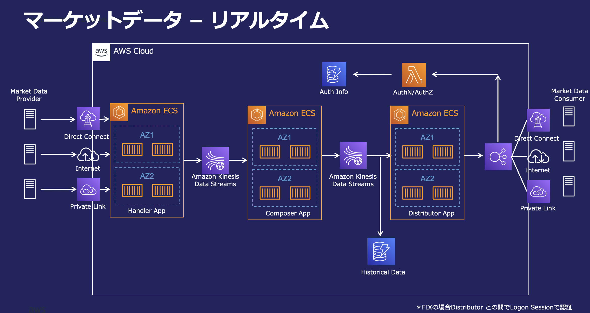

# 金融ワークロードアーキテクチャ解説 [マーケットデータ]

## ユースケース

- 金融機関のマーケットデータ配信システムは、市場に関わる様々なデータを生成し、社内外のクライアントへ配信します。
- 通常、配信データは社内外のデータプロバイダから収集したデータを元に計算されます。
- クライアント、プロバイダとの通信には FIX, REST, WebSocket などのプロトコルが用いられます。
- データの発生頻度、発生からクライアントへの配信までに求められる鮮度によって、リアルタイム、ニアリアルタイム、バッチの大きく 3 パターンに分類されます。これらのうち、本リファレンスアーキテクチャではリアルタイムなユースケースを対象とします。
  - リアルタイム
    - 株価、為替レートなど
    - 1 分あたり数千〜を超える更新
    - レイテンシセンシティブである場合も多い
  - ニアリアルタイム
    - 市況ニュース、非リアルタイムなプライス配信など
    - 数分に１度の更新
  - バッチ
    - 金利指標、企業格付け、外為公示相場など
    - 数時間〜に 1 度の更新

## アーキテクチャの特徴

### Handler App, Composer App, Distributor App の 3 層で構成

#### Handler App

- 配信データの元となる Input を受信します。プロトコルや認証方式は Provider が定めるインターフェースに依ります。
- Handler は受信データを Kinesis Data Streams にプロデューサとして書き込みます。

#### Composer App

- 配信データの計算を行います。
- 多くの場合、配信データは上流の Market Data Provider や、社内のリファレンスデータをインプットとして計算されます。
  - Input データは Handler App が提供する Stream をコンシューマとして利用します。
  - 他の Composer の計算結果が Input となる場合もあります。この時も他の Composer が提供する Stream をコンシューマとして利用します。
    - ex. 為替レート計算のユースケースで、Composer C (GBPJPY を計算)の Input として、Composer A (GBPUSD を計算)、Composer B (USDJPY を計算)の Stream を利用する場合など

#### Distributor App

- クライアントに向けたデータの配信を行います。
- 配信データは Composer App が提供する Stream をコンシューマとして利用します。
- Distributor App はクライアントの要求に応じてフォーマットの変換や配信頻度、粒度の調整などを行います。
  - 上流の Composer App、及びその Stream が何らかの障害で利用不能になった場合に、直近正常時の値を固定値として提供することなども Distributor の責務です。
- クライアントの種類や要件に応じて様々なプロトコルがありますが、主に FIX, REST, WebSocket を想定します。
  - FIX
    - Consumer は NLB を経由して Distributor App と通信します。
    - 認証は FIX 通信時の Logon プロセスで実施します。
  - REST, WebSocket
    - Consumer は ALB を経由して Distributor App と通信します。
    - ALB は HTTP の Authorization ヘッダを検証して、認証用の Lambda と Distributor App をルーティングします。
- Provider, Client とのネットワークは要件に応じて Direct Connect, Internet, Private Link 等を利用します。

#### その他ポイント

- 各コンテナアプリケーションは同一構成を Multi AZ で配置し、Active - Active で稼働します。クライアントに対しては両現用な 2 つのエンドポイントを示し、障害時の切り替えをガイドします。
- コンポーネント間の連携に Stream を採用することで、コンポーネント間の結合を疎にしています。プロデューサとなる Handler や Composer は後続コンポーネントの存在や場所を意識することなくデータを提供することができ、コンシューマの数を変動させることも容易です。
  - また、本構成を拡張して、例えば分析用途に新たな DB などを追加したい場合も、コンシューマの一員として追加することで容易に拡張できます。

## アーキテクチャ図

