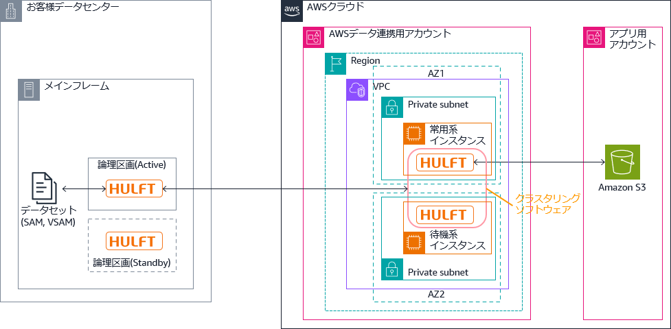

# 金融ワークロードアーキテクチャ解説 [メインフレーム連携]

## 前提条件

- 本リファレンスアーキテクチャにおけるメインフレームとは、固有の命令セットを持つプロセッサーを搭載し、独自 OS の上で大量の業務データを処理する基幹系システムが稼働する大型コンピューターを指します。メインフレーム用の OS の例としては IBM z/OS、富士通 OS IV/MSP、日立製作所 VOS3、日本電気 ACOS-4 等が挙げられます。
- 本リファレンスアーキテクチャにて扱うメインフレーム連携は、メインフレームと AWS の間のデータ連携を対象とします。
- 本リファレンスアーキテクチャで言及するソフトウェア製品の動作を AWS がサポートもしくは保証するものではありません。各ソフトウェア製品の前提条件や詳細は提供元にお問い合わせ下さい。
  - AWS Mainframe Modernization Data Replication with Precisely がサポートするレプリケーション元の環境は IBM z/OS と IBM i (AS/400) のみです。

---

## 1. データレプリケーション

### 1.1 ユースケース

金融機関はメインフレームで稼働する各種システムのデータを AWS にレプリケーションすることにより、データの活用や新規サービスの開発を促進します。

- メインフレームデータを使用した分析や AI / 機械学習

メインフレーム上で稼働する各種システム(勘定系、情報系、チャネル系)のデータを AWS 上のデータレイクやデータウェアハウスに取り込み、AWS サービスを活用した解析や AI / 機械学習によりビジネス価値を創出します。

- メインフレームデータを活用したビジネスイノベーション

メインフレーム上のシステムに手を加えることなく、データをニアリアルタイムで AWS に伝播し、AWS サービスを活用して新しいサービスや機能を追加開発して、イノベーションを加速します。モバイルアプリ等により、カスタマーエクスペリエンスを向上させ、新しい市場機会を開拓します。

- メインフレームアプリケーションのシームレスな移行

メインフレームのデータストアから AWS へデータをレプリケーションし、ビジネスアプリケーションの本稼働環境へのスイッチオーバーをダウンタイムほぼゼロでサポートします。

### 1.2 アーキテクチャ図

AWS Mainframe Modernization Data Replication with Precisely によって Db2 for z/OS から AWS 上のデータベースにレプリケーションするアーキテクチャの例を以下に示します。メインフレーム側の Publisher エージェントはアクティブ/スタンバイ構成で、AWS 側の Apply エージェントはアクティブ/アクティブ構成です。

**レプリケーションの基本動作**  
①Log Reader が Db2 のログをキャプチャーし、カップリングファシリティー (CF) ベースの Log Stream に出力します。  
②IBM メインフレーム上の論理区画 (LPAR) 上のプライマリー Publisher エージェントがログを読み取り、Apply エージェントに発行します。  
③Apply エージェントが Publisher から転送されるデータを読み取ります。  
④ アクティブな Apply エージェントが Amazon MSK にデータを出力します。  
⑤Amazon MSK クラスターが AWS のデータストアを更新します。

**待機系にフェールオーバーするときの動作**  
⑥ 論理区画 A のアクティブ Publisher エージェントで障害が発生すると、IBM メインフレーム上の別の論理区画 B 上でスタンバイ Publisher エージェントが動作します。アクティブ Apply エージェントは論理区画 A のアクティブ Publisher エージェントからのデータを読み取れず、処理を中断します。  
⑦ 代替の Apply エージェントは一定のインターバルでスタンバイ Publisher エージェントからのデータ読み取りをリトライします。  
⑧ アクティブだった Apply エージェントがデータの読み取りを中断すると、コントローラーデーモンが代替の Apply エージェントを Amazon MSK に接続します。

**モニタリングの仕組み**  
⑨Apply エージェントのログは CloudWatch Logs に記録されます。  
⑩ データベースのログは CloudWatch Logs に記録されます。  
⑪CloudWatch がログを集約し、表示します。

### 1.3 アーキテクチャの特徴

前掲のアーキテクチャの主な特徴を以下に示します。

- メインフレームに対する影響の極小化
  - メインフレームのアプリケーションやデータを変更せず、AWS クラウドでのデータ活用を促進します。VSAM ファイルのレイアウトを定義した COBOL コピーブックをスキーマ情報として使い、Lambda 関数によって入力データのフォーマットをターゲットのテーブルにマッピングすることができます
  - メインフレーム側で無く、データの伝播先である AWS クラウドで分析やサービス構築を実装することで、左記の追加開発によるメインフレームの負荷の増大はありません
- 多様なデータソースのサポート
  - IBM z/OS: Db2 for z/OS, IMS/DB, VSAM
  - IBM i: Db2 for IBM i
- 多様なターゲットのサポート
  - データベース
    - Amazon RDS: Oracle, Microsoft SQL Server, PostgreSQL, Amazon Aurora PostgreSQL
    - EC2 にインストールしたデータベース: Oracle, Microsoft SQL Server, IBM Db2 for LUW, PostgreSQL
  - ストレージ: Amazon S3
  - ストリーミングサービス: Amazon Managed Streaming for Apache Kafka (MSK)
    - Amazon MSK 経由で上記以外のデータベースへのレプリケーションも可能
- 低遅延で高スループットのデータ同期
  - データソースからターゲットに対してデータの一貫性を保ちつつ低遅延のレプリケーションを実現することができます
  - Apply エージェントに複数のワーカー (コネクタロジックを実行する Java 仮想マシン (JVM) プロセス) を設定して Amazon MSK に対してデータを出力することにより(⑫)、必要に応じてスループットの増大を図ることができます
- 高可用性
  - z/OS 上の Publisher エージェントをアクティブ/スタンバイ構成にすることで、z/OS 側の Precisely 構成要素の高可用性を実現します
  - AWS 上にマルチ AZ 構成で複数の EC2 インスタンスを稼働し、Amazon MSK クラスターに連携することにより、AWS 側の Precisely 構成要素の高可用性を実現します
- レプリケーションの構成要素の稼働状態の監視
  - Apply エージェント、MSK、データベースの挿入 / 更新の動作に伴い CloudWatch Logs とメトリクスが記録されます。左記のログとメトリクスを監視することで、レプリケーションの構成要素の稼働状態を監視することができます。各構成要素のログとメトリクスを照合すると、どこで問題が発生しているか特定することができます。

### 1.4 アーキテクチャのバリエーション

Db2 for z/OS から Amazon RDS for Db2 へのレプリケーションは上記以外の構成でも可能です。その方法をいくつか以下に示します。

- Q レプリケーション

Q レプリケーション は、IBM MQ メッセージキューを使用してソースとターゲットのデータベースまたはサブシステム間でトランザクションを伝送する、大容量で低遅延のレプリケーションソリューションです。  
Q キャプチャープログラムは、指定されたソース表に対する変更を Db2 リカバリーログから読み取り、このトランザクションをメッセージとしてキューに送信します。Q アプライプログラムはキューからメッセージを読み取り、ターゲット表に変更を適用します。

- SQL レプリケーション

SQL レプリケーションは、ソース表とビューに対する変更をキャプチャーし、コミットされたトランザクションデータをステージング表に保管します。続いて、ステージング表から変更内容が読み取られ、対応するターゲット表に複製されます。

- CDC レプリケーション

IBM Change Data Capture (CDC Replication) は、データベースの変更を発生時にキャプチャーし、 CDC Replication Management Console GUI アプリケーションで構成された表マッピングに基づいて、ターゲットデータベース、メッセージキュー、または ETL ソリューション ( IBM DataStage など) に配信するレプリケーションソリューションです。

### 1.5 参考情報

[1] AWS Mainframe Modernization Data Replication with Precisely  
<https://aws.amazon.com/mainframe-modernization/capabilities/data-replication/>  
[2] Amazon RDS for Db2  
<https://aws.amazon.com/jp/rds/db2/>  
[3] Amazon Managed Streaming for Apache Kafka  
<https://aws.amazon.com/jp/msk/>  
[4] AWS Prescriptive Guidance: Replicate mainframe databases to AWS by using Precisely Connect  
<https://docs.aws.amazon.com/prescriptive-guidance/latest/patterns/replicate-mainframe-databases-to-aws-by-using-precisely-connect.html>  
[5] AWS Prescriptive Guidance: Migrate and replicate VSAM files to Amazon RDS or Amazon MSK using Connect from Precisely  
<https://docs.aws.amazon.com/prescriptive-guidance/latest/patterns/migrate-and-replicate-vsam-files-to-amazon-rds-or-amazon-msk-using-connect-from-precisely.html>  
[6] Q レプリケーション  
<https://www.ibm.com/docs/ja/idr/11.4.0?topic=po-q-replication>  
[7] SQL レプリケーション  
<https://www.ibm.com/docs/ja/idr/11.4.0?topic=replication-sql>  
[8] CDC Replication について (InfoSphere CDC for Db2 for z/OS)  
<https://www.ibm.com/docs/ja/idr/11.4.0?topic=replication-infosphere-cdc-db2-zos>

---

## 2. 非同期メッセージング

### ユースケース

金融機関は、メインフレームで稼働する各種システムと AWS 上で稼働するシステムの間の非同期メッセージングにより、アプリケーション間で直接同期的に接続することなく、シンプルな API でデータを授受できます。  
IBM MQ は、Point-to-Point (P2P) によるメッセージングと、トピックに対するパブリッシュ/サブスクライブのメッセージングをサポートします。いずれの方式でも、メッセージの入出力のトランザクション属性 (Atomicity, Consistency, Isolation and Durability: ACID) が保証されます。  
メインフレームと AWS のアプリケーションは、いずれもメッセージをキューに書き込む起点になることができます。メッセージに相関 ID (correlation ID) を指定すると、通信相手のアプリケーションとの間で、要求-応答のように対応付けてメッセージを授受することができます。  
IBM MQ のキューマネージャー(※1)の可用性を高める構成は複数ありますが、その中で代表的なものを 3 つ取り上げます。

|                      | 2.1 高可用性 (HA) 構成                                         | 2.2 MQ クラスター                                                                                                                                                       | 2.3 マルチインスタンスキューマネージャー構成                   |
| -------------------- | -------------------------------------------------------------- | ----------------------------------------------------------------------------------------------------------------------------------------------------------------------- | -------------------------------------------------------------- |
| メッセージの順序性   | フェールオーバー前後を通じて維持されます                       | 維持されません。したがって、金融取引等メッセージの順序性を維持する要件がある場合は、この構成を取ることができません。                                                    | フェールオーバー前後を通じて維持されます                       |
| 持続メッセージの保証 | 持続メッセージは永続化され、フェールオーバー前後で維持されます | キュー内の持続メッセージは永続化されないため、障害発生等によりキューマネージャーが停止すると消失します。消失を防ぐ要件がある場合は、高可用性(HA) 構成と組み合わせます。 | 持続メッセージは永続化され、フェールオーバー前後で維持されます |
| RTO                  | 数分                                                           | N/A (サービスが中断されません)                                                                                                                                          | 30 秒 ~ 数分                                                   |
| 前提ソフトウェア等   | クラスタリングソフトウェアの導入が必要(※2)          |                                                                                                                                                                         | ファイル共有が必要(※3)                              |

(※1) キューマネージャー: キューマネージャーが、キューやチャネルを管理し、アプリケーションに対してメッセージングサービスを提供します。キューマネージャーはローカルキューにメッセージを格納します。キューマネージャーがメッセージのトランザクション制御を行います。  
(※2) Windows Server の場合 Microsoft Cluster Service (MSCS), Red Hat Enterprise Linux の場合 Red Hat Enterprise Linux cluster with Red Hat Cluster Suite 等  
(※3) Amazon Elastic File System (EFS) や、Amazon FSx for Windows File Server 等

### 2.1 高可用性 (HA) 構成 (アクティブ/スタンバイ)

アクティブ/スタンバイ構成とすることにより、障害発生時にキューマネージャーをフェールオーバーすることができます。クラスタリングソフトウェアにより、ディスクやネットワークアドレスをサーバー間で引き継ぎます。仕掛かり中のトランザクションがある状態で障害が発生すると、トランザクションはロールバックされます。  
通信相手のキューマネージャーや MQ クライアントは、障害検知後にフェールオーバー先のキューマネージャーに再接続します。

**非同期メッセージングの基本動作**  
① メインフレーム上のアプリケーションがキューマネージャー QM#1 のキューに対してメッセージを書き込みます。  
② キューマネージャー QM#1 は、キューに書き込まれたメッセージをキューマネージャー QM#2 のキューに転送します。  
③AWS 上のアプリケーションがキューマネージャー QM#2 のキューからメッセージを読み取ります。  
④⑤⑥AWS 上のアプリケーションが起点になる場合の処理順序を示します。

**メインフレーム側が待機系にフェールオーバーするときの動作**  
⑦ アクティブな論理区画のキューマネージャー QM#1 で障害が発生すると、オペレーターが該当の論理区画の OS をシャットダウンするか、キューマネージャーを停止します。  
次に ⑧ スタンバイの論理区画の OS をオペレーターが起動し、キューマネージャー QM#1 を始動すると、両区画で共用するストレージを介してキューの状態が引き継がれ、処理が再開されます。  
アプリケーションがキューに書き込んだ持続メッセージは、QM#1 の再開後にキューマネージャー QM#2 に転送されます。非持続メッセージは、QM#1 の障害/停止により破棄されますので、アプリケーションから再送する必要があります。

**AWS 側が待機系にフェールオーバーするときの動作**  
⑨ 常用系インスタンスで障害が発生すると、⑩ クラスタリングソフトウェアが ⑪ 待機系インスタンスに切り替えます。このときにクラスター IP アドレスが引き継がれ、他システムからアクセスする通信相手は見かけ上は以前と変わりません。両インスタンスのストレージは障害発生時点まで複製されており、同一の内容を保持します。待機系だったインスタンスで稼働するキューマネージャー QM#2 が障害発生時点の内容を引継ぎ、処理が再開されます。

### 2.2 MQ クラスター(アクティブ/アクティブ)

MQ クラスターを構成する各キューマネージャーに対して、ラウンドロビンでメッセージが振り分けられます。  
キューマネージャーの 1 つがダウンすると、クラスターから切り離され、残りの正常に稼働しているキューマネージャーにメッセージが振り分けられます。この仕組みにより、RTO を極小化することができます。  
ダウンしたキューマネージャーが管理するキュー内のメッセージは、該当のキューマネージャーが復旧するまで利用できません。そのため、要件に応じて高可用性 (HA) 構成と組み合わせて利用します。  
以下のアーキテクチャ図は、煩雑になるのを避けるため、メインフレーム側から AWS 側へのメッセージ送信のみ記載します。

**非同期メッセージングの基本動作**  
① メインフレーム上のアプリケーションがクラスターキュー対してメッセージを書き込みます。このメッセージは、キューマネージャー QM#1 上のクラスター転送キューに一時的に保持されます。  
② キューマネージャー QM#1 は、メッセージをキューマネージャー ③QM#2, ④QM#3, ⑤QM#4 のキューにラウンドロビン等で自動的に振り分けて転送します。  
⑥⑦⑧AWS 上のアプリケーションがキューマネージャー ③QM#2, ④QM#3, ⑤QM#4 のキューからメッセージを読み取ります。

**AWS 側のキューマネージャーが障害等で利用不能になったときの動作**  
例えば、キューマネージャー ③QM#2 で障害が発生すると、キューマネージャー QM#1 がそれを検知して振り分けの対象から除外します。以後は、残りのキューマネージャー ④QM#3, ⑤QM#4 に対してメッセージが振り分けられます。

### 2.3 マルチインスタンスキューマネージャー構成(アクティブ/ウォームスタンバイ)

高可用性 (HA) 構成と異なり、フェールオーバー時にネットワークアドレスが引き継がれませんが、通信相手のキューマネージャーや MQ クライアントは、自動フェールオーバー後のキューマネージャーに再接続できます。  
なお、この構成は AWS 上のキューマネージャーで実現可能です。z/OS 側はマルチインスタンスキューマネージャーをサポートしていません。  
以下のアーキテクチャ図は、煩雑になるのを避けるため、メインフレーム側から AWS 側へのメッセージ送信のみ記載します。

**非同期メッセージングの基本動作**  
① メインフレーム上のアプリケーションがキューマネージャー QM#1 のキューに対してメッセージを書き込みます。  
② キューマネージャー QM#1 は、キューに書き込まれたメッセージをキューマネージャー QM#2 のキューに転送します。  
③AWS 上のアプリケーションがキューマネージャー QM#2 のキューからメッセージを読み取ります。

**AWS 側が待機系にフェールオーバーするときの動作**  
④ 常用系のキューマネージャーの稼働状況は、⑤ 待機系のキューマネージャーがチェックしています。  
⑤ 待機系のキューマネージャーは、④ 常用系のキューマネージャーの障害を検知すると、自動的にフェールオーバーし、自らがアクティブになります。  
⑥ キューの内容やトランザクションの状態は Amazon EFS のような共有ストレージに記録され、フェールオーバー前後で引き継がれます。  
⑦ キューマネージャー QM#1 の宛先として、キューマネージャー QM#2 の ④⑤ 両方を記述しておくと、フェールオーバー発生によりアクティブになった ⑤ インスタンスに自動再接続します。  
⑧ アプリケーション側の IBM MQ クライアントライブラリーは、障害を検知してキューマネージャーに再接続します。フェールオーバーが発生すると、アクティブになった ⑤ インスタンスに接続先が切り替わります。

### 2.4 参考情報

[1] MQ 虎の巻: 11. 高可用性設計
<https://community.ibm.com/community/user/integration/viewdocument/mq-11-1>
[2] IBM MQ 高可用性の構成
<https://www.ibm.com/docs/ja/ibm-mq/9.4?topic=restart-high-availability-configurations>
[3] IBM MQ typical architecture
<https://docs.aws.amazon.com/amazon-mq/latest/migration-guide/ibm-mq-typical-architecture.html>
[4] Event-Driven Architecture for ISO 20022 Messaging Workflows on AWS
<https://aws.amazon.com/jp/blogs/industries/event-driven-architecture-for-iso-20022-messaging-workflows-on-aws/>

---

## 3. ファイル転送

### 3.1 ユースケース

金融機関は、メインフレームで稼働する各種システムと AWS の間のファイル転送により、外部システム連携や、データのバックアップやアーカイブにクラウドを活用できます。

- 外部システム連携

メインフレーム上で稼働する各種システム(勘定系、情報系、チャネル系)のファイルを AWS に転送し、データベース更新やレポーティング等のバッチ処理に活用します。  
AWS 上のアプリケーションが作成したデータをメインフレームにファイル転送し、メインフレーム上のバッチ処理でデータベース更新や帳票出力を行います。

- メインフレームデータを使用した分析や AI / 機械学習

メインフレーム上で稼働する各種システム (勘定系、情報系、チャネル系) のデータを AWS 上のデータレイクやデータウェアハウスに取り込み、AWS サービスを活用した解析によりビジネス価値を創出します。

- メインフレームデータのバックアップ

メインフレーム上で稼働する各種システム (勘定系、情報系、チャネル系) のデータやログのバックアップを AWS 上のストレージに保管します。

- メインフレームアプリケーションのクラウド化に伴うデータ移行

メインフレーム上のデータを AWS にファイル転送し、アプリケーションの AWS 移行中の AWS 側でのテストに利用します。AWS に移行したシステムへの切り替えに際して、メインフレームからのデータ移行に利用します。

### 3.2 アーキテクチャ図

金融機関におけるメインフレームとオープン系でのファイル転送では、HULFT が一般的に利用されており、AWS 環境でも HULFT の機能を活用したい場合があります。HULFT によってメインフレームと AWS の間のファイル転送を実現するアーキテクチャ例を以下に示します。

- HULFT for z/OS と AWS 上の HULFT の間で、ファイル転送時のデータの変換を行います。無変換でバイナリー転送することができる他、テキストとして転送する場合は、それぞれのプラットフォーム間の文字コードへの変換を伴うファイル転送が可能です。固定長データのレイアウトに応じたデータ項目単位のデータ型の変換も可能です。
- ファイル転送の前後のタイミングで自動的に実行するジョブを、配信前ジョブ、配信後ジョブ、集信後ジョブとして登録しておくことができます。
- AWS 上の HULFT をアクティブ/スタンバイ構成にする場合は、HULFT がサポートするクラスタリングソフトウェアにより、両インスタンス間でデータ同期を行う必要があります。
- HULFT クラウドストレージオプションを使うと、Amazon S3 バケットのオブジェクトを直接入出力することができます。

### 3.3 アーキテクチャの特徴

前掲のアーキテクチャの主な特徴を以下に示します。

- メインフレームに対する影響の極小化
  - メインフレームのアプリケーションやデータを変更せず、AWS クラウドでのデータ活用を促進します
- 転送したファイルをメインフレームおよび AWS で活用可能
- 高可用性
  - クラスタリングソフトウェアによる制御の下で、AWS 上にマルチ AZ 構成で複数の EC2 インスタンスを稼働し、HULFT を実行することにより、高可用性を実現できます。クラスタリングソフトウェアの一覧は、参考情報[2] をご参照願います。
- コスト最適化
  - バックアップファイルを Amazon S3 バケットに保管すれば、メインフレームに保管する場合と比較すると、コストを節約することができます。Amazon S3 バケットのクロスリージョンレプリケーションを災害対策用に設定したり、長期保存用アーカイブとして Amazon S3 のストレージクラスを設定することができます。運用要件によっては、従来のテープベースのシステムを代替することができます。

### 3.4 アーキテクチャのバリエーション

ファイル転送途中のエラー発生時のリトライや、項目単位のデータ変換 / 文字コード変換が不要であれば、ftp もしくは sftp によるファイル転送も選択肢になります。  
z/OS Communication Server の ftp サーバーを構成すると、AWS Transfer Family によって AWS 上のストレージとの間で ftp によるファイル転送が可能になります。z/OS OpenSSH を構成すると sftp によるファイル転送が可能になります。  
メインフレームと AWS 間のファイル転送を実現するソリューションは上記以外にもあります。

### 3.5 参考情報

[1] HULFT8 マニュアル  
<https://www.hulft.com/help/ja-jp/HULFT-V8/>  
[2] HULFT8 動作環境  
<https://www.hulft.com/software/hulft-8/os>  
[3] AWS Transfer Family  
<https://aws.amazon.com/jp/aws-transfer-family/>  
[4] AWS Prescriptive Guidance: Move mainframe files directly to Amazon S3 using Transfer Family  
<https://docs.aws.amazon.com/prescriptive-guidance/latest/patterns/move-mainframe-files-directly-to-amazon-s3-using-transfer-family.html>  
[5] AWS Prescriptive Guidance: Transfer large-scale Db2 z/OS data to Amazon S3 in CSV files  
<https://docs.aws.amazon.com/prescriptive-guidance/latest/patterns/transfer-large-scale-db2-z-os-data-to-amazon-s3-in-csv-files.html>

---

## 商標

IBM、Db2、IBM Z、IMS/ESA、MQSeries、z/OS は、International Business Machines Corporation の商標または登録商標です。  
VOS3/LS および VOS3/US は株式会社 日立製作所の商標または登録商標です。  
Red Hat および Red Hat Enterprise Linux は、米国およびその他の国における Red Hat, Inc. の登録商標です。  
Linux は、米国およびその他の国における Linus Torvalds 氏の登録商標です。  
Microsoft、SQL Server、Windows、Windows Server は、米国およびその他の国における米国 Microsoft Corporation の登録商標または商標です。  
Oracle は Oracle Corporation および/またはその子会社もしくは関連会社の登録商標です。  
PostgreSQL は、PostgreSQL Community Association of Canada のカナダにおける登録商標およびその他の国における商標です。  
Apache、Apache Kafka、KAFKA は Apache Software Foundation の登録商標です。  
HULFT は株式会社セゾンテクノロジーの登録商標または商標です。  
その他、記載されている会社名、製品名は、各社の登録商標または商標です。
