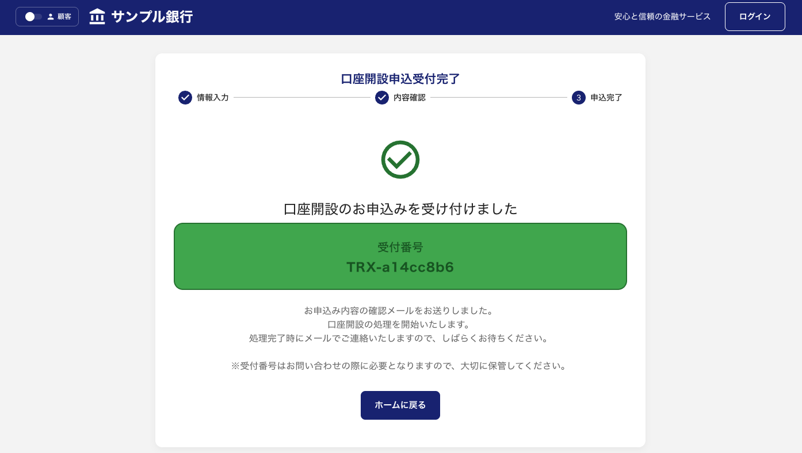
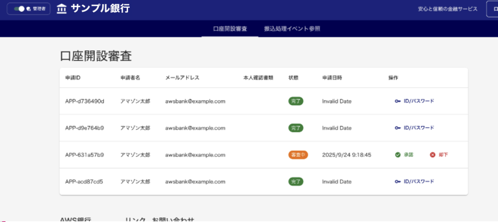

# モバイルバンキングアプリケーション 利用手順書

## 概要

本ドキュメントは、モバイルバンキングアプリケーションのフロントエンド利用手順について説明します。

## 前提条件

- モバイルバンキングアプリケーションがデプロイ済みであること
- 必要な AWS リソースが正常に稼働していること

## 利用手順

### 1. アプリケーションへのアクセス

デプロイが完了すると、以下のように WebsiteUrl が出力されます。

赤枠で囲まれた WebsiteUrl のリンクをクリックして、ブラウザでモバイルバンキングアプリケーションにアクセスしてください。

### 2. 口座開設申込（ユーザ画面）

アプリケーションにアクセスすると、最初に以下の画面が表示されます。

この画面では、既存の口座をお持ちの方はログインを、新規で口座開設をご希望の方は口座開設の申込を行うことができます。口座開設を行う場合は、「口座開設を始める」ボタンを押下してください。

#### 2.1 口座開設申込情報の入力

「口座開設を始める」ボタンを押下すると、以下の口座開設申込画面に遷移します。

この画面では、口座開設に必要な以下の情報を入力してください：

- お名前（姓・名）
- 生年月日
- 住所
- 電話番号
- メールアドレス
- その他必要事項

すべての必要な情報を入力したら、「入力内容を確認する」ボタンを押下してください。

#### 2.2 申込内容の確認

入力内容確認画面では、先ほど入力した情報が正しく表示されます。

入力した内容に間違いがないことを確認してください。修正が必要な場合は「戻る」ボタンで前の画面に戻り、内容を修正できます。内容に問題がなければ、「申込を確定する」ボタンを押下してください。

#### 2.3 口座開設申込完了

申込確定後、以下の受付完了画面が表示されます。

この画面が表示されることで、口座開設の申込が正常に完了したことが確認できます。申込内容は管理者による承認待ちの状態となり、承認後に口座が開設されます。

### 3. 口座開設申請の承認（管理者画面）

口座開設申請の承認を行うため、管理者画面に切り替えます。アプリのホーム画面から操作を開始します。

管理者画面に切り替えるため、画面左上のトグルボタンを押下してください。これにより管理者モードに切り替わります。

#### 3.1 口座開設申請一覧の確認

管理者画面に切り替わると、以下の口座開設審査画面が表示されます。

この画面では、口座開設の申請一覧を確認することができます。承認待ちの申請が表示されており、各申請の詳細情報を確認できます。承認を行う場合は、対象の申請の「承認」ボタンを押下してください。

#### 3.2 承認処理の実行

承認ボタンを押下すると、以下の承認確認画面が表示されます。

この画面では、承認に関するコメントを入力することができます。必要に応じて承認理由や注意事項などのコメントを入力し、「承認する」ボタンを押下してください。

#### 3.3 承認処理中

承認処理を実行すると、以下の処理中画面が表示されます。

システムが承認処理を実行している間、この画面が表示されます。処理が完了するまでお待ちください。

#### 3.4 ID/パスワード発行完了

承認処理が完了すると、以下の画面で ID/パスワードが発行されます。

口座開設が承認され、ユーザー用のログイン ID と初期パスワードが自動生成されます。「ID/パスワード」ボタンを押下して、発行された認証情報を確認してください。

#### 3.5 発行されたログイン情報の確認

ID/パスワードボタンを押下すると、以下の画面で具体的なログイン情報が表示されます。

この画面に表示されたログイン ID と初期パスワードを使用して、ユーザーはアプリケーションにログインすることができます。これらの情報は適切な方法でユーザーに通知してください。

### 4. ログイン（ユーザ画面）

口座開設が承認され、ID/パスワードが発行された後、ユーザーはアプリケーションにログインすることができます。

#### 4.1 ログイン画面への遷移

アプリのトップ画面から「ログイン」ボタンを押下して、ログイン画面に遷移します。

#### 4.2 ログイン情報の入力

以下のログイン画面が表示されます。

前の手順で発行されたログイン ID と初期パスワードを入力し、「ログイン」ボタンを押下してください。

#### 4.3 ダッシュボード画面の表示

ログインが成功すると、以下のダッシュボード画面が表示されます。

この画面では、口座残高や取引履歴などの情報を確認することができます。

#### 4.4 デモユーザーでの体験

口座開設を行わなくても、このアプリケーションではデモユーザーを用意しており、簡単にアプリの機能を体験することができます。

「ユーザー 1」または「ユーザー 2」を選択することで、サンプルデータでアプリケーションの機能を確認できます。

デモユーザーを選択すると、以下のようなサンプルのダッシュボード画面が表示されます。

デモユーザーでは、実際の口座開設プロセスを経ることなく、アプリケーションの各種機能を体験することができます。

### 5. 振込・送金（ユーザ画面）

ログイン後のダッシュボード画面から振込・送金の操作を行います。

#### 5.1 振込・送金機能の開始

ダッシュボード画面で「振込・送金」ボタンを押下します。

画面上の「振込・送金」ボタンを押下して、振込機能を開始してください。

#### 5.2 振込情報の入力

振込・送金ボタンを押下すると、以下の振込・送金画面に遷移します。

この画面では、以下の振込情報を入力してください：

- 振込先口座情報
- 振込金額
- 振込目的・内容
- その他必要事項

すべての必要な情報を入力したら、「確認画面へ」ボタンを押下してください。

#### 5.3 振込内容の確認

入力内容確認画面では、先ほど入力した振込情報が表示されます。

振込先口座、金額、内容などの情報に間違いがないことを確認してください。修正が必要な場合は「戻る」ボタンで前の画面に戻り、内容を修正できます。内容に問題がなければ、「振込を実行」ボタンを押下してください。

#### 5.4 振込完了の確認

振込処理が完了すると、ダッシュボード画面に戻り、取引結果が反映されます。

振込完了後は、以下の内容が更新されます：

- **最近の取引履歴**: 実行した振込取引が履歴に追加表示されます
- **現在の残高**: 振込金額が差し引かれた最新の残高が表示されます

これにより、振込処理が正常に完了したことを確認できます。

### 6. 振込処理イベント参照（管理者画面）

振込処理が完了した後、管理者は取引の詳細な処理フローを確認することができます。この機能により、取引の各ステップでの処理状況を追跡できます。

#### 6.1 Transaction ID の取得

前の手順で振込処理が完了すると、取引履歴に Transaction ID が表示されます。この Transaction ID をコピーしてください。

#### 6.2 管理者画面への切り替え

画面左上のトグルボタンを押下して、管理者画面に切り替えます。

#### 6.3 振込処理イベント参照画面への遷移

管理者画面から「振込処理イベント参照」機能にアクセスします。

#### 6.4 取引 ID による検索

振込処理イベント参照画面で、以下の操作を行います。

1. 取引 ID 入力欄に、先ほどコピーした Transaction ID を貼り付けます
2. 「検索」ボタンを押下します

#### 6.5 処理履歴の確認

検索結果として、該当する取引の詳細な処理履歴が表示されます。この画面では以下の情報を確認できます：

- **取引の各ステップ**: 振込処理の各段階での状況
- **処理時刻**: 各ステップが実行された時刻
- **処理状況**: 各ステップの成功/失敗状況
- **詳細情報**: 各処理での詳細なログ情報

この機能により、管理者は取引処理の透明性を確保し、必要に応じてトラブルシューティングを行うことができます。
