# 金融ワークロードアーキテクチャ解説 [レジリエンス - モダンアーキテクチャ (オンラインバンキング アプリケーション サンプル)]

## 前提条件

- 本リファレンスアーキテクチャは、レジリエンスの観点でマイクロサービスの価値を例示する目的で作成されたものです。
- 従来から、金融システムに関しては[金融ワークロードアーキテクチャ解説 [勘定系]](../reference-arc-core-banking/core-banking-arch-readme.md)にて、勘定系ワークロードのサンプルを提供しています。この中では Saga パターンにおける補正トランザクションを発行する、マイクロサービスなどで一般的な整合性担保のデザインパターンを採用しています。一方で、マイクロサービスなどの分散システムでのデザインパターンは Saga パターン様々あり、本リファレンスアーキテクチャは別のパターンを採用しています。
- 本リファレンスアーキテクチャテクチャは３つに分けて AWS Cloud Development Kit (AWS CDK)によるサンプルテンプレートとして提供しています。このアーキテクチャでは、 Amazon DynamoDB をメインデータストアとして、業務ロジックは AWS Lambda、Lambda のトリガーとして API ホストやイベント起動に Amazon API Gateway、Amazon EventBridge、Amazon SQS、フロントエンドのホスティングに Amazon S3、Amazon CloudFront を採用しています。
- [FISC 安全対策基準 実務基準の対策](fisc-mapping-mobile-banking.md)では３つのテンプレートのうち、バックエンドシステム(online-banking-app-backend)を前提として記載を整理しております。
- 本リファレンスアーキテクチャは Kiro と Amazon Q Developer により開発しています。アーキテクチャ図を元に初期版を作成させたのち、Vibe Coding を中心に修正しています。それによりプログラムに関しては 2~3 週間程で開発が可能となりました。

## ユースケース

モバイルバンキングアプリケーションを題材として、口座開設、残高照会、振込処理の主要機能を各種業務を取り扱うシステムを想定しています。本リファレンスアーキテクチャで示している構成は、高い可用性とスケーラビリティが求められるモダンなマイクロサービスアーキテクチャに基づいており、金融業界に限らず様々な業界のミッションクリティカルなシステムに応用できる汎用的なものとなっています。<br>
本ドキュメントは[リファレンスアーキテクチャの解説](#リファレンスアーキテクチャの解説)と[金融システムにおけるマイクロサービスアーキテクチャのメリット](#金融システムにおけるマイクロサービスアーキテクチャのメリット)の二部構成になっています。マイクロサービスの用語の解説等は後半の金融システムにおけるマイクロサービスアーキテクチャのメリット側をご確認ください。

## リファレンスアーキテクチャの解説

ここからは本リファレンスについて詳細を解説します。

### アーキテクチャの概要

> 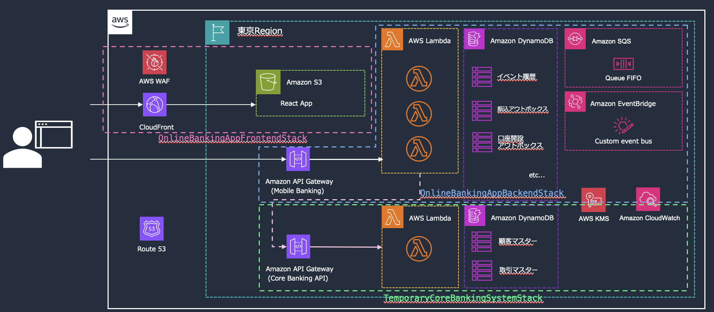

本リファレンスアーキテクチャでは、以下３つのスタックに分けて実装されています。

- **OnlineBankingAppFrontendStack**: React SPA によるフロントエンド
- **OnlineBankingAppBackendStack**: Lambda + DynamoDB によるマイクロサービス群
- **TemporaryCoreBankingSystemStack**: 勘定系システムの API を擬似的に作成したバンキングシステム

ここではマイクロサービスで構成される**OnlineBankingAppBackendStack**について解説します。<br>
フロントエンドの機能、サンプルアプリの使い方に関しては[アプリケーションガイド](guide-mobile-banking-app.md)を参照ください。

### OnlineBankingAppBackendStack

OnlineBankingAppBackendStack は機能単位に Lambda 上に実装されており、データストアは DynamoDB を利用しています。フロントエンドからのリクエストは API Gateway のエンドポイントを呼び出す形になっています。
口座開設、振込の２つの処理は非同期処理として利用者からのリクエストを受け付けたのち、状態変更をイベントを変更履歴（監査証跡）として残す[イベントソーシング](#4-c-イベントソーシング)の形で処理します。勘定系 API を呼び出す際の一貫性を担保するため、トランザクションアウトボックスを採用し、Lambda の内部には再実行の仕組みを組み込んでいます。再実行に関しては AWS Well-Architected フレームワーク 信頼性の柱[REL05-BP03 再試行呼び出しを制御および制限する](https://docs.aws.amazon.com/ja_jp/wellarchitected/latest/reliability-pillar/rel_mitigate_interaction_failure_limit_retries.html)もご参照ください。

#### 提供 API の概要

モバイルバンキング機能

- 口座開設 API (/api/accounts/\*): 口座開設の申込および審査に関連する機能
- 照会サービス API (/api/balance/\*): 口座残高, 取引履歴等データの参照機能
- 振込管理 API (/api/transfer): 振込依頼を受け付ける機能

顧客管理/認証認可

- 認証関連 API (/api/auth/\*): 口座開設後のログインおよび残高照会, 振込等の認可機能
- ユーザー管理 API (/api/users/\*): 口座開設時に受領した顧客情報を管理する機能

銀行管理者機能(アプリ挙動を理解しやすいように最小限実装)

- 管理者 API (/admin/\*): 振込のイベントソーシングの状態遷移を可視化・口座開設の擬似的な承認

#### イベントソーシングをベースにした実装機能の解説

##### 口座開設処理フロー

**実装の解説**

口座開設処理は、イベントソーシングとトランザクションアウトボックスパターンを組み合わせて実装されています。顧客による申込、管理者による承認、システムによる自動処理の 3 段階で構成され、申込情報はイベントストアに永続化され、アウトボックステーブルを経由して外部システムとの連携を行います。処理は非同期で実行され、各ステップの完了後にイベントが発行される仕組みとなっています。

**実装によるメリット**

この設計により、金融システムに求められる厳格な記録管理要件を満たす完全な監査証跡を提供できます。アウトボックスパターンによりデータベース更新とイベント発行の原子性が保証され、システムの整合性を確実に維持します。また、非同期処理アーキテクチャにより外部システム（Core Banking API、認証システム）の障害がフロントエンドに影響せず、優れたユーザー体験を実現できます。外部 API 呼び出し失敗時の自動リトライ機能により信頼性を確保し、イベント駆動設計により、メール通知などの副次的処理を疎結合で実装でき、システム全体の保守性と拡張性が向上します。

**考慮点**

非同期処理による最終的整合性のため、リアルタイムでの状態確認が必要な場合は別途考慮が必要です。また、複数段階の処理における各段階での障害発生時の適切な補償処理の実装と、外部システムとの連携における冪等性の確保が重要となります。

**処理フロー**

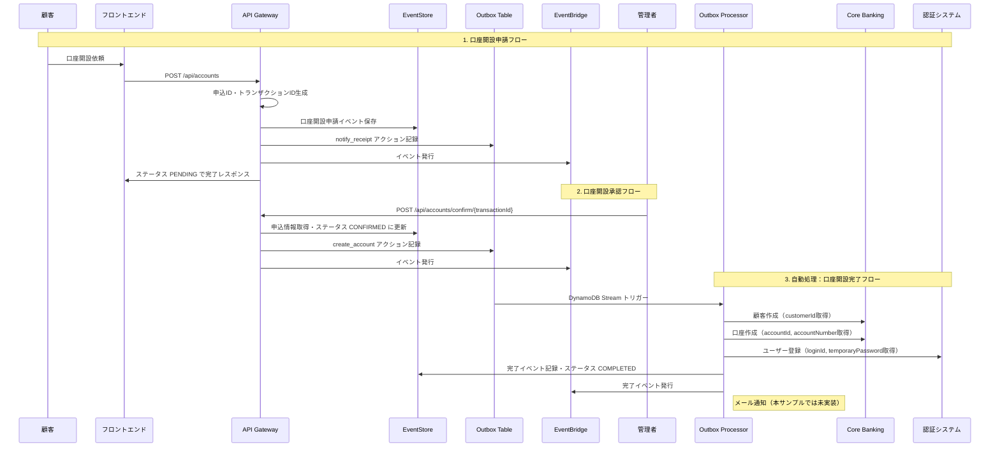

**補足**
本構成では EventBridge を採用することで、イベント発行を通じて非同期の並行処理（ファンアウト）を追加実装できるようになっています。
これにより、AI による本人確認書類の審査本人確認書類の審査,リスクスコアリング,人による審査, 顧客への通知などを並列実行するのが容易になります。

##### 振込処理フロー

**実装の解説**

振込処理は、出金と入金を分離したマイクロサービスアーキテクチャで実装されており、イベントソーシング、イベントドリブンアーキテクチャ、トランザクションアウトボックスパターンを組み合わせた設計です。振込リクエストはイベントストアに記録され、EventBridge を通じてイベントドリブンな処理連携を行います。出金・入金の各処理は SQS キューを通じて非同期実行され、DynamoDB Stream をトリガーとするアウトボックスパターンにより外部システムとの整合性を保証します。

**実装によるメリット**

出金と入金を独立したサービスで処理することで障害の局所化を実現し、一方の処理で問題が発生しても他方への影響を最小限に抑えます。EventBridge と SQS による非同期処理アーキテクチャにより、高負荷時でもシステム全体のスケーラビリティを確保し、安定したサービス提供を可能にします。デッドレターキューの実装により失敗した処理の自動再試行と詳細な監視を行い、冪等性の確保により重複処理を防止してシステムの信頼性を向上させます。イベントソーシングパターンにより振込処理の全工程にわたる完全な状態追跡が可能となり、金融取引に求められる厳格な監査要件と障害時の原因究明を支援します。

**考慮点**

分散処理による複雑性の増加に伴い、出金完了後の入金処理失敗時の補償処理の実装が重要です。また、残高不足や口座凍結などの事前チェック、ネットワーク障害による処理の重複実行に対する冪等性の確保、処理の進行状況をユーザーに適切に通知するための仕組みや、長時間処理が滞留した場合のアラート機能の実装も考慮が必要です。

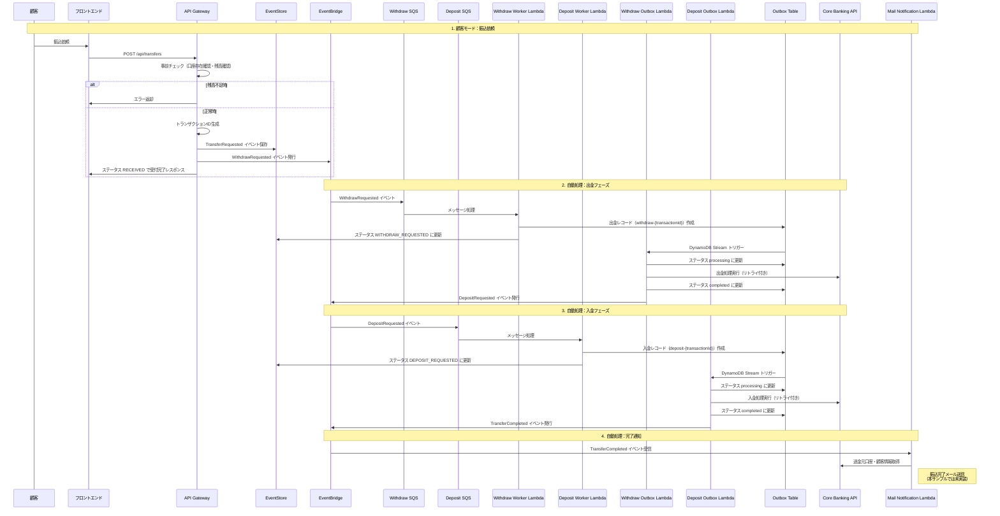

### メール配信基盤に関する注意事項

本リファレンスにおいてはイベント実行する Lambda は準備しておりますが、実際のメール送信処理は疑似的な実装としてログ出力のみを行っています。

メール配信処理のログ出力：

```typescript
// メール配信処理
console.log(
  '📧 メール配信基盤はこのサンプルアーキテクチャの対象外ですが、このLambdaから呼び出す形を想定して設計しています',
);
console.log('📧 実装時は以下のような外部API呼び出しを行います:', {
  recipient: sourceCustomer.email,
  subject: emailData.subject,
  template: 'transfer-completion',
  transactionId: transactionId,
});
```

### マルチリージョン対応の考慮事項

レジリエンスの観点でマルチリージョン化にあたってのポイントを記載します。

#### アプリケーション配信の観点

本リファレンスアーキテクチャではドメイン取得をせずに展開できるようにカスタムドメインを利用せず、AWS 発行の CloudFront のデフォルトドメインを利用しているため、単一リージョンでの CloudFront Distribution による静的コンテンツ配信（S3 + CloudFront + WAF）にて実装されています。<br>
カスタムドメインが使えない前提のままマルチリージョン構成にする場合は、CloudFront Origin Group を活用したオリジンレベルでの冗長化が有効です。具体的には、プライマリリージョン（ap-northeast-1）とセカンダリリージョン（ap-southeast-1）にそれぞれ S3 バケットを配置し、S3 Cross-Region Replication でコンテンツを同期します。その上で CloudFront Distribution の Origin Group 機能を使用して、プライマリオリジンに障害が発生した際（403, 404, 500, 502, 503, 504 エラー）に自動的にセカンダリオリジンにフェイルオーバーする構成とします。この手法により、カスタムドメインを使用せずとも、単一の CloudFront Distribution でマルチリージョンの可用性を実現できます。
API のホスティングに関しても同様に CloudFront を使いオリジンフェイルオーバーにて実現する形になります。

一方、本番システムにおいては独自ドメインを利用する前提となります。Route 53 Application Recovery Controller の利用やフロントエンドの Standby takes over primary(STOP)手法などにより実装可能です。具体的な方法についてはこちらの[Amazon Route 53 を用いたディザスタリカバリ (DR) のメカニズム](https://aws.amazon.com/jp/blogs/news/creating-disaster-recovery-mechanisms-using-amazon-route-53/)もご参照ください。

#### イベント処理の切り替え

口座開設、および振込処理の Lambda はイベントソーシングを前提に実装されてるので、イベント情報の履歴を DynamoDB に書き込む設計となっています。DynamoDB Global Tables の強い整合性を有効化することで、各種イベントのステータスがマルチリージョンに同期されます。リージョン切り替えに当たって不整合が出たデータに関しては、イベント状況に応じて滞留イベントの再実行を行うことが可能です。<br>
再実行にあたり勘定系システムの API を呼び出す設計となっている機能は、アプリケーション画面上は非同期処理の依頼を受け付けた旨表示の上で、実際には勘定系システムのを待って再実行する流れとなります。これにより顧客のアプリケーション体験を損なわない上で実処理を実行することができます。特に口座開設のようなオペレーション上受付と処理、開設に時差のある機能に関しては有効な手法となります。

## 金融システムにおけるマイクロサービスアーキテクチャのメリット

続いて、レジリエンスにおけるマイクロサービスアーキテクチャの利点をおさらいします。

### 1.アーキテクチャ解説における前提

一般的に、マイクロサービスとモノリシックなシステムはしばしば比較され、どちらが優れるか議論されます。
しかしどちらかが明確に優れるものではなく、双方メリット、デメリットが存在します。故に採用にあたっては組織やシステムの特性がどちらを許容できるかを第一に考えるのをお勧めします。このリファレンスアーキテクチャはマイクロサービスをむやみに推奨するものではなく、方法論の例示に主眼をおいてサンプル開発しました。<br>
上記を前提として、本章では主にマイクロサービスの観点を記載します。

### ２. レジリエンスにおけるマイクロサービスの利点

以下の図、左側で示すように、モノリスでは単一のアプリケーションで障害が発生した場合、システム全体が影響を受けてしまい、一部の機能のみに問題があってもサービス全体が停止するリスクがあります。また、負荷が集中した際にはアプリケーション全体をスケールする必要があり、リソースの効率的な利用が困難になる場合があります。<br>
一方、右側で示すようにマイクロサービスでは各サービスが独立して動作するため、一つのサービスで障害が発生しても他のサービスは正常に稼働し続けることができます。これにより障害の影響範囲を局所化でき、システム全体の可用性を向上させることが可能になります。また、負荷の高いサービスのみを個別にスケールアウトできるため、リソースの効率的な活用とコスト最適化を実現できます。

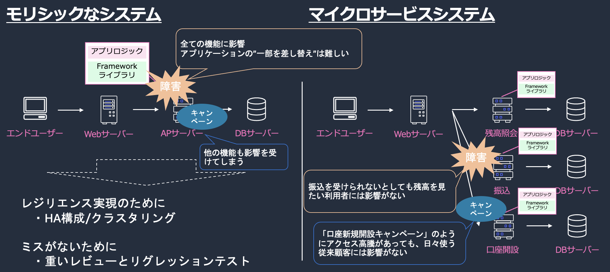

これらの利点は何も実行環境に限ったものではなく、アプリケーションの開発・デプロイにおいても同様です。モノリスなシステムは全資源が差し代わるため、作業ミスのリスクなど避けるため作業を減らすためにリリース日を絞り、資源凍結をおこなったうえで全体のリグレッションテストを行う傾向が強まります。金融機関の多くのシステムはこのような手法を取られています。一方、マイクロサービスに分割し、呼び出されるインターフェイスを定義することで、サービス毎に独立したリグレッション、作業ミスの影響の極小化を行えるため一度のリリース作業の負担を軽減することができます。

### 2. マイクロサービスとモノリシックなシステムの特性の違い

先ほど[1.アーキテクチャ解説における前提](#1.アーキテクチャ解説における前提)でも言及した通り、マイクロサービスには従来のアプリケーション設計の課題に対してメリットも多いですが、逆に難易度が上がる点もあります。その論点でまとめたものか以下の図となります。この図では**結合度**, **柔軟性とアジリティ**, **スケーラビリティ**, **障害の影響範囲**, **アーキテクチャの複雑度**, **データ整合性の担保**を元に記載していますが、従来のモノリスに合わせて設計されたアプリケーションやそれに慣れた開発者の視点では、右下の**アーキテクチャの複雑度**, **データ整合性の担保**に特に課題を感じる人が多いと考えます。

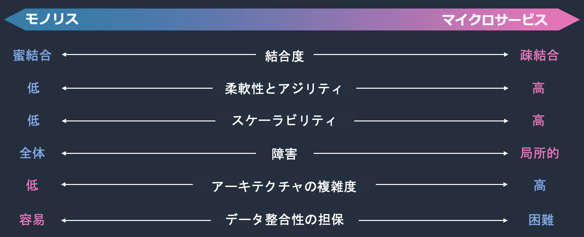

この具体例を一つ紹介します。

#### モノリスとマイクロサービスにおける整合性担保の違い

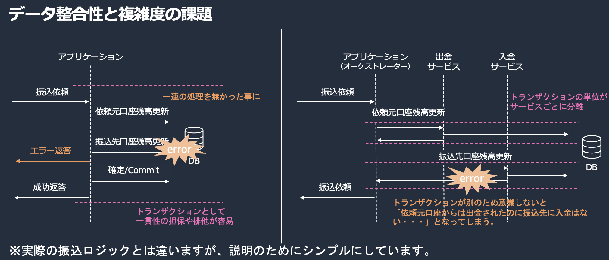

左側の図に示すように、モノリスでは単一のアプリケーションが単一のデータベースに対してトランザクションを実行します。これにより ACID 特性の活用[^1], 出金元口座の残高更新と振込先口座の残高更新を同一トランザクション内で実行し、どちらかが失敗した場合は全体をロールバックできるシンプルな整合性保証, 全ての処理が同期的に実行され、処理完了時点で整合性が保証されるという観点での利点があり、アプリケーションのアーキテクチャ設計をシンプルにします。一方で、マイクロサービスでは右側の図が示すように、複数の独立したサービスとデータベースが関与します。各サービスが独立したデータベースを持つため、従来の ACID トランザクションが使用できない点。また、サービス間通信でネットワーク障害や部分的な失敗が発生する可能性を考慮する必要があります。これらを加味してなおシステムとしての挙動を担保するには即座に全体の整合性を保証するのではなく、最終的に整合性が取れる設計が必要となります。実現の難易度が高く、アーキテクチャの複雑度が増します。これがマイクロサービスにおける整合性/一貫性の課題です。

[^1]**ACID 特性の活用**: データベースの原子性（Atomicity）、一貫性（Consistency）、独立性（Isolation）、永続性（Durability）

この課題を解決するために、以下のようなデザインパターンが重要になります。

### 4. 分散システムにおけるデザインパターン

マイクロサービスをはじめとする分散システムにおいては、複数のサービス間での整合性保証や障害処理が複雑になるため、これらの課題を解決するための確立されたデザインパターンの採用が重要になります。適切なパターンを選択することで、システムの信頼性と保守性を大幅に向上させることができます。詳細については AWS 規範的ガイダンスの[マイクロサービスにおけるデータ永続化の有効化](https://docs.aws.amazon.com/ja_jp/prescriptive-guidance/latest/modernization-data-persistence/welcome.html)もご参照ください。
ここでは、データ永続化において代表的な考え方である、[金融ワークロードアーキテクチャ解説 [勘定系]](../reference-arc-core-banking/core-banking-arch-readme.md)でも採用される Saga パターン[^2]、および本リファレンスで採用するトランザクションアウトボックスパターン、イベントソーシング、CQRS の概念について簡単にご紹介します。

[^2]勘定系での Saga パターン利用範囲
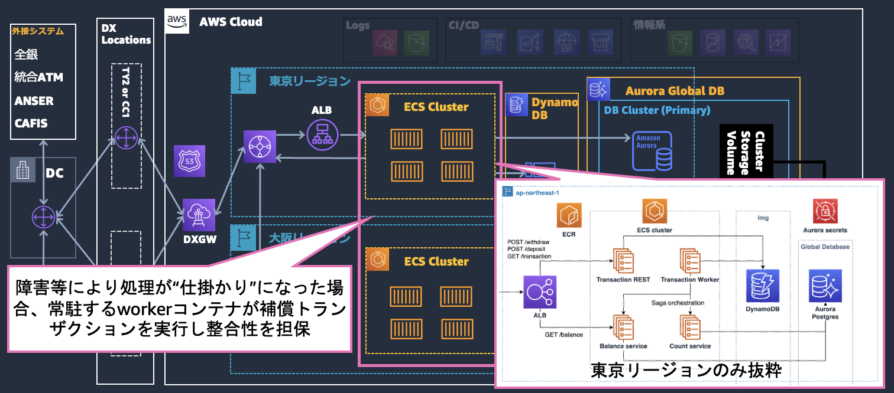

#### 4-a. Saga パターン

Saga パターンは、分散システムにおいて複数のサービス間でのトランザクション整合性を保証するためのデザインパターンです。

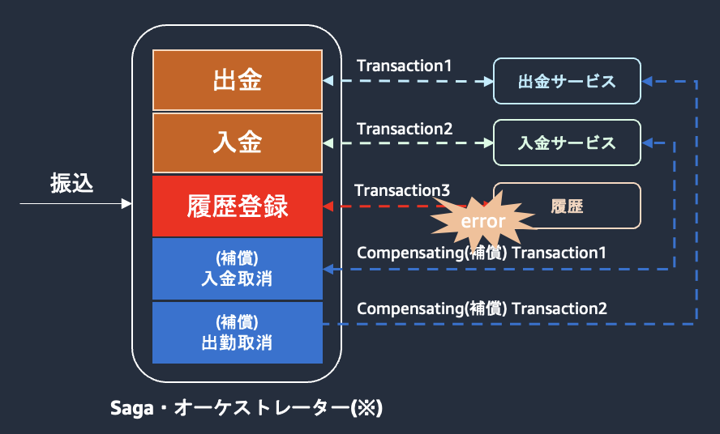

このパターンでは、各ステップで失敗した場合に前のステップを取り消すための補償トランザクションを定義することで、分散環境でも整合性を保証します。実装方式としては、中央制御型のオーケストレーションと分散制御型のコレオグラフィの 2 つのアプローチがあり、システムの要件に応じて選択できます。金融システムにおいては、例えば振込処理で出金から入金への各ステップにおいて、失敗時の補償処理を実装することで、資金の整合性を確実に保つことができます。

#### 4-b. トランザクションアウトボックスパターン

トランザクションアウトボックスパターンは、データベースの更新とメッセージ送信を原子的に実行するためのパターンです。

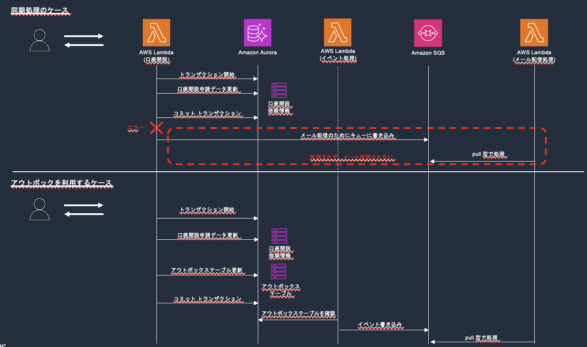

このパターンでは、データベース更新とイベント発行を同一トランザクション内で実行することで原子性を保証します。具体的には、発行すべきイベントを一時的に格納するアウトボックステーブルを用意し、別プロセスがこのテーブルを監視してイベントを外部システムに送信する仕組みです。また、イベント ID による重複排除機能により、同じイベントが複数回処理されることを防ぎ、システムの信頼性を確保します。

#### 4-c. イベントソーシング

イベントソーシングは、アプリケーションの状態変更をイベントの連続として記録するパターンです。

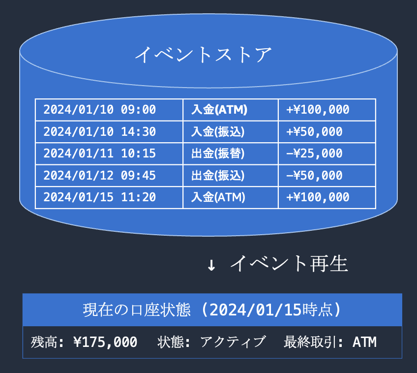

このパターンでは、すべての業務イベントを時系列でイベントストアに永続化し、これらのイベントを順次適用することで現在の状態を復元できます。完全な変更履歴が保持されるため、金融システムに求められる厳格な監査要件を満たすことができ、さらに過去の任意の時点での状態を再現する「時間旅行」機能も実現可能です。また、CQRS パターンとの親和性が高く、イベントストアから読み取り専用ビューを効率的に構築できるため、参照処理のパフォーマンス向上にも寄与します。

#### 4-d. CQRS（Command Query Responsibility Segregation）

CQRS は、コマンド（更新処理）とクエリ（参照処理）の責任を分離するアーキテクチャパターンです。

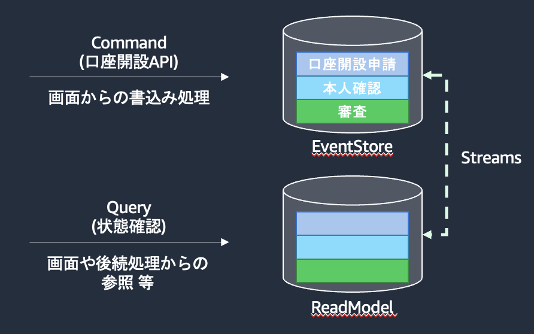

このパターンでは、更新用と参照用で異なるデータモデルとデータストアを使用することで読み書きを分離し、それぞれの処理に最適化された設計を実現します。参照処理に特化したデータ構造により高速な検索が可能になり、読み取り負荷と書き込み負荷を独立してスケールできるため、システム全体のスケーラビリティが向上します。特にイベントソーシングと組み合わせることで、イベントストアから読み取り専用ビューを構築し、複雑な集計処理や分析処理を効率的に実行できるアーキテクチャを構築できます。
