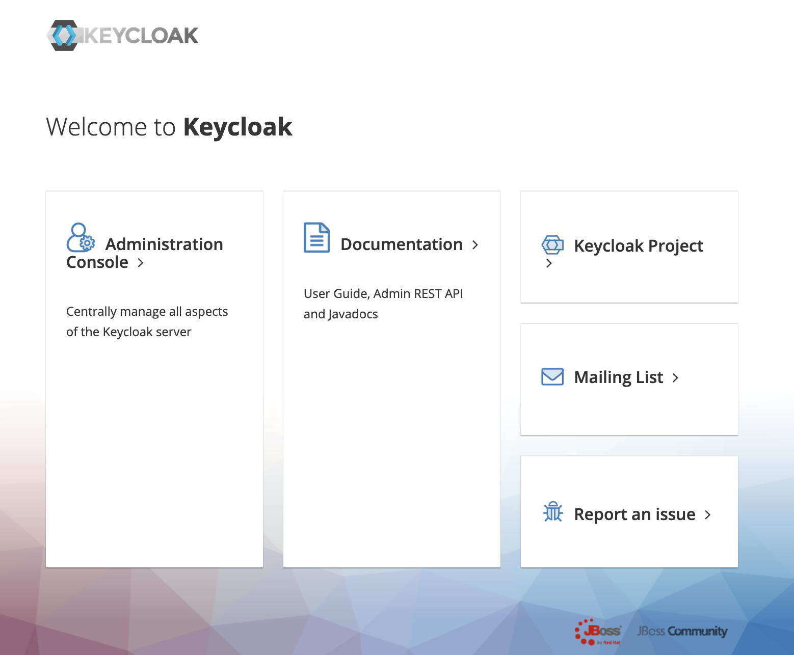

# [OpenAPI] 金融グレード(FAPI) サンプル環境のデプロイ手順

[リポジトリの README に戻る](../../README.md)

ここでは BLEA for FSI のガバナンスベースがデプロイされたアカウントに [OpenAPI] 金融グレード(FAPI) サンプル環境を導入する手順について記述します。

> `MC`はマネジメントコンソールでの作業を、`Local`は手元環境での作業を示します。

## 前提・補足

### 1. [OpenAPI] FAPI サンプル環境について

- FAPI 1.0 に対応した認可サーバー(Authorization Server)を VPC 上に構築する際のアーキテクチャサンプルを提示します。
  - [FAPI (Financial-grade API) 1.0](https://openid.net/2021/03/12/fapi-1-0-part-1-and-part-2-are-now-final-specifications/) は、[OpenID Foundation Financial-grade API (FAPI) ワーキンググループ](https://openid.net/wg/fapi/) が策定する、OAuth2.0 や OpenID Connect 1.0 で規定された内容をベースに、“金融グレード”の、よりセキュアな API 通信を実現するための仕様です。
  - FAPI 自体は金融領域に限定されず、高いセキュリティ基準が必要な API 全般に有効なものとして策定されています。
  - FAPI 1.0 Security Profile では、以下の 2 つが規定されています：
    - [FAPI 1.0 - Baseline Security Profile](https://openid.net/specs/openid-financial-api-part-1-1_0.html)
    - [FAPI 1.0 - Advanced Security Profile](https://openid.net/specs/openid-financial-api-part-2-1_0.html)
- 本 FAPI サンプル環境では、FAPI 1.0 Security Profile に対応した認可サーバーとしてオープンソースソフトウェア(OSS)の[Keycloak](https://www.keycloak.org/)バージョン[16.1.1](https://www.keycloak.org/2022/01/keycloak-1611-released)を利用します。
  - Keycloak は、OpenID FAPI Certification を[取得](https://openid.net/certification/#FAPI_OPs)しています。
    - Keycloak は、FAPI 1.0 Security Profile で規定される 2 種類のプロファイルの両方に対応しています。
  - バージョン 16.1.1 は、DockerHub で公開される Keycloak コンテナイメージのうち、「[jboss/keycloak](https://hub.docker.com/r/jboss/keycloak/)」 の最終バージョンです。
- 本 FAPI サンプル環境には、リソースサーバー(Resource Server)側のアプリケーション(API ならびにその実装)は含まれません。
  - リソースサーバーとしては、Amazon API Gateway の API および そのバックエンド(Lambda 関数など) を利用することが可能です。

> - このドキュメントに、FAPI 1.0 Security Profile ならびに関連仕様の解説は含まれません。
> - FAPI サンプル環境には、アプリケーション(クライアントアプリケーション、リソースサーバーならびに API とその実装)は含まれません。
> - 本サンプル環境では Keycloak を利用していますが、FAPI に対応する認可サーバーは商用プロダクトを含めて複数の選択肢が存在します。

### 2. [OpenAPI] 相互 TLS のサーバー証明書とクライアント証明書について

- FAPI 1.0 Advanced Security Profile のクライアントに紐付けられたトークンの伝送のために、相互 TLS(Mutual TLS, mTLS)を必要とします。
  - クライアントは、FAPI 1.0 仕様に基づいて「トークンの発行をリクエストする対象の認可サーバー」と「トークンを付加してリクエストする対象のリソースサーバー」との通信の両方で同一のクライアント証明書を用いた相互 TLS 通信が必要です。
- その際に用いるサーバー証明書の有効期限を認識し、失効タイミングより前に適切にサーバー証明書とクライアント証明書の双方の更新を行う必要があることに留意が必要です。
- Amazon API Gateway をリソースサーバーとして用いる場合は、以下のドキュメントを参照して下さい。
  - 参考：「[REST API の総合 TLS 認証の設定](https://docs.aws.amazon.com/ja_jp/apigateway/latest/developerguide/rest-api-mutual-tls.html)」
  - 参考：「[HTTP API の相互 TLS 認証の設定](https://docs.aws.amazon.com/ja_jp/apigateway/latest/developerguide/http-api-mutual-tls.html)」
- また、Amazon API Gateway をリソースサーバーとして用いる場合は、以下の点にも留意して下さい。
  - Amazon API Gateway の相互 TLS 認証機能は、クライアント証明書の失効を確認しません。Lambda Authorizer を利用して、検証ロジックを実装する必要があります。
  - Amazon API Gateway の相互 TLS 認証機能は、CRL(Certificate Revocation List, 証明書失効リスト)に対応しません。必要に応じて、Lambda Authorizer を利用して、CRL 対応を実装する必要があります。

## 導入手順

### 1. 事前作業

FAPI サンプル環境のデプロイに当たっては、以下の事前作業が必要です。

#### 1-1. Public な DNS ドメインを取得し、Route 53 Public Hosted Zone を作成する(MC)

（ログインしていない場合）AWS IAM Identity Center（旧 AWS SSO) を使ってゲストアカウントにログインします。

```sh
aws sso login --profile ct-guest-sso
```

有効なドメインを Public Hosted Zone として作成します。

- 例：「fapidemo.example.com」

また、BLEA for FSI には含まれませんが、上記とは別に、リソースサーバー用の別のドメインも利用できる状態にしてください。これは、例えば Amazon API Gateway REST API を利用して、FAPI 1.0 Security Profile で保護されるリソースサーバー(API)が用いるドメインを指します。

- 例：「api.fapidemo.example.com」

#### 1-2. 認可サーバー(keycloak)と、リソースサーバー(Amazon API Gateway)の両方で利用する各種証明書(CA/中間 CA/認可サーバー/リソースサーバー)を作成する(Local)

> 補足：本サンプル環境の導入手順には含まれませんが、Amazon API Gateway で 相互 TLS(Mutual TLS) を実現するサーバー証明書として利用するためには、サーバー証明書を AWS Certification Manager に登録する必要があります。

```bash

## CDKプロジェクト直下の docker_and_certificationディレクトリで作業を開始
$ cd docker_and_certification

## このFAPIサンプル環境のデプロイ手順では、ルートCAとして利用する秘密鍵を生成します。実際の業務上の利用には、PublicなCAから署名されたサーバー証明書を利用します。
## ルートCAとして利用する秘密鍵(例：ca.key)を生成
$  openssl genrsa -out ca.key 4096

Generating RSA private key, 4096 bit long modulus
..............++
........................................................................................................................................................................................................................................++
e is 65537 (0x10001)

## ルートCA証明書(例：ca.crt)を作成
## Subject DN はこの手順では以下を指定
$ openssl req -new -x509 -days 36500 -key ca.key -out ca.crt -subj "/C=JP/ST=Tokyo/O=fapidemo/CN=fapidemo ca"

## クライアント証明書の秘密鍵(例：client.key)を作成
$ openssl genrsa -out client.key 2048

Generating RSA private key, 2048 bit long modulus
....+++
..........+++
e is 65537 (0x10001)

## クライアント証明書のための署名要求(例：client.csr)を作成
$ openssl req -new -key client.key -out client.csr -subj "/C=JP/ST=Tokyo/O=fapidemo/CN=fapidemo client"

## クライアント証明書(例：client.crt)を作成
$ openssl x509 -req -in client.csr -CA ca.crt -CAkey ca.key -set_serial 01 -out client.crt -days 36500 -sha256

Signature ok
subject=/C=JP/ST=Tokyo/O=fapidemo/CN=fapidemo client
Getting CA Private Key

## 中間証明局の秘密鍵(例：inca.key)を作成
$  openssl genrsa -out inca.key 2048

Generating RSA private key, 2048 bit long modulus
...............+++
..........................................................+++
e is 65537 (0x10001)

## 中間証明局の署名要求(例：inca.csr)を作成
$  openssl req -new -key inca.key -out inca.csr -subj "/C=JP/ST=Tokyo/O=fapidemo/CN=fapidemo inca"

## その中間証明局の署名要求にルート証明局の秘密鍵で署名し、中間証明局の証明書(例：inca.crt)を作成
$ openssl x509 -req -in inca.csr -CA ca.crt -CAkey ca.key -set_serial 01 -out inca.crt -days 36500 -sha256

Signature ok
subject=/C=JP/ST=Tokyo/O=fapidemo/CN=fapidemo inca
Getting CA Private Key

## 認可サーバー(Keycloak)が用いるサーバー証明書の秘密鍵(例：authserver.key)を作成
$ openssl genrsa -out authserver.key 2048

Generating RSA private key, 2048 bit long modulus
....+++
.....................................................................................+++
e is 65537 (0x10001)

## 認可サーバー(Keycloak)証明書の署名要求(例：authserver.csr)を作成
## このときの CommonName(CN)は、利用するPublicなドメイン名と一致させる。
$ openssl req -new -key authserver.key -out authserver.csr -subj "/C=JP/ST=Tokyo/O=fapidemo/CN=fapidemo.example.com"

## 認可サーバー証明書の署名要求に中間証明局の秘密鍵で署名し、認可サーバー証明書の証明書(例：authserver.crt)を作成
$ openssl x509 -req -in authserver.csr -CA inca.crt -CAkey inca.key -set_serial 01 -out authserver.crt -days 36500

Signature ok
subject=/C=JP/ST=Tokyo/O=fapidemo/CN=fapidemo.example.com
Getting CA Private Key

## なお、リソースサーバー用証明書もここで実際には作成
## サーバー証明書(Amazon API GatewayのAPIのドメインとして使う。ドメイン名はapi.fapidemo.example.com の秘密鍵を作成)
$ openssl genrsa -out resourceserver.key 2048

## リソースサーバー証明書の署名要求を作成
## なお、このときの CommonName(CN)は、Publicドメイン名と一致させる
$ openssl req -new -key resourceserver.key -out resourceserver.csr -subj "/C=JP/ST=Tokyo/O=fapidemo/CN=api.fapidemo.example.com"

## リソースサーバー証明書に、中間証明局の秘密鍵で署名し、サーバー証明書の証明書(例：resourceserver.crt)を作成
$ openssl x509 -req -in resourceserver.csr -CA inca.crt -CAkey inca.key -set_serial 01 -out resourceserver.crt -days 36500 -sha256

Signature ok
subject=/C=JP/ST=Tokyo/O=fapidemo/CN=api.fapidemo.example.com
Getting CA Private Key

```

#### 1-3. カスタムコンテナイメージのビルド用 Dockerfile を作成する(Local)

カスタムコンテナイメージをビルドするために、docker_and_certification ディレクトリで Dockerfile ファイルを作成します。

- 参考：jboss/keycloak コンテナイメージの仕様として、以下が定められています。
- tls.crt というファイル名：サーバー証明書
- tls.key というファイル名：秘密鍵(プライベートキー)
- 上記を _/etc/x509/https/ ディレクトリ直下に_ 配置している状態にします。
- X509_CA_BUNDLE 環境変数に、値「/etc/x509/https/x509_ca_bundle/ca.crt /etc/x509/https/x509_ca_bundle/inca.crt」をセットします。
  - 半角スペース区切りで、チェーン証明書バンドル(.crt)を全てフルパスで列挙します。

Dockerfile のテキスト内容は下記を利用します(変更する必要はありません)。

```docker
FROM jboss/keycloak:16.1.1
ENV X509_CA_BUNDLE /etc/x509/https/x509_ca_bundle/ca.crt /etc/x509/https/x509_ca_bundle/inca.crt
COPY ./authserver.crt /etc/x509/https/tls.crt
COPY ./authserver.key /etc/x509/https/tls.key
COPY ./ca.crt /etc/x509/https/x509_ca_bundle/ca.crt
COPY ./inca.crt /etc/x509/https/x509_ca_bundle/inca.crt

```

#### 1-4. ECR リポジトリを作成(MC)

管理コンソールで、リージョン ap-northeast-1 に「_fapidemo/keycloak_」という名前で ECR リポジトリを作成します。

#### 1-5. ECR リポジトリを作成(Local)

ECR リポジトリの作成完了後、この後の手順でローカルから docker コマンドを用いてその作成した ECR リポジトリに push できるよう、下記コマンドを実行して ECR リポジトリへのログイン処理を行います。

```bash
$ aws ecr get-login-password | docker login --username AWS --password-stdin <アカウントID>.dkr.ecr.ap-northeast-1.amazonaws.com
```

#### 1-6. カスタムコンテナイメージをビルド(Local)

作成した Dockerfile を利用して Keycloak のカスタムコンテナイメージをビルドします。

> これは、HTTPS 処理のためのサーバー証明書をコンテナイメージに格納するためです。

```bash
## カレントディレクトリの Dockerfileを使ってコンテナイメージをビルドします。
## コンテナイメージ名は「fapidemo/keycloak」とします (CDKプロジェクトのcdk.jsonで、そのコンテナイメージ名がデフォルトとして設定されています)
$ docker build -t fapidemo/keycloak:16.1.1 .

## もし、ローカルPCがM1 MacBookPro環境のDocker CLIを使用している場合は以下のようにbuildxコマンドを利用してください。
$ docker buildx build --platform linux/amd64 -t fapidemo/keycloak:16.1.1 .

## ビルドしたコンテナイメージを確認します。
$  docker images fapidemo/keycloak

REPOSITORY          TAG       IMAGE ID       CREATED         SIZE
fapidemo/keycloak   16.1.1    cadcf9a5bd63   2 minutes ago   759MB

## ECRプライベートリポジトリへのプッシュのためにタグ付けを行います。
$ docker tag fapidemo/keycloak:16.1.1 <アカウントID>.dkr.ecr.ap-northeast-1.amazonaws.com/fapidemo/keycloak:16.1.1
```

#### 1-7. カスタムコンテナイメージを ECR リポジトリへプッシュ(Local)

ECR プライベートリポジトリへプッシュします。

```sh
$ docker push <アカウントID>.dkr.ecr.ap-northeast-1.amazonaws.com/fapidemo/keycloak:16.1.1
```

### 2. FAPI サンプル環境をデプロイする(Local)

ゲストアカウントに IAM Access Identity で認証している状態からのデプロイメントの手順を示します。

#### 2-1. ゲストアプリケーションの Context を設定する

BLEA for FSI と同じ手順で Context を設定します。

ファイル名: usecases/guest-openapi-fapi-sample/bin/parameter.ts

```js
//// Development environment parameters ////
export const DevParameter: StackParameter = {
  envName: 'Development',
  dbUser: 'dbadmin',
  keycloakContainerVersionTag: '16.1.1',
  keycloakContainerImageName: 'fapidemo/keycloak',
  primaryRegion: {
    region: 'ap-northeast-1',
    vpcCidr: '10.110.0.0/16',
  },
};

//// Staging environment parameters ////
export const StageParameter: StackParameter = {
  envName: 'Staging',
  account: '111111111111',
  dbUser: 'dbadmin',
  keycloakContainerVersionTag: '16.1.1',
  keycloakContainerImageName: 'fapidemo/keycloak',
  primaryRegion: {
    region: 'ap-northeast-1',
    vpcCidr: '10.110.0.0/16',
  },
};
```

この設定内容は以下の通りです。

| key                         | value                                          |
| --------------------------- | ---------------------------------------------- |
| envName                     | 環境名。これが各々のリソースタグに設定されます |
| dbUser                      | Aurora MySQL データベースへのログインユーザ名  |
| keycloakContainerImageName  | カスタム Keycloak コンテナイメージ名           |
| keycloakContainerVersionTag | カスタム Keycloak のコンテナバージョンタグ     |
| primaryRegion.region        | デプロイするリージョン                         |
| primaryRegion.vpcCidr       | 作成する VPC の CIDR                           |

#### 2-2. ゲストアプリケーションをデプロイする(Local)

ゲストアカウントで CDK ブートストラップを実行します。(すでに実行済みの場合は不要)

```sh
cd usecases/guest-openapi-fapi-sample
npx cdk bootstrap --profile ct-guest-sso
```

サンプル環境をデプロイします。

```sh
cd usecases/guest-openapi-fapi-sample
npx cdk deploy BLEAFSI-OpenApi-Fapi-primary-Dev --profile ct-guest-sso
```

> `BLEAFSI-OpenApi-Fapi-primary-Dev` はデプロイする開発環境用のスタック名です。環境（開発、ステージング、本番）によってスタック名は異なります。

cdk deploy コマンドが正常に終了し、Outputs に以下が出力されていることを確認します

- Network Load Balancer (NLB)の ホスト名
- AWS Certification Manager の Secrets の ARN

#### 2-3. ゲストアプリケーションの情報を確認する(MC)

デプロイの結果、Secrets Manager に自動生成されたシークレット「KeycloakKCSecret…」で始まる名前のシークレットの詳細画面から、Keycloak 管理者ユーザーのパスワードを取得します

- ユーザー名(username)は「keycloak」で固定です。
- パスワード(password)は **自動生成された値** です。

#### 2-4. NLB のホスト名にアクセスし、 Keycloak 管理画面の HTML が得られることを確認する(Local)

デプロイの結果として得られた NLB ホスト名に対して、以下のような curl コマンドを実行し、404 などのエラー応答ではなく、レスポンスとして HTML テキストが得られることを確認します。

```sh
$ curl --insecure https://BLEA-Keycl-1MHF5NFY5IIV-fef9d6cac6eb154a.elb.ap-northeast-1.amazonaws.com
<!--
  ~ Copyright 2016 Red Hat, Inc. and/or its affiliates
  ~ and other contributors as indicated by the @author tags.
  ~
  ~ Licensed under the Apache License, Version 2.0 (the "License");
  ~ you may not use this file except in compliance with the License.
  ~ You may obtain a copy of the License at
  ~
  ~ http://www.apache.org/licenses/LICENSE-2.0
  ~
  ~ Unless required by applicable law or agreed to in writing, software
  ~ distributed under the License is distributed on an "AS IS" BASIS,
  ~ WITHOUT WARRANTIES OR CONDITIONS OF ANY KIND, either express or implied.
  ~ See the License for the specific language governing permissions and
  ~ limitations under the License.
  -->
<!DOCTYPE html PUBLIC "-//W3C//DTD HTML 4.01 Transitional//EN">

<html>
<head>
    <meta http-equiv="refresh" content="0; url=/auth/" />
    <meta name="robots" content="noindex, nofollow">
    <script type="text/javascript">
        window.location.href = "/auth/"
    </script>
</head>
<body>
    If you are not redirected automatically, follow this <a href='/auth'>link</a>.
</body>
</html>
```

#### 2-5. Public ドメインに、NLB のホスト名に対するエイリアスレコードを作成する(MC)

Route 53 に作成した Public Hosted ドメイン(例：「fapidemo.example.com」)に、エイリアスレコードとして、ap-northeast-1 リージョンにデプロイされた NLB のホスト名を登録します。

#### 2-6. Public ドメイン名にアクセスし、 Keycloak 管理画面の HTML が得られることを確認する(Local)

> Route 53 にエイリアスレコードを登録後、1〜2 分程度待機します。

再び curl コマンドを用いて、今度は Public ドメイン名に対してアクセスし、同じ HTML テキストが得られることを確認します。

- 手順で示した ルート CA・中間 CA 証明書・サーバー証明を自己署名証明書として作成している場合は、--insecure オプション の指定が引き続き必要です。

```sh
$ curl --insecure https://fapidemo.example.com
```

以上で FAPI サンプル環境のデプロイは完了です。

### 補足 1. Keycloak 管理コンソールにログインする

#### Web ブラウザで、エイリアスレコードとして登録した Public ドメイン名にアクセスし、 Keycloak 管理にサインインする

> サーバー証明書に自己署名証明書を使用している場合、Web ブラウザはセキュリティ上の警告を表示します。その場合は、Firefox や Safari など、自己署名証明書を受け入れてアクセス継続可能なブラウザを利用して下さい。

- サインイン画面で、以下を入力してログインします
  - ユーザー名：「keycloak」(固定)
  - パスワード：「`Secrets Manager の Secrets から得たパスワード文字列`」

サインインに成功した場合、以下のような Keyclock のトップページが表示されることを確認します。



> 以降の手順は、Keyclock 自体の設定作業であり個別の設定に基づいて実施します。

### 補足 2. Keycloak の設定：レルムの追加

- レルムの追加
  - レルム(例：「fapi」)を追加します。
    - 初期時点では、「Master」レルムのみが登録されているため、「Add Realm」をクリックして新しいレルムを作成します。

### 補足 3. Keycloak の設定：レルムにクライアントポリシーの追加

- 追加したレルムに「クライアントポリシー」として、必要な FAPI 1.0 Advanced Profile または Baseline Profile を設定します
  - 追加したレルムの「Client Policies」タブをクリックします。
  - デフォルトで「Profiles タブ > Form View タブ」が表示されていることを確認します。
    - この画面で、Keycloak が 「FAPI 1.0 Baseline」「FAPI 1.0 Advanced」「FAPI CIBA」に関するプロファイルが定義されていることを確認できます。
  - Policies タブをクリックし、「Create」をクリックします。
  - 表示画面で、以下のように入力して「Save」をクリックします。
    - Name：「fapi-1-advanced-policy」(実際には任意の名前)
  - Condition セクションで、クライアントプロファイルを適用する条件を設定します。
    - 「Create」をクリックし、以下のような Condition を指定して「Save」をクリックします。
      - Condition Type：「client-updater-context」
      - Update Client Context：「ByAuthenticatedUser」

### 補足 4. Keycloak の設定： レルムにキープロバイダーの追加

> FAPI 1.0 では、ID トークンの署名アロゴリズムに PS256 または ES256 が要求されていますが、Keyclock のレルム初期設定ではこれらの署名アルゴリズムに対応する鍵ペアは設定されていないため、必要な鍵ペアを生成・登録する必要があります。

- 作成したレルムでの「Realm Settings > Keys タブ > Providers タブ」を選択し、「Add keystore...」から _rsa-generated_ をクリックします。
- クリックすると、作成するキーペアの設定項目が表示されるので、Algorithm で「PS256」を選択して「Save」をクリックします。
- Active タブをクリックし、「PS256」の行が追加されていることを確認します。

### 補足 5. Keycloak の設定： fapi-client クライアントの追加

- 以下のクライアントを例として定義します。
  - fapi-client (Access Type: Confidential)
    - このクライアントは、アプリケーションとして、認証を行いトークンを得るために Keycloak にアクセスします。
    - また、リソースサーバーが行うトークン検証に備え、得たトークンをリソースサーバーへのアクセス時に送信します。
- 追加したレルムの「Clients」メニューを選択し、クライアント一覧画面で「Create」をクリックします。
- 以下を入力し、「Save」をクリックして保存します。
  - Client ID：「fapi-client」
  - Client Protocol：「openid-connect」
- Save すると詳細画面が表示されるため、以下を設定して「Save」をクリックします。
  - Access Type : confidential (Public から変更)
  - Valid Redirect URIs：このクライアントアプリケーションがリダイレクトを受け付ける URI を指定します。(適切な URI を指定します)
    - (例：テスト環境でローカル Web アプリケーションを使用する場合は「https://localhost:8082/callback」のような URI を指定します)
  - Implicit Flow Enabled：「ON」
- 「Advanced Settings」セクションで、Proof Key for Code Exchange Code Challenge Method で「S256」を選択します。

### 補足 6. Keycloak の設定： fapi-client クライアントの設定

> Keyclock のデフォルトでは、クライアント認証方法として FAPI 1.0 で定義されている「private_key_jwt」と「tls_client_auth」の 2 つのうち、前者が指定されています。これを、「tls_client_auth」(クライアント TLS=相互 TLS)を利用するように設定を変更します。

- 追加した fapi-client の「Credentials」タブで、以下のように設定します。
  - Client Authenticator：「X509 Certificate」
  - Subject DN：クライアント証明書の DN を指定します。
    - このとき、厳密に「CN=fapidemo client, O=fapidemo, ST=Tokyo, C=JP」のような正規形の Subject DN を指定します。
      - クライアント証明書を作成した openssl コマンドで指定した文字列とは書式が異なることに留意します。
    - テストなどでクライアント証明書の DN を限定しない場合は、正規表現文字列「(.\*?)(?:$)」を指定した上で、「Allow Regex Pattern Comparison」をオンにします。
- 「Roles」タブをクリックし、入力して「Save」をクリックします。
  - Role Name：ロール名(例：「fapi1adv」)
- レルム内に作成したクライアントポリシー「fapi-1-advanced-policy」に、このロールを条件として追加します。
- 「Keys」タブをクリックします。
  - このクライアントが認可サーバーである Keycloak に提示する「JWKS の URI」または「JWKS 文字列」を指定して保存します。
    - JWKS は JSON Web Key Set を意味し、クライアントの公開鍵が含まれます。認可サーバーは、このクライアントの公開鍵を用いてトークンを暗号化し、クライアントに払い出します。

### 補足 5. Keycloak の設定： fapi-resource-server クライアントの追加

- 同様の手順で、Client ID に「fapi-resource-server」を指定したクライアントを追加します。
  - このクライアントは、例えば Amazon API Gateway などを表現します。
  - Resource Server として、Keycloak に対しトークンのイントロスペクションリクエストを行うクライアントを意味します。
- (Access Type: bearer-only)
- リソースサーバーとして、トークンの検証を行うために Keycloak にアクセスします。

- 追加したレルムの「Clients」メニューを選択し、クライアント一覧画面で「Create」をクリックします。
- 以下の設定で、「Save」をクリックして保存します。
  - Client ID：「fapi-resource-server」
  - Client Protocol：「openid-connect」
- Save すると詳細画面が表示されるため、以下を設定して保存します
  - Access Type : bearer-only (Public から変更)
- 「Save」をクリックします。

### 補足 6. Keycloak の設定： fapi-resource-server クライアントの設定

- 追加した fapi-resource-server の「Credentials」タブで、以下のように設定します。
  - Client Authenticator：「X509 Certificate」
  - Subject DN：クライアント証明書の DN を指定します。
    - このとき、厳密に「CN=api.fapidemo.example.com, O=fapidemo, ST=Tokyo, C=JP」のような正規形の DN 文字列を指定します。
      - クライアント証明書を作成した openssl コマンドで指定した文字列とは書式が異なることに留意する必要があります。
      - CN(CommonName)がホスト名に一致していることを確認します。
    - テストなどでクライアント証明書の DN を限定しない場合は正規表現文字列「(.\*?)(?:$)」を指定した上で、「Allow Regex Pattern Comparison」をオンにします。

### 補足 6. Keycloak の設定： リソースオーナーとしてのユーザーを追加

- 追加したレルムの左メニュー「Users」をクリックし、一覧画面の「Add user」をクリックします。
- 以下のような設定を行って「Save」をクリックしテスト用のユーザーを作成します。
  - Username：「任意のユーザー名(例：fapidemo)」
  - Email：適切なメールアドレス
  - First Name：任意の文字列
  - Last Name：任意の文字列
- 追加したユーザー詳細画面の「Credentials」タブをクリックし、Set Password セクションで任意のパスワードを Password & Password Confirmation 欄に入力し、「Set Password」をクリックします。
- 「Role Mappings」タブをクリックし、Client Roles セクションで先の手順で作成したクライアントロール「fapi-client」で、Available Roles に表示される fapi1adv を選択して「Add Selected」をクリックして同ロールにマッピングします。

### 補足 7. Keycloak の設定確認：

- Keycloak は、Configuration エンドポイントに GET リクエストを送信することで、設定情報を得ることができます。以下は fapi レルムの Configuration エンドポイントにリクエストを送信する curl コマンドの例です。

```sh
$ curl --insecure https://fapidemo.example.com/auth/realms/fapi/.well-known/openid-configuration
```

応答として、認証エンドポイント(authorization_endpoint)、トークンエンドポイント(token_endpoint)、イントロスペクションエンドポイント(introspection_endopoint)など、OpenID Connect に定義された各種の情報を確認することができます。

以上で Keycloak の設定は完了です。
