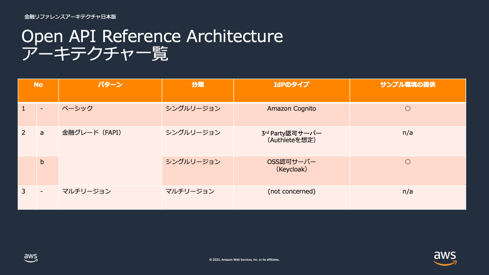
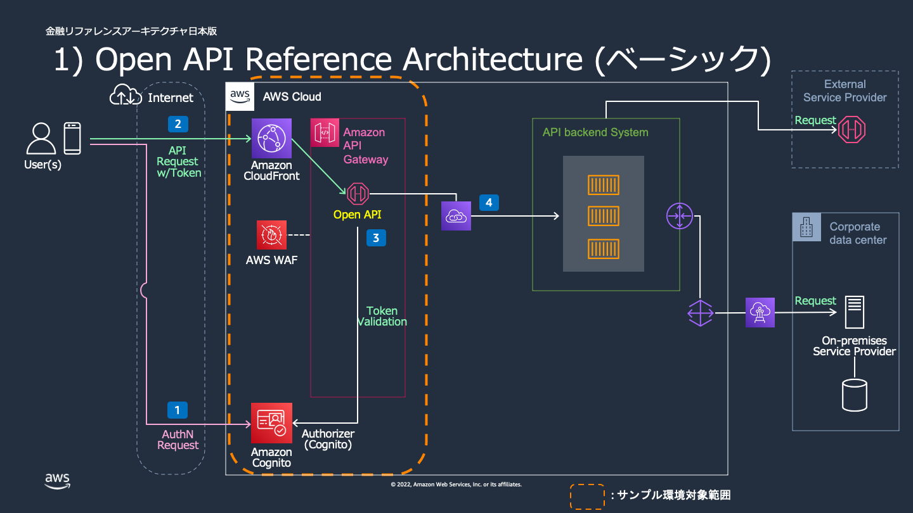
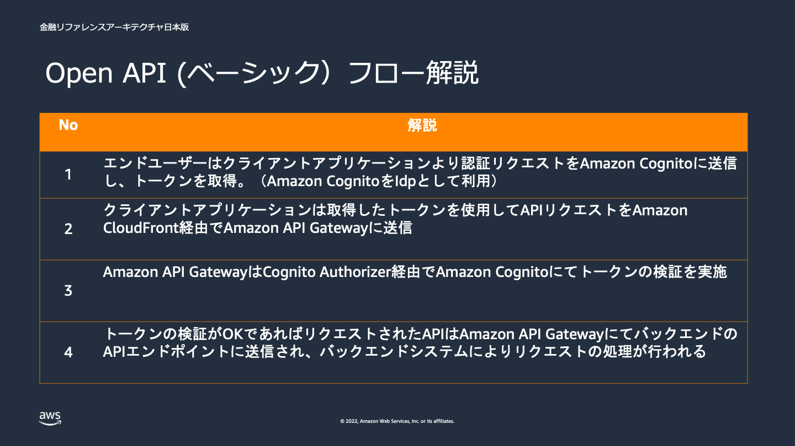
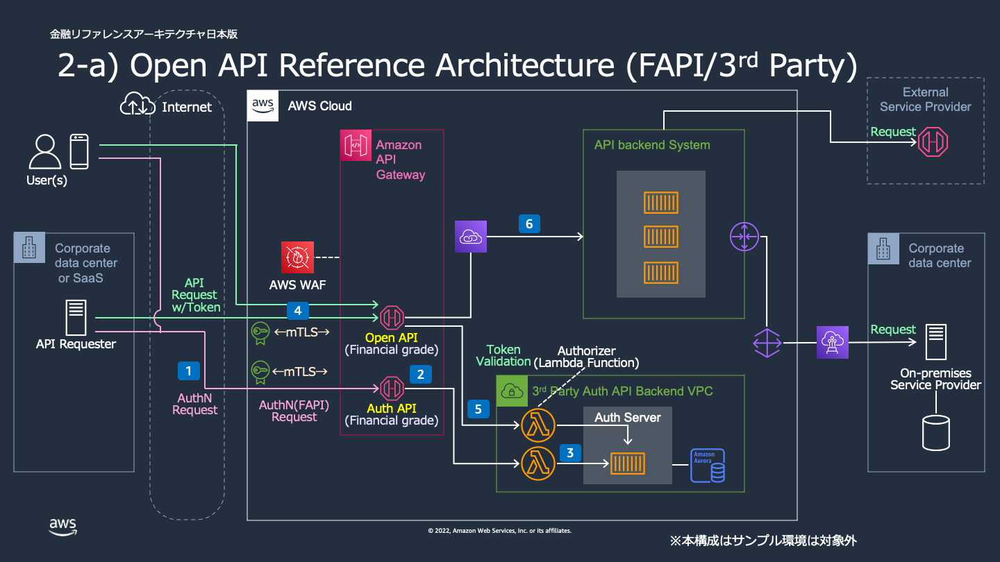
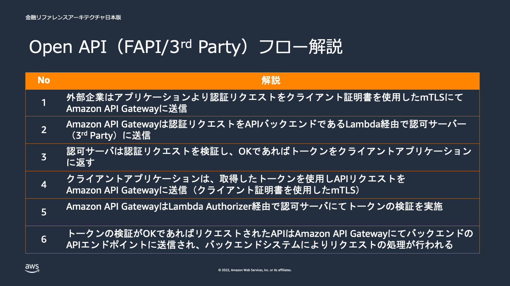
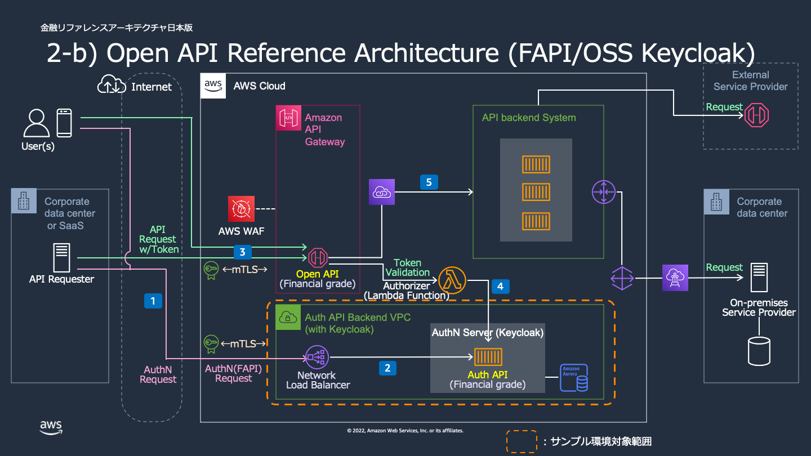
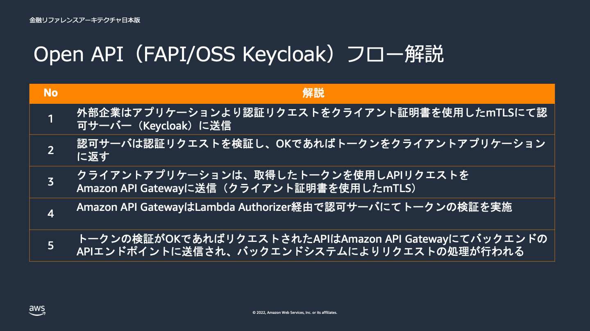
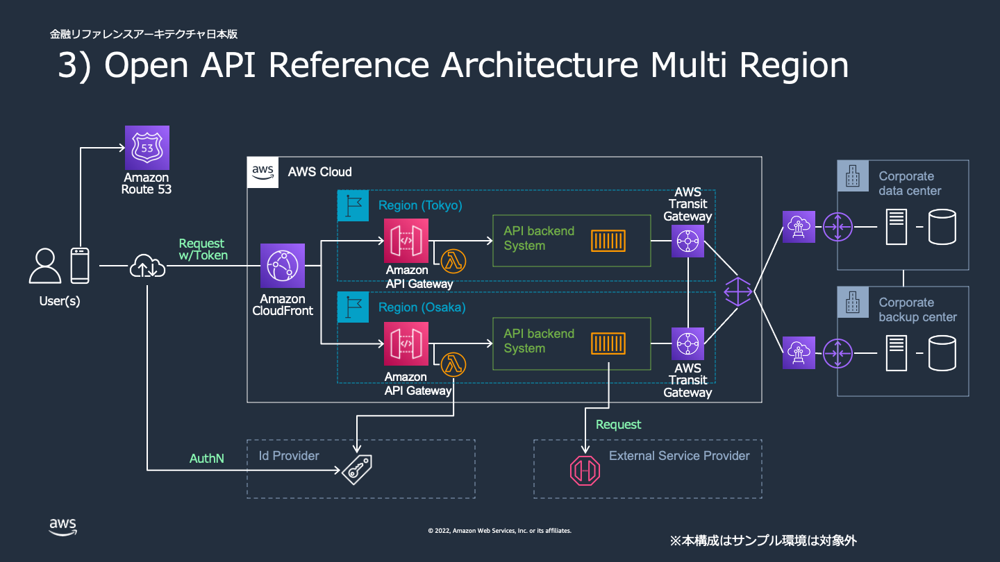

# 金融ワークロードアーキテクチャ解説 [オープン API]

## 前提条件

- 本リファレンスアーキテクチャにおける「オープン API」とは、[全銀協の定義](https://www.fsa.go.jp/singi/singi_kinyu/financial_system/siryou/20161028/02.pdf)に基づき”サードパーティ（外部企業等）からアクセス可能な API”としています。
- 本リファレンスアーキテクチャにて扱う API としては、付与する権限範囲において以下を対象としています。
  - 参照・照会系 API
  - 更新・実行系 API
- 本リファレンスアーキテクチャでは、以下の仕様は必ずしも前提ではないものとします。
  - OpenAPI 仕様のドキュメント規格である Open API Specification (Swagger) で定義されていること
  - 金融グレードアクセスの仕様である Financial grade API (FAPI)に準拠していること
  - ID 認証/認可の仕様である OAuth2, OpenID Connect に準拠していること

## ユースケース

- 金融機関が個人やサードパーティー（外部企業など）に対して、アクセス可能な API を通じて、以下ようなサービスを提供することを想定しています。
  - ベーシック API アクセス
    - 主にエンドユーザからのアクセスを想定
    - 株価・為替相場情報照会、銀行残高照会、ポイント照会など
  - 金融グレード API（FAPI）アクセス
    - 主に Fintech 企業など外部の企業からのアクセスを想定
    - 金融グレードのアクセスが求められるワークロード
    - 株式・投信売買指図、資金移動（振込・振替）など

## アーキテクチャの特徴

- ベーシック API アクセス
  - ユーザ認証としてウェブおよびモバイルアプリの認証、承認、およびユーザー管理機能を提供する Amazon Cognito を、API の作成、公開、保守、モニタリング、保護として Amazon API Gateway などフルマネージドサービスを採用しています。
- 金融グレード API（FAPI）アクセス
  - 金融グレードのアクセスである Financial grade API (FAPI)に準拠するため、ユーザ認証として認可サーバーを、API アクセス時には相互 TLS による認証、暗号化を採用しています。
  - 認可サーバーの提供形態として、以下の２パターンに関するアーキテクチャを提供します。（サンプル環境の提供は OSS のパターンのみ）
    - 3rd パーティー製：Authlete を想定
    - OSS（Open Source Software)：Keycloak
  - 本アーキテクチャは、 FAPI 1.0 仕様の挙動を開発・テスト目的として確認する用途を想定したものとなっています。
- 災害対策
  - 関東広域被災発生時などの災害対策として、マルチリージョン（例. 東京リージョンおよび大阪リージョン）構成を採用しています。OpenAPI の構成が各リージョンごとにそれぞれ配置され、Route53 によりリージョンへリクエストが振り分けられる構成となります。どのようにリクエストを振り分ける、もしくは切り替えるかは API バックエンドシステムのポリシーに依存することになります。（本リファレンスアーキテクチャでは、ID 認証部分はリージョン間での認証情報の同期が必要ない、外部 IdP を利用する構成となっています。）

## アーキテクチャ図

- アーキテクチャ一覧

- ベーシック API アーキテクチャ図

- ベーシック API データフロー

- 金融グレード API(FAPI/3rd Party)アーキテクチャ図

- 金融グレード API(FAPI/3rd Party)データフロー

- 金融グレード API(FAPI/OSS)アーキテクチャ図

- 金融グレード API(FAPI/OSS)データフロー

- マルチリージョン・アーキテクチャ図

