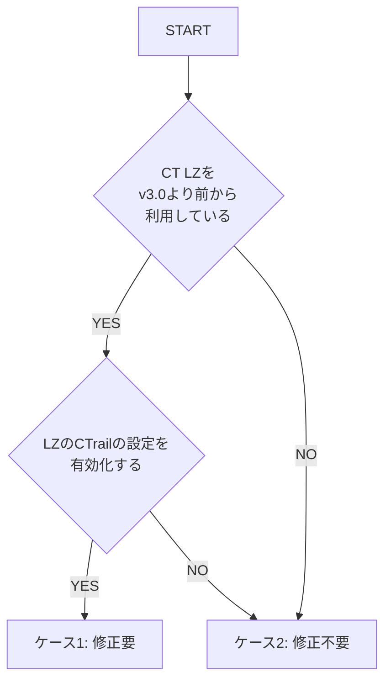

# AWS Control Tower Landing Zone ver3.0 のアップデートに関する注意事項

AWS Control Tower Landing Zone の v3.0 へのバージョンアップに伴い、usecases/base-ct-guest のデプロイ前に、ご自身の環境に合わせて base-ct-guest のソースコードを修正していただく場合があります。

## アップデートによる BLEA への影響

AWS Control Tower Landing Zone ver.3.0 より、CloudTrail の設定を有効化した場合の CloudTrail のログは、管理アカウント の AWS CloudWatch Logs に集約されるようになりました。

- ご参考：https://docs.aws.amazon.com/controltower/latest/userguide/2022-all.html#version-3.0

その結果、これまでゲストアカウント上に存在していた CloudTrail のログが出力される CloudWatch Logs の ロググループが新たに作成されなくなり、base-ct-guest でデプロイされていた AWS CloudTrail のログを監視する通知がデプロイできなくなりました。

## BLEA for FSI の対応方針

BLEA for FSI では、ベースとなった BLEA と同様にゲストアカウントのログ監視はゲストアカウントの管理者が実施すべきと考えるため、これまで AWS Control Tower Landing Zone がアカウントのプロビジョニング時に作成していた AWS CloudTrail 証跡と AWS CloudWatch Logs のリソースを CDK テンプレートによるガバナンスベースのセットアップ時に生成するように修正しました。

ただし、適用する Control Tower Landing Zone のバージョンが 3.0 より前であった場合や、3.0 以降へのアップデート時に CloudTrail の設定を有効にしない場合は、デフォルトの状態では CDK スタック（usecase/base-ct-guest/bleafsi-base-ct-guest.ts）により不要な CloudTrail 証跡ログが作成されてしまうため、ご自身の環境に合わせてソースコードを一部修正することを推奨します。

## ソースコードの修正方法

以下のフローチャートに従い、ご自身の環境に適した`usecase/base-ct-guest/bleafsi-base-ct-guest.ts`のソースコードの修正方針を確認してください。

図中の略語は以下の通りです。

- CT: Control Tower
- LZ: Landing Zone
- CTrail: CloudTrail



### ケース 1: 修正要 ゲストアカウント上で新規のリソースを作成しない

バージョン 3.0 より前の AWS Control Tower landing zone が作成したリソースを利用するため、ゲストアカウント上に新規の CloudTrail 証跡と CloudWatch Logs ロググループ を作成しないように`bleafsi-base-ct-guest.ts`の修正して下さい。

`bleafsi-base-ct-guest.ts`の 7 行目の import 文と、65, 66 行目にあるコードをコメントアウトして、59 行目のコードのコメントを外してください。

```js
//import { TrailStack } from '../lib/bleafsi-trail-stack';
```

[7 行目]

```js
//const trail = new TrailStack(app, `${pjPrefix}-Trail`, { env: getProcEnv() });
//const cloudTrailLogGroupName = trail.cloudTrailLogGroup.logGroupName;
```

[65,66 行目]

```js
const logGroupName = 'aws-controltower/CloudTrailLogs';
```

[59 行目]

### ケース 2: 修正不要 ゲストアカウント上に新規でリソースを作成する

`blea-base-ct-guest.ts`の修正は不要です。bleafsi-trail-stack.ts によりゲストアカウント上に CloudTrail 証跡と CloudWatch Logs ロググループ が作成されます。

## 備考

- AWS Control Tower Landing Zone の ver.3.0 において、一度でも AWS CloudTrail の設定を無効化すると、過去に生成されていた AWS CloudTrail と AWS CloudWatch Logs のリソースは削除されます。
