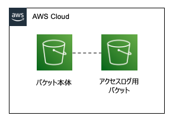

[BLEA for FSI 共通 L3 コンストラクト サンプル集](../README.md) / [Exports](../modules.md) / Bucket

# Class: Bucket

S3 バケットを作成する Construct <br>
See: [CDK v2 aws_s3.encryption](https://docs.aws.amazon.com/cdk/api/v2/docs/aws-cdk-lib.aws_s3.Bucket.html#encryption)

**`Remarks`**



下記設定の 2 つのバケットを作成する

- バケット本体
  - Public アクセスブロック：有効
  - バージョン管理: 有効
  - 暗号化：SSE-S3
  - HTTPS アクセスのみ許可
- アクセスログ用バケット（オプションにより作成しないことも可）
  - Public アクセスブロック：有効
  - バージョン管理: 有効
  - 暗号化：SSE-S3
  - HTTPS アクセスのみ許可
  - オブジェクトの削除は禁止
  - ライフサイクルルール
  - 作成後 90 日後に Gracier に移動
  - 作成後 2555 日（7 年後）に削除

**`Example`**

パラメータは全てデフォルト、暗号化鍵は SSE-S3 を使用

```
 import { Bucket } from '../lib/bleafsi-s3-bucket';

 const bucket = new Bucket(this, 'sampleBucket');

 const s3_bucket = bucket.bucket;  //バケット本体
 const accesslog_bucket = bucket.accessLogbucket; //アクセスログバケット
```

**`Example`**

CDK スタック削除時にバケットを削除、暗号化鍵は SSE-S3 を使用、バケット名指定、アクセスログは作成しない

```
 import { Bucket } from '../lib/bleafsi-s3-bucket';

 const bucket = new Bucket(this, 'sampleBucket', {
   bucketName: `${PjPrefix.toLowerCase()}-xxx-${cdk.Stack.of(this).account}`,
   removalPolicy: cdk.RemovalPolicy.DESTROY,
   createAccessLog: false,
 });
```

**`Example`**

暗号化鍵として KMS SSE-KMS aws managed key を使用

```
 const bucket = new Bucket(this, 'sampleBucket', {
   encryption: s3.BucketEncryption.KMS_MANAGED,
 });
```

**`Example`**

暗号化鍵として KMS SSE-KMS customer managed key を使用

```
 const bucket = new Bucket(this, 'sampleBucket', {
   encryption: s3.BucketEncryption.KMS,
 });
 //生成されたKMS Keyを取得
 const kmskey = bucket.encryptionKey;
```

**`Example`**

暗号化鍵として KMS SSE-KMS customer managed key を使用。明示的に key を指定

```
 const kmskey = new KmsKey(this, 'S3Encryption');
 const bucket = new Bucket(this, 'sampleBucket', {
   encryption: s3.BucketEncryption.KMS,
   encryptionKey: kmskey.key,
 });
```

## Hierarchy

- `Construct`

  ↳ **`Bucket`**

## Table of contents

### Constructors

- [constructor](Bucket.md#constructor)

### Properties

- [accessLogbucket](Bucket.md#accesslogbucket)
- [bucket](Bucket.md#bucket)
- [encryptionKey](Bucket.md#encryptionkey)

### Methods

- [addToResourcePolicy](Bucket.md#addtoresourcepolicy)

## Constructors

### constructor

• **new Bucket**(`scope`, `id`, `props?`)

#### Parameters

| Name     | Type                                          |
| :------- | :-------------------------------------------- |
| `scope`  | `Construct`                                   |
| `id`     | `string`                                      |
| `props?` | [`BucketProps`](../interfaces/BucketProps.md) |

#### Overrides

Construct.constructor

#### Defined in

bleafsi-s3-bucket.ts:182

## Properties

### accessLogbucket

• `Readonly` **accessLogbucket**: `Bucket`

生成したバケット本体に対するアクセスログ用バケット

#### Defined in

bleafsi-s3-bucket.ts:176

---

### bucket

• `Readonly` **bucket**: `Bucket`

生成したバケット本体

#### Defined in

bleafsi-s3-bucket.ts:172

---

### encryptionKey

• `Readonly` **encryptionKey**: `IKey`

バケット本体の暗号化に KMS を使用する場合の暗号化キー

#### Defined in

bleafsi-s3-bucket.ts:180

## Methods

### addToResourcePolicy

▸ **addToResourcePolicy**(`policy`): `void`

バケットにリソースポリシーを追加する

**`Example`**

```
const policy = new iam.PolicyStatement({
  sid: 'AWSBucketDelivery',
  effect: iam.Effect.ALLOW,
  resources: [`${bucket.bucketArn}/ * / *`],
  principals: [
    new iam.ServicePrincipal('cloudtrail.amazonaws.com'),
    new iam.ServicePrincipal('config.amazonaws.com'),
  ],
  actions: ['s3:PutObject'],
  conditions: {
    StringEquals: {
      's3:x-amz-acl': 'bucket-owner-full-control',
    },
  },
});

bucket.addToResourcePolicy(policy);
```

#### Parameters

| Name     | Type              | Description                                                                                                                                              |
| :------- | :---------------- | :------------------------------------------------------------------------------------------------------------------------------------------------------- |
| `policy` | `PolicyStatement` | 追加する IAM ポリシーステートメント See: [aws_iam.PolicyStatement](https://docs.aws.amazon.com/cdk/api/v2/docs/aws-cdk-lib.aws_iam.PolicyStatement.html) |

#### Returns

`void`

#### Defined in

bleafsi-s3-bucket.ts:328
