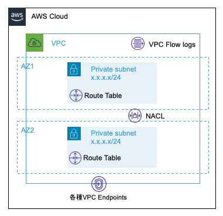

[BLEA for FSI 共通 L3 コンストラクト サンプル集](../README.md) / [Exports](../modules.md) / PrivateVpc

# Class: PrivateVpc

Private Subnet のみの VPC を作成する Construct <br>
See [aws-cdk-lib.aws_ec2.Vpc](https://docs.aws.amazon.com/cdk/api/v2/docs/aws-cdk-lib.aws_ec2.Vpc.html)



**`Remarks`**

下記のリソースを作成する。

- 2 つの AZ に 2 つの Private Subnet
- Subnet の CIDR マスクのデフォルトは /24
- NACL
- VPC FlowLogs（CloudWatch Logs に出力）
- 指定された VPC Endpoints

**`Example`**

vpcEndpoint 付きで Private subnet のみを持つ VPC を作成

```
import { PrivateVpc, VpcEndpointTypeName } from '../lib/bleafsi-vpc';

const vpc = new PrivateVpc(this, 'SampleVpc', {
  vpcIpAddresses: '10.2.0.0/16',
  vpcEndpoints: [VpcEndpointTypeName.CWLogs, VpcEndpointTypeName.DynamoDB],
});
```

## Hierarchy

- `Construct`

  ↳ **`PrivateVpc`**

## Table of contents

### Constructors

- [constructor](PrivateVpc.md#constructor)

### Properties

- [vpc](PrivateVpc.md#vpc)

## Constructors

### constructor

• **new PrivateVpc**(`scope`, `id`, `props?`)

#### Parameters

| Name     | Type                                    |
| :------- | :-------------------------------------- |
| `scope`  | `Construct`                             |
| `id`     | `string`                                |
| `props?` | [`VpcProps`](../interfaces/VpcProps.md) |

#### Overrides

Construct.constructor

#### Defined in

bleafsi-vpc.ts:105

## Properties

### vpc

• `Readonly` **vpc**: `Vpc`

#### Defined in

bleafsi-vpc.ts:104
