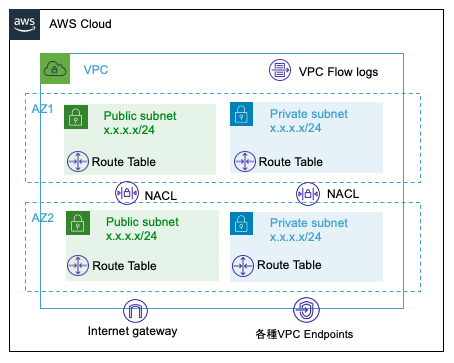

[BLEA for FSI 共通 L3 コンストラクト サンプル集](../README.md) / [Exports](../modules.md) / PublicVpc

# Class: PublicVpc

Public と Private Subnet を持つ VPC を作成する Construct <br>
See: [aws-cdk-lib.aws_ec2.Vpc](https://docs.aws.amazon.com/cdk/api/v2/docs/aws-cdk-lib.aws_ec2.Vpc.html)



**`Remarks`**

下記のリソースを作成する。

- 2 つの AZ に 2 つの Private Subnet と 2 つの Public Subnet
- Subnet の CIDR マスクのデフォルトは /24
- Public Subnet/Private Subnet それぞれに NACL
- VPC FlowLogs（CloudWatch Logs に出力）
- Internet Gateway（Public Subnet に紐付け）
- 指定された VPC Endpoints（Private Subnet に紐付け）

**`Example`**

vpcEndpoint 付きで Public と Private subnet を持つ VPC を作成

```
import { PublicVpc, VpcEndpointTypeName } from '../lib/bleafsi-vpc';

const vpc = new PublicVpc(this, 'SampleVpc', {
  vpcIpAddresses: '10.0.0.0/16',
  vpcEndpoints: [VpcEndpointTypeName.S3_Gateway],
});
```

## Hierarchy

- `Construct`

  ↳ **`PublicVpc`**

## Table of contents

### Constructors

- [constructor](PublicVpc.md#constructor)

### Properties

- [vpc](PublicVpc.md#vpc)

## Constructors

### constructor

• **new PublicVpc**(`scope`, `id`, `props?`)

#### Parameters

| Name     | Type                                    |
| :------- | :-------------------------------------- |
| `scope`  | `Construct`                             |
| `id`     | `string`                                |
| `props?` | [`VpcProps`](../interfaces/VpcProps.md) |

#### Overrides

Construct.constructor

#### Defined in

bleafsi-vpc.ts:173

## Properties

### vpc

• `Readonly` **vpc**: `Vpc`

#### Defined in

bleafsi-vpc.ts:172
