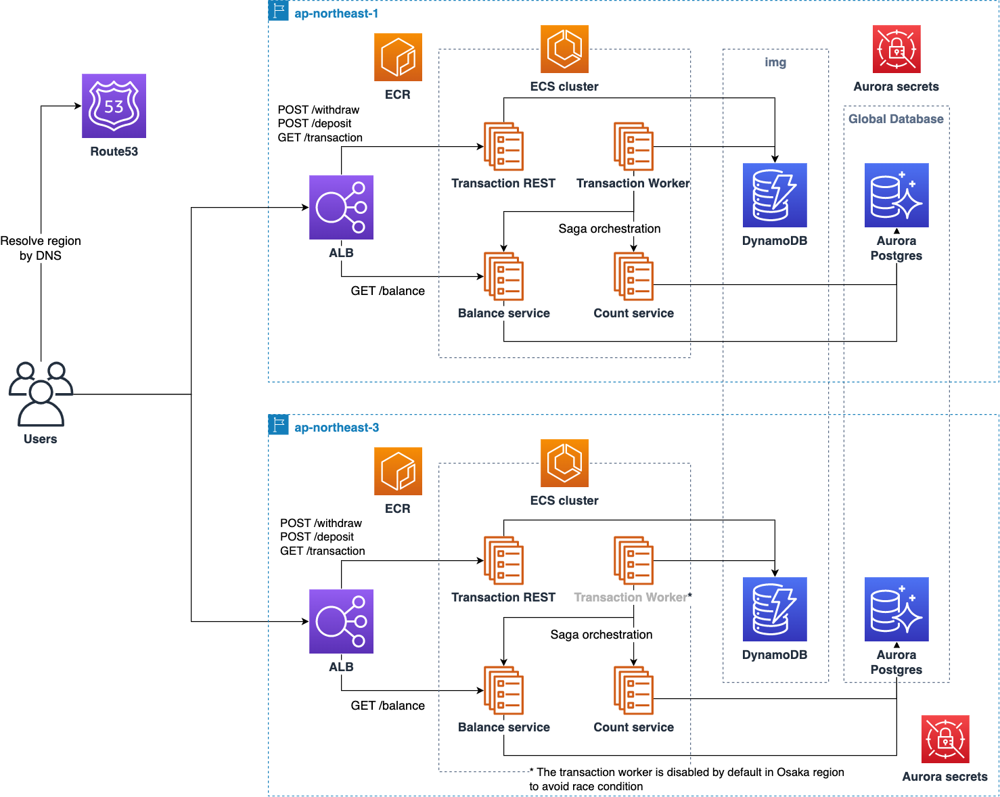
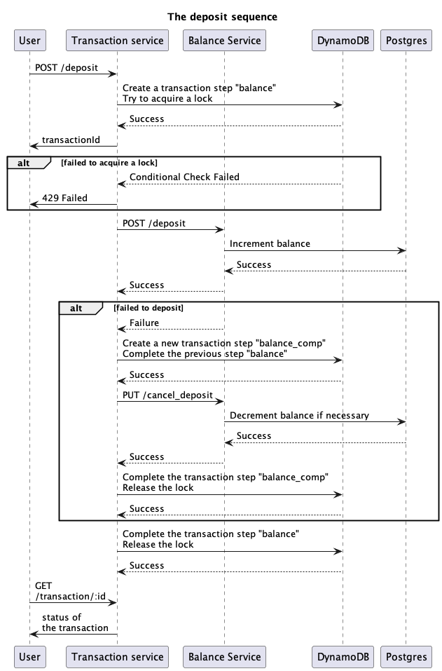
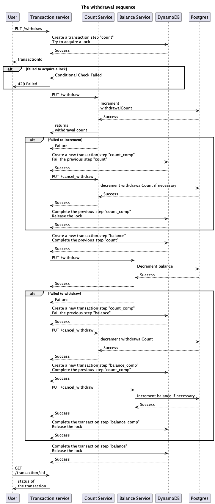

# マルチリージョン対応 マイクロサービス サンプルアプリケーションの解説

## サンプルアプリケーションの特徴

本サンプルアプリケーションは、マルチリージョン環境で稼働するマイクロサービスとして実装されたアプリケーションです。
以下の勘定系機能を提供します。

- 残高参照
- 口座預入れ
- 口座引落し

アプリケーションは下記の 4 つのマイクロサービス(ECS コンテナ)から構成され、Saga パターンによる補償トランザクションの仕組みを実装することで、分散環境でのトランザクションの整合性を保持するように実装されています。

| サービス名  | 機能                                                                           | データベース接続                     |
| ----------- | ------------------------------------------------------------------------------ | ------------------------------------ |
| transaction | トランザクション全体を制御するマイクロサービス                                 | DynamoDB（分散トランザクション管理） |
| balance     | 口座データに対して引落し/預入れ処理を行うマイクロサービス                      | Aurora（PostgreSQL または DSQL）     |
| count       | 口座からの引落し処理の回数を管理するマイクロサービス                           | Aurora（PostgreSQL または DSQL）     |
| worker      | 仕掛かり中でペンディング状態となっているトランザクションを処理する常駐サービス | DynamoDB + HTTP API（balance/count） |

基本的には同一のアプリケーションが東京リージョンと大阪リージョンにデプロイされますが、競合状態になることを割けるため、トランザクションワーカーは東京リージョンのみで稼働します。（以下、Aurora PostgreSQL 前提の記載ですが Aurora DSQL の場合もデータベースの役割やシーケンスは同様です。）

[アプリケーションのアーキテクチャー]

[預入れ処理のシーケンス図]

[引落し処理のシーケンス図]

## API エンドポイント

### Transaction Service

- `POST /transaction/deposit` - 預入れトランザクション開始
- `POST /transaction/withdraw` - 引落しトランザクション開始
- `GET /transaction/{transactionId}` - トランザクション状態照会

### Balance Service

- `GET /balance` - 残高照会
- `PUT /balance/withdraw` - 引落し処理
- `PUT /balance/cancel_withdraw` - 引落しキャンセル（補償トランザクション）
- `PUT /balance/deposit` - 預入れ処理
- `PUT /balance/cancel_deposit` - 預入れキャンセル（補償トランザクション）
- `GET /health` - ヘルスチェック

### Count Service

- `PUT /count/withdraw` - 引落し回数増加
- `PUT /count/cancel_withdraw` - 引落し回数キャンセル（補償トランザクション）
- `GET /health` - ヘルスチェック

**ビジネスロジック**: 引落し回数が 3 回を超えると手数料 100 円が追加されます。

## サンプルアプリケーションのデプロイ

デプロイ手順については以下の文書を参照して下さい。

[マルチリージョン対応 マイクロサービス サンプルアプリケーションのデプロイ手順](./deploy.md)
