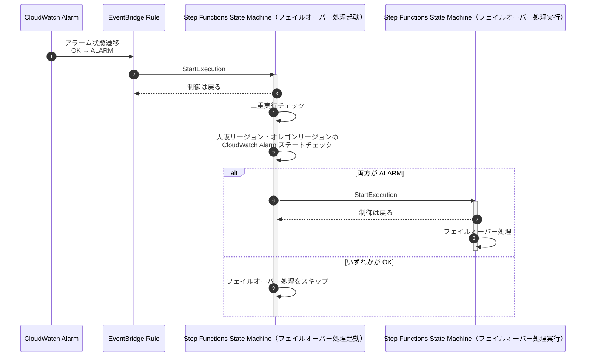

# マルチリージョン対応 マイクロサービス サンプルアプリケーションの自動フェイルオーバーの有効化と動作確認手順

マルチリージョン マイクロサービス・アプリケーションの東京リージョンから大阪リージョンへの自動フェイルオーバーの有効化とその動作確認手順を示します。

## 1. 自動フェイルオーバーの有効化

### 1.1. 自動フェイルオーバーの概要

マルチリージョン マイクロサービス アプリケーションをデプロイすると、セカンダリリージョン（大阪リージョン）と監視リージョン（オレゴンリージョン）にサンプルアプリケーションを監視する CloudWatch Synthetics Canary と その Canary のステータスをチェックする CloudWatch Alarm が作成されます。1 分毎に Canary を実行し、2 回連続で失敗すると CloudWatch Alarm が ALARM 状態へと遷移します。大阪リージョンの CloudWatch Alarm のステートが OK から ALARM に遷移した際に、Amazon EventBridge Rules 経由で フェイルオーバー処理をキックする Step Functions ステートマシンが 起動されます。
デプロイ後は、EventBridge Rule は無効化されており、有効化することで自動フェイルオーバー機能を利用できます。

#### 自動フェイルオーバーの処理フロー



### 1.2. 自動フェイルオーバーの有効化

`BLEAFSI-CoreBanking-failover-Dev` スタックの実行が完了すると、Output に下記の CLI コマンドが表示されます。このコマンドを実行して EventBridge Rule を有効化します。
なお、`enable-rule` の代わりに `disable-rule` とすることで、再度 Rule を無効化できます。

```
Outputs:
BLEAFSI-CoreBanking-failover-Dev.EnablingEventBridgeruleforautofailover = aws events enable-rule --name BLEAFSI-CoreBanking-xxxxx --region ap-northeast-3 --profile ct-guest-sso

```

| Output                                                                  | 説明                                                             |
| ----------------------------------------------------------------------- | ---------------------------------------------------------------- |
| BLEAFSI-CoreBanking-failover-Dev.EnablingEventBridgeruleforautofailover | 自動フェイルオーバーに使用する EventBridge Rule を有効化する CLI |

## 2. 自動フェイルオーバーの動作確認

### 2.1. Locust でサンプルアプリケーションにリクエストを送る

負荷テストツールである [Locust](https://locust.io/) を使用して、ドメイン `api.example.com` にリクエストを送ります（負荷をかけるサンプルアプリケーションについては、[bastion host 経由のサンプルアプリケーションの利用方法](./deploy.md#bastion-host-経由のサンプルアプリケーションの利用方法) を参照）。
別のリクエストを送信している場合は [Stop]ボタンを押して、リクエストを止めます。右上にある[New test]リンクを押すことで、新しい設定でリクエストを送ることができます。

Locust の設定画面で下記を入力します。

| 項目                           | 値                     |
| ------------------------------ | ---------------------- |
| Number of Users(User 数)       | 10                     |
| Spawn rate(秒間当たりの実行数) | 1                      |
| Host                           | http://api.example.com |

[Satrt Swarming]ボタンを押して、Locust で負荷を発生させます。エラーが発生しないことを確認して下さい。

### 2-2. `api.example.com` の IP アドレスから、アプリケーションの稼働リージョンを確認

事前準備として、`api.example.com` の IP アドレスを名前解決し、東京リージョンのアプリケーションが稼働中であることを確認します。
下記のコマンドを実行して SSM セッションマネージャー経由でデモクライアント用 EC2 bastion host にアクセスします。

> コマンドを実行する前に、下記のドキュメントに従って CLI からセッションマネージャー機能を利用するために必要となる Session Manager プラグインのインストールを行って下さい。  
> https://docs.aws.amazon.com/ja_jp/systems-manager/latest/userguide/session-manager-working-with-install-plugin.html

```sh
aws ssm start-session --target <EC2インスタンスID> --region ap-northeast-1 --profile ct-guest-sso
```

> <EC2 インスタンス ID>は確認した bastion host のインスタンス ID に置き換えて下さい 例 i-0xxxx

dig コマンドを実行して、ALB に割り当てられた 2 つの IP アドレスを確認します。

```
dig api.example.com
```

IP アドレスが東京リージョンの CIDR: `10.100.0.0/16` であり、東京リージョンでアプリケーションが稼働していることが確認できます。

結果の例（10.100.5.165 と 10.100.9.84 が割り当てられた IP アドレス）:

```
; <<>> DiG 9.11.4-P2-RedHat-9.11.4-26.P2.amzn2.13 <<>> api.example.com
;; global options: +cmd
;; Got answer:
;; ->>HEADER<<- opcode: QUERY, status: NOERROR, id: 55699
;; flags: qr rd ra; QUERY: 1, ANSWER: 2, AUTHORITY: 0, ADDITIONAL: 1

;; OPT PSEUDOSECTION:
; EDNS: version: 0, flags:; udp: 4096
;; QUESTION SECTION:
;api.example.com.               IN      A

;; ANSWER SECTION:
api.example.com.        60      IN      A       10.100.5.165
api.example.com.        60      IN      A       10.100.9.84

;; Query time: 2 msec
```

### 2-3. ECS Transaction サービスを停止し、東京リージョンから大阪リージョンへ自動切り替え

以下のコマンドを実行して、東京リージョンで稼働する ECS Transaction サービスのタスク数を 0 に設定します。東京リージョンで擬似的にアプリケーションが障害状態となり、大阪リージョンへ自動切り替えが行われます。

#### Transaction サービスのタスク数を 0 に設定

```
CLUSTER_ARN=`aws ecs list-clusters --region ap-northeast-1 |  jq -r '.clusterArns[0]'`
SERVICE_ARN=`aws ecs list-services --cluster $CLUSTER_ARN --region ap-northeast-1 | jq -r '.serviceArns[]' | grep SampleMultiRegionAppTransactionFargateService`
aws ecs update-service --cluster $CLUSTER_ARN --service $SERVICE_ARN --desired-count 0 --region ap-northeast-1
```

マネジメントコンソールから、以下の Step Functions ステートマシンが実行したことを確認できます。

- フェイルオーバー処理をキックする Step Functions ステートマシン（FailoverInitiatorStateMachine で始まる名前のステートマシン）
- フェイルオーバー処理の Step Functions ステートマシン（FailoverStateMachine で始まる名前のステートマシン）

その後、再度 `2-2. ALB の IP アドレスの確認` を実行すると、ALB の IP アドレスが大阪リージョンの CIDR: `10.101.0.0/16` となっており、大阪リージョンへフェイルオーバーしたことが確認できます。

フェイルオーバー後は、以下のコマンドを実行して、東京リージョンで稼働する ECS Transaction サービスのタスク数を 1 に戻します。

#### Transaction サービスのタスク数を 1 に設定

```
CLUSTER_ARN=`aws ecs list-clusters --region ap-northeast-1 |  jq -r '.clusterArns[0]'`
SERVICE_ARN=`aws ecs list-services --cluster $CLUSTER_ARN --region ap-northeast-1 | jq -r '.serviceArns[]' | grep SampleMultiRegionAppTransactionFargateService`
aws ecs update-service --cluster $CLUSTER_ARN --service $SERVICE_ARN --desired-count 1 --region ap-northeast-1
```

### 2-4. Step Functions による東京リージョンへのフェイルバック

`1.2. 自動フェイルオーバーの有効化` の手順を参照し、自動フェールバックを無効化します。

大阪リージョンから東京リージョンへアプリケーションをフェイルバックするためのステートマシンを実行します。

```shell
aws stepfunctions start-execution --state-machine-arn <ステートマシンのARN> --region ap-northeast-3 --profile ct-guest-sso
```

<ステートマシンの ARN>の部分には大阪リージョンの Step Functions にて ”FailbackStateMachine” で始まるステートマシンを見つけてその ARN を使用してください。
