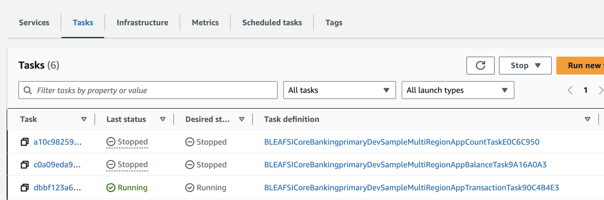
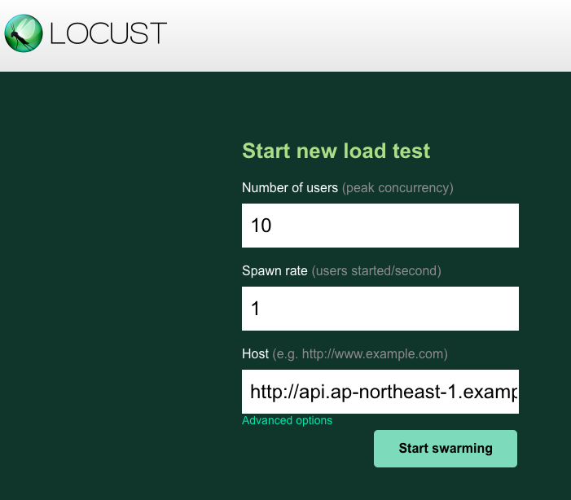
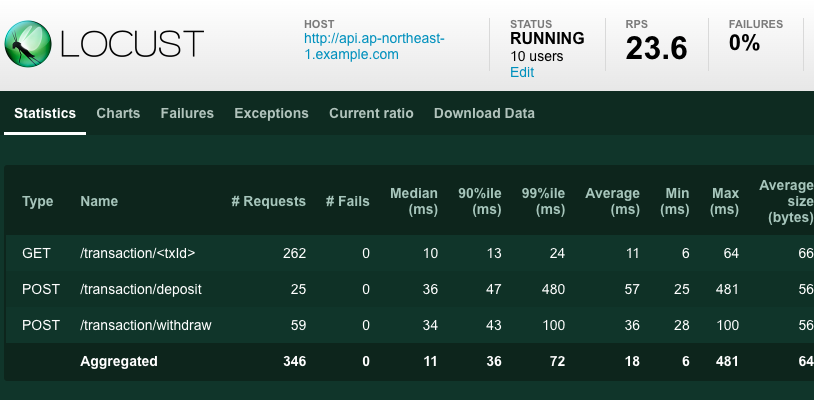
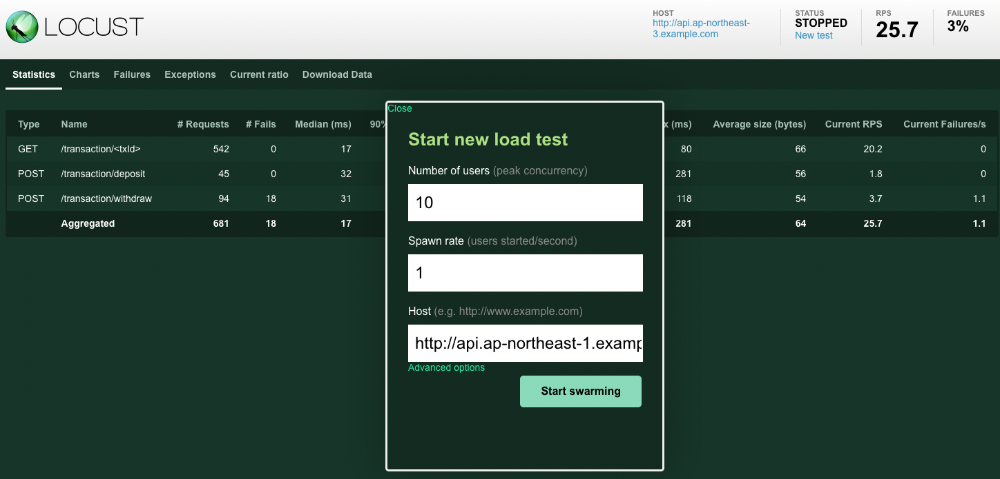

# マルチリージョン対応 マイクロサービス サンプルアプリケーションのデプロイ手順

勘定系ワークロード と サンプルアプリケーションをゲストアカウントにデプロイする手順について説明します。

## 勘定系ワークロードのデプロイ

勘定系ワークロードのデプロイ手順については下記を参照して下さい。

[勘定系ワークロード サンプルコードのデプロイ](../../../doc/reference-arc-core-banking/deploy-core-banking-sample.md)

## サンプルアプリケーションのデプロイ

primary stack のデプロイ完了後に表示される 下記情報を確認して下さい。

| #   | 表示名                                                                          | 用途                                                                        |
| --- | ------------------------------------------------------------------------------- | --------------------------------------------------------------------------- |
| 1   | BLEAFSI-CoreBanking-primary-Dev.SampleAppClientInstanceBastionHostIdXxx         | サンプルアプリが提供するクライアント実行用の bastion host のインスタンス ID |
| 2   | BLEAFSI-CoreBanking-primary-Dev.SampleMultiRegionAppBalanceMigrationCommandxxxx | Balance マイクロサービス初期化用の ECR タスクを実行するコマンド             |
| 3   | BLEAFSI-CoreBanking-primary-Dev.SampleMultiRegionAppCountMigrationCommandxxxx   | Count マイクロサービス初期化用の ECR タスクを実行するコマンド               |
| 4   | BLEAFSI-CoreBanking-primary-XX.SampleMultiRegionAppParamTableNameXxx            | デモアプリケーションが使用する DynamoDB のテーブル名                        |

```
 ✅  BLEAFSI-CoreBanking-primary-Dev

Outputs:
BLEAFSI-CoreBanking-primary-Dev.SampleAppClientInstanceBastionHostIdXxx = i-0XXXX
BLEAFSI-CoreBanking-primary-Dev.SampleMultiRegionAppBalanceMigrationCommand6ADC0CF6 = aws ecs run-task ...
BLEAFSI-CoreBanking-primary-Dev.SampleMultiRegionAppCountMigrationCommand03F10102 = aws ecs run-task ...
BLEAFSI-CoreBanking-primary-Dev.SampleMultiRegionAppParamTableNameXxx = BLEAFSI-CoreBanking-xxxx
```

Aurora Postgres にアプリケーションが必要とするデータベースとテーブルを作成します。上記のスタック出力に表示されている AWS CLI コマンド 2 つを実行してください:

```sh
#2 BLEAFSI-CoreBanking-primary-Dev.SampleMultiRegionAppBalanceMigrationCommandxxx を実行
aws ecs run-task ...
#3 BLEAFSI-CoreBanking-primary-Dev.SampleMultiRegionAppCountMigrationCommand0xxx を実行
aws ecs run-task ...
```

これらのタスクは通常 1 分程度で完了します。各タスクの進行状況は、 [ECS のマネジメントコンソール](https://console.aws.amazon.com/ecs/v2/clusters)から確認できます。

[確認手順]

- 管理コンソールで Amazon ECS サービスにアクセス（東京リージョン）
- 作成済みの ECS クラスタ （BLEAFSI-CoreBanking-primary-xxx）を開く
- [タスク] タブを選択
- フィルタで "すべてのタスク"を選択して全タスクを表示させる
- 下記のタスク定義のタスクの Status が"Stopped"になっている事を確認
  - BLEAFSICoreBankingprimaryDevSampleMultiRegionAppCountTaskXxxx
  - BLEAFSICoreBankingprimaryDevSampleMultiRegionAppBalanceTaskXxxxx



次に、デモアプリケーションの稼働に必要な DynamoDB テーブルのレコードを作成します。このデータは東京リージョンで worker サービスを起動するために必要です。

```sh
#東京リージョン
aws dynamodb put-item --region ap-northeast-1 --table-name <TableName> --item '{ "PK": { "S": "stopFlag" }, "value": { "S": "false" } }' --profile ct-guest-sso
#大阪リージョン
aws dynamodb put-item --region ap-northeast-3 --table-name <TableName> --item '{ "PK": { "S": "stopFlag" }, "value": { "S": "true" } }' --profile ct-guest-sso
```

`<TableName>`には確認した 東京リージョンと大阪リージョンの DynamoDB のテーブル名に置き換えて下さい

## bastion host 経由のサンプルアプリケーションの利用方法

bastion host にアクセスし、負荷テストツールである [Locust](https://locust.io/)を使用して、勘定系サンプルアプリケーションに負荷をかける手順を説明します。

1. EC2 bastion host での Locust サーバーの立ち上げ

   コマンドプロンプト環境を立ち上げ、下記のコマンドを実行して SSM セッションマネージャー経由でデモクライアント用 EC2 bastion host にアクセスします。

   > コマンドを実行する前に、下記のドキュメントに従って CLI からセッションマネージャー機能を利用するために必要となる Session Manager プラグインのインストールを行って下さい。  
   > https://docs.aws.amazon.com/ja_jp/systems-manager/latest/userguide/session-manager-working-with-install-plugin.html

```sh
aws ssm start-session --target <EC2インスタンスID> --profile ct-guest-sso
```

> <EC2 インスタンス ID>は確認した bastion host のインスタンス ID に置き換えて下さい 例 i-0xxxx

アプリケーションに負荷をかけるために、[Locust](https://locust.io/)サーバーを起動します。

```sh
sudo su ec2-user
cd ~    # move to /home/ec2-user
./pull.sh   # pull required files from S3
cd client
docker build -t client .
docker run --name client -d --restart unless-stopped -p 8089:8089 client
```

もし `The container name "/client" is already in use` という旨のメッセージが表示された場合は、以下のコマンドで既存のコンテナを削除した後、再度 `docker run` を実行してください。

```sh
docker stop client
docker rm client
docker run --name client -d --restart unless-stopped -p 8089:8089 client
```

`exit' を 2 回入力して、SSM リモートセッションを閉じます。

2. Locust GUI にアクセス

   SSM セッションマネージャーのポートフォワーディング機能を使用して、ローカル PC の 8089 ポートを EC2 Bastion host の 8089 ポートにフォワードします。

```sh
aws ssm start-session\
    --target <EC2 インスタンス ID>\
    --document-name AWS-StartPortForwardingSessionToRemoteHost \
    --parameters '{"host": ["localhost"], "portNumber":["8089"], "localPortNumber":["8089"]}'
```

> <EC2 インスタンス ID>は確認した bastion host のインスタンス ID に置き換えて下さい 例 i-0xxxx

ブラウザで `http://localhost:8089` を開くことで、Locust GUI にアクセスできるようになります。

3. Locust でサンプルアプリケーションにリクエストを送る

Locust の初期画面で下記を入力します。

| 項目                           | 値                                    |
| ------------------------------ | ------------------------------------- |
| Number of Users(User 数)       | 10                                    |
| Spawn rate(秒間当たりの実行数) | 1                                     |
| Host                           | http://api.ap-northeast-1.example.com |



[Satrt Swarming]ボタンを押して、Locust で負荷を発生させます。エラーが発生しないことを確認して下さい。



> Locust の利用方法については [こちら](./README.md#locust-の利用方法)を参照下さい。

4. (オプション) REST API を直接送信する

サンプルアプリケーションの稼働を確認するために、直接 REST API を送信してみます。
ローカル端末から下記のコマンドを実行して、EC2 bastion host にリモート接続します。

```sh
aws ssm start-session --target <EC2インスタンスID> --profile ct-guest-sso
```

> <EC2 インスタンス ID>は確認した bastion host のインスタンス ID に置き換えて下さい 例 i-0xxxx

下記の REST リクエストを実行して、正常に処理されることを確認して下さい。

```shell
# deposit
curl -X POST \
 'http://api.ap-northeast-1.example.com/transaction/deposit' \
  --header 'X_ACCOUNT_ID: 1231221' \
  --header 'Content-Type: application/json' \
  --data-raw '{
     "quantity": 1000
  }'

# withdraw
curl -X POST \
 'http://api.ap-northeast-1.example.com/transaction/withdraw' \
  --header 'X_ACCOUNT_ID: 1231221' \
  --header 'Content-Type: application/json' \
  --data-raw '{
   "quantity": 100
  }'

# get balance
curl -X GET \
 'http://api.ap-northeast-1.example.com/balance' \
 --header 'X_ACCOUNT_ID: 1231221'

```

## サンプルアプリケーションをフェイルオーバーさせる

本アプリケーションを東京リージョンから大阪リージョンにフェイルオーバーする手順については[こちら](./failover-sample-application.md)を参照して下さい。

## Locust の利用方法

ユーザー数、spawn レート、ターゲットホストを入力して、Locust で負荷テストを開始することができます。



サンプルアプリケーション用の ALB には下記の URL からアクセスできます（末尾に `/`を入力しないこと）

- `http://api.ap-northeast-1.example.com` (東京)
- `http://api.ap-northeast-3.example.com` (大阪)

### リクエストタイムアウトの変更

```sh
cd /home/ec2-user/client
vim locustfile.py
# change TIMEOUT_SECONDS = 3 to any float value

# terminate the client
docker rm -f client

# rebuild and restart the client
docker build -t client .
docker run --name client -d --restart unless-stopped -p 8089:8089 client
```

## ローカル環境での実行

本サンプルアプリケーション用のコンテナサービスをローカル環境で立ち上げるための手順です。

```sh
cd services
# run docker-compose
docker compose build
docker compose up

# run each service on your host machine
cd balance # or client, transaction
npm run start
# npm run worker for transaction worker

# run locust
cd ../client
docker build -t client .
docker run -p 8089:8089 client
# open http://localhost:8089
```
