# マルチリージョン対応 マイクロサービス サンプルアプリケーションのフェイルオーバー手順

マルチリージョン マイクロサービス・アプリケーションを東京リージョンから大阪リージョンにフェイルオーバーさせるための手順について解説します。

## 0. Route53 Application Recovery Controller のための事前準備

AWS 管理コンソール上で Route53 Application Recovery Controller（以後 ARC）にアクセスして、以下の作業を実施します。

- 最初に `クラスタ` を作成する

  - 名前: ARC-CoreBanking
  - グローバルに展開される５つのエンドポイントが作成される。切り替えの時にはこのいずれかのエンドポイントを使用することができる。

  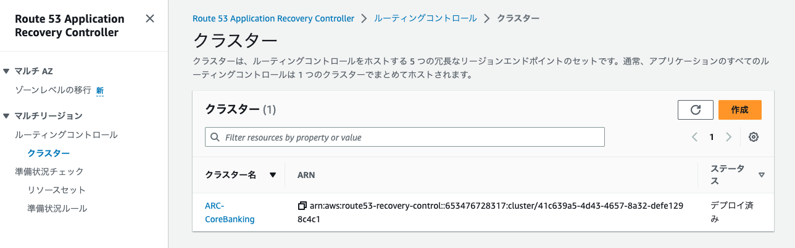

- ルーティングコントロール を 2 つ作成する（東京リージョンと大阪リージョン用)

  - クラスタ
    - クラスタ名: `ARC-CoreBanking`
  - コントロールパネル
    - 既存のコントロールパネルに追加
    - コントロールパネル名: `DefaultControlPanel`
  - 東京リージョン用
    - 名前: rc-tokyo
    - ルーティングコントロールの状態: オン
  - 大阪リージョン用
    - 名前: rc-osaka
    - ルーティングコントロールの状態: オフ

  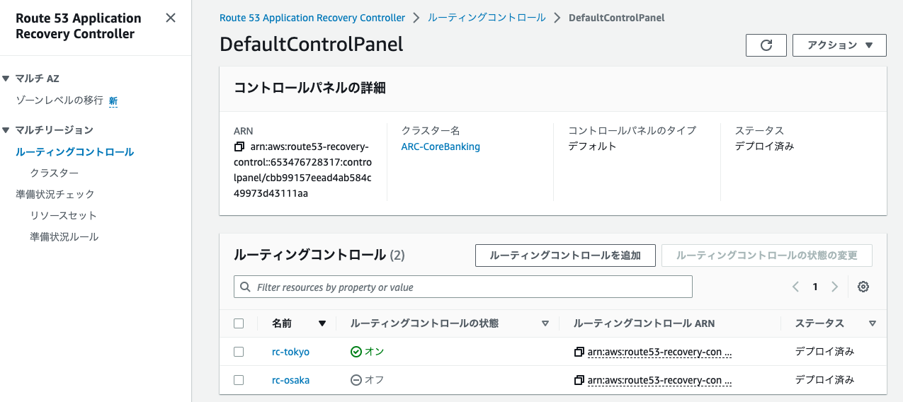

- 各 ルーティングコントロール に対して ヘルスチェック を作成する（東京リージョンと大阪リージョン用)

  - `ルーティング制御がオフの場合、ヘルスチェックは正常です。` はチェックしない
  - 東京リージョン用
    - 名前: hc-tokyo
  - 大阪リージョン用
    - 名前: hc-osaka

  > ヘルスチェック は ルーティングコントロール の詳細画面から作成できます

  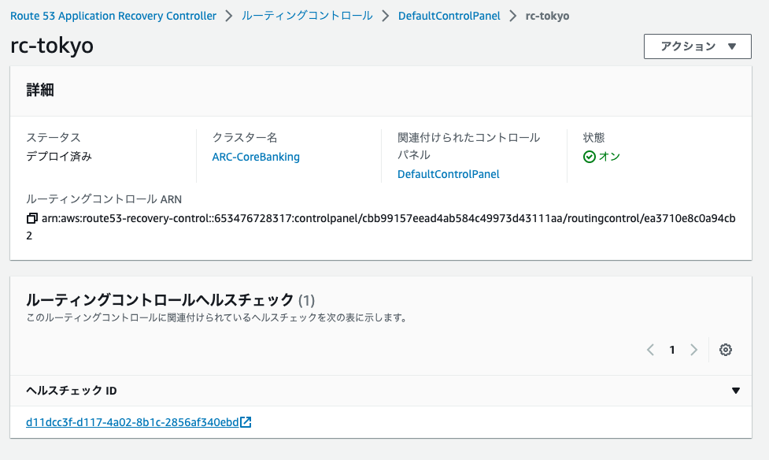

- Route 53 プライベートホストゾーン に各リージョンの ALB 向けのエイリアスを作成する

  - 対象 プライベート ホストゾーン: example.com
  - 東京リージョン用

    - レコード名: api
    - レコードタイプ: A (Alias)
    - トラフィックのルーティング先: 作成済みの東京リージョンの ALB インスタンス
    - ルーティングポリシー: フェイルオーバー
    - フェイルオーバーレコードタイプ: プライマリ
    - ヘルスチェック ID: 事前に作成済みの東京リージョン向けの ヘルスチェック
    - レコード ID: tokyo

    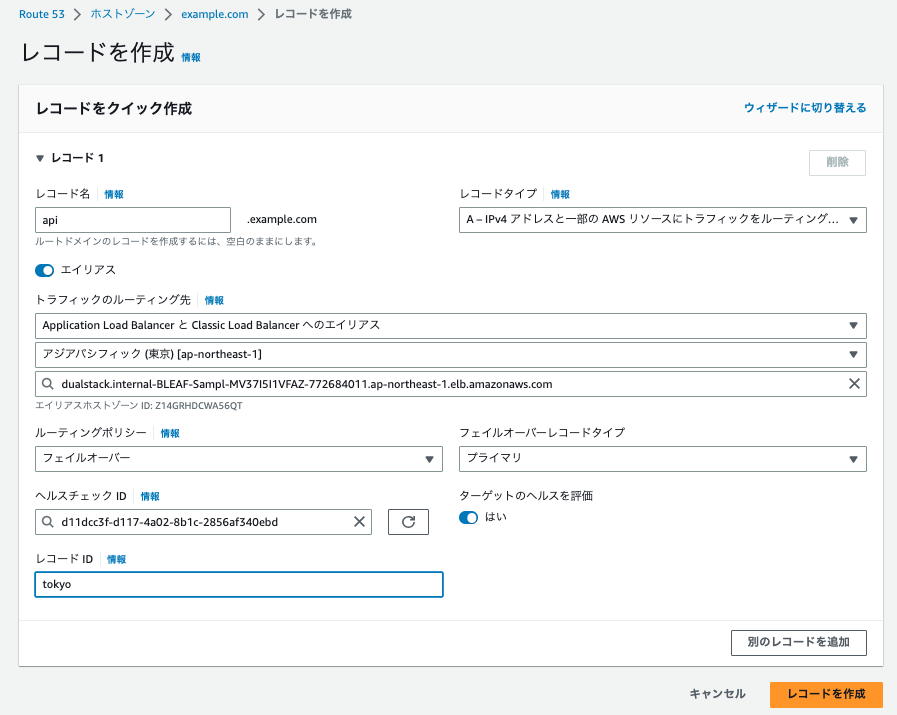

  - 大阪リージョン用

    - レコード名: api
    - レコードタイプ: A (Alias)
    - トラフィックのルーティング先: 作成済みの大阪リージョンの ALB インスタンス
    - ルーティングポリシー: フェイルオーバー
    - フェイルオーバーレコードタイプ: セカンダリ
    - ヘルスチェック ID: 事前に作成済みの大阪リージョン向けの ヘルスチェック
    - レコード ID: osaka

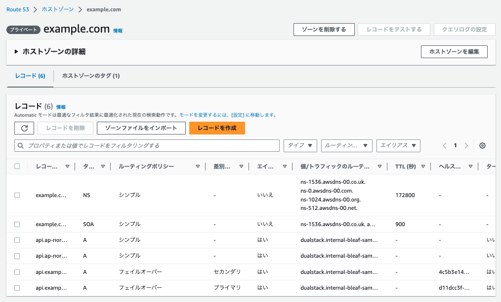

## 1. Locust でサンプルアプリケーションにリクエストを送る

ドメイン `api.example.com` をターゲットに Locust でリクエストを送ります。
別のリクエストを送信している場合は [Stop]ボタンを押して、リクエストを止めます。右上にある[New test]リンクを押すことで、新しい設定でリクエストを送ることができます。

Locust の設定画面で下記を入力します。

| 項目                           | 値                     |
| ------------------------------ | ---------------------- |
| Number of Users(User 数)       | 10                     |
| Spawn rate(秒間当たりの実行数) | 1                      |
| Host                           | http://api.example.com |


[Satrt Swarming]ボタンを押して、Locust で負荷を発生させます。エラーが発生しないことを確認して下さい。

## 2． 疑似障害発生と検知

### 2-1. ALB の IP アドレスの確認

事前準備として、東京リージョンの ALB に割り当てられた IP アドレスを確認します。
下記のコマンドを実行して SSM セッションマネージャー経由でデモクライアント用 EC2 bastion host にアクセスします。

> コマンドを実行する前に、下記のドキュメントに従って CLI からセッションマネージャー機能を利用するために必要となる Session Manager プラグインのインストールを行って下さい。  
> https://docs.aws.amazon.com/ja_jp/systems-manager/latest/userguide/session-manager-working-with-install-plugin.html

```sh
aws ssm start-session --target <EC2インスタンスID> --profile ct-guest-sso
```

> <EC2 インスタンス ID>は確認した bastion host のインスタンス ID に置き換えて下さい 例 i-0xxxx

dig コマンドを実行して、ALB に割り当てられた 2 つの IP アドレスを確認します。

```
dig api.example.com
```

結果の例（10.100.5.165 と 10.100.9.84 が割り当てられた IP アドレス）:

```
; <<>> DiG 9.11.4-P2-RedHat-9.11.4-26.P2.amzn2.13 <<>> api.example.com
;; global options: +cmd
;; Got answer:
;; ->>HEADER<<- opcode: QUERY, status: NOERROR, id: 55699
;; flags: qr rd ra; QUERY: 1, ANSWER: 2, AUTHORITY: 0, ADDITIONAL: 1

;; OPT PSEUDOSECTION:
; EDNS: version: 0, flags:; udp: 4096
;; QUESTION SECTION:
;api.example.com.               IN      A

;; ANSWER SECTION:
api.example.com.        60      IN      A       10.100.5.165
api.example.com.        60      IN      A       10.100.9.84

;; Query time: 2 msec
```

### 2-2. AWS Fault Injection Simulator(FIS) による疑似障害の注入

オンプレミスから東京リージョンへのネットワーク全経路上での断続的なパケットロス発生を想定した疑似障害を FIS で注入します。
ここでは、FIS アクション`AWSFIS-Run-Network-Packet-Loss-Sources`を使用して Trx シミュレータの EC2 にてパケットロスを発生させます。

[手順]

- マネジメントコンソールから東京リージョンの FIS にアクセス

  - `実験テンプレート`を作成

    - 説明: 東京リージョンでパケットロスを発生
    - 名前：exp-packetloss
    - アクション

      - 名前: Run-Network-Packet-Loss
      - アクションタイプ: SSM aws:ssm:send-command
      - ターゲット: Instances-Target-1
      - Document ARN: arn:aws:ssm:ap-northeast-1::document/AWSFIS-Run-Network-Packet-Loss-Sources
      - Document Parameters:

      ```
      {"LossPercent":"30", "Sources":"<手順2−1で確認したIPアドレス>", "TrafficType":"ingress", "DurationSeconds":"1800", "InstallDependencies":"True"}
      ```

      > Document Parameter に指定する <手順 2−1 で確認した IP アドレス>は、カンマ区切りで 2 つ記載して下さい。
      > 例 10.100.10.112,10.100.5.212

      - Duration: 30 分

    - ターゲット
      - `Instance-Target-1` で Target Method を指定
        - リソースタイプ: aws:ec2:instance
        - リソース ID として BastionHost を選択
    - 停止条件
      - ブランク（指定しない）
    - サービスアクセス
      - `実験テンプレート用の新しいロールを作成する `を選択

  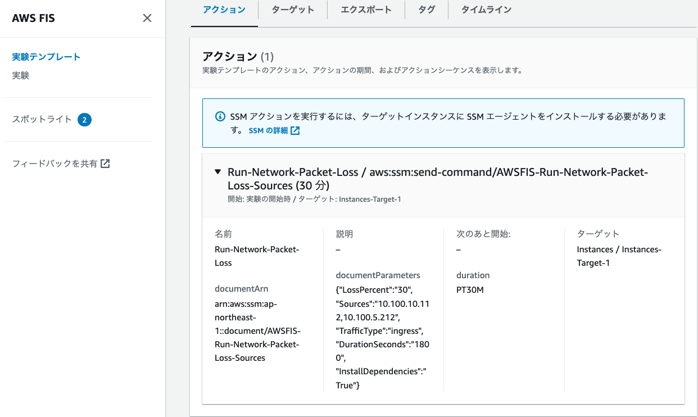

- [実験を開始] をクリックして`実験`を開始する

- Locust(負荷ツール）の画面をチェックして、レスポンスタイムやエラーカウントの上昇などから注入したパケットロスによりネットワーク接続が不安定になっていることを確認する。

  > FIS の SSM パラメータでのパケットロス率（今回は 30%で指定）や Locust からのリクエスト数を増やすことで、障害の影響を大きくすることができます。

  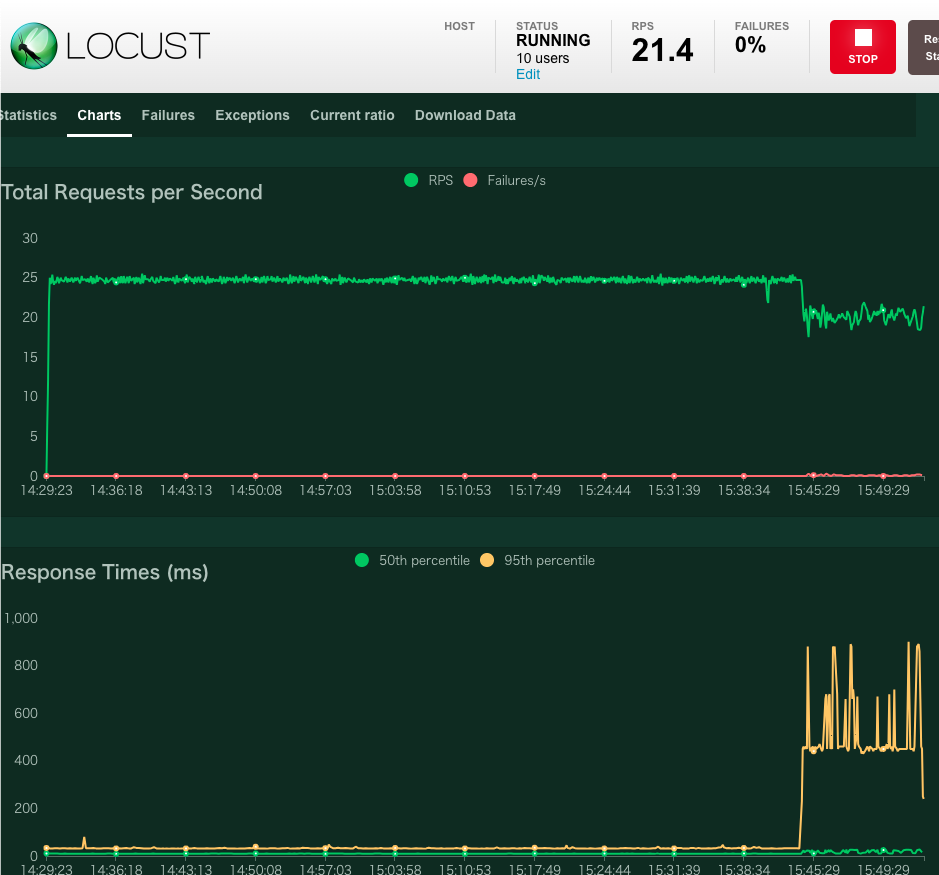

## 3． 東京リージョンのアプリケーションの閉塞

アプリケーションおよび DB のリージョン切り替えに先立ち、アプリケーションを閉塞（クライアントからのリクエストをつけ付けない状態）させます。

[手順]

- 東京リージョンの DynamoDB でアプリケーション閉塞フラグを立てる

  ```shell
  aws dynamodb put-item --region ap-northeast-1 --table-name [table-name] --item '{ "PK": { "S": "stopFlag" }, "value": { "S": "true" } }' --profile ct-guest-sso
  ```

  > `[table-mame]`は確認した 東京リージョンの DynamoDB のテーブル名に置き換えて下さい

- 負荷ツールのチャートおよび Failure の統計にてトランザクションが 100%失敗することを確認（503 がカウントアップされます）

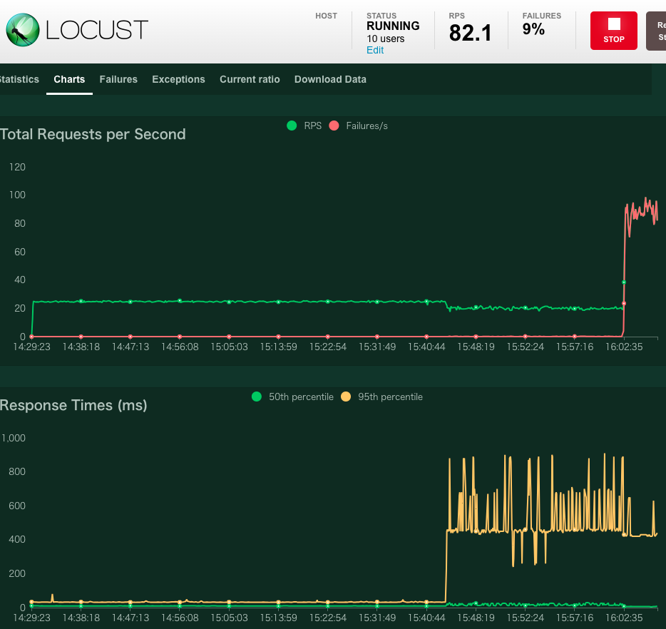

## 4．Aurora のリージョンフェイルオーバー

Aurora のプライマリクラスタを東京から大阪へ切り替えます。

`Planned Failover` または `Unplanned Failover` のいずれかの切り替えを選んで実行して下さい。`Unplanned Failover` の切り戻し方法が不明な場合は `Planned Failover` を選択される事を推奨します。

### [Planned Failover 手順]

- Aurora の Planned Failover を実施し、Aurora グローバルクラスタを東京リージョンから大阪リージョンへ切り替えます  
  （参考：[Amazon Aurora Global Database のフェイルオーバーを使用する](https://docs.aws.amazon.com/ja_jp/AmazonRDS/latest/AuroraUserGuide/aurora-global-database-disaster-recovery.html)）

  - 管理コンソールから Amazon RDS にアクセス
  - [データベース]を選択して、[core-banking-global-db]（Aurora Global DB）を選択
  - [アクション]から[グローバルデータベースをフェイルオーバー]を選択

    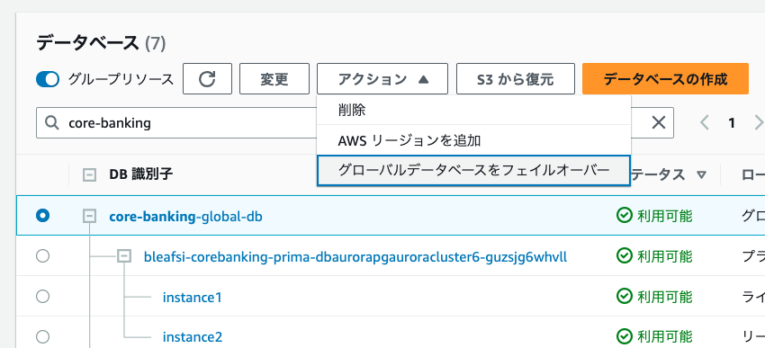

  - フェイルオーバーが開始されるので、完了するまで待つ

    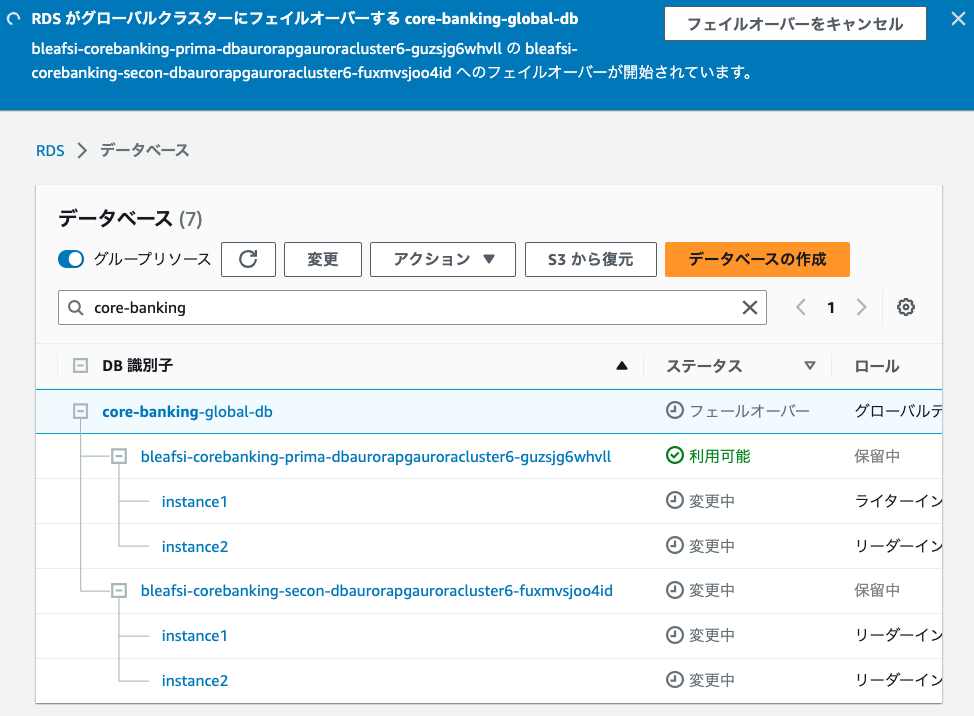

  - 大阪リージョンの Aurora クラスタが プライマリ になり、ステータスが正常であることを確認

    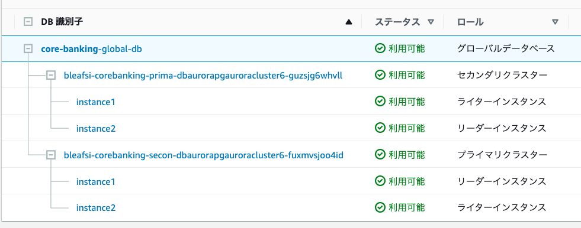

  > - Planned Failover は大阪でも東京でもどちらでも実施可能。また Planned Failover の場合は同期終わってないと Failover できないので、リージョン間の同期が担保される
  > - 大阪リージョンのアプリケーションが接続する Aurora のエンドポイントはあらかじめエンドポイント名から”-ro”を取り除いたたものとしている

### [Unplanned Failover 手順]

- Aurora の Unplanned Failover を実施し東京リージョンから大阪リージョンへ切り替えます  
  （参考：[Amazon Aurora Global Database のフェイルオーバーを使用する](https://docs.aws.amazon.com/ja_jp/AmazonRDS/latest/AuroraUserGuide/aurora-global-database-disaster-recovery.html)）

## 5．大阪リージョンのアプリケーションの開放

大阪リージョン側おアプリケーションを開放状態（クライアントからのリクエストをつけ付ける状態）にします。

[手順]

- 大阪リージョンの DynamoDB でアプリケーション閉塞フラグを開放フラグに変更する

  ```shell
  aws dynamodb put-item --region ap-northeast-3 --table-name [table-name] --item '{ "PK": { "S": "stopFlag" }, "value": { "S": "false" } }' --profile ct-guest-sso
  ```

  > `[table-mame]`は確認した 大阪リージョンの DynamoDB のテーブル名に置き換えて下さい

- 大阪リージョンの ALB へ試験トランザクションを送信し、正常に処理されることを確認する

  ローカル端末から下記のコマンドを実行して、EC2 bastion host にリモート接続します。

  ```sh
  aws ssm start-session --target <EC2インスタンスID> --profile ct-guest-sso
  ```

  > <EC2 インスタンス ID>は確認した bastion host のインスタンス ID に置き換えて下さい 例 i-0xxxx

  下記の REST リクエストを実行して、リクエストが正常に処理されることを確認します。以下はテスト送信の例

  ```shell
  # deposit
  curl -X POST \
   'http://api.ap-northeast-3.example.com/transaction/deposit' \
    --header 'X_ACCOUNT_ID: 1231221' \
    --header 'Content-Type: application/json' \
    --data-raw '{
       "quantity": 1000
    }'

  # withdraw
  curl -X POST \
   'http://api.ap-northeast-3.example.com/transaction/withdraw' \
    --header 'X_ACCOUNT_ID: 1231221' \
    --header 'Content-Type: application/json' \
    --data-raw '{
     "quantity": 100
    }'

  # get balance
  curl -X GET \
   'http://api.ap-northeast-3.example.com/balance' \
   --header 'X_ACCOUNT_ID: 1231221'

  ```

## 6. ユーザトラフィックを大阪リージョンへルーティング

Route53 Application Recovery Controller(ARC) を使用してユーザトラフィックを大阪リージョンの ALB へルーティングさせます。

[手順]

AWS 管理コンソール上で Route53 ARC にアクセスして、以下の作業を実施します。

- コントロールパネル `DefaultControlPanel`を選択して詳細画面を開く
- ルーティングコントロール `rc-tokyo`を選択して、[ルーティングコントロールの状態の変更]をクリック
  - 状態を `オフ`に変更
- ルーティングコントロール `rc-osaka`を選択して、[ルーティングコントロールの状態の変更]をクリック

  - 状態を `オン`に変更

  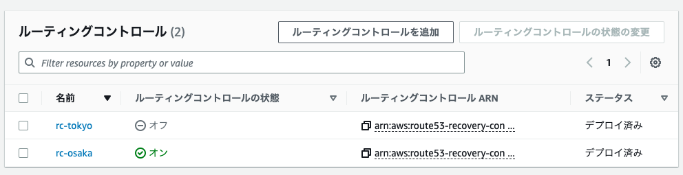

- Locust 負荷ツールにてトランザクションが正常に処理できるように変わることを確認

  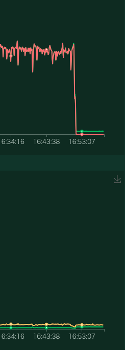
